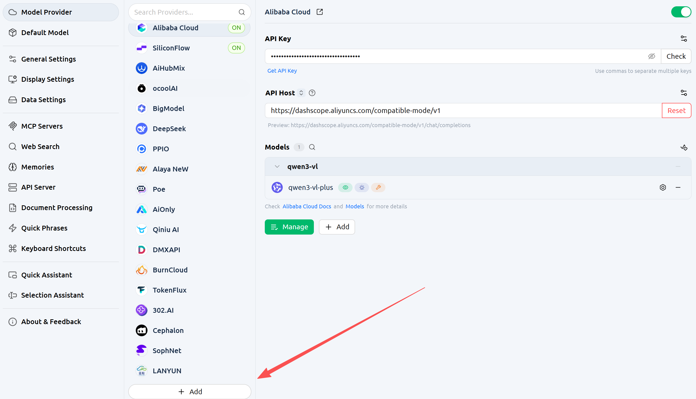
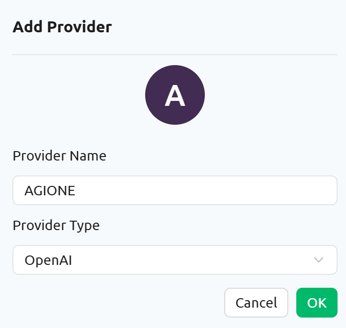
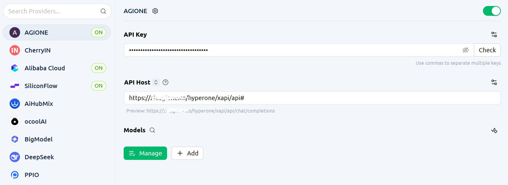
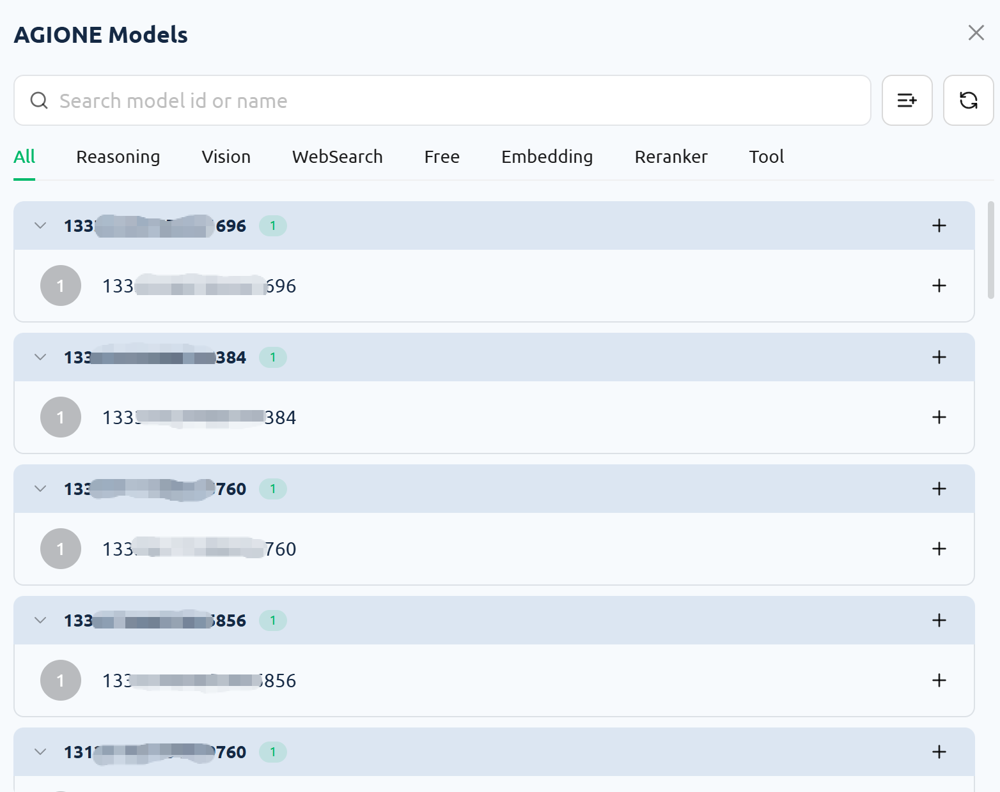
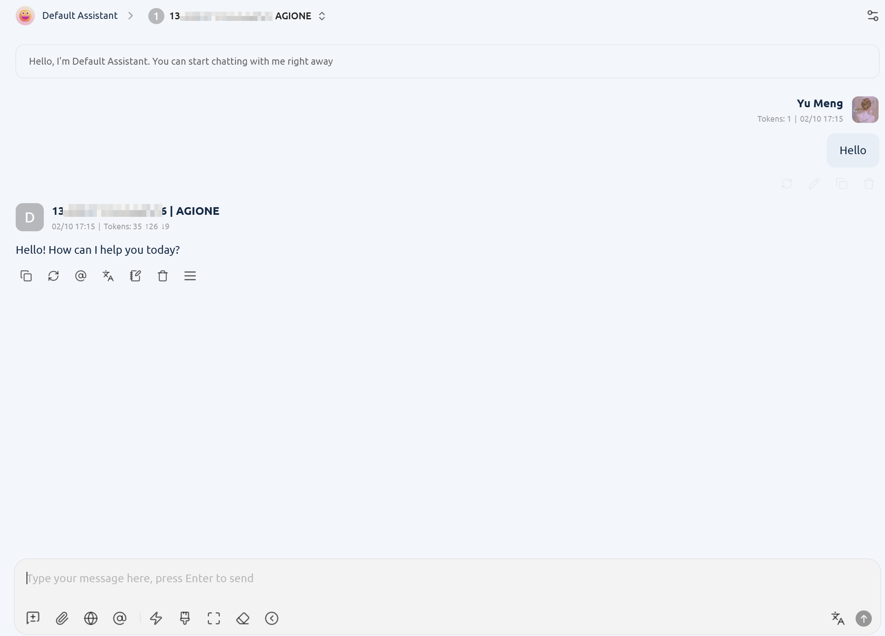

# Add AGIOne as a Model Provider in Cherry Studio

## Install Cherry Studio

Visit the official [Cherry Studio](https://www.cherry-ai.com/) website to download and install the version suitable for your operating system.

## Configure Model Provider (AGIOne)

1. Open the client, click **Settings** in the bottom right corner, find **Model Provider**, scroll down the page and click the **Add** button.
   
2. Add a provider - _Provider Name_: Enter a custom name - _Provider Type_: Select OpenAI
   
3. Configure API Key and API Address
   - _API Key_: Obtain the `Certified TOKEN` from the AGIOne platform model API call page - _API Address_: `https://tai.agione.co/hyperone/xapi/api` - _Note: CherryStudio will append `/chat/completions` to the end of the URL by default. However, AGIONE request routing is not compatible with this format on the CherryStudio platform. Therefore, users need to enter `#` at the end of the URL to indicate that the appending operation will not be performed._
     
4. Retrieve the Model List  
    After configuration, go to **Model → Manage** to retrieve the model list (most model providers predefine available models), then select your desired model.
   

## Use the Model

Select the model you just configured, enter the test text in the dialog box, and if there is a normal response, the configuration is successful.

