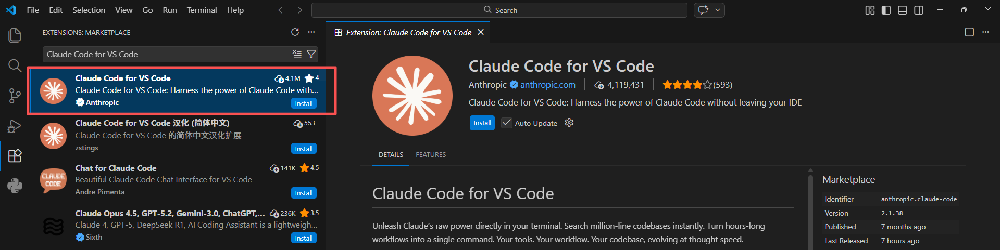
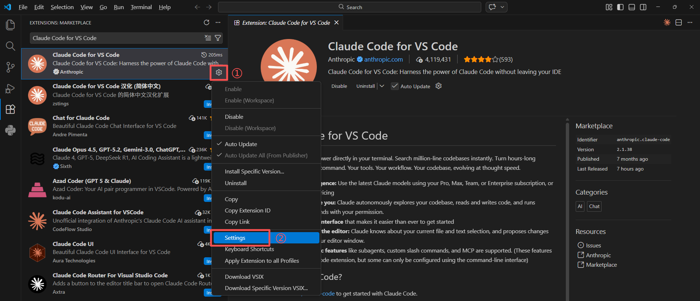
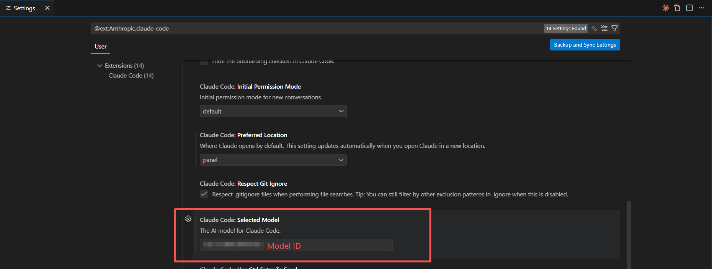
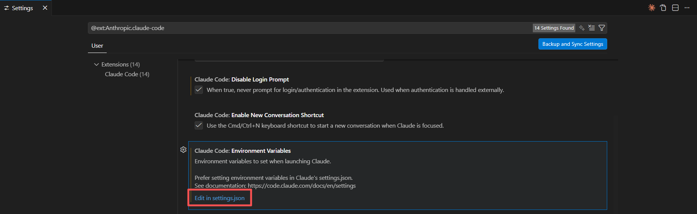
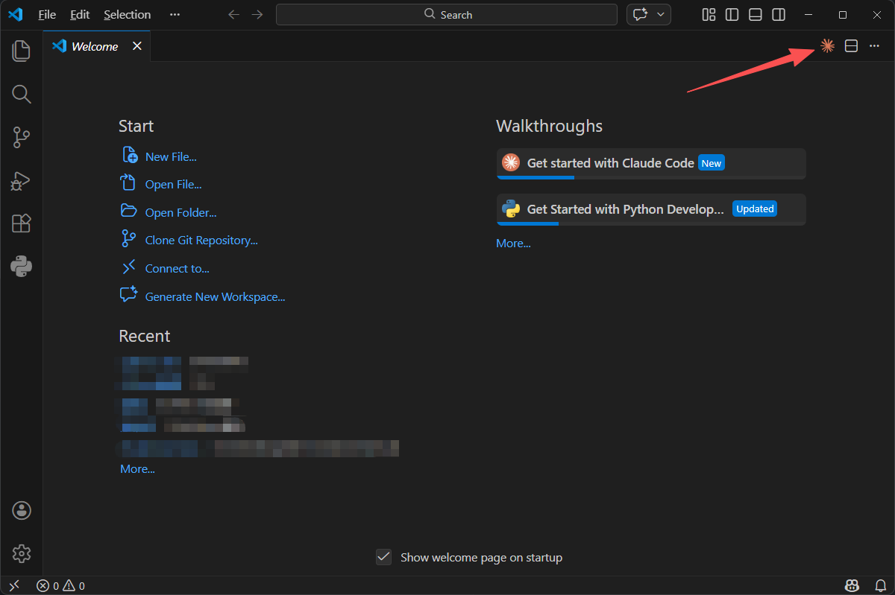
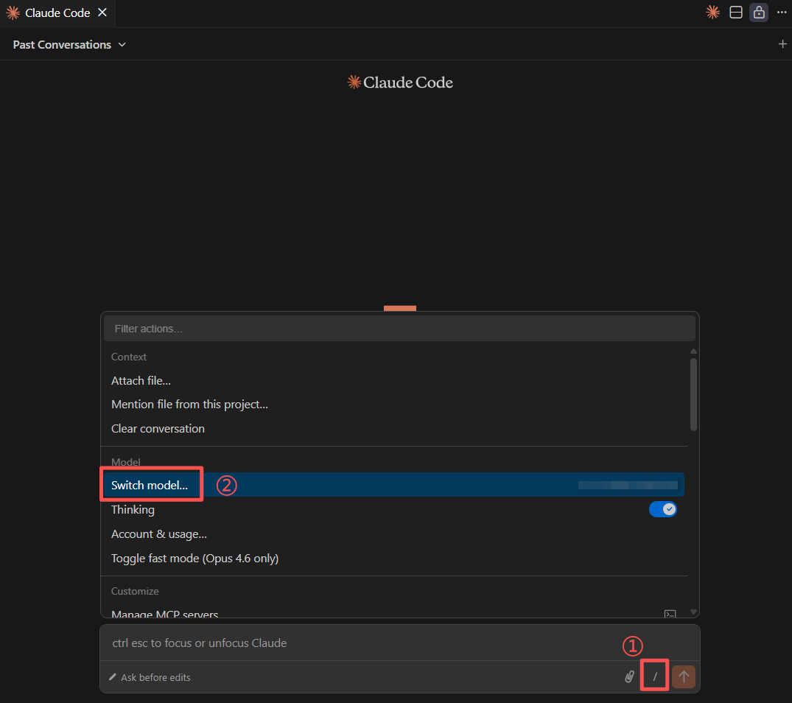
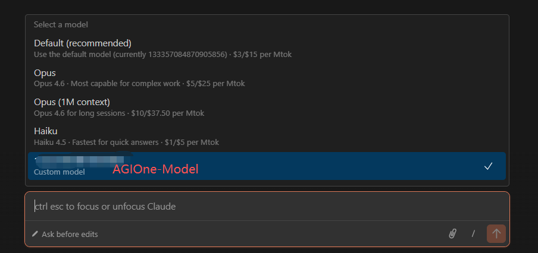
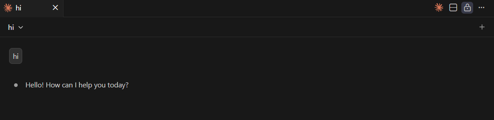

# Integrating AGIOne models using Claude Code for VS Code in VSCode

## Install Claude Code for VS Code

1. Install and open VS Code.
2. In VS Code, go to the Extensions Store and search for **Claude Code for VS Code**, then click **Install.**
   

## Model Configuration

1. Visit [AGIOne](https://tai.agione.co/) and register an account.
2. Go to the model marketplace, select a model, enter the API Usage page, and obtain the *API key* and *model id*.

### Configuration instructions (Using AGIOne as the model provider)

1. After installation, click the gear icon in the lower right corner of the extension and select **Settings**.
   
2. Enter the **model ID** in Select Model.
   
3. In the settings interface, find Environment Variables and click to edit the `settings.json` file.
   
4. After opening the `settings.json` file, configure the provider information.
   - _ANTHROPIC_BASE_URL_: https://tai.agione.co
   - _ANTHROPIC_AUTH_TOKEN_: Obtain the `Certified TOKEN` from the AGIOne platform model API call page
   - _claudeCode.selectedModel_、_ANTHROPIC_DEFAULT_HAIKU_MODEL_、_ANTHROPIC_DEFAULT_SONNET_MODEL_、_ANTHROPIC_DEFAULT_OPUS_MODEL_: Obtain the `Model Id` from the request parameters of the AGIOne platform model API call page

```json
{
  "workbench.colorTheme": "Default Dark Modern",
  "window.zoomLevel": 1,
  "claudeCode.selectedModel": "<agione-model-id>",
  "claudeCode.environmentVariables": [
    {
      "name": "ANTHROPIC_BASE_URL",
      "value": "https://tai.agione.co"
    },
    {
      "name": "ANTHROPIC_AUTH_TOKEN",
      "value": "<agione-api-key>"
    },
    {
      "name": "ANTHROPIC_DEFAULT_HAIKU_MODEL",
      "value": "<agione-model-id>"
    },
    {
      "name": "ANTHROPIC_DEFAULT_SONNET_MODEL",
      "value": "<agione-model-id>"
    },
    {
      "name": "ANTHROPIC_DEFAULT_OPUS_MODEL",
      "value": "<agione-model-id>"
    }
  ],
  "claudeCode.disableLoginPrompt": true,
  "claudeCode.preferredLocation": "panel"
}
```

### Using Claude Code

1. After saving the configuration information, restart VS Code and click the Claude Code icon in the upper right corner.
   
2. Open the Claude Code dialog box, click the "**/**" -> "**Switch Model**" button below the input box, and select the model ID we added.
   
   
3. Test Response: Send a test message such as "Hi". If a normal response is returned, the configuration is successful.
   
