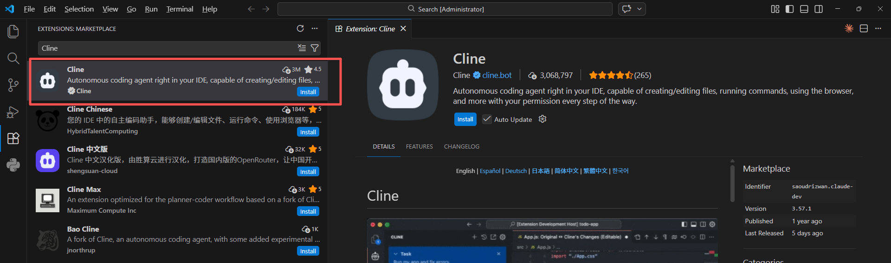
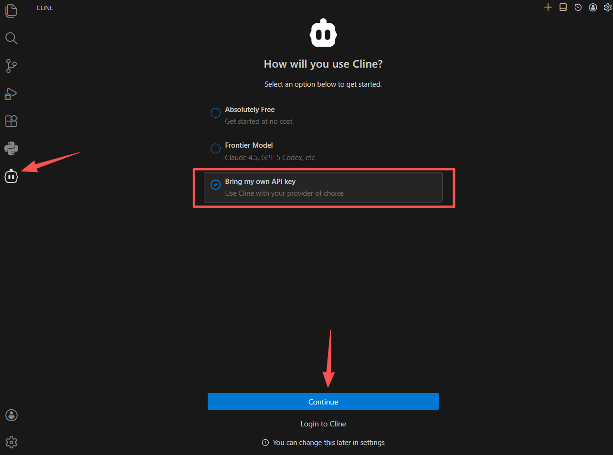
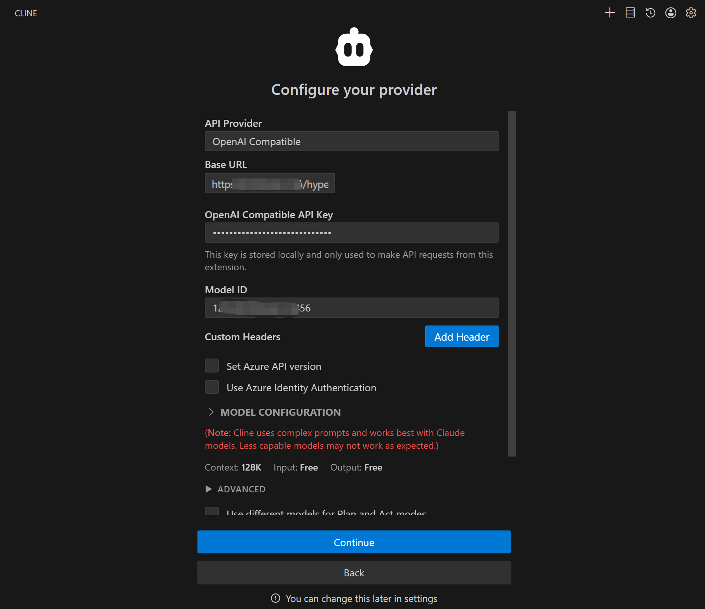
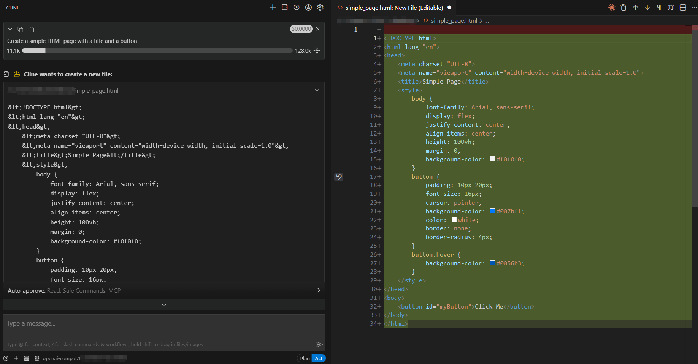

# Using Cline to access the AGIOne model in VSCode

## Install Cline

1. Install and open VS Code.
2. In VS Code, go to the Extensions Store and search for **Cline**, then click **Install.**
   

## Model Configuration

1. Visit [AGIOne](https://tai.agione.co/) and register an account.
2. Go to the model marketplace, select a model, enter the API Usage page, and obtain the *API key* and *model id*.

### Configuration instructions (Using AGIOne as the model provider)

1. After installation, you can see the Cline icon in the left sidebar of VS Code. Click the icon to open the settings interface.
2. Select _Bring my own API key_, then click _Continue_.
   
3. Configure Provider Information, After filling in the information, click _Continue_.
   - _API Provider_: Select `OpenAI Compatible`
   - _Base URL_: `https://tai.agione.co/hyperone/xapi/api`
   - _API Key_: Obtain the `Certified TOKEN` from the AGIOne platform model API call page
   - _Model ID_: Obtain the `Model Id` from the request parameters of the AGIOne platform model API call page
     

### Test Response

Briefly describe your task in the input box, for example: "Create a simple HTML page with a title and a button," press Enter or click the send button, and Cline should respond normally.

