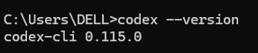
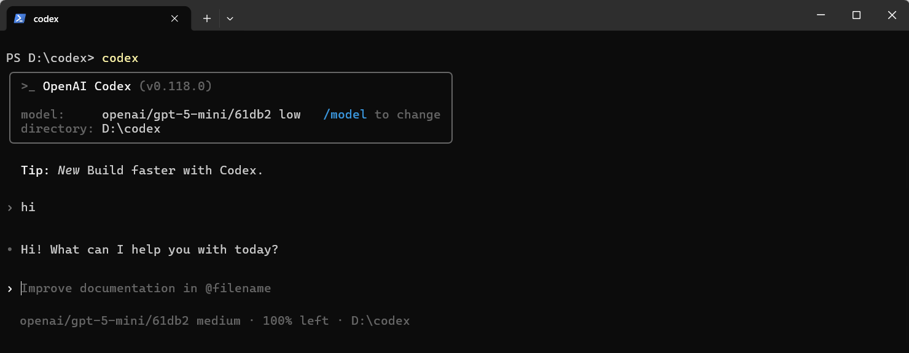

# Install Codex and use AGIOne as the model provider

## Install Codex

1. Ensure Node.js (v20.x.x or later) is installed.
2. Open cmd and execute the command:

```
npm install -g @openai/codex@latest
```

3. Verify installation results.

```
codex --version
```



## Model Configuration

1. Visit [Agione International Version](https://tai.agione.co/) and register an account.
2. Go to the model marketplace, select a model, enter the API Usage page, and obtain the *API key* and *model id*.

### Configuration Instructions (Using AGIOne as the Model Provider)

In the `~/.codex` folder, create a `config.toml` file and configure the provider and model information:

- `model_provider`: Custom provider name (example: agione)
- `model`: Obtain the `Model Id` from the API endpoint in the AGIOne platform's quick model start interface
- `base_url`: `https://tai.agione.co/hyperone/xapi/api/v1`
- `wire_api`: Supports the response protocol
- `env_key`: Obtain the `API Key` from the authentication process in the AGIOne platform's quick model start interface, and set the environment variable name corresponding to the API key.

```Python
model_provider = "agione" # Custom Provider Name
model_reasoning_effort = "medium" # Reasoning intensity（high/medium/low）
model = "openai/gpt-5-mini/61db2"

# Custom Provider Details
[model_providers.agione]
name = "agione"
base_url = "https://tai.agione.co/hyperone/xapi/api/v1"
wire_api = "responses"
env_key = "AGIONE_API_KEY" # Corresponding environment variable name
```

### Setting Environment Variables

- You can set it in the system environment variables: AGIONE_API_KEY "your_agione_key"
- Or execute the following code:

```PowerShell
setx AGIONE_API_KEY "your_agione_key"
```

> Please note: The API Key environment variable name must match the `env_key` in `config.toml`.

### Getting Started

Open `cmd` in the project directory and run `codex`. You should see that the model you added has been automatically selected. Enter the test text "hi". If it responds normally, the configuration is successful.

