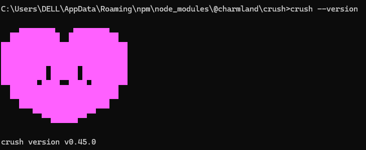

# Install Crush and use AGIOne as the model provider

## Install Crush

1. Ensure Node.js (v20.x.x or later) is installed.
2. Open cmd and execute the command:

```
npm install -g @charmland/crush
```

3. Verify installation results.

```
crush --version
```



## Model Configuration

1. Visit [AGIOne](https://tai.agione.co/) and register an account.
2. Go to the model marketplace, select a model, enter the API Usage page, and obtain the *API key* and *model id*.

### Configuration instructions (Using AGIOne as the model provider)

After successful installation, run the `crush` command to launch the interactive interface, select any model and press Enter. You can find the configuration file path below the API Key input interface.

Locate the crush.json file according to the path (create it manually if it doesn't exist), and configure the provider and model information, After saving the file, return to the command prompt (cmd) and rerun the `crush` command to select and use your custom model.

- _Provider Name_: User-defined (The example name is AGIOne)
- _base_url_: `https://tai.agione.co/hyperone/xapi/api`
- _api_key_: Obtain the `Certified TOKEN` from the AGIOne platform model API call page
- _id_: Obtain the `Model Id` from the request parameters of the AGIOne platform model API call page
- _name_: Model Name

```json
{
  "$schema": "https://charm.land/crush.json",
  "providers": {
    "AGIOne": {
      "type": "openai-compat",
      "base_url": "https://tai.agione.co/hyperone/xapi/api",
      "api_key": "your_api_key",
      "models": [
        {
          "id": "model_id",
          "name": "model_name",
          "display_name": "display_name"
        }
      ]
    }
  }
}
```

### Test Response

Run the startup command `crush`. The interface will display that the model we added has been selected. Enter the test text "hi" in the dialog box. If there is a normal response, the configuration is successful.

