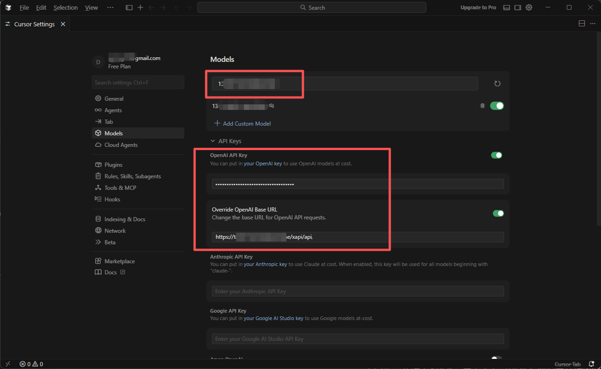
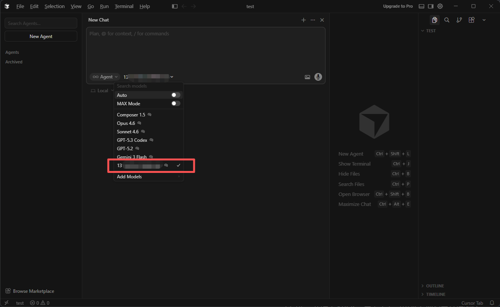

# Install Cursor and use AGIOne as the model provider

## Install Cursor

Visit the Cursor website https://cursor.com/ to download and install the version suitable for your operating system.

## Model Configuration

1. Visit [AGIOne](https://tai.agione.co/) and register an account.
2. Go to the model marketplace, select a model, enter the API Usage page, and obtain the *API key* and *model id*.

### Configuration instructions (Using AGIOne as the model provider)

1. Register and log in to Cursor.
2. In the settings interface, open the "**Models**" section, fill in the _ID_, _Base URL_, and _API Key_, and then click the "**Add Custom Model**" button. - _OpenAI Base URL_: `https://tai.agione.co/hyperone/xapi/api` - _Model ID_: The model ID to be used, which can be obtained from the AGIOne platform model API call details.
   
3. Open the project and select the added model to start using it.
   

_Note: Due to Cursor's limitations, only users with a Cursor Premium subscription or higher can customize their model._
