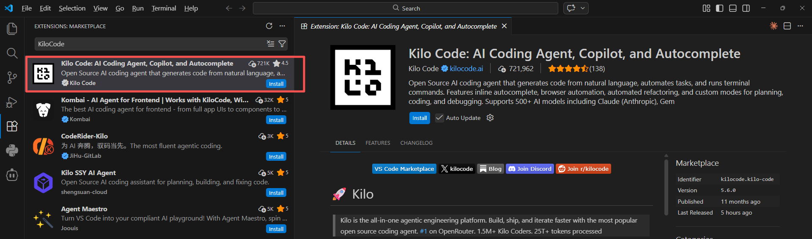
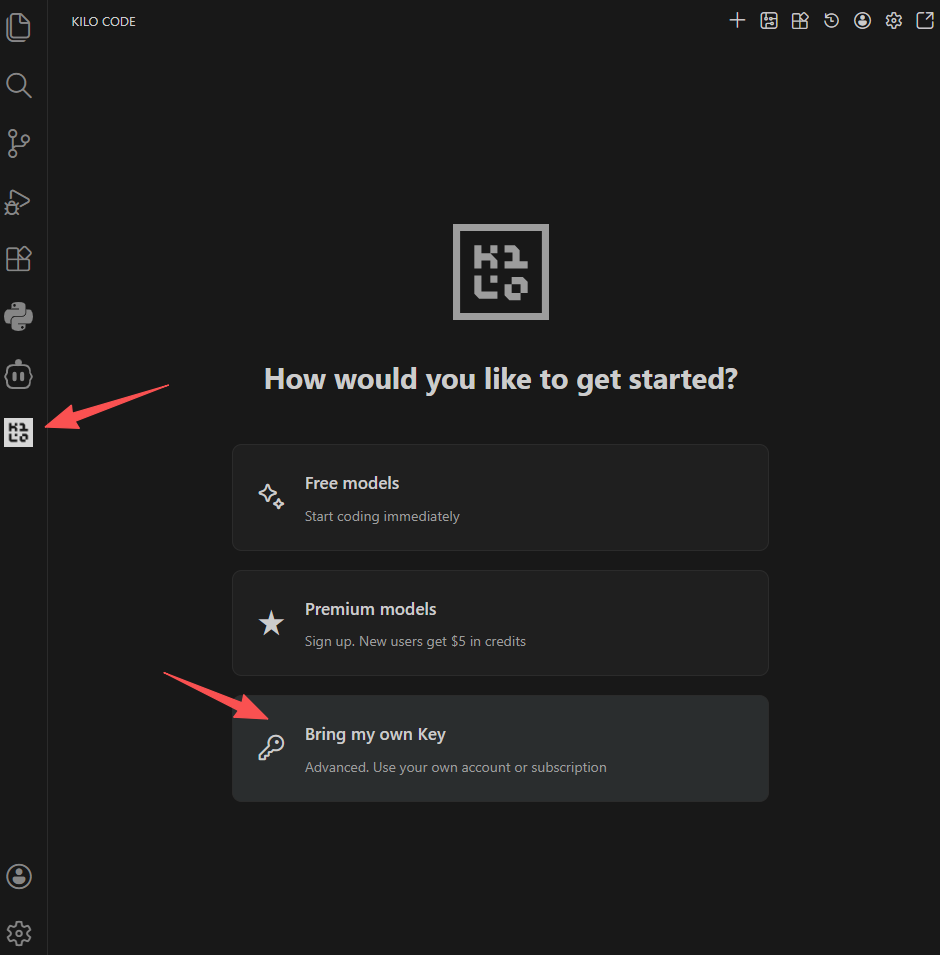
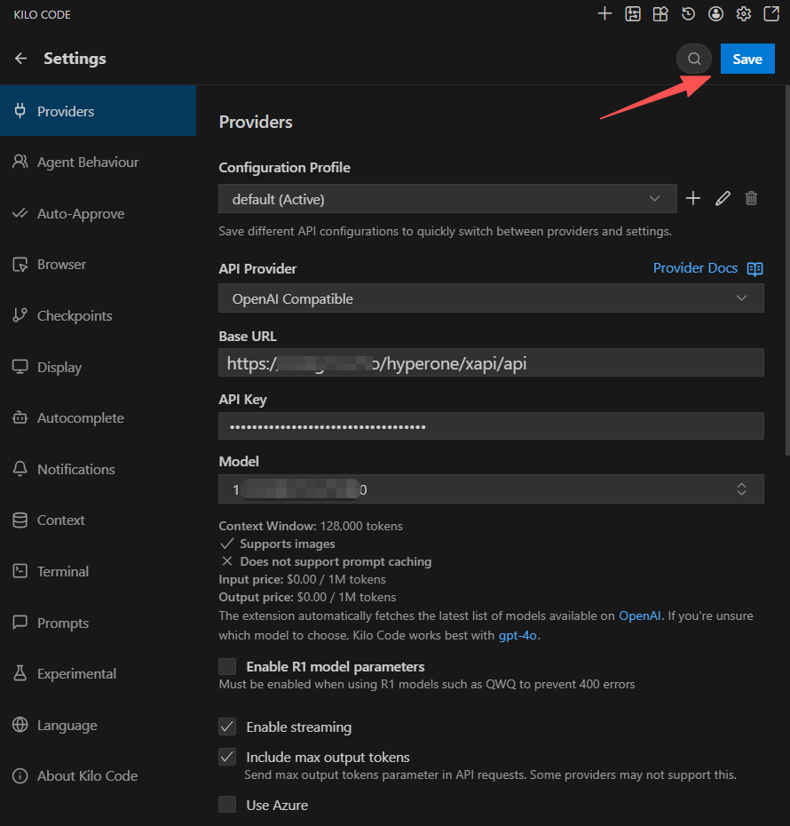
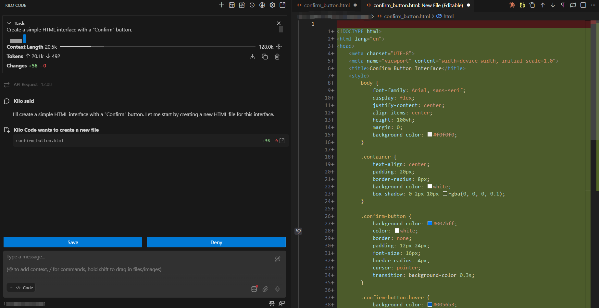

# Using Kilo Code to integrate AGIOne models in VSCode

## Install Kilo Code

1. Install and open VS Code.
2. In VS Code, go to the Extensions Store and search for **Kilo Code**, then click **Install.**
   

## Model Configuration

1. Visit [AGIOne](https://tai.agione.co/) and register an account.
2. Go to the model marketplace, select a model, enter the API Usage page, and obtain the *API key* and *model id*.

### Configuration instructions

1. After installation, you will see the Kilo Code icon in the left sidebar of VS Code. Click the icon to open the settings interface.
2. Click _Bring my own key_.
   
3. Configure Provider Information, After filling in the information, click the _Save_ button.
   - _API Provider_: Select `OpenAI Compatible`
   - _Base URL_: `https://tai.agione.co/hyperone/xapi/api`
   - _API Key_: Obtain the `Certified TOKEN` from the AGIOne platform model API call page
   - _Model_: Obtain the `Model Id` from the request parameters of the AGIOne platform model API call page
     

### Test Response

Click the "**+**" button in the upper right corner to open a new dialog box. Enter your requirements, such as "Create a simple HTML interface with a "Confirm" button." Kilo Code will respond normally.

