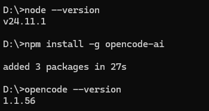
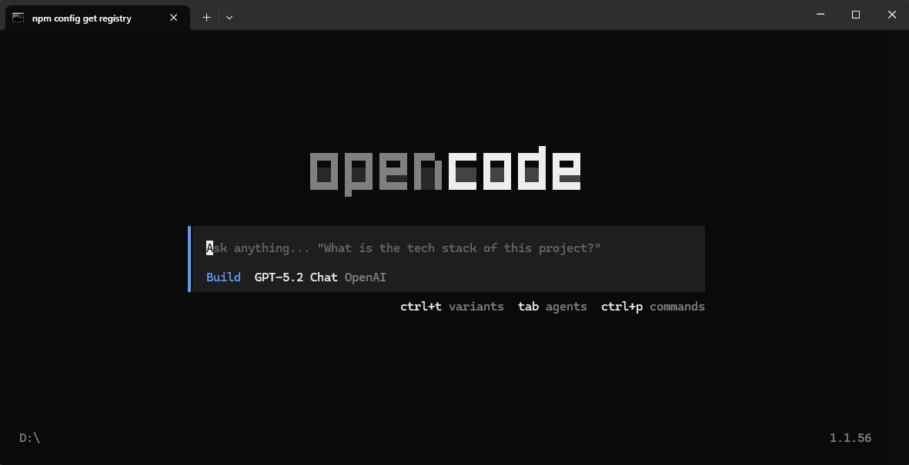
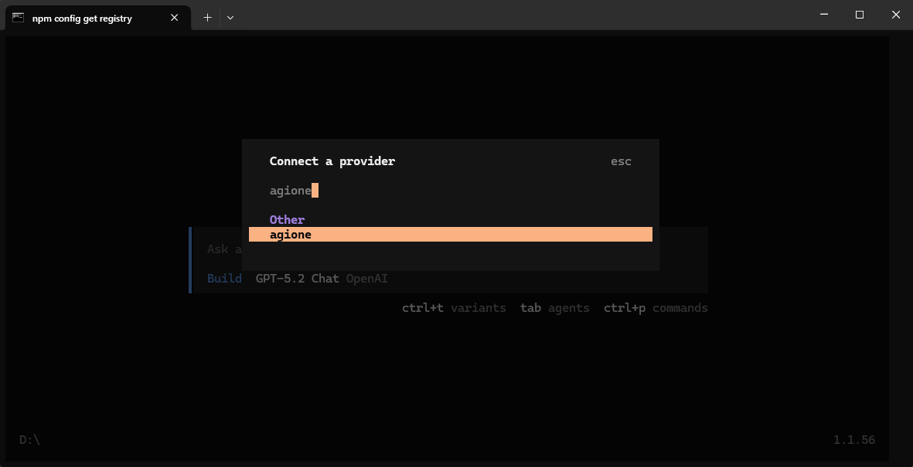
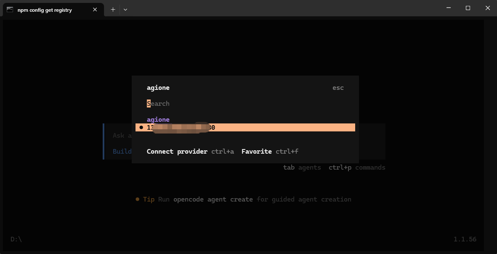
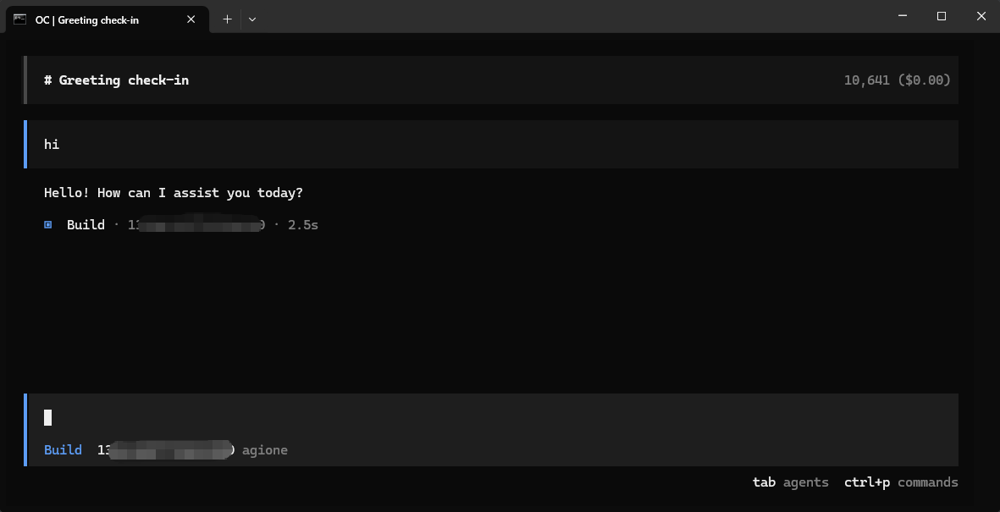

# Install Open Code and use AGIOne as the model provider

## Install Open Code

1. Ensure Node.js (v20.x.x or later) is installed.
2. Install the OpenCode command.

```
npm install -g opencode-ai
```

3. Verify installation results.

```
opencode --version
```



## Model Configuration

1. Visit [AGIOne](https://tai.agione.co/) and register an account.
2. Go to the model marketplace, select a model, enter the API Usage page, and obtain the *API key* and *model id*.

### Configuration instructions(Using AGIOne as the model provider)

Create an `opencode.json` file in the project directory and configure the provider and model information.

- _name_：Provider Name（User-defined, an example being agione）
- _baseURL_：`https://zh.agione.co/hyperone/xapi/api`
- _Authorization_：Obtain the API Key from the `Certified TOKEN` section of the AGIOne platform's model API call page
- `provider.models`: Obtain the `Model Id` from the request parameters of the AGIOne platform model API call page
- `model-id.name`: Custom model name

```json
{
  "$schema": "https://opencode.ai/config.json",
  "provider": {
    "myprovider": {
      "npm": "@ai-sdk/openai-compatible",
      "name": "agione",
      "options": {
        "baseURL": "https://tai.agione.co/hyperone/xapi/api",
        "headers": {
          "Authorization": "Bearer your_agione_key"
        }
      },
      "models": {
        "model-id": {
          "name": "model-name"
        }
      }
    }
  }
}
```

Return to cmd and type `opencode` to open the text user interface.

Use the `/connect` command to connect to the provider, entering the provider name set in the JSON file.

Then enter the model's API Key and press Enter to select the model you want to add.


### Test Response

Enter the test text "hi" in the dialog box. If a normal response is received, the configuration is successful.

