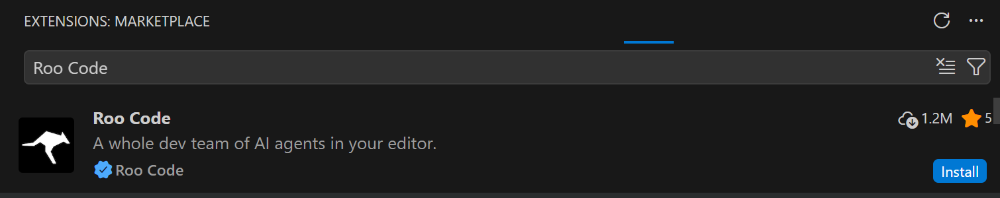
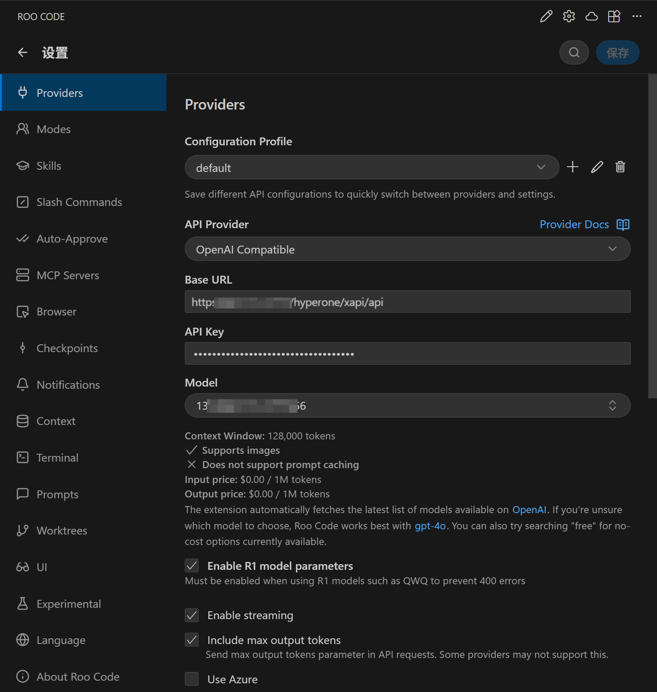
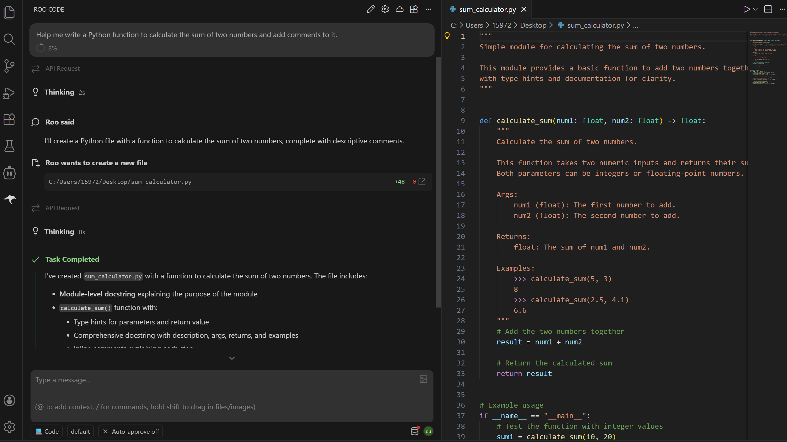

# Using Roo Code to Connect to AGIOne Models in VS Code

## Install the Roo Code Extension

1. Install and open VS Code.
2. In VS Code, go to the Extensions Store and search for **Roo Code**, then click **Install**.
   

## Model Configuration

1. Visit [AGIOne](https://tai.agione.co/) and register an account.
2. Go to the model marketplace, select a model, enter the API Usage page, and obtain the *API key* and *model id*.

### Configuration instructions

After installation, enter the settings interface and fill in the relevant information:

- _API Provider_: Select `OpenAI Compatible`
- _OpenAI Base URL_: `https://tai.agione.co/hyperone/xapi/api`
- _API Key_: Obtain the `Certified TOKEN` from the AGIOne platform model API call page
- _Model_: Obtain the `Model Id` from the request parameters of the AGIOne platform model API call page
  

### Start Using

After the model is successfully added, return to the dialog box interface, enter a simple task description, such as: Help me write a Python function to calculate the sum of two numbers, and add comments.

