# Best Practices for Configuring and Using Codex with AGIOne

## Codex \+ CC Switch \+ AGIOne — AI Coding Setup Guide

> A clear step\-by\-step guide to configure **Codex Desktop** with **CC Switch** and **AGIOne \(agione\.pro\)** API tokens for AI\-assisted coding\.
> 
> 

## Architecture Overview

```Plain Text
Codex Desktop (AI coding client)
        │
        │  Requests go through local route
        ▼
CC Switch (local proxy — protocol conversion + provider management)
        │
        │  Forwards to upstream API
        ▼
AGIOne (https://agione.pro/hyperone/xapi/api)
        │
        │  Routes to models
        ▼
DeepSeek / GLM / Gemini / GPT, etc.
```

**Why Routing mode?** AGIOne uses Chat Completions protocol, while Codex uses Responses protocol\. CC Switch's Routing mode handles the conversion automatically\.

---

## Step 1: Download \& Install Codex Desktop

1. Go to OpenAI's official website and download [**Codex Desktop**](https://learn.chatgpt.com/docs/app#getting-started)\. 


    - macOS: `.dmg` file

    - Windows: `.exe` installer

    - Linux: `.AppImage` or `.deb`

2. Install and launch Codex\.

3. You may be asked to log in with your OpenAI/ChatGPT account — you can skip this wait cc switch configuration finshed\.

---

## Step 2: Download \& Install CC Switch

1. Go to the official download page: [**https://ccswitch\.io**](https://ccswitch.io) or [**https://github\.com/farion1231/cc\-switch/releases**](https://github.com/farion1231/cc-switch/releases)

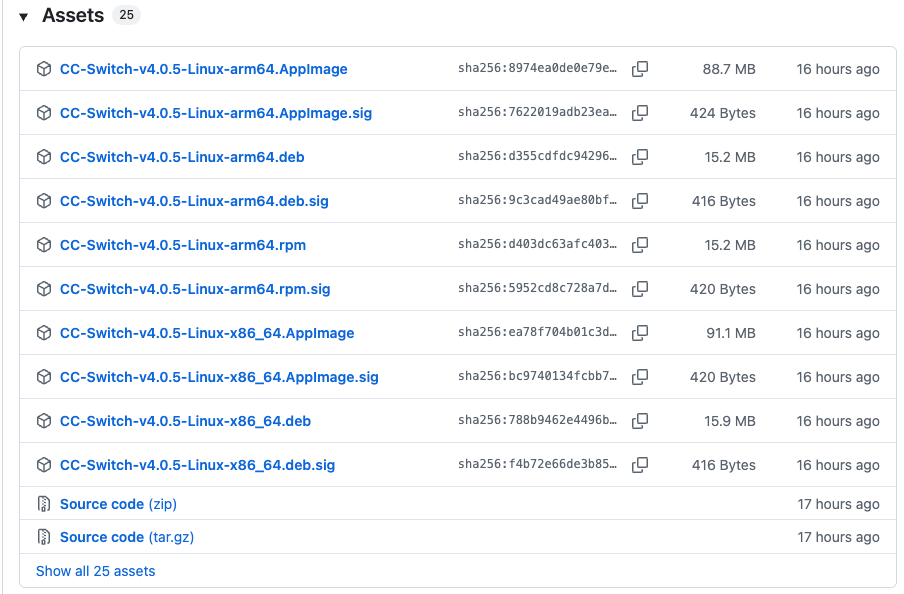

2. Choose your platform: 

    - macOS \(Apple Silicon\): `CC-Switch-v4.0.5-mac-aarch64.dmg`

    - macOS \(Intel\): `CC-Switch-v4.0.5-mac-x64.dmg`

    - Windows: `CC-Switch-v4.0.5-win-x64-setup.exe`

    - Linux: `.deb`, `.rpm`, or `.AppImage`

3. Install and launch the CC Switch\.

---

## Step 3: Access AGIOne \& Get API Key

1. Open your browser and go to [**https://agione\.pro**](https://agione.pro)** or your private agione platform\.**

2. Log in or create an account\.

3. Once logged in, go to **Settings** , **My Keys** to **Model API Keys**\.


4. Click **Create API Key** \(or **\+ Create**\)\. 

- Give it a name \(e\.g\., `codex-cc-switch`\)

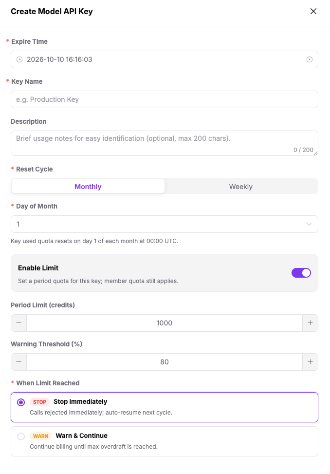

- Copy the generated key — it starts with `ak-` and is only shown once\.


---

## Step 4: Find Your Model Info

1. In AGIOne, go to **Model Services** in the top menu\.

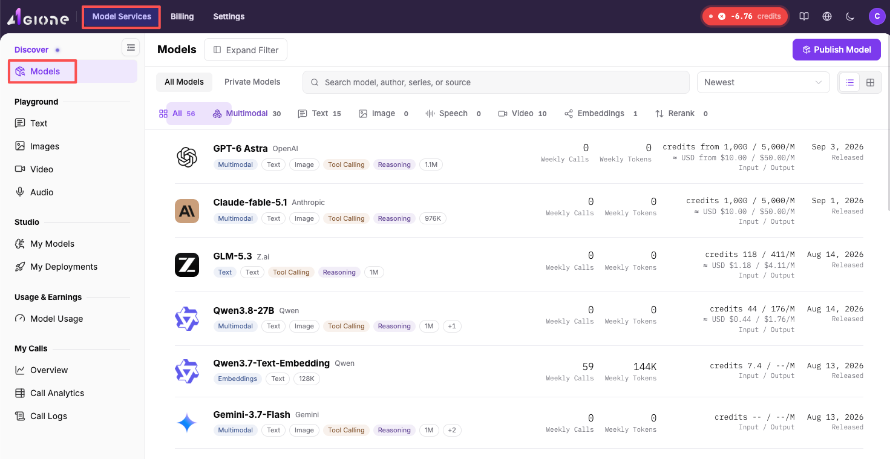

2. Find the model you want to use\. Examples:

    - **DeepSeek\-V4\-Flash**: `deepseek/deepseek-v4-flash/02acd` — fast, low cost, good for daily coding


3. Copy the **Model ID** \&\& **Base URL**

- Go to **Quick Start, **Copy** Model ID**

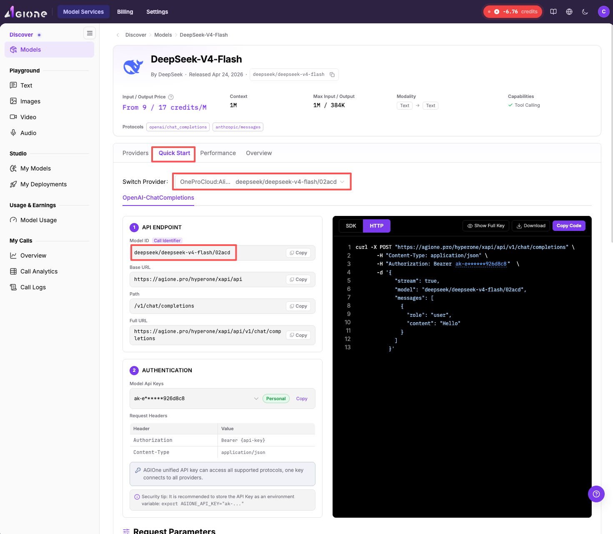

- Go to **Quick Start, **Copy** Base URL**


- Confirm what protocols the model supports\.

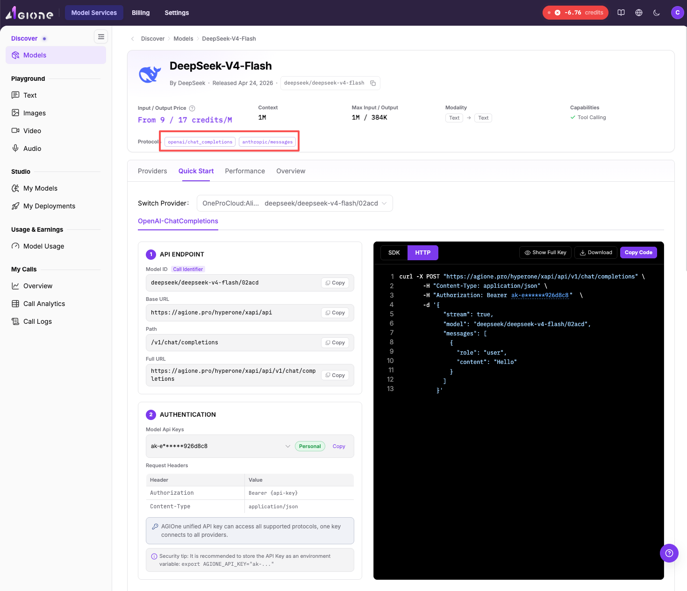

---

## Step 5: Configure CC Switch

### 5\.1 Open Codex page in CC Switch

1. In CC Switch, click **Codex** in the left sidebar\.

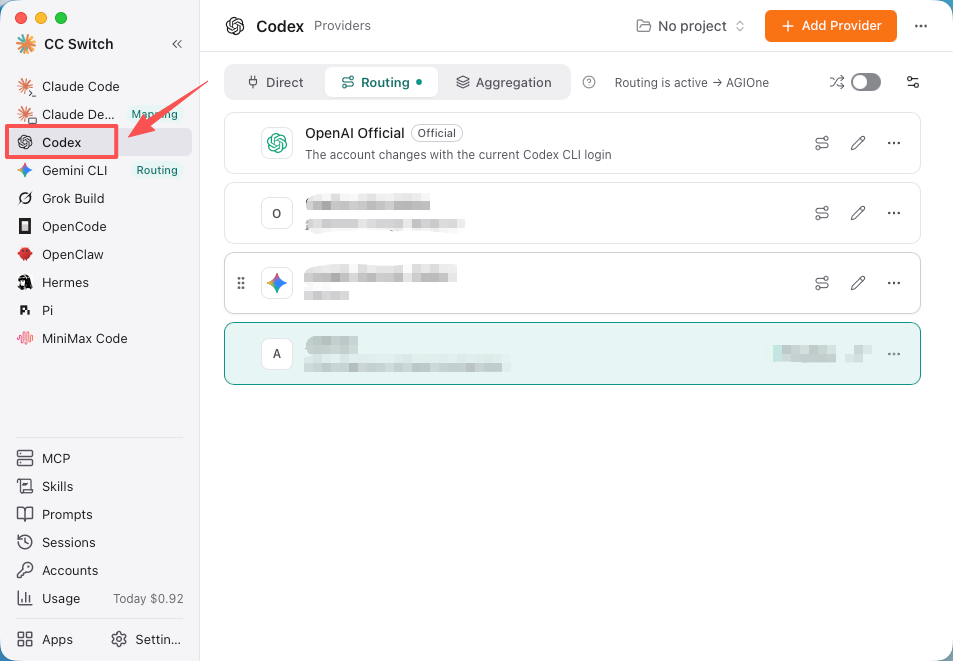

2. You'll see three tabs at the top: **Direct / Routing / Aggregation**\.

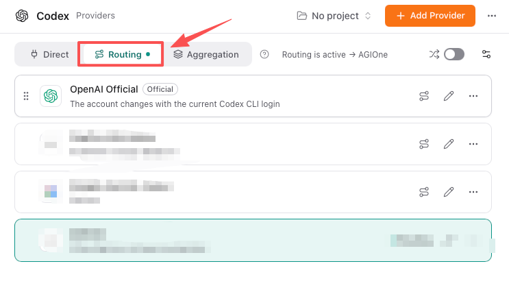

### 5\.2 Switch to Routing mode

1. Click the **Routing** tab\.

2. Routing mode starts with a local proxy service\. Codex sends all requests through it first\.

### 5\.3 Add AGIOne as a provider

1. Click **Add Provider**\.

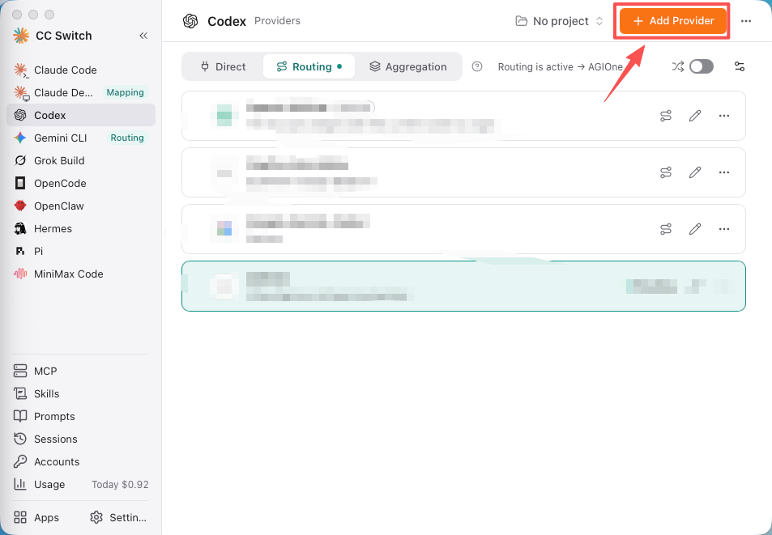

2. Choose **Custom Configuration**\.


3. Fill in the fields:

|**Field**|**Value**|
|---|---|
|Name|AGIOne|
|API Key|ak\-xxxxxxxx \(your key from Step 3\)|
|API Request URL|\<Copy Base URL of the AGIOne Platform\>|
|Full URL|**Off**|
|Default Model|\<Copy Model ID of the AGIOne Platform\>|

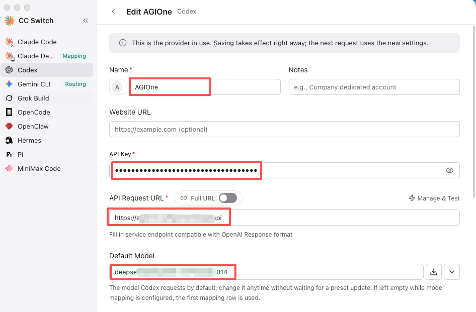

### 5\.4 Configure Advanced Options

Expand **Advanced Options** and set:

|**Setting**|**Value**|
|---|---|
|Upstream Format|Chat Completions \(routing required\) \| depends on the protocol types supported by the model|
|Prompt cache routing|Auto \(recommended\)|
|Supports Thinking Mode|\<depends on the Thinking mode supported by the model\> \| DeepSeek Support, There is Enabled|
|Supports Reasoning Effort|\<depends on the Thinking mode supported by the model\> \| DeepSeek Support, There is Enabled|

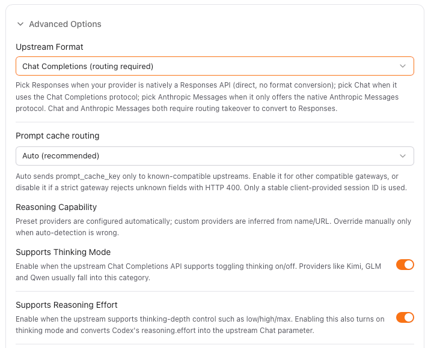

### 5\.5 Model Mapping

1. Click \+ **Add manually to **add which models do you want to use\.


> You can get more models from agione platform and fill in model on there to use it\.
> 
> 

2. Click **Save**\.

### 5\.6 Activate routing

1. In the provider list, find **AGIOne**\.

2. Click **Route here**\.

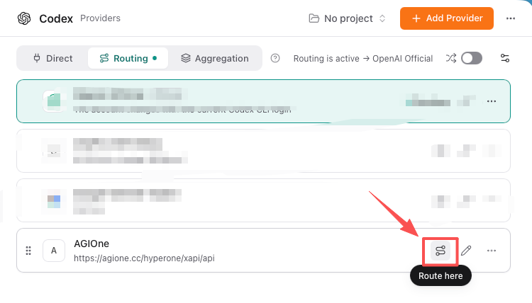

3. Confirm the top of the page shows **Routing is active → AGIOne**\.


---

## Step 6: Test in Codex

1. **Fully quit Codex** \(Cmd\+Q on macOS\) and reopen it\.

2. Start a new chat in Codex\.

3. Send a test message: 

```Plain Text
Hello! Tell me who you are and which model you are using.
```

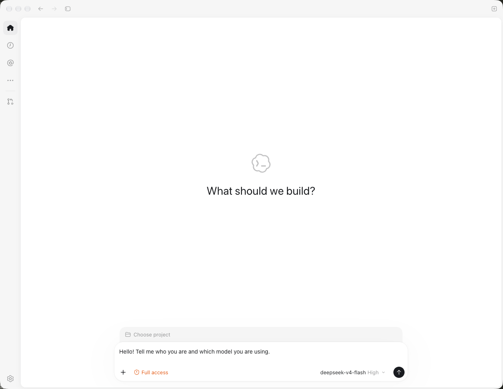

1. If you get a reply, the setup is working\!


---

## Step 7: verify Usage in AGIOne

1. Go back to **AGIOne Dashboard** \(`https://agione.pro`\)\.

2. Check the **Usage** or **Call Logs** page to see your API calls\.

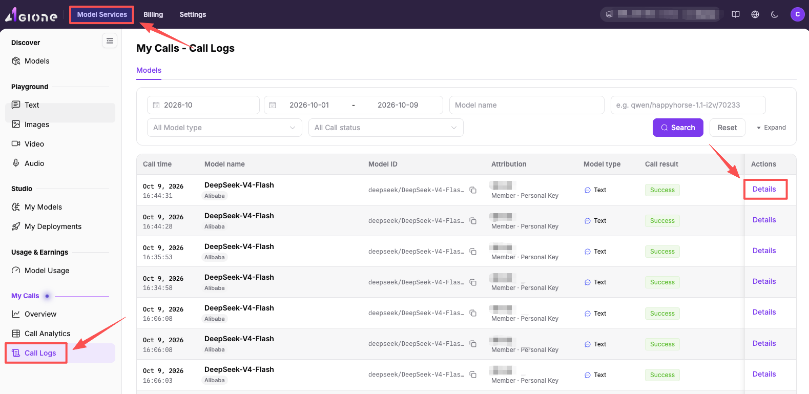


---

## Configuration Files \(Auto\-generated\)

CC Switch manages these files automatically:

**`~/.codex/auth.json`**

```JSON
{
  "OPENAI_API_KEY": "ak-xxxxxxxx"
}
```

**`~/.codex/config.toml`** \(key fields\)

```TOML
model_provider = "custom"
model = "deepseek/deepseek-v4-flash/02acd"
model_reasoning_effort = "high"
model_catalog_json = "cc-switch-model-catalog.json"

[model_providers.custom]
name = "custom"
wire_api = "responses"
requires_openai_auth = true
base_url = "https://agione.pro/hyperone/xapi/api"
```

---

## Troubleshooting

|**Issue**|**Likely Cause**|**Fix**|
|---|---|---|
|Fetch Models fails|Wrong API Key or no balance|Check key and AGIOne balance|
|Codex returns 401|Key not saved properly|Re\-save provider in CC Switch|
|Codex returns 404|Wrong Base URL|Confirm [https://agione\.pro/hyperone/xapi/api](https://agione.pro/hyperone/xapi/api)|
|No models in Codex|Codex not restarted|Fully quit and reopen Codex|
|Requests hang|Network issue or model overload|Check network, try another model|

---

## Links

|**Resource**|**URL**|
|---|---|
|AGIOne|[https://agione\.pro](https://agione.pro)|
|CC Switch Official|[https://ccswitch\.io](https://ccswitch.io)|
|CC Switch GitHub|[https://github\.com/farion1231/cc\-switch](https://github.com/farion1231/cc-switch)|
|CC Switch Releases|[https://github\.com/farion1231/cc\-switch/releases](https://github.com/farion1231/cc-switch/releases)|

---

*Guide generated: 2026\-10\-09 \| Verified on: macOS \+ Codex Desktop \+ CC Switch v4\.0\.5 \+ AGIOne*

