# Building a Scheduled Weather Information Retrieval Workflow Using Dify

## Introduction to Dify

Dify is an open-source Large Language Model (LLM) application development platform designed to help developers quickly build production-ready generative AI applications. It integrates the concepts of Backend as Service and LLMops, providing a one-stop solution from cue word orchestration, knowledge retrieval (RAG), agent framework to workflow orchestration.

The platform supports various application types, including chat assistants, agents (intelligent agents with reasoning and tool invocation capabilities), chatflows (for multi-turn complex dialogues), and workflows (for single-turn automated tasks). Users can operate through an intuitive interface or API, allowing even non-technical personnel to participate in the definition and data operation of AI applications.

Dify's core advantages lie in its engineering design, with built-in support for hundreds of models, a high-quality RAG engine, flexible workflow orchestration tools, and an emphasis on data security and model neutrality. It is suitable for B2B scenarios, helping enterprise users build customized AI applications at a lower cost, while supporting self-deployment to ensure data control.

## Add Model Supplier (AGIOne)

Register and log in to the Dify platform. Click the "**Plugins**" button in the upper right corner of the page.
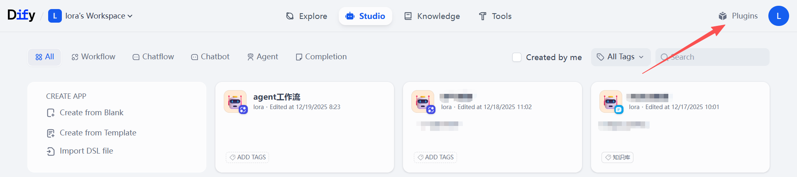
On the plugins page, there is also an "**Install plugin**" button in the upper right corner. Click it and select "**Marketplace**".
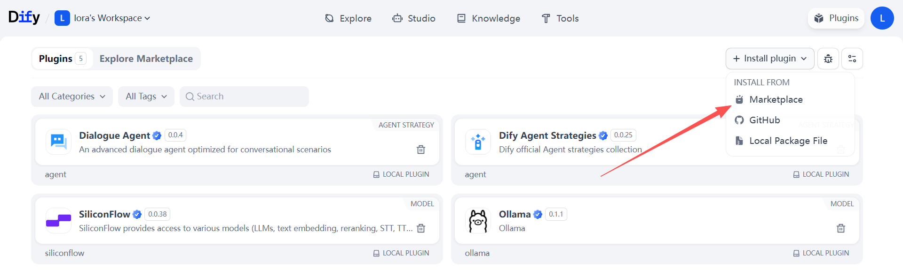
Switch to the Explore Marketplace page, use the search box to filter for "openAI", select the plugin "**OpenAI-API-compatible**", hover your mouse over the card, and click the "**Install**" button. The plugin is successfully installed when the page displays "_Installation successful_".
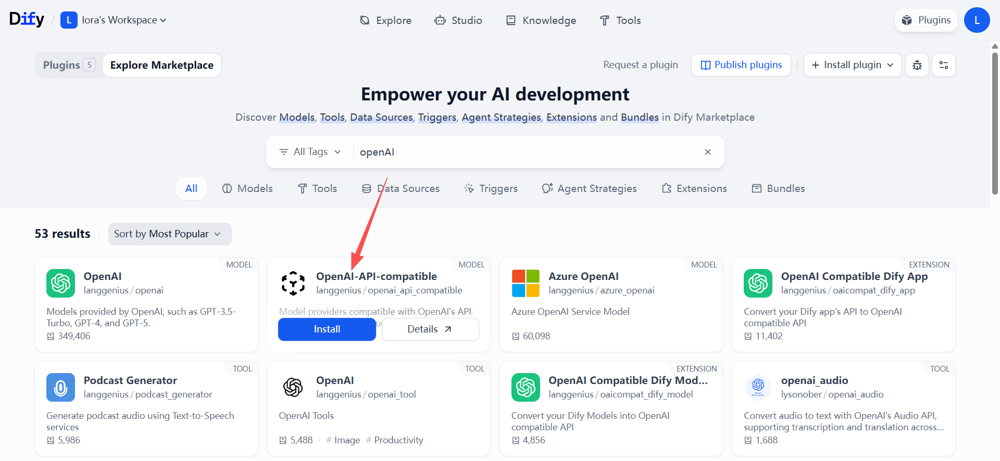
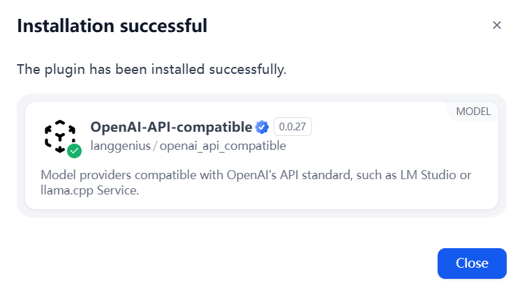

## Adding a Model

After successfully adding the model supplier, we need to add the model from the AGIOne platform to Dify.
Click the account's "**avatar**" in the upper right corner, select **Settings**, and click it.
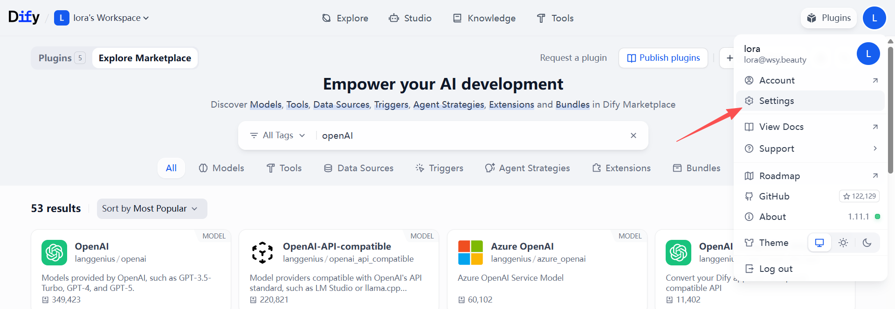
On the settings page, switch the workspace to Model Supplier, select the model supplier we just added, and click the "**+ Add Model**" button in the lower right corner of the card.
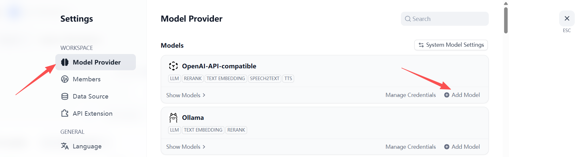
After the Add Model pop-up appears, keep the page still.
Open a new browser tab and go to the AGIOne platform. In the model marketplace, select the model you want to add and click **API Usage** to enter the details page.
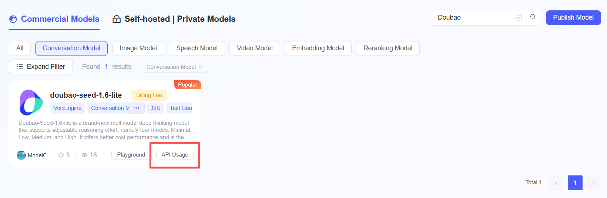
The core parameters are as follows:

- Model Name: The name of the model
- Model Type: The subtype of the model, for example: LLM
  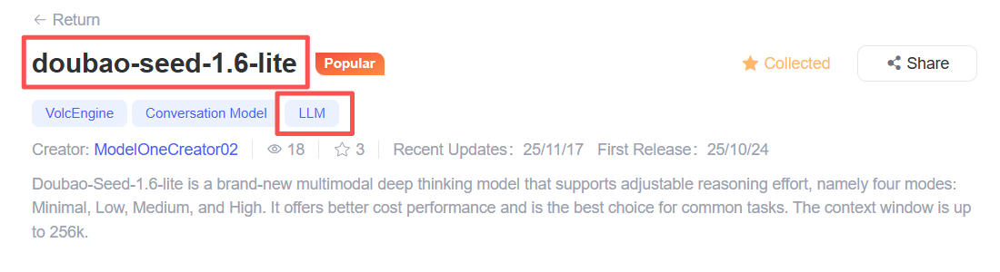
- API endpoint URL: `https://tai.agione.co/hyperone/xapi/api`
- API Key: Obtain the API key from the `Certified TOKEN`
- API endpoint: Obtain the `Model Id` from the Request Parameters
  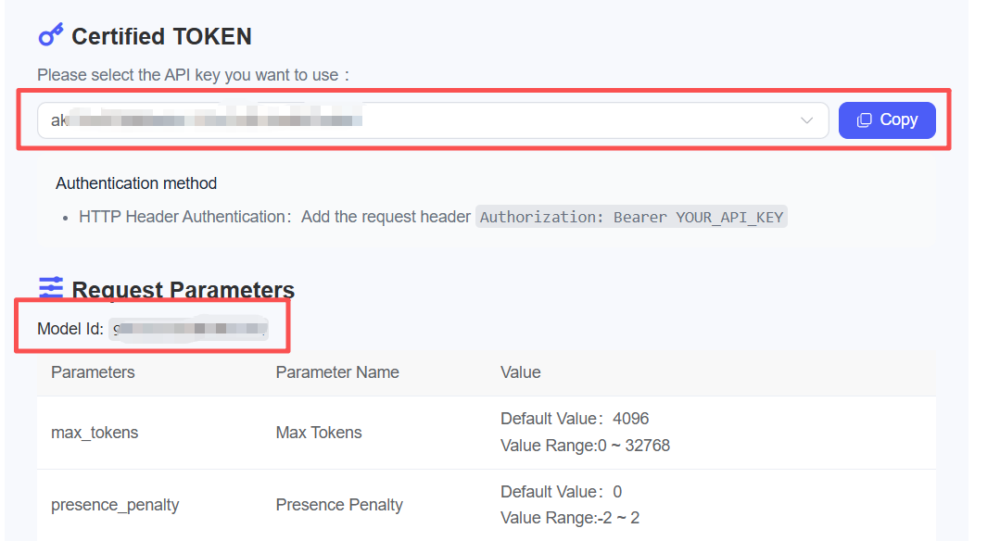
  Return to the Dify platform's add model page, copy the above parameters into the corresponding field input boxes, check that the information is correct, click the "**Add**" button, wait a few seconds, and the model will be successfully displayed in the list.
  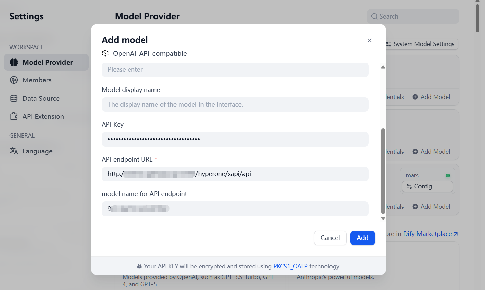
  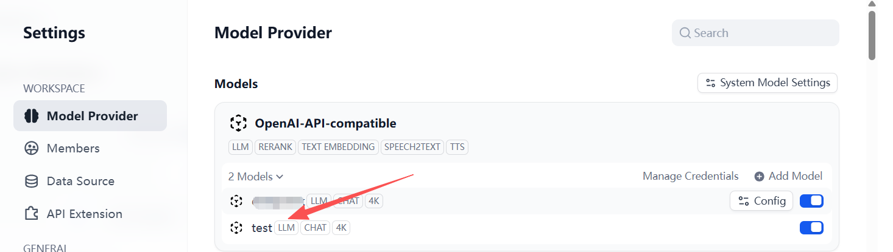

## Setting up a Weather Information Query Workflow

The model has been successfully added. Now, create a workflow that uses the model to summarize and output a weather forecast.
Exit the settings page and switch to the "**Studio**" page via the top navigation bar. In the tab, select Workflow and click the "**Create from Blank**" button.
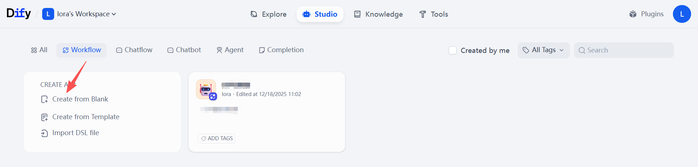
Enter the application name, icon, and description, and click the "**Create**" button.
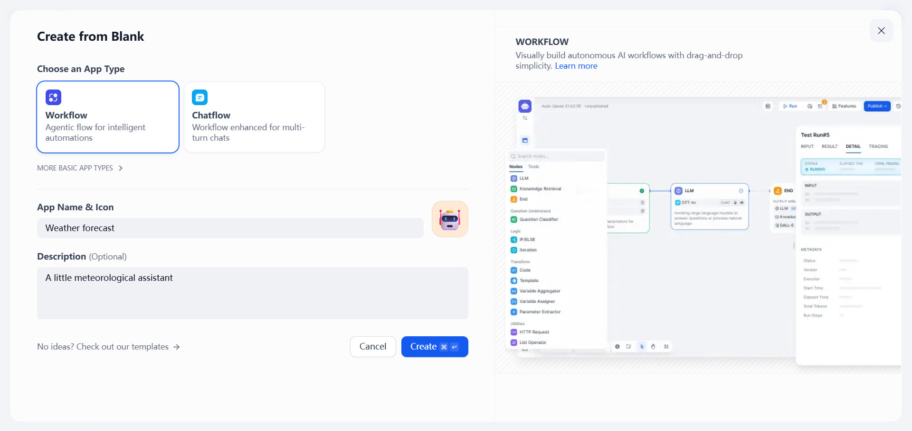

### Adding a Trigger

The system will automatically redirect you to the canvas to add your first node. Select **Trigger -> Schedule Trigger**.
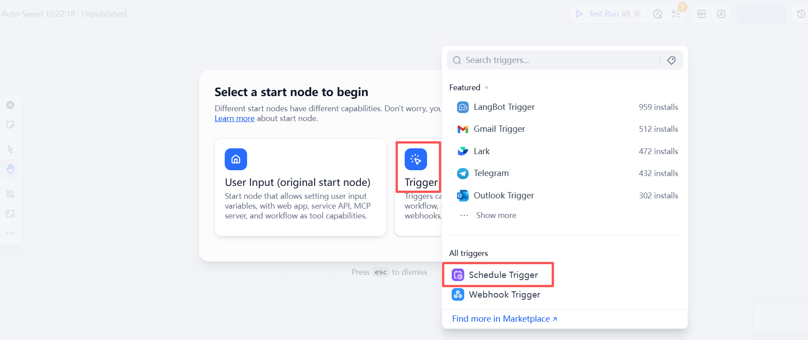
Click on the trigger in the canvas. On the right-hand settings page, adjust the trigger **frequency** and **time**. Here, I set it to _Daily -> 8:30am_. After setting, click the "**▷**" button to confirm the node is running successfully.
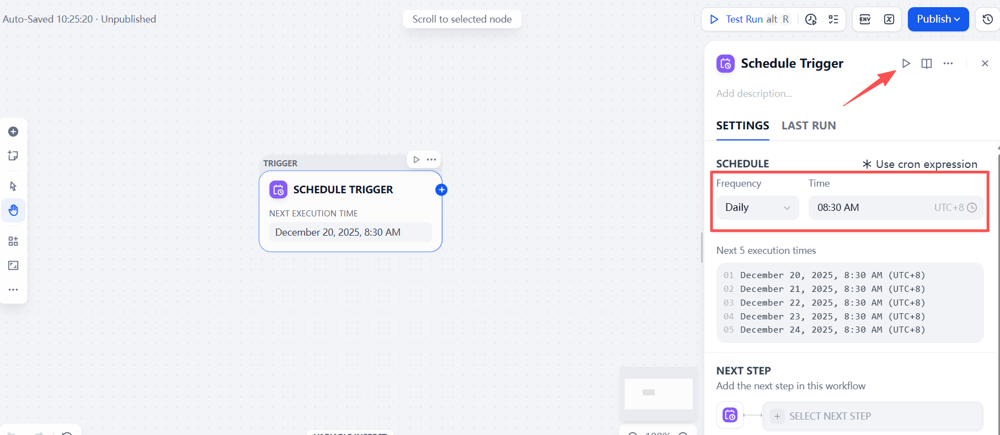

### Adding an HTTP Request

To add an HTTP request component to retrieve weather information, click the "**+**" button after the first node and select **HTTP Request**.
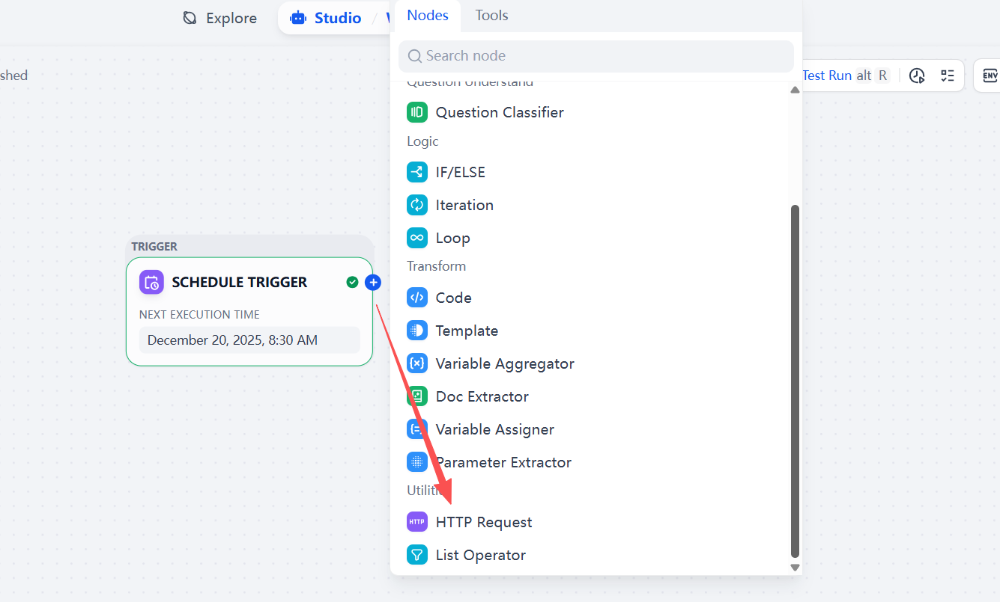
On the right-hand settings page, begin configuring parameters. Select **GET** as the HTTP request method and enter the **URL**. (Users need to register on the API Box platform to obtain their personal ID and KEY.)

```
https://cn.apihz.cn/api/tianqi/tqyb.php?id=10011034&key=b4138a4432bf6ac940702dc1d9368969&sheng=湖北&place=武汉&day=1&hourtype=1
```

After entering the data, click the **▷** button to view the output results.
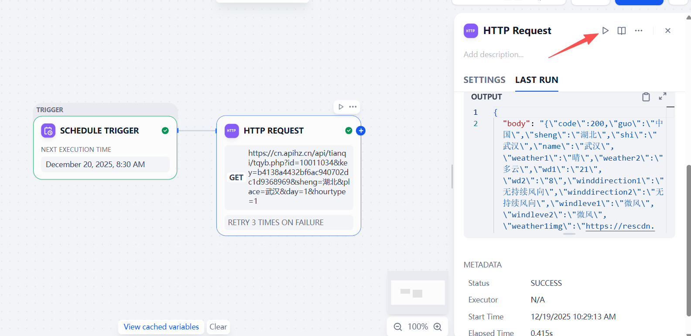

### Adding an LLM Model

The retrieved weather data is too extensive and difficult to pinpoint. Let the model help us analyze the results and provide professional weather tips.
Click the "**+**" button after the previous node, select **LLM**.
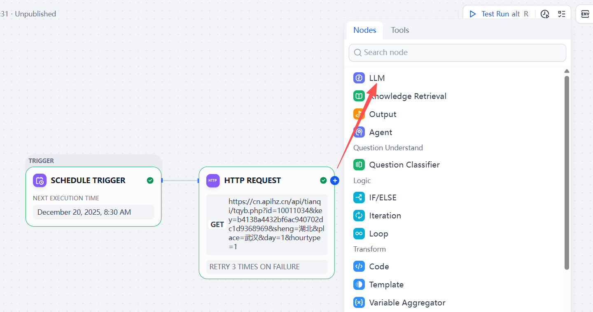
On the right-hand settings page, select the model we added. In the context field, select the `body parameter` of the HTTP request, and enter prompts containing context variables in SYSTEM. After entering the data, click the **▷** button to view the output.

```
You are a professional meteorologist with extensive life experience. Based on the input information, generate a short email with tips for travel and daily life. The email should be written in a more engaging tone, but also include data to reflect the rigor of meteorological science. Only output the results, not the thought process: [Variables]
```

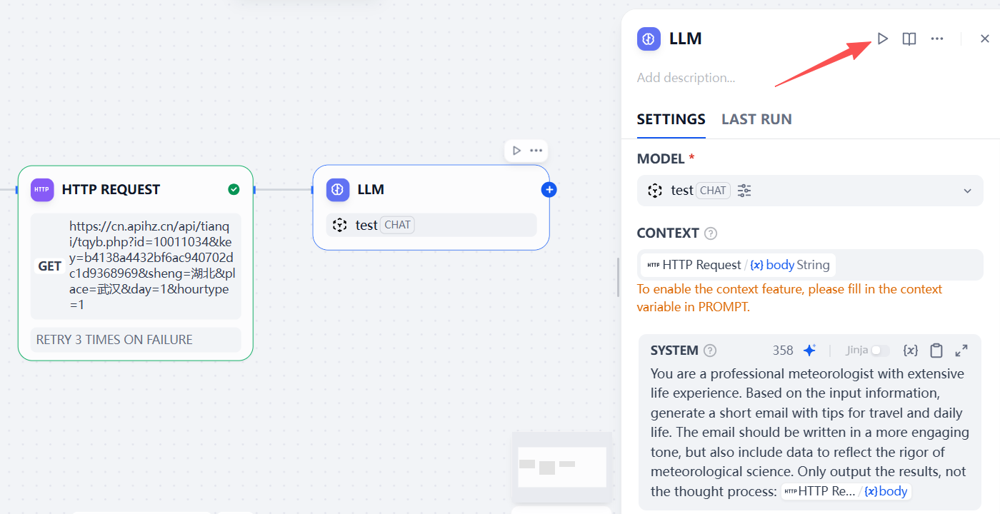

### Adding an Output Node

Finally, add an output node to output the data generated by the model, completing the workflow.
Click the "**+**" button after the previous node, and select **Output**.
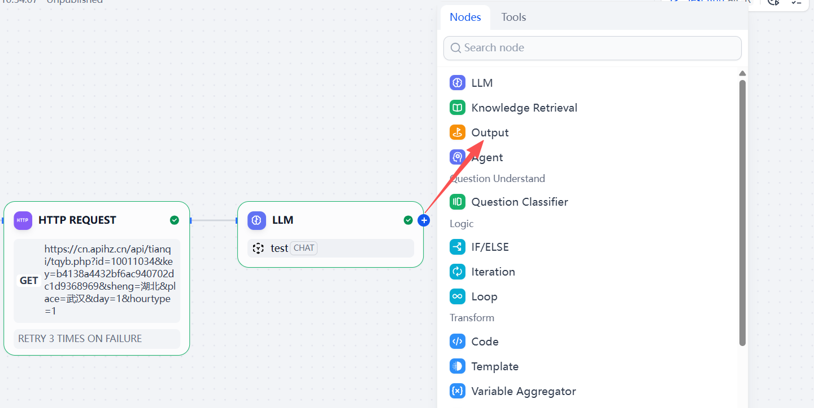
On the right-hand settings page, add an **Output Variable**, selecting the `text parameter` from the LLM output as the variable value. After setting, click the "**▷ Test Run**" button to verify that the workflow runs successfully. After the test is complete, click the "**Publish**" button.
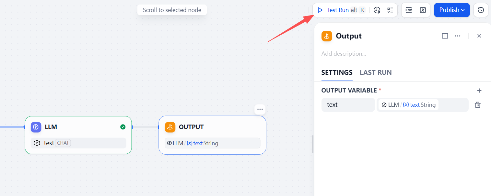

## Explore Applications

After the application is successfully published, switch to the "**Explore**" page via the top navigation bar, select the newly published application in the workspace, click the "**▷ Execute**" button, wait for the workflow to run, and view the results.
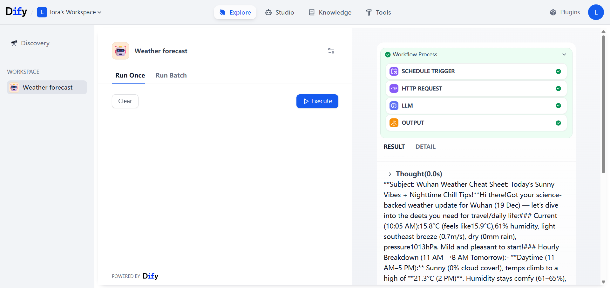
