# Building a Workflow for Scheduled Weather Emails Using N8N

## Introduction to N8N

n8n is an open-source workflow automation tool that allows users to create, edit, and run automated tasks through a visual interface. Unlike traditional programming methods, n8n uses a node-based connection approach to link various applications and data sources, achieving automated operations. Its design philosophy is "connecting everything."

The core features of this tool include:

- **Rich Node Ecosystem:** n8n boasts over 400 nodes, covering mainstream applications and services such as GitHub, Slack, Google Drive, databases (MySQL, MongoDB), and various APIs, supporting data transfer, processing, and synchronization.
- **Visual Workflow Design:** Users can drag and drop nodes to create workflows. The intuitive interface allows even non-technical users to quickly get started.
- **Powerful Scripting Support:** Users can write custom JavaScript code within node configurations to implement flexible data cleaning, transformation, or complex logic processing.
- **Scalability and Customizability:** Supports developing custom nodes or calling external APIs to meet specific business needs. An enterprise version is also provided to support advanced features such as multi-user management and access control.

## Creating a Workflow

After registering and successfully logging into the n8n platform, navigate to the "_Overview_" page and click the "**Create Workflow**" button in the upper right corner to enter the editor page.
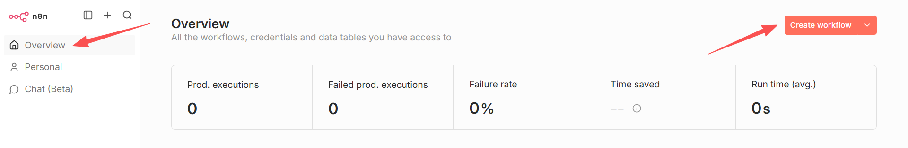

### Adding a Trigger

A trigger is the starting point of a workflow, determining when and how the process begins execution. Examples include manual triggering, scheduled triggering, and application event triggering. Here, we add a scheduled trigger and set it to fire every morning at 8:30.
In the editor page, click the "**+**" button and select "**on a Schedule**".
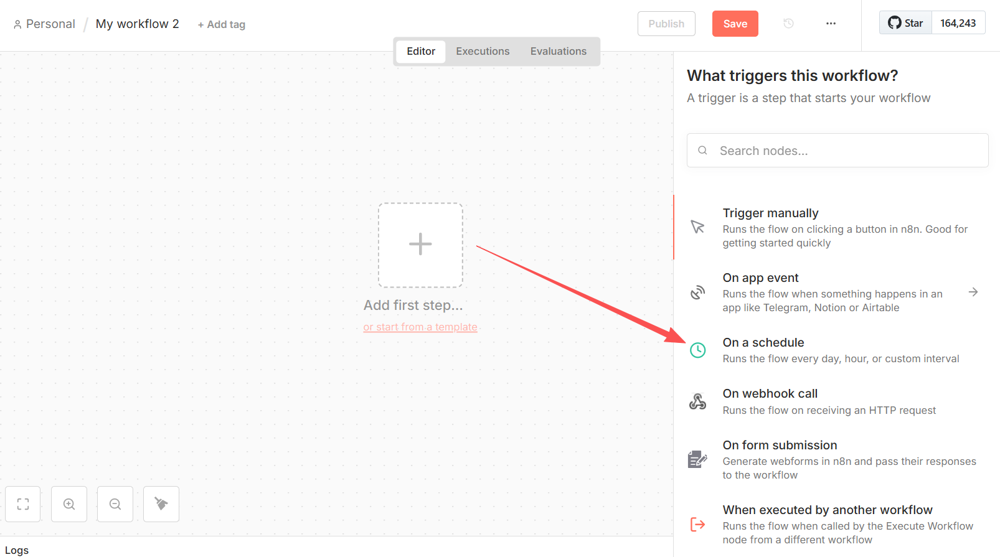
In the pop-up timer trigger window, fill in the "**Trigger Days**" and "**Time**" according to your needs. Click the _Add Rule_ button to add multiple trigger rules, allowing the workflow to run at different times.

- Trigger Interval: The interval period for workflow triggering, such as seconds, minutes, hours, days, etc.
- Days Between Triggers: The interval time for workflow triggering.
- Trigger at Hour: The specific time of day when the workflow triggers, such as 8:00 AM.
- Trigger at Minute: The specific minute of day when the workflow triggers, such as 30 seconds.
  Here, we select an interval period of **Days**, an interval time of **1**, a specific time of **8:00 AM**, and a specific minute of **30**. Click **Execute Steps** and view the output results on the right (select JSON).
  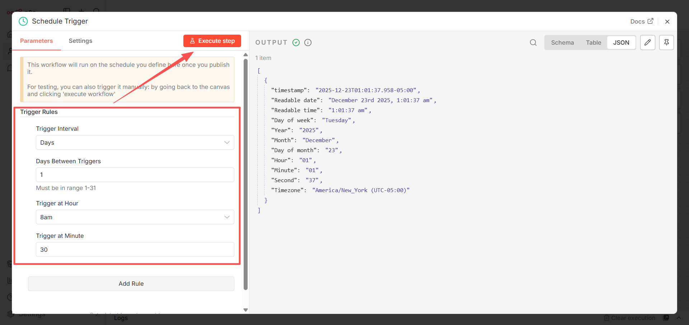
  Upon reviewing the results, the timezone was found to be America/New York, so we need to change it to Asia/Shanghai.
  Return to the canvas, click the "**···**" button at the top right of the editor, select **Settings**, modify the timezone in the pop-up window, and save.
  After saving the timezone, double-click the component in the canvas, click "Execute Steps," and review the output again. The timezone should now be displayed correctly.
  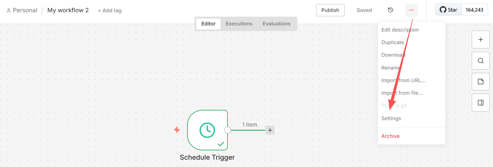
  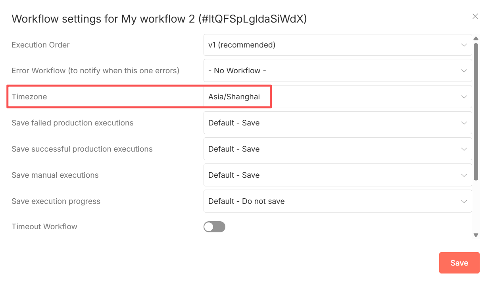

### Adding an HTTP Request

Use the HTTP request component to retrieve weather information. Click the "**+**" button after the timer trigger and select the "**Core -> HTTP Request**" component.
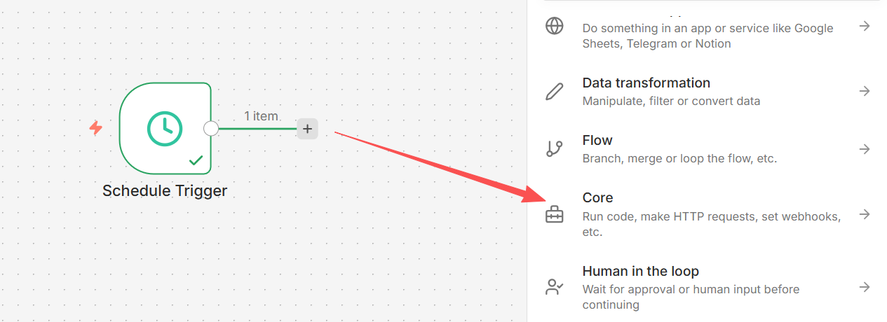
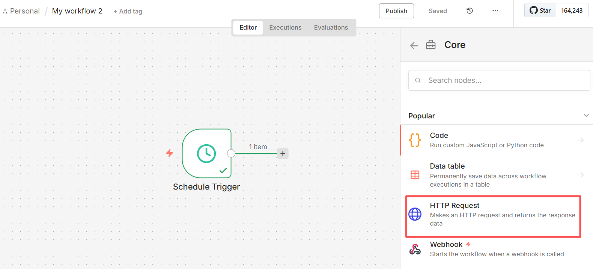
The pop-up HTTP request interface displays three parts:

- The left side displays the output data of the previous component, which will be used as input data here.
- The middle section contains the HTTP Request configuration parameters.
- The right side displays the output data of the current component, which will be used as input data for the next component.
  To begin configuring parameters, select the HTTP request method as **GET** and enter the **URL**. (Users need to register on the API Box platform to obtain their personal ID and KEY.)

```
https://cn.apihz.cn/api/tianqi/tqyb.php?id=10011034&key=b4138a4432bf6ac940702dc1d9368969&sheng=湖北&place=武汉&day=1&hourtype=1
```

After entering the data, click **Execute Steps**, and view the output results on the right (select JSON).
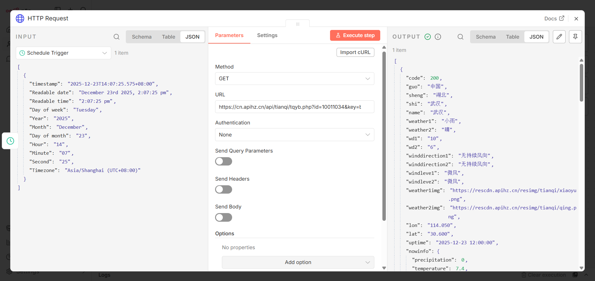

### Adding the AI ​​Agent Component

We now have all the weather information for the day, so we need to add AI to analyze all the data and output accurate and easy-to-understand conclusions.
Click the "**+**" button after the previous component and select the "**AI -> AI Agent**" component.
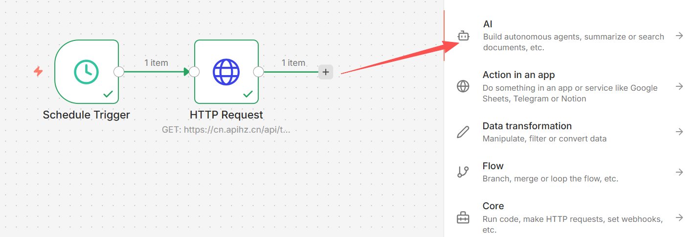
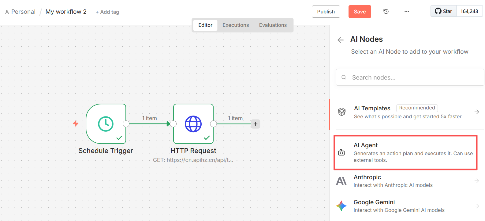
In the pop-up AI Agent page, select **Source for Promp** and **Prompt**.

- Source for Promp: Select "Define below" to customize the prompt source.
- Prompt: Hover your mouse over the Prompt input box, switch to _Expression_ in the upper right corner, and enter <span v-pre>`{{ $json }}`</span>, which means retrieving all JSON data output by the HTTP Request component.
  Click the **Add Option** button, select "System Message," and enter the message you want to send to the AI.

```
You are a professional meteorologist with extensive life experience. Based on the input information, generate a short email with tips for travel and daily life. The email should be more engaging but also include data to reflect the rigor of meteorological science. Only output the results, not the thought process, output the result in English.
```

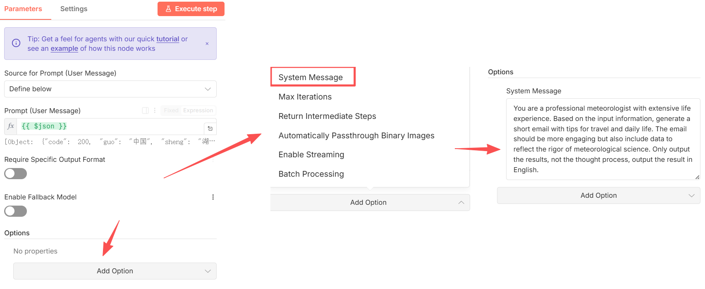
This completes the AI ​​Agent addition process. We need to return to the canvas, click the "**Save**" button in the upper right corner of the editor, and then click the "**Personal**" menu to switch pages and add credentials and the large language model.
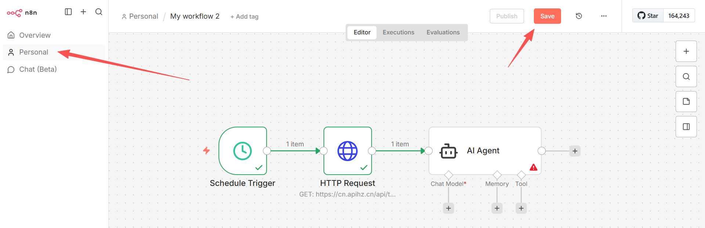

#### Adding Credentials

Before selecting a large language model, we need to add credential information for the model.
Open a new browser page, open the AGIOne platform, register an account and log in. In the model Hub, select the model you want to add, and click **API Usage** to enter the details page and obtain the **API Key** and **URL** information.
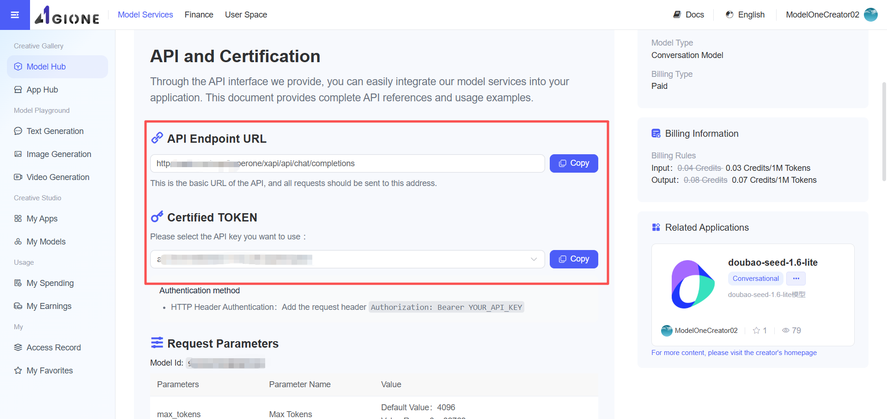
Return to your n8n personal page, switch to the "**Credentials**" tab, and click the "**Create Credential**" button in the upper right corner.
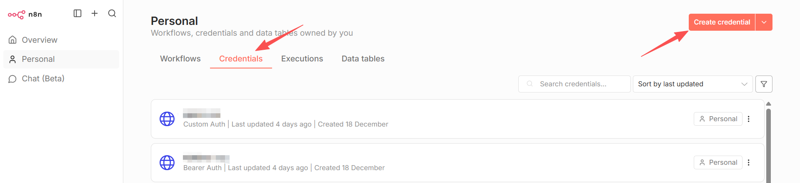
Search for the application or service you want to connect to. Here, search for and select **OpenAi**, then click "**Continue**".
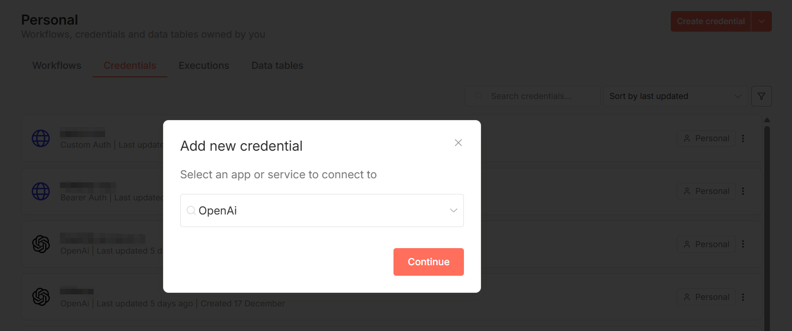
Enter the obtained **API Key** and **URL** into the panel and click "**Save**". The page will indicate that the connection test was successful, meaning the Key has been activated. Click the "**×**" button in the upper right corner of the panel to return to your personal page. After the credentials are successfully saved, we need to select and use the model.
**Base URL**: `https://tai.agione.co/hyperone/xapi/api`
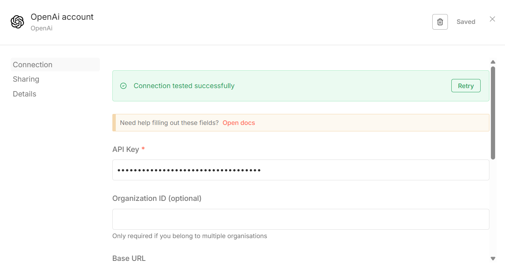

#### Adding a Large Language Model

Switch to Overview, click the saved workflow "_My workflow_", and return to the canvas page.
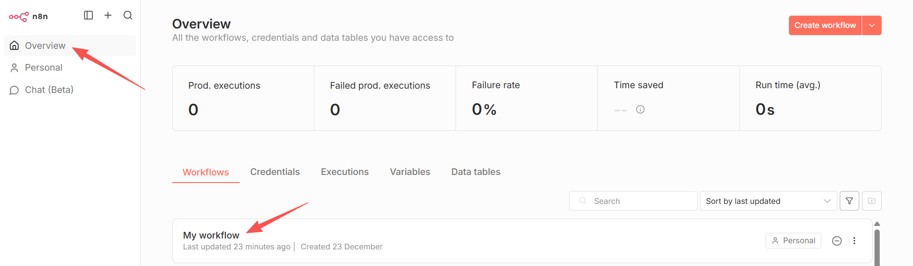
On the canvas page, there are three buttons below the AI ​​Agent component. Click the "**Chat Model +**" button. On the Language Models page, select a model; here, I choose "**OpenAI Chat Model**".
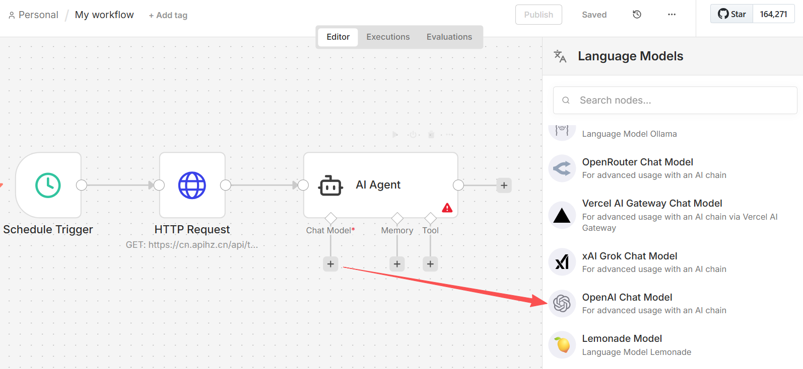
In the pop-up OpenAI Chat Model page, select the **credential** we just added. Change the Model filter to "_By ID_", copy the model ID selected in the AGIOne platform into the input box, and return to the canvas after selection. Click the "**Execute Workflow**" button at the bottom of the canvas. (The Responses API is not currently supported. Please disable the `Use Responses API` switch.)
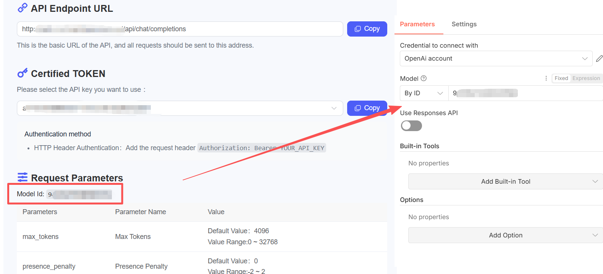

After the workflow is completed, double-click the AI ​​Agent component, observe the bottom left corner of the configuration page, and the model has been added successfully. Click **Execute Steps**, and view the output results on the right (select JSON).
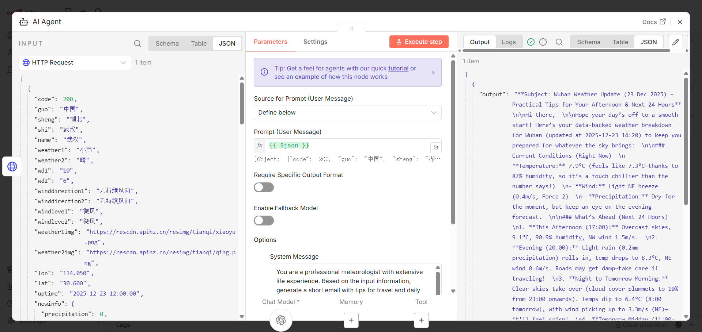

### Adding a Markdown Component

AI output is generally in Markdown format, but email clients may not support Markdown rendering. Therefore, adding a Markdown component converts Markdown to HTML.
Click the "**+**" button after the previous component and select the "**Data transformation -> Markdown**" component.
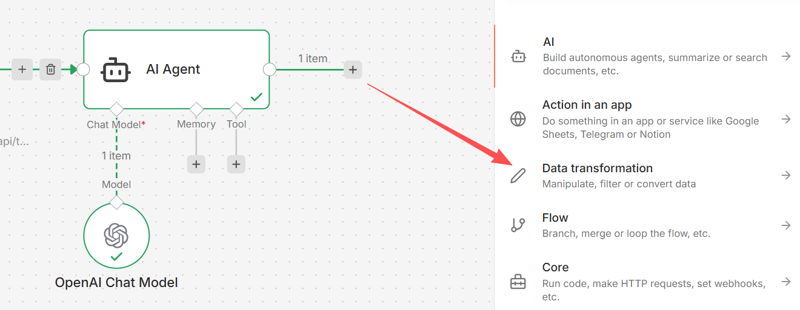
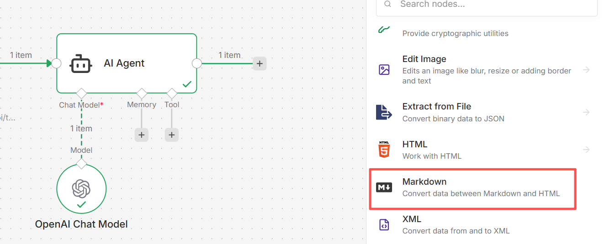
In the pop-up Markdown page:

- Select **Markdown to HTML** for Mode
- Hover your mouse over the Markdown input box, switch to _Expression_ in the upper right corner, drag the output field from the input data to the Markdown input box, and automatically generate the expression <span v-pre>`{{ $json.output }}`</span>, which means retrieving the value of the output field from the JSON data output by the AI ​​Agent component.
- Destination Key uses data by default.
  After configuring the parameters, click **Execute Steps**, and view the output results on the right (select JSON).
  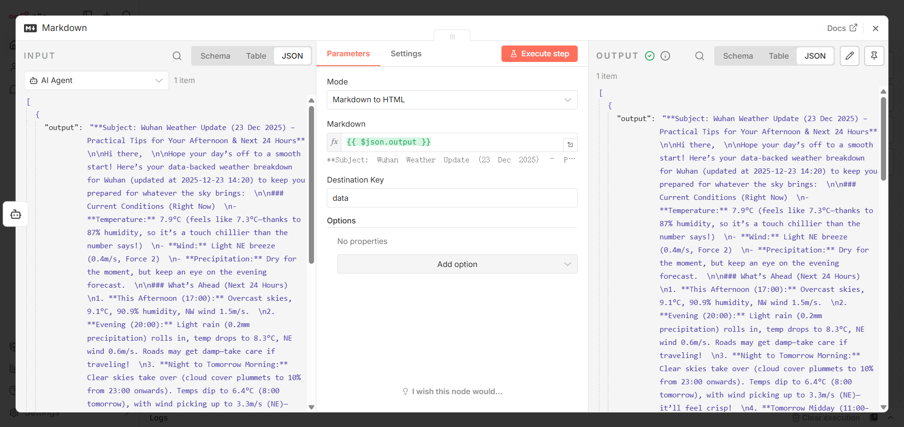

### Adding an Email Sending Component

The weather forecast has been generated, but I can't open my N8n at 8:30 every day to run the workflow and check the weather. Therefore, I need to automatically send the information to my email every day for easy viewing.
Click the "**+**" button after the previous component, search for your email address, and select the "**Send Email -> Send an Email**" component.
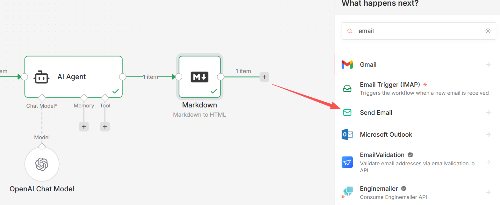
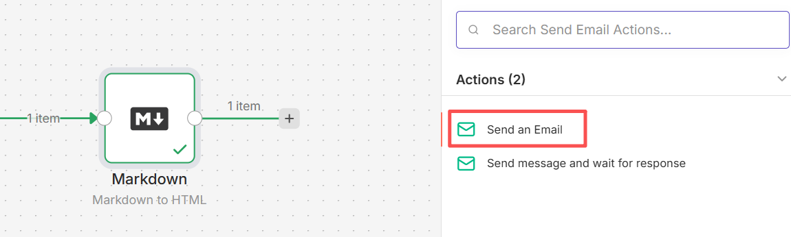
In the pop-up Send Email page, click the "Credentials to connect to" dropdown menu and select **Create New Credentials**. In the pop-up panel, enter the _User_, _Password_, _Host_, and _Port_ information (this information can be obtained from the email platform's settings page under _Third-Party Client Login_). Click the **Save** button. A message indicating a successful connection test means the email message is now active.
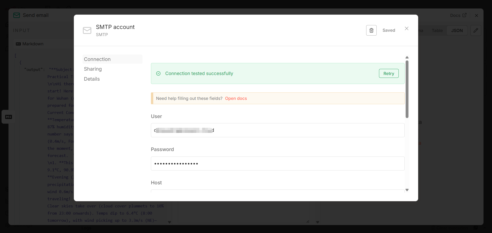
Click the "**×**" button in the upper right corner of the panel to return to the Send Email page:

- Select the newly added email credential
- Operation: Default selection is Send
- From Email: Enter the sender's email address
- To Email: Enter the recipient's email address
- Subject: Enter the email subject, for example: Wuhan Today's Weather
- HTML: Hover your mouse over the HTML input box, switch to _Expression_ in the upper right corner, and drag the data output from the previous component into the HTML box.
  After configuring the parameters, click **Execute Steps**. View the output results on the right (select JSON).
  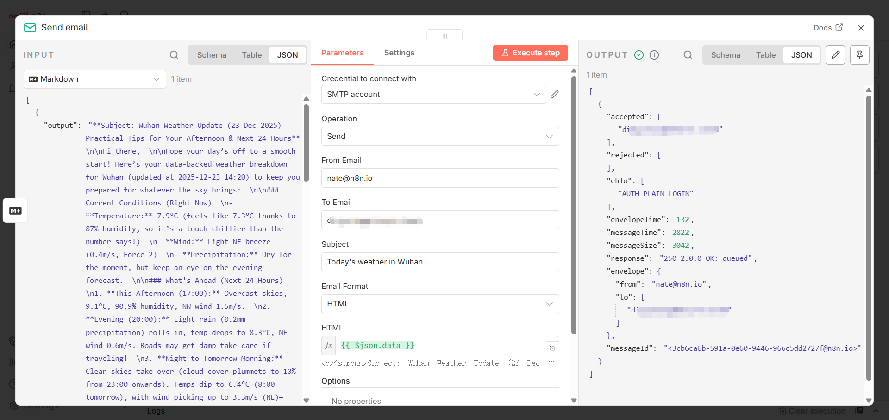
  Log in to the email address you selected to receive the email. If you received it, the email was sent successfully.
  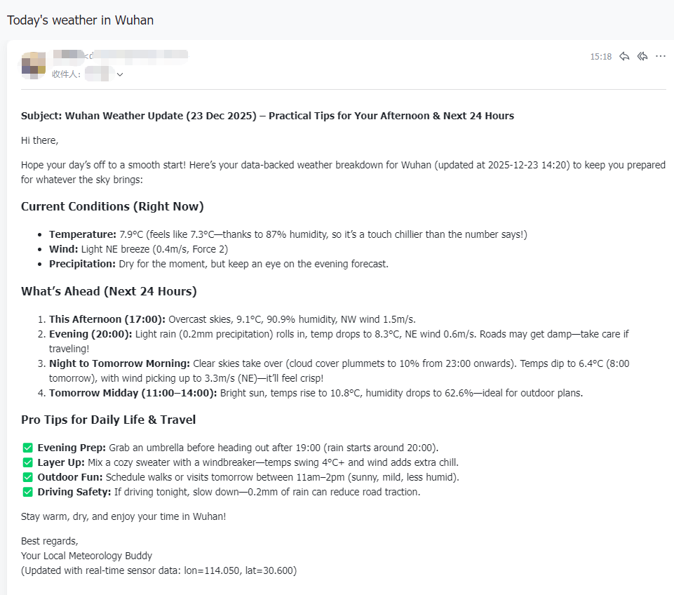
  Finally, return to the canvas, change the workflow name to "_Weather Alert_" in the upper left corner of the editor, and click the **Save** button in the upper right corner.
  On the overview page, find the _Weather Alert_ workflow, click the "**︙**" button at the end, select **Archive**, and activate the workflow.
  Now you'll receive a weather alert email every morning at 8:30!
  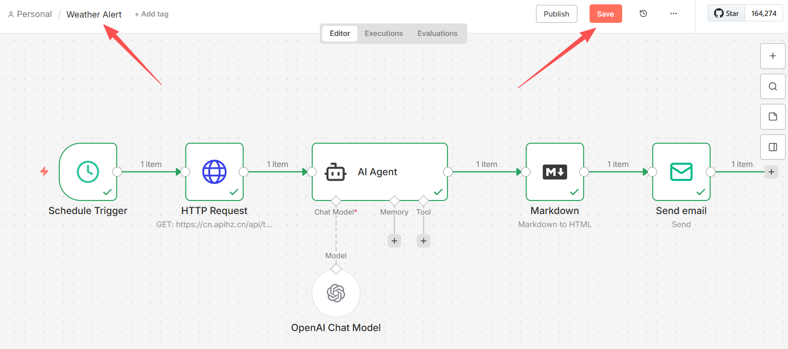
  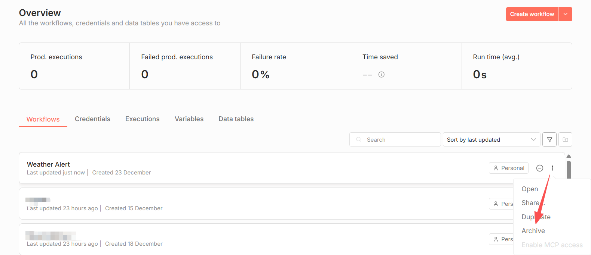
