# Creating Model Dialogues for The Little Prince Using Open WebUI

## Introduction to Open WebUI

Open WebUI is a scalable, feature-rich, and user-friendly **self-hosted AI platform** designed for completely offline operation. Here's a detailed overview of Open WebUI:

- **Multi-Model Support:** Open WebUI supports various LLM (Large Language Model) runners, such as Ollam and OpenAI compatible APIs, allowing users to quickly switch, load, and manage different local and remote AI models.
- **RAG Pipeline:** A built-in RAG (Retrieval Augmentation Generative) inference engine supports content extraction and processing from videos, documents, or embedded data.
- **Multimodal Support:** Supports various data types of input, including text and images, enriching the interactive experience.
- **Customizability:** Users can customize model parameters, such as temperature and context length, through the model management tool to meet individual needs.
- **Built-in Memory Function:** Allows users to add memories to the model for continued use in conversations, improving the coherence and accuracy of dialogue.
- **Collaboration and Sharing:** Supports local chat sharing and session cloning for convenient team collaboration or personal note-taking.

## Adding a Model API Connection

Click your account avatar in the upper right corner, select **Admin Panel** and click it.
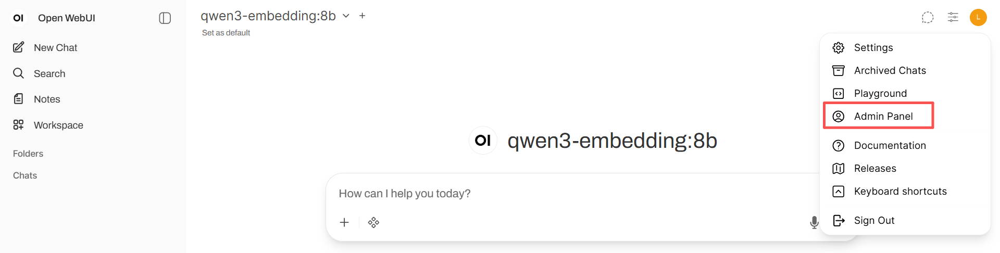
Switch to the _Settings_ page. On the `External Connections` page of the `Settings` page, add an OpenAI API connection. Click the "**+**" button at the end.
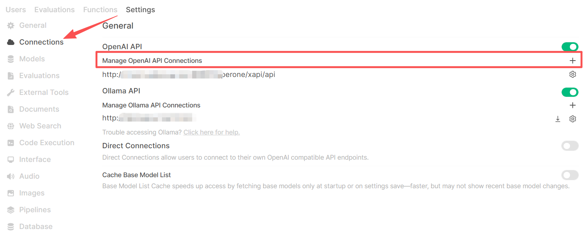
After the add connection pop-up appears, keep the page still.
Open a new browser tab and open the AGIOne platform. In the model square, select the model you want to add and click **API Usage** to enter the details page.
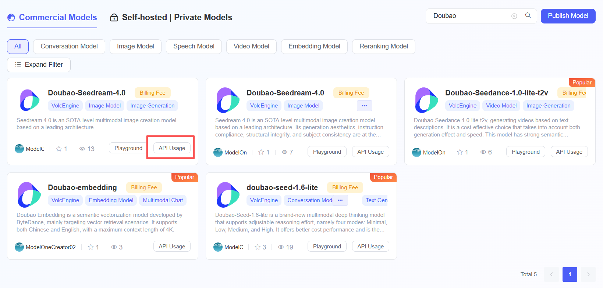
The core parameters are as follows:

- URL address: `https://tai.agione.co/hyperone/xapi/api`
- API key: Obtain the API key from `Authentication TOKEN`
- Model ID: Obtain from `Request Parameters`
  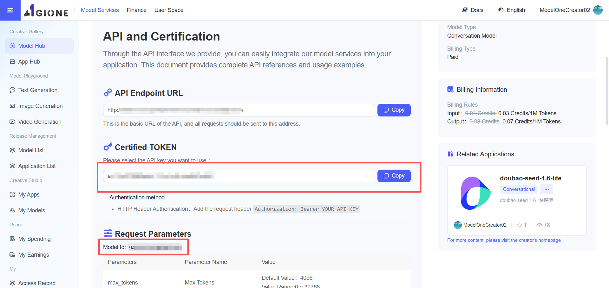
  Return to the Open WebUI platform's add connection page, copy the above parameters into the corresponding field input boxes, check that the information is correct, and click the "**Save**" button. The model will then be successfully displayed in the list.
  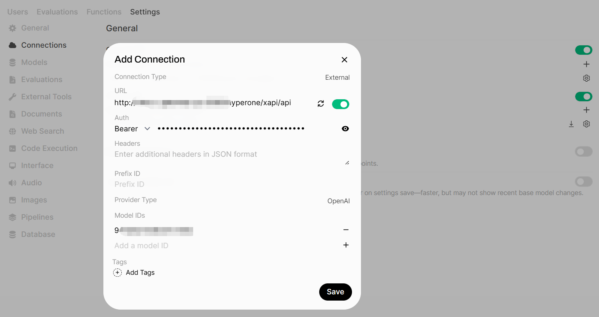

## Creating a Knowledge Base

Switch to "**Workspace -> Knowledge"** in the menu, and click the "**+ New Knowledge**" button.
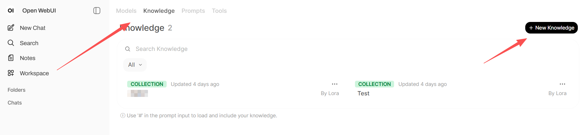
Enter the knowledge base name and description, and click the "**Create Knowledge**" button in the lower right corner.
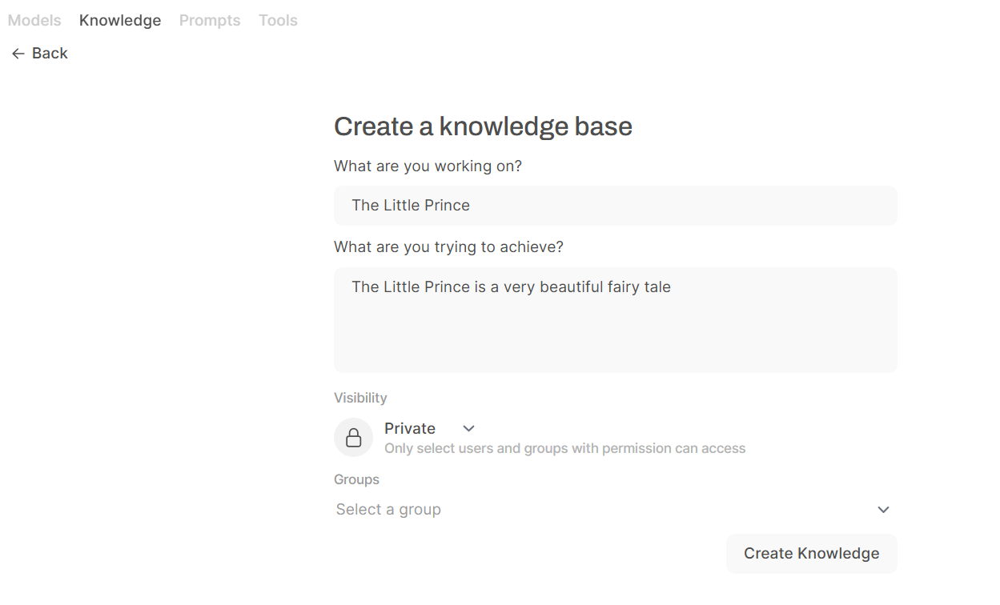
In the The Little Prince knowledge base, click the "**+**" button on the right, select "Upload File," and upload the The Little Prince TXT file. If the file upload fails, please open the administrator settings panel and add the embedded model and other configurations on the document page.
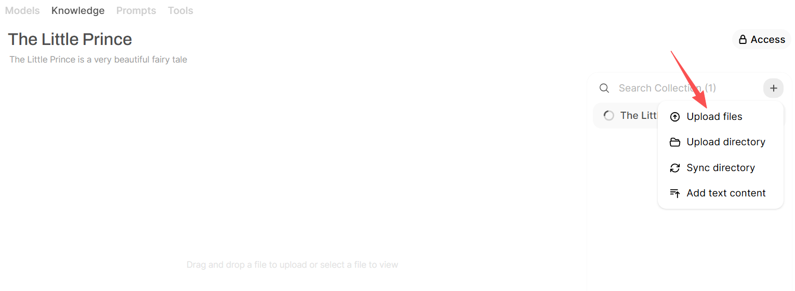

## Creating a Model

Switch to the **Models** page and click the "**+ New Model**" button.
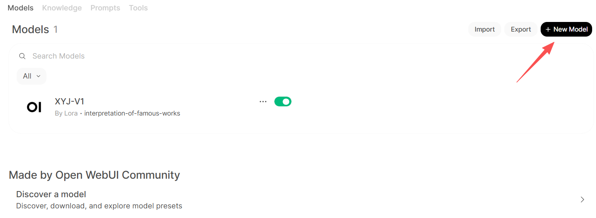
Enter the _Model Name_ and select the _Base Model_ (the model from the first step, `Adding a Model API Connection`). Click the "**Select Knowledge**" button to associate the knowledge base with the model. Change the access setting to _Public_ in the upper right corner. Fill in other information as needed. After configuring the model, click the **Save & Create** button.
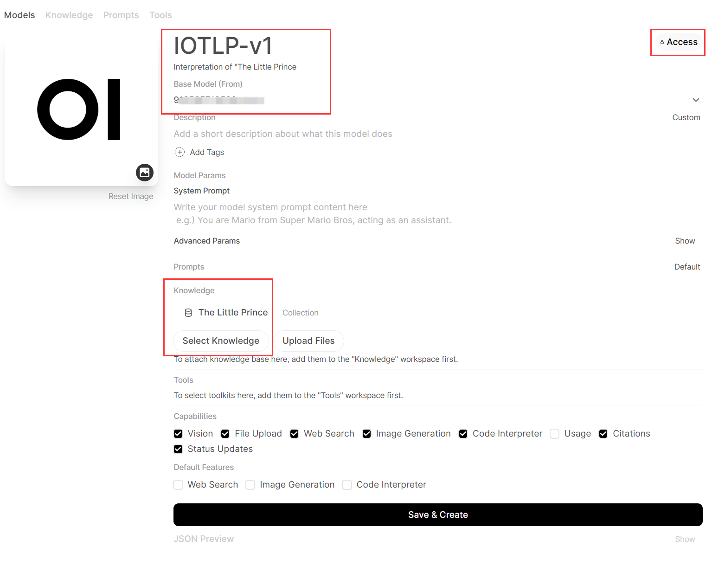

## Using the Model

Switch to the **New Chat** page, select the newly added model `IOTLP-v1`, enter a hint related to The Little Prince in the dialog box and send it, then wait for the model to respond.
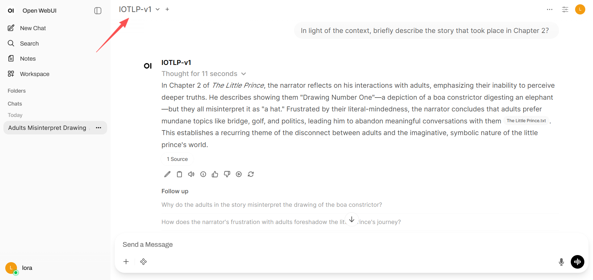
