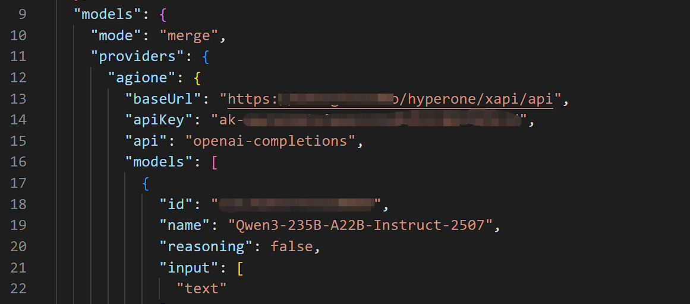
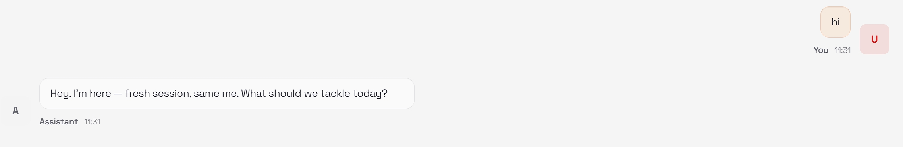

# Add AGIOne as a model provider to Openclaw

## Installing Openclaw

Installation process (omitted)

## Configuration Model (Using AGIOne as the model provider)

### Manually modify the configuration file:

```
Prompt message: Modifying the AGIOne model via the openclwa command without first modifying the configuration file is not currently supported.
```

1. Edit `~/.openclaw/openclaw.json`, and add the AGIOne model provider in `models.providers`.
   - _provider_: agione (User-defined)
   - _baseUrl_: `https://tai.agione.co/hyperone/xpai/api`
   - _api_: openai-completions
   - _id_: "Model ID on AGIOne"
   - _name_: "Model name on AGIOne"
     
2. In `models.agents`, modify the AGIOne model to be used.
   - _primary_: "agione/Model ID on AGIOne" `# Format：agione/model id，The agione and providers need to be consistent.`
     
3. Restart the Gateway service.

```Plain
openclaw gateway restart

# If you are using a different version or deployment method, simply restart the service.
```

4. Test Response: In chat, send a test message such as "Hi". If a normal response is returned, the configuration is successful.
   
