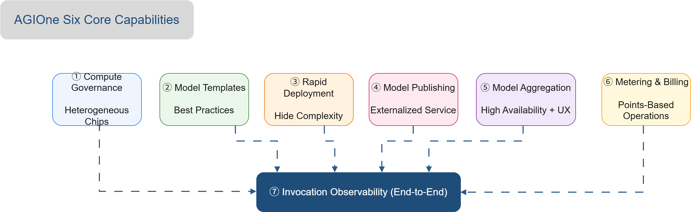
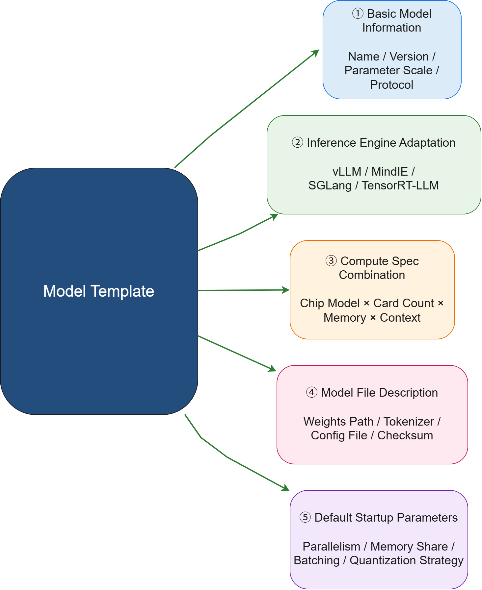
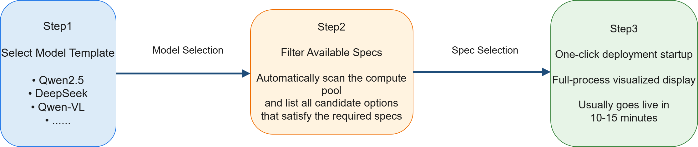
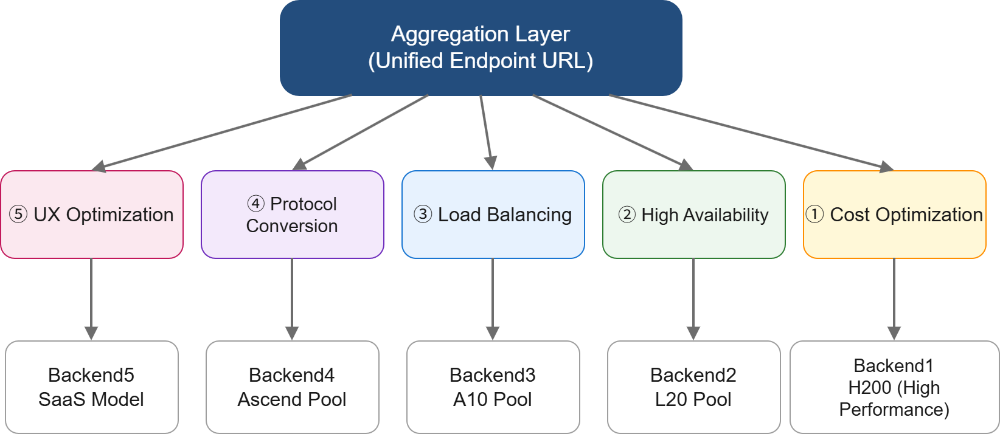
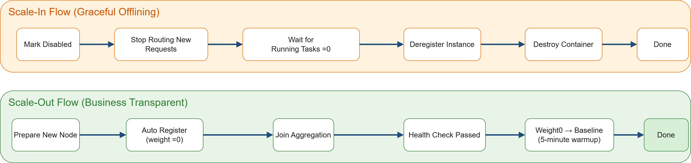
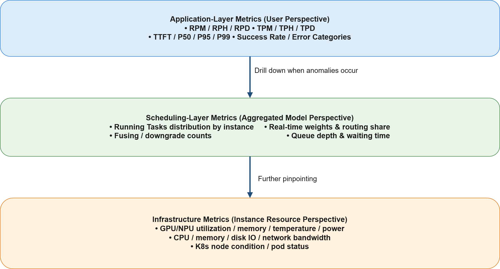
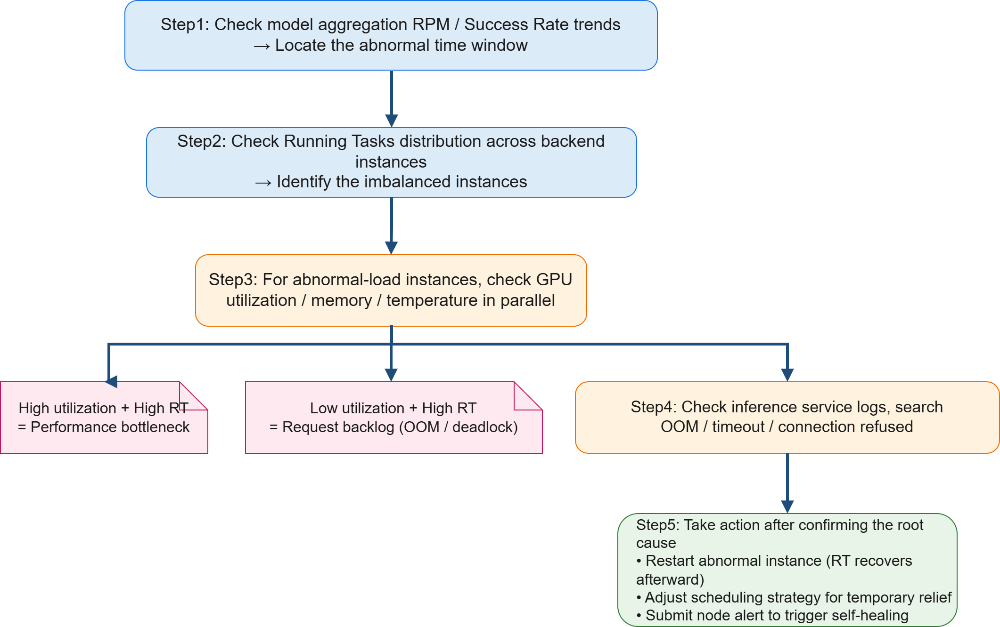
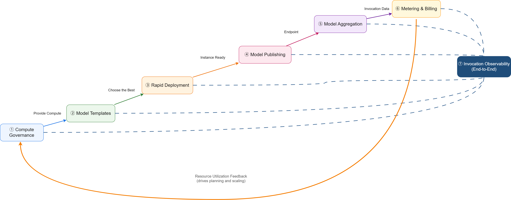

# Core Capabilities and Features

## Overview

AGIOne is a **one-stop intelligent computing power and model management platform** for enterprise-level LLM production operations. It provides six core capabilities centered around the end-to-end closed loop of **Computing Power → Model → Service → Operations**:



<p align="center"><i>Figure 1: AGIOne Six Core Capabilities Overview (including end-to-end call observability)</i></p>

> The seventh capability, **Call Observability**, runs horizontally across the first six capabilities, providing full链路 visualization and analysis from hardware resources to business calls.

---

## 1. Computing Power Governance — Heterogeneous Chip Unified Pooling

### 1.1 Capability Overview

Through a unified computing power governance layer, AGIOne integrates accelerated cards (GPU/NPU) distributed across **different machine rooms, different vendors, and different generations** into a **logically unified, physically heterogeneous** computing resource pool, with **automatic scheduling and allocation** based on business specification requirements. This fundamentally solves enterprise pain points such as computing resource fragmentation, low utilization, and difficult scaling.

### 1.2 Supported Heterogeneous Chip List

| Vendor | Architecture / Series | Typical Models | Inference Engine Adaptation |
|---|---|---|---|
| **NVIDIA** | Hopper | H200 / H20 / H100 / H800 | vLLM / TensorRT-LLM / SGLang |
| **NVIDIA** | Ada | L40 / L40S / L20 / L20S / L4 / L2 / RTX 4090, etc. | vLLM / TensorRT-LLM |
| **NVIDIA** | Ampere | A100 / A800 / A40 / A30 / A10 / RTX A Series / RTX 30 Series | vLLM |
| **Huawei Ascend** | Ascend 910 | 910B / 910C | MindIE |
| **Enflame** | Enflame | 106 | Vendor Inference Framework |
| **Biren** | Biren | S60 | Vendor Inference Framework |

### 1.3 Core Sub-capabilities

#### 1.3.1 Node Governance and Lifecycle Management

- **Multi-cluster Governance**: Supports cross-machine-room, cross-network-domain (public cloud HCS, private cloud, IDC physical machines) governance into a unified management view with "central management + edge execution" architecture;
- **Node Initialization**: Provides standardized node initialization scripts, automatically installing container runtime, K8s kubelet, accelerated card drivers, AGIOne Agent and other components;
- **Base Image Specification**: Creates base images containing OS / drivers / K8s components / Agent; **failed node OS can be automatically restored within 15 minutes after reinstallation**;
- **Fault Self-healing**: Heartbeat detection failure automatically removes traffic → OS reinstallation → automatic registration → health check passed → automatic traffic access, full process automation.

#### 1.3.2 Resource Scheduling and Allocation Strategy

| Scheduling Dimension | Strategy | Applicable Scenario |
|---|--------------------------------------------------------------|---|
| **Hardware Label Scheduling** | Precise routing through labels like `xpu_type=ascend-910b64g` / `nvidia-h2096g` | Different inference engines bound to different chips |
| **VRAM Specification Scheduling** | Automatically selects cards meeting conditions based on model VRAM requirements (e.g., 72B model requires ≥ 80G HBM) | Large model inference |
| **Business Priority Scheduling** | Core business preferentially occupies high-performance cards; secondary business uses remaining resources | Multiple business lines sharing |
| **Multi-card Parallel Scheduling** | Automatically configures `tensor_parallel_size` / `world_size`, supports HCCL / NCCL communication | Single-machine multi-card, multi-machine multi-card |
| **Elastic Auto-scaling** | Automatically scales horizontally based on load trends; instances scale from 4 → 36 without affecting online business | High-concurrency inference |

#### 1.3.3 Hardware Monitoring Metrics

Collected in real-time via DCGM (NVIDIA) / npu-exporter (Ascend), pushed to monitoring dashboards at **15~30 second granularity**:

- **GPU/NPU Compute Utilization** & SM occupancy rate
- **VRAM Usage** & VRAM bandwidth
- **Core Temperature** & VRAM temperature
- **Real-time Power Consumption** & TDP utilization
- **NVLink / InfiniBand Bandwidth** & health status


## 2. Model Templates —沉淀最佳实践

### 2.1 Capability Overview

Based on **vast historical deployment experience**, AGIOne沉淀 each mainstream LLM's deployment knowledge into **reusable model templates**, transforming work that **relies on expert experience** (how many cards, which engine, which parameters needed to deploy a model) into **out-of-the-box standard products**.

### 2.2 Model Template Contents

Each model template encapsulates the following five types of information, constituting complete deployment knowledge assets:



<p align="center"><i>Figure 2: Five Components of Model Templates</i></p>

### 2.3 Built-in Model Template Examples

#### 2.3.1 Mainstream LLM Pre-built Template Examples

| Model Series | Typical Versions | Parameter Scale | Recommended Computing Spec | Inference Engine | Context Support |
|---|---|:---:|---|:---:|:---:|
| **DeepSeek** | V3.1 / R1 | 671B MoE / 7B-70B | H200×8 / H20×4 + RDMA | vLLM | 32K/64K/128K |
| **Qwen** | QwQ-32B | 32B | H20×2 / L20×4 | vLLM | 32K/64K |
| **Qwen-VL** | 2 / 3 | 7B / 14B / 72B | H20×2 / H200×2 | vLLM | Multimodal |
| **InternLM** | 2-20B | 20B | H200×2 / Ascend 910B×4 | vLLM/MindIE | 32K |
| **GLM** | 4.6 | — | H20×4 | vLLM | 32K |
| **Embedding/Rerank** | bge-m3 / bge-reranker / qwen3-embedding | — | L20×1 / L4×2 | vLLM | — |

#### 2.3.2 Multiple Specification Variants per Template

The same model can provide **multiple specification variants** within a template, corresponding to different business scenarios:

| Model | Spec Variant | Recommended Hardware | Context | Concurrency | Applicable Scenario |
|---|---|---|:---:|:---:|---|
| **Qwen2.5-7B** | Standard | L20 × 1 | 32K | ≥ 50 QPS | High-concurrency Q&A |
| **Qwen2.5-32B** | Balanced | L20 × 2 | 64K | 20-50 QPS | Document analysis |
| **Qwen2.5-72B** | Long Context | H20 × 4 | 128K | 5-20 QPS | Engineering report analysis |
| **DeepSeek-V3** | Flagship Inference | H200 × 8 + RDMA | 128K | 10-30 QPS | Complex reasoning tasks |

### 2.4 Template Version Management

- **Official Templates**: Continuously maintained by the AGIOne team, updated following mainstream model versions;
- **Enterprise Custom Templates**: Customers can沉淀 proprietary templates based on actual business scenarios (e.g., "Best configuration for fine-tuned Qwen3-VL-7B on 4×L20"), forming internal enterprise best practices library;
- **Template Sharing Market**: Share templates across teams within the enterprise to avoid duplicate exploration;
- **Template Version Tracing**: Each update retains historical versions, supporting rollback.

## 3. Rapid Deployment — "One-click" Experience Blocking Technical Details

### 3.1 Capability Overview

Based on model template capabilities, AGIOne transforms model deployment—which originally required multiple engineers collaborating for days—into a productized process of **"Select Model → Select Spec → One-click Deploy"**, completely blocking complex technical details such as inference framework configuration, VRAM calculation, parallel parameters, and container orchestration, **allowing ordinary operations/business personnel to complete professional-level model deployment**.

### 3.2 Three-Step Rapid Deployment Process



<p align="center"><i>Figure 3: Three-Step Rapid Deployment Process</i></p>

### 3.3 Intelligent Spec Filtering

After the user selects a model, AGIOne **automatically scans the current computing pool**, instantly calculating and displaying all **immediately deployable spec combinations** based on the following conditions:

| Filtering Condition | Automatic Judgment Logic |
|---|---|
| **Sufficient VRAM** | Calculates model weights × quantization coefficient + KV Cache reserve + system overhead |
| **Sufficient Cards** | Checks if idle cards in target computing pool ≥ `tensor_parallel_size` |
| **Network Satisfied** | Validates RDMA bandwidth and latency for multi-machine deployment |
| **Driver Version Compatible** | CUDA / CANN version matches image requirements |
| **Sufficient Storage** | Validates data disk remaining space ≥ model weight size × 1.2 |
| **Current Priority Conflict** | Checks if it would preempt resources used by core business |

### 3.4 Deployment Process Visualization

After deployment starts, the UI **displays each phase in real-time**, keeping users informed of deployment status:

| Phase | UI Display Content | Typical Duration |
|:---:|---|:---:|
| **① Resource Allocation** | Highlights selected physical cards (rack / node / card number), animation showing resource locking | < 30 seconds |
| **② Container Scheduling** | K8s Pod creation progress, scheduling policy, node matching, resource quota validation | 30 seconds ~ 2 minutes |
| **③ Image Pull** | Inference engine image download progress bar (near-end image service can complete in seconds) | 1 ~ 5 minutes |
| **④ Model Loading** | Model weights loaded from shared storage to VRAM, shard loading progress | 2 ~ 10 minutes |
| **⑤ Engine Initialization** | vLLM / MindIE startup logs scrolling in real-time, PagedAttention initialization | 30 seconds ~ 2 minutes |
| **⑥ Health Check** | HTTP `/health` probe, inference warmup request, TTFT benchmark test | 30 seconds ~ 1 minute |
| **⑦ Aggregate/Routing Access** | Instance registered to API gateway / aggregate model, weight linearly rising from 0 to baseline | 30 seconds ~ 5 minutes |

The entire process typically **completes within 10-15 minutes**, with no command line, no manual yaml configuration, and no need to understand inference framework details.

### 3.5 Failure Rollback and Diagnosis

- **Any phase failure** automatically rolls back allocated resources to avoid resource leakage;
- **Failure reasons** are located through the rule engine: "Insufficient VRAM / Image pull timeout / Model file validation failed / Port conflict" and other typical errors have clear prompts;
- **Historical deployment records** are completely retained, supporting review and attribution.

---

## 4. Model Publishing — Service-oriented External Exposure

### 4.1 Capability Overview

AGIOne **service-encapsulates** deployed model instances as standard Endpoints, securely and controllably providing model capabilities to business parties through unified authentication mechanisms, pricing strategies, and rate limiting configuration, achieving the key leap **from "usable" to "commercially usable"**.

### 4.2 Endpoint Standard Encapsulation

| Encapsulation Dimension | Content |
|---|---|
| **Protocol Compatibility** | OpenAI compatible (`/v1/chat/completions`, `/v1/embeddings`, `/v1/models`)<br>Anthropic compatible (`/v1/messages`), zero-modification migration for existing clients |
| **Endpoint URL** | Standard URL form, e.g., `https://agione.example.com/v1/chat/completions`, with custom `model` field routing |
| **Request/Response Specification** | Fully compliant with community standards; tool calling (Function Calling), streaming output (SSE), multimodal input all supported |
| **Error Code Specification** | Standard HTTP status codes + business error codes for unified client handling |

### 4.3 Authentication and Permissions

- **API Key Authentication**: Each tenant/business line is issued an independent API Key, supporting multiple Keys coexisting and Key rotation;
- **OAuth 2.0 / SSO**: Integration with enterprise identity systems (LDAP / DingTalk / WeCom / SAML) for unified identity;
- **RBAC Permission Model**: Four-level granularity authorization by tenant → project → model → operation, controlling who can call, who can view bills, and who can manage instances;
- **IP Whitelist**: Single Key can bind to source IP ranges for tighter access control.

### 4.4 Pricing Configuration

During publishing, **differentiated pricing strategies** can be configured for each Endpoint:

| Pricing Mode | Applicable Scenario | Configuration Example |
|---|---|---|
| **Per Token Pricing (Input/Output separately)** | General dialogue, document generation | DeepSeek-V3: Input $0.012/1K Tokens, Output $0.048/1K Tokens |
| **Per Call Pricing** | Fixed structure requests (OCR, vectorization) | Embedding: $0.001 / call |
| **Per Duration Pricing** | Streaming output, long tasks | Speech synthesis: $0.05 / second |
| **Per Resource Exclusive Pricing** | Package cards / package instances | H200×8: $XXX / month exclusive |
| **Mixed Pricing** | Complex scenarios | Base package + excess at per-token rate |

Supports differentiated pricing for **different tenants / different time periods / different model specs** (e.g., internal business department cost price, partner discounted price, external customer standard price).

### 4.5 Multi-dimensional Rate Limiting Configuration

AGIOne provides **fine-grained multi-dimensional rate limiting** at the API gateway layer to prevent single caller overload and protect core business quality:

| Rate Limiting Dimension | Configuration Granularity | Typical Scenario |
|---|---|---|
| **Per Tenant RPM/TPM** | Independent quota per tenant | Intelligent Manufacturing Division: RPM=500, TPM=2,000,000 |
| **Per API Key** | Single Key independent rate limiting | Prevent key leakage causing massive abuse |
| **Per User RPM/TPM** | Per-user rate limiting within tenant | Single user: RPM=30, TPM=100,000 |
| **Per Model Rate Limiting** | Per Endpoint rate limiting | 128K long context: RPM=50 (protect stability) |
| **Per Time Period Variation** | Working hours vs. nighttime | High priority during working hours, relaxed at night |
| **Per Scenario Variation** | Different API paths | `/chat/completions` RPM=1000, `/embeddings` RPM=5000 |

**Overflow strategy** can choose "Direct rejection (HTTP 429)" or "Queue waiting"; core business recommends queuing without losing requests.

### 4.6 Canary Release and Version Management

- **Canary Release**: New model first accesses at 1% traffic, gradually scaling to 10% / 50% / 100%;
- **A/B Testing**: Two versions run in parallel under the same Endpoint, split by user tags or random routing for effect comparison;
- **Quick Rollback**: One-click switch back to previous version upon detecting anomalies, effective in seconds;
- **Version Archiving**: Historical release records retained for querying any release's configuration details anytime.

---

## 5. Model Aggregation — Multi-objective Optimization Intelligent Orchestration

### 5.1 Capability Overview

The Aggregated Model is AGIOne's **core value abstraction**: **Logically**, it is a unified model Endpoint externally; **Physically**, it consists of multiple backend inference instances (which can span hardware, clusters, and regions). The aggregation layer **real-time dynamically decides** routing each request to the most suitable backend based on multi-dimensional needs such as **cost, high availability, load balancing, protocol conversion, and user experience**, allowing upstream applications to be unaware of backend complexity.

### 5.2 Five Optimization Objectives of Aggregated Models



<p align="center"><i>Figure 4: Five Optimization Objectives of Aggregated Models</i></p>

### 5.3 Five Aggregation Strategies in Detail

#### 5.3.1 Cost Optimization Aggregation

- **Requirement**: Meet SLA at lowest cost
- **Strategy**: Prioritize routing to backend instances with lowest cost per token (e.g., prefer L20 over H200, prefer INT4 quantized version)
- **Typical Scenarios**: Daily Q&A, internal office assistant, knowledge base retrieval

#### 5.3.2 High Availability Aggregation (HA)

- **Requirement**: 99.9%+ service availability, single point of failure does not interrupt
- **Strategy**: Multi-instance hot standby; automatic traffic removal after 2 heartbeat failures (60 seconds); automatic access after failed node recovery; cross-machine-room / cross-availability-zone deployment
- **Typical Scenarios**: Core business system integration, external commercial API

#### 5.3.3 Load Balancing Aggregation

- **Requirement**: Avoid load imbalance between instances (inference tasks have uneven duration, simple polling causes some instances to overload)
- **Strategy**: Dynamic weighted distribution based on **real-time Running Tasks count**, formula:

```
Weight(i) = BaseCapacity(i) × HealthScore(i) / (RunningTasks(i) + 1)
```
Where:
- `BaseCapacity` — Normalized value of instance's tested TPM baseline (reflecting hardware performance differences)
- `HealthScore` — 0.0~1.0 (success rate), drops to 0 when abnormal
- `RunningTasks` — Number of requests currently being processed (real-time collection)

The scheduler **updates weights every 1 minute**, and requests automatically tend toward healthy instances with lower load.

#### 5.3.4 Protocol Conversion Aggregation

- **Requirement**: Upstream uses OpenAI protocol, but backend instances may use different inference frameworks and protocols
- **Strategy**: Aggregation layer **automatically converts protocol formats** on request/response path, backend models are unaware
- **Supported Conversions**: OpenAI ⇄ Anthropic, OpenAI ⇄ MindIE native protocol, Streaming ⇄ Non-streaming

#### 5.3.5 Experience Optimization Aggregation

- **Requirement**: Low TTFT, high output rate, improve user perception
- **Strategy**: Select instances with best experience based on **historical P95 latency and output TPS**; SLA threshold can be configured (e.g., TTFT < 2s), instances failing to meet are deprioritized
- **Typical Scenarios**: Interactive ChatBox, real-time agent dialogue

### 5.4 Multi-scenario Aggregation Configuration

| Aggregation Scenario | Backend Instances | Load Strategy | Timeout Configuration | Applicable Time |
|---|:---:|---|:---:|---|
| **Small load (Daytime API support)** | 3 ~ 5 | Experience + polling balance | 3000s | Weekdays 08:00-20:00 |
| **Medium load (Daytime batch reports)** | 10 ~ 30 | Experience + polling balance | 3000s | Weekdays 09:00-20:00 |
| **Full load (Nighttime batch processing)** | All instances | Experience + polling + Batching | 3000s | Daily 20:00 - next 08:00 |

### 5.5 Aggregation Model Scaling (Business Imperceptible)



<p align="center"><i>Figure 5: Aggregation Model Scaling Process (Business Imperceptible)</i></p>

**Throughout the process, the aggregated Endpoint URL remains unchanged, and upstream callers are completely unaware**.

---

## 6. Metering and Billing — Refined Operations Control

### 6.1 Capability Overview

AGIOne provides an **enterprise-grade SaaS-style metering and billing system**, precisely converting each model call into quantifiable, allocable, and settlement-capable business data, and implements flexible pricing and unified reconciliation for internal business departments through a **credit system**, making AI costs go from "black box" to "completely transparent".

### 6.2 Multi-dimensional Metering Data Collection

For each API call, AGIOne accurately records the following metering data:

| Metering Dimension | Collection Content | Metering Precision |
|---|---|:---:|
| **Input Token Count** | Actual calculated input tokens (including system prompts, conversation history) | Exact to 1 Token |
| **Output Token Count** | Tokens actually generated by model (precisely recorded even for streaming interruption) | Exact to 1 Token |
| **Call Count** | API call count (success/failure counted separately) | Exact to 1 call |
| **Inference Duration** | End-to-end processing duration (for duration-based billing scenarios) | Exact to 1 ms |
| **Resource Occupation Duration** | Resource holding duration in exclusive instance / card package scenarios | Exact to 1 second |
| **Multimodal Metering** | Image count / audio duration / video frame count (depending on modality) | Depends on type |

### 6.3 Credit-based Pricing System

AGIOne uses **credits** as the unified internal pricing unit, which has significant advantages over direct amount pricing:

- **Unified Comparable**: Different models, different businesses, different settlement cycles are all accounted in credits, avoiding exchange rate / price fluctuations;
- **Flexible Exchange**: Credits can be exchanged with actual amounts at configurable rates (e.g., $1 = 100 credits, rate adjustable per business needs);
- **Cross-period Continuation**: Credits can roll monthly / quarterly / annually, remaining credits can be carried forward or frozen;
- **Flexible Distribution**: Administrators can issue credit packages to departments at one time, departments consume freely within.

#### Billing Rules Examples

| Model Spec | Input Billing | Output Billing | Applicable Scenario |
|---|:---:|:---:|---|
| **DeepSeek-V3 / 128K** | 12 credits / 1K Tokens | 48 credits / 1K Tokens | High-value complex reasoning |
| **Qwen2.5-72B / 64K** | 8 credits / 1K Tokens | 32 credits / 1K Tokens | Standard document processing |
| **DeepSeek-7B / 32K** | 2 credits / 1K Tokens | 8 credits / 1K Tokens | High-concurrency lightweight scenarios |
| **Embedding Model** | 1 credit / 1K Tokens | — | Knowledge base indexing, retrieval |
| **OCR Service** | 5 credits / call | — | Image recognition |

> **💡 Credit ⇄ Amount Example**
>
> Assuming exchange rate `$1 = 100 credits`:
> - One DeepSeek-V3 call with 1000 input + 500 output Tokens = 12 + 24 = **36 credits** = $0.36
> - Intelligent Manufacturing Division receives **10,000,000 credits** at month start (equivalent to $100,000), can consume freely within the month.

### 6.4 Metering Records and Deduction Records

AGIOne automatically generates **two types of records**, serving as original documents for reconciliation and audit:

#### 6.4.1 Metering Records (By Call Dimension)

Records complete metering data for **each API call**:

| Field | Example |
|---|---|
| Call ID | `req_2026042701000123` |
| Timestamp | `2026-04-27 10:23:45.123` |
| Tenant / User | Intelligent Manufacturing Division / zhangsan |
| Model / Endpoint | `deepseek-v3-128k-aggregated` |
| Input Tokens | 1,243 |
| Output Tokens | 587 |
| Inference Duration (ms) | 8,234 |
| Call Result | Success |
| Credits to Deduct | 1243×0.012 + 587×0.048 = **42.7 credits** |

#### 6.4.2 Deduction Records (By Account Dimension)

Summarizes credit deduction by tenant / user / period:

| Dimension | Dimension Example | Period | Starting Credits | Cumulative Deduction | Balance |
|---|---|:---:|---:|---:|---:|
| Intelligent Manufacturing Division | (Department level) | 2026-04 | 10,000,000 | 6,234,891 | 3,765,109 |
| Intelligent Manufacturing Division / Zhang San | (User level) | 2026-04 | — | 432,156 | — |
| Intelligent Manufacturing Division / RAG System | (Application level) | 2026-04 | — | 1,892,344 | — |


## 7. Call Observability — Full-chain Monitoring Analysis

### 7.1 Capability Overview

Call observability **runs horizontally across** the six preceding capabilities, providing complete chain tracking from each user request, aggregation layer routing decisions, inference instance processing, and underlying hardware resources, and **driving operational decisions and continuous optimization** based on multi-dimensional statistics.

### 7.2 Three-layer Monitoring Metrics System



<p align="center"><i>Figure 6: Three-layer Monitoring Metrics System for Call Observability</i></p>

### 7.3 Multi-dimensional Call Statistics

#### 7.3.1 By Model Dimension

- **Call volume trends** (hour/day/week) for each model / each aggregated model
- **Average TTFT, P95 latency, Token/s throughput** for each model
- **Error rate distribution, Top N error types** for each model
- **Cost-effectiveness** (credits/Token, cost/instance) for each model

#### 7.3.2 By Customer / Tenant Dimension

- **Call volume, Token consumption, credit deduction** for each tenant / each API Key
- **Rate limiting trigger count, over-limit request distribution** for each tenant
- **Usage time heatmaps** for each tenant (assisting resource scheduling)
- **TOP calling interfaces, TOP users** for each tenant

#### 7.3.3 By Time Period Dimension

- Business peak pattern recognition (within week / within month / seasonal)
- Capacity prediction: Extrapolating future 30 days RPM/TPM based on historical trends

### 7.4 Anomaly Joint Troubleshooting Process

When users report call anomalies, AGIOne provides a **standardized minute-level troubleshooting path from application → scheduling → infrastructure**:



<p align="center"><i>Figure 7: Anomaly Joint Troubleshooting Process</i></p>


## 8. Capability Linkage Closed Loop

AGIOne's six core capabilities are not independent existences but an **organic whole that interlinks and mutually empowers**:



<p align="center"><i>Figure 8: AGIOne Six Capabilities Linkage Closed Loop</i></p>

**Typical Business Closed Loop**:

1. ① **Computing Power Governance** provides resource foundation →
2. ② **Model Templates** 沉淀 deployment experience →
3. ③ **Rapid Deployment** brings models online →
4. ④ **Model Publishing** transforms into commercial service →
5. ⑤ **Model Aggregation** optimizes user experience →
6. ⑥ **Metering and Billing** drives financial accounting →
7. ⑦ **Call Observability** feeds back resource planning and template optimization → Back to ①
