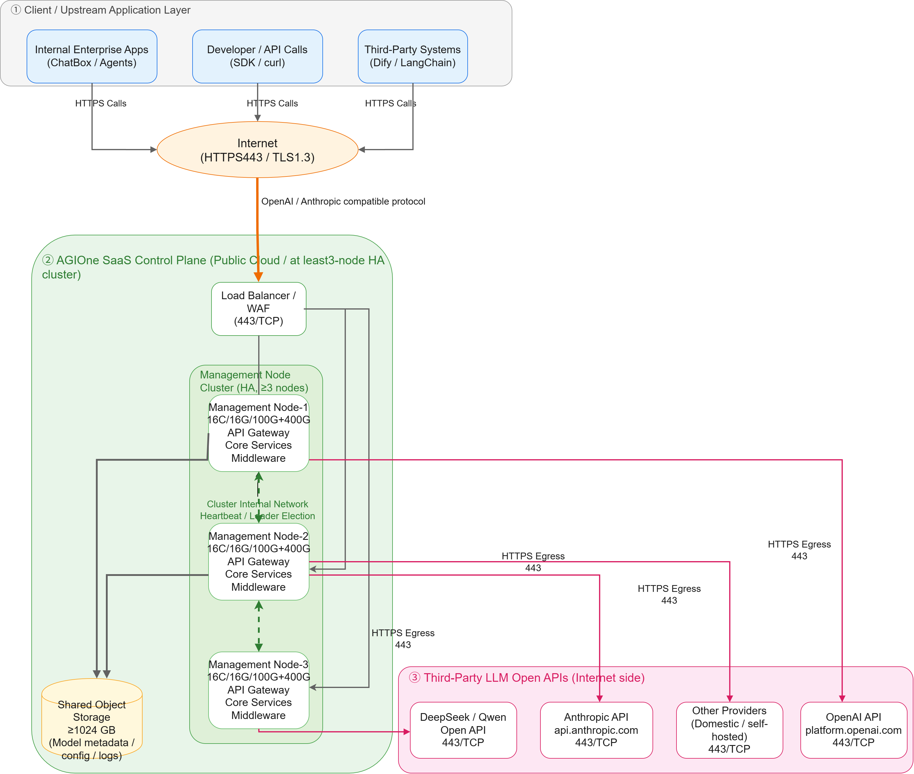
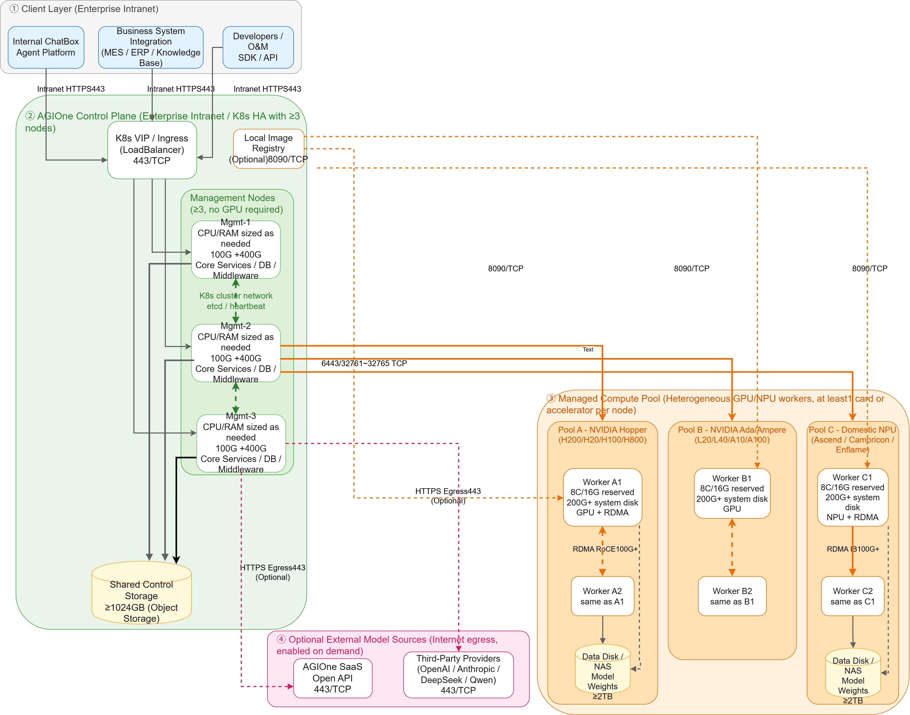

# Deployment Network Planning

## 1. Overview

This document provides end-to-end network planning for two typical AGIOne platform deployment scenarios — **SaaS Deployment** and **Private Deployment** — including resource configuration details, key ports and protocols, network zoning and connectivity requirements, and network topology diagrams for each deployment mode.

### 1.1 Deployment Mode Comparison

| Comparison Dimension | SaaS Deployment | Private Deployment |
|---|---|---|
| **Control Plane Location** | AGIOne public cloud / SaaS data center | Customer enterprise internal network (IDC / private cloud) |
| **Core Service Nodes** | ≥ 3 nodes (HA high availability) | ≥ 3 nodes (K8s HA, no GPU required) |
| **Model Source** | Call third-party / proprietary SaaS model APIs via **internet** | Locally governed GPU/NPU nodes; optional callback to AGIOne SaaS / third-party API |
| **Client ⇄ Control Plane** | Internet HTTPS (443) | Enterprise internal network HTTPS (443) |
| **Control ⇄ Computing Nodes** | None (all inference done externally) | Internal network / dedicated line, open ports 6443, 32761~32765, 8090 (optional) |
| **Data Residency** | Subject to SaaS provider security policies | Fully private, data never leaves enterprise boundary |
| **Typical Applications** | Small/medium customers / pilots / customers without computing power / burst load supplement | Central SOEs / classified industries / large computing power customers / engineering industry / multiple computing pools |

### 1.2 Network Zoning Design Principles

- **Separation of Control Plane and Execution Plane**: Management nodes do not undertake inference computing tasks; governed nodes do not directly expose ports externally; all calls go through the control gateway proxy.
- **Minimum Open Principle**: Only necessary ports are opened (6443 K8s API, 32761~32765 scheduling/monitoring, 8090 image, 443 upstream API); all other inbound is denied by default.
- **High Availability First**: Management services at least 3 nodes + VIP / Ingress LoadBalancer to avoid single points; shared storage has independent network channels.
- **Heterogeneous Compatibility**: Governed nodes support NVIDIA Hopper / Ada / Ampere full series, and Ascend 910B/910C, Enflame, Biren and other domestic NPUs; nodes of the same architecture are recommended to join the same K8s cluster.
- **Network Performance Guarantee**: Single node ≥ 1 Gbps management network; multi-card training / large model inference recommend 100 Gbps RDMA (RoCE or IB).

> **⚠️ Important Constraints**
>
> 1. Management nodes: Do not require any XPU (GPU / TPU / NPU), but governed worker nodes **must have at least 1 accelerated card**.
> 2. A single K8s cluster is recommended to have ≤ 1000 management nodes, and it is recommended that **nodes of the same CPU architecture (x86 / ARM) join the same cluster**.
> 3. All management nodes share the same set of shared storage; worker nodes also share storage, which can scale horizontally as models increase.

---

## 2. SaaS Deployment Network Planning

### 2.1 Deployment Scenario and Logical Architecture

SaaS deployment targets customers who **do not hold large-scale GPU computing power** or **want to quickly access LLM capabilities via subscription**. AGIOne deploys **at least 3 core management nodes** on the public cloud side to form a high-availability cluster, uniformly exposing OpenAI / Anthropic compatible APIs; customer applications access the AGIOne SaaS entry via **internet (HTTPS / TLS 1.3)**; AGIOne SaaS backend then **outbound connects via open API interfaces (HTTPS 443)** to one or more third-party model providers (such as OpenAI / Anthropic / DeepSeek / Qwen, etc.) or AGIOne's own hosted model instances.

### 2.2 Network Topology Diagram

<i>Figure 2-1: AGIOne SaaS Deployment Network Topology</i>

### 2.3 SaaS Management Node Resource Configuration Details

| Node Type | Quantity | CPU | Memory | System Disk | Data Disk | Network Requirements |
|---|:---:|:---:|:---:|:---:|:---:|---|
| **AGIOne Core Management Nodes** (API Gateway + Core Services + DB + Middleware + Plugins) | ≥ 3 | ≥ 16 cores | ≥ 16 GB | ≥ 100 GB | ≥ 400 GB | Public entry: 443/TCP Cluster internal: 10Gb LAN Outbound: Can access third-party APIs |
| **Shared Storage** (Block storage / recommended) | ≥ 1 | — | — | ≥ 1024 GB | — | Storage private network / multi-replica |

### 2.4 Key Ports and Flow Directions

| Direction | Source | Destination | Protocol / Port | Description |
|:---:|---|---|---|---|
| Inbound | Client (Internet) | SaaS Load Balancer / WAF | TCP 443 (HTTPS) | OpenAI / Anthropic compatible protocol; TLS 1.3 mandatory |
| Internal | Load Balancer | Management Nodes 1/2/3 | TCP 80/443 / business ports | L7 reverse proxy to each management node |
| Internal | Management Node ⇄ Management Node | — | TCP / UDP internal ports | Cluster heartbeat, leader election, cache sync, message queue |
| Internal | Management Node | Shared Storage | Storage protocol (iSCSI/NFS/Object) | Model metadata, logs, configuration persistence |
| Outbound | Management Node | Third-party model API | TCP 443 (HTTPS) | OpenAI / Anthropic / DeepSeek / Qwen, etc. |
| Outbound | Management Node | Image registry / upgrade source | TCP 443 (HTTPS) | Component upgrade, security patches |

### 2.5 Security and Compliance Key Points

- Enable **WAF / DDoS protection** at entry; issue independent API Keys per caller (or OAuth 2.0); support per-tenant **RPM/TPM rate limiting**.
- Outbound access to third-party APIs strictly controlled via **NAT gateway / outbound whitelist** to prevent data leakage to unauthorized domains.
- Full-chain **audit logs** (request time, tenant ID, model name, token count) written to disk and centrally searchable; prohibit storing Prompt and output plaintext in logs.
- Operations channel and business channel of the management panel are physically / logically isolated; operations enable **MFA and bastion host audit**.

---

## 3. Private Deployment Network Planning

### 3.1 Deployment Scenario and Logical Architecture

Private deployment targets **central SOEs, classified industries**, and **large-scale computing power self-owned customers**. The AGIOne control plane is **completely deployed within the customer's enterprise internal network**; at least **3 core service and middleware node** constitute a K8s HA cluster (management nodes do not require any accelerated cards); governed GPU / NPU worker nodes are divided by **heterogeneous computing pools** (NVIDIA Hopper / Ada / Ampere, Ascend 910B/910C, Enflame, Biren, etc.), communicating with the control plane via open API interfaces, with key ports including **6443, 32761, 32762, 32763, 32764, 32765**, etc. If the cluster uses near-end image service, **additionally open port 8090**. The control plane can optionally connect outward via outbound HTTPS to AGIOne SaaS / third-party provider APIs for supplementary model capabilities or elastic offloading.

### 3.2 Network Topology Diagram

<i>Figure 3-1: AGIOne Private Deployment Network Topology (including control plane, governed heterogeneous computing pools, and key ports)</i>

### 3.3 Management Node Resource Configuration (By Governance Scale Tiers)

Management node resources consist of **K8s basic overhead** and **AGIOne service overhead**. The table below provides **recommended single-node configuration** for different governance scales based on "Mgt nodes requirements detail" in "AGIOneRequirements"; all scales recommend **at least 3 nodes** for high availability.

| Governed Node Scale | K8s Basic Requirements (per node) | AGIOne Additional Requirements (per node) | Recommended Single Node Total | Minimum Node Count |
|---|:---:|:---:|:---:|:---:|
| 1 ~ 5 nodes | 1 core / 4 GB | 7 cores / 12 GB | ≥ 8 cores / 16 GB | 3 |
| 6 ~ 10 nodes | 2 cores / 8 GB | 7 cores / 12 GB | ≥ 9 cores / 20 GB | 3 |
| 11 ~ 100 nodes | 4 cores / 16 GB | 12 cores / 24 GB | ≥ 16 cores / 40 GB | 3 |
| 101 ~ 250 nodes | 8 cores / 32 GB | 12 cores / 24 GB | ≥ 20 cores / 56 GB | 3 |
| 251 ~ 500 nodes | 16 cores / 64 GB | 24 cores / 48 GB | ≥ 40 cores / 112 GB | 3 |
| 500+ nodes | 32 cores / 128 GB | 32 cores / 64 GB | ≥ 64 cores / 192 GB | 3 |

> **💡 Management Node Disk and Network**
>
> - System disk ≥ 100 GB; data disk ≥ 400 GB (AGIOne core services + DB + middleware + plugins).
> - Recommended to mount ≥ 1024 GB **shared block storage**, carrying platform metadata / model registry info / log archives.
> - Internal network: Mutually accessible with all CPU/management node local LAN; dedicated line connection recommended to Ascend and other dedicated computing pools.

### 3.4 Governed Worker Node Resource Configuration

Worker nodes (i.e., governed computing nodes) must **hold at least 1 accelerated card**; CPU/RAM is reserved for K8s and monitoring agents; main resources are consumed by model inference / fine-tuning tasks. The table below gives **the minimum reserve for a single worker node**; accelerated card models and quantities are planned separately based on business model size (see "AGIOne Managed Chip Compatibility List").

| Item | Recommended Configuration | Description |
|---|---|---|
| **CPU (Reserved)** | ≥ 8 cores | Reserved for K8s kubelet / kube-proxy / monitoring agent / inference framework |
| **Memory (Reserved)** | ≥ 16 GB | Same as above; does not include VRAM required for model weights |
| **System Disk** | ≥ 200 GB | Operating system + container runtime + accelerated card driver + AGIOne Agent |
| **Data Disk / Shared Storage** | NAS / shared file system ≥ 2048 GB recommended | Model weights, KV Cache, logs; shared among multiple nodes for hot loading and scaling |
| **Accelerated Card (Required)** | ≥ 1 | Supports NVIDIA Hopper / Ada / Ampere (H200/H20/H100/H800/L20/L40/A100/A10, etc.); Domestic: Ascend 910B / 910C, Enflame 106, Biren S60 |
| **RDMA Network (Recommended)** | 100 Gbps RoCE or InfiniBand | Required for multi-card / multi-machine tensor parallelism, PD separation scenarios; recommend MLNX_OFED 23.07 and above |
| **Management Network** | ≥ 1 Gbps | Mutually accessible with management node local LAN; outbound internet (recommended) for patches, images, and optional SaaS callback |
| **Operating System** | CentOS 7 / Ubuntu 20.04 / 22.04 / EulerOS | Requires pre-installed accelerated card drivers (NVIDIA ≥ 535, CANN adapted for Ascend) and RDMA drivers; Recommend disabling OS auto-update to ensure base environment stability |

### 3.5 Key Ports and Flow Directions (Key Points)

AGIOne control plane communicates with governed nodes via **standard open APIs**; the following table lists **must-allow** ports and protocols; all other inbound connections are denied by default, complying with the minimum authorization principle.

| Port | Protocol | Service | Source → Destination | Description |
|:---:|:---:|---|---|---|
| **443** | TCP | AGIOne Web / API entry | Client → Control VIP / Ingress | OpenAI / Anthropic compatible API entry; TLS 1.3 mandatory |
| **6443** | TCP | Kubernetes API Server | Control ⇄ Governed nodes | K8s control plane communication; control plane issues scheduling / status queries |
| **32761** | TCP | AGIOne Scheduling / Registration | Control ⇄ Governed nodes | Node governance and heartbeat (NodePort) |
| **32762** | TCP | AGIOne Task Build API | Control ⇄ Governed nodes | Inference instance build / destroy; model loading issued |
| **32763** | TCP | AGIOne Monitoring / Metrics Collection | Control ⇄ Governed nodes | GPU/NPU utilization, VRAM, temperature, Running Tasks, etc. |
| **32764** | TCP | AGIOne Logs / Events | Control ⇄ Governed nodes | Inference logs, exception event aggregation |
| **32765** | TCP | AGIOne File / Model Cache Proxy | Control ⇄ Governed nodes | Model weight / config file distribution |
| **8090** | TCP | Near-end image service (**Optional**) | Governed node → Image registry | Must additionally allow if cluster uses local image service; otherwise can be closed |
| **443** | TCP | Outbound HTTPS (**Optional**) | Control / Governed nodes → Internet | Optional callback to AGIOne SaaS / third-party model API; configure outbound whitelist as needed |
| **RDMA** | — | RoCE / InfiniBand | Between governed nodes | Multi-machine tensor parallelism, KV Cache distribution; 100 Gbps+; not crossing computing pool |

> **🔒 Firewall Policy Key Points**
>
> 1. **Control ⇄ Governed**: 6443 / 32761 / 32762 / 32763 / 32764 / 32765 **must be allowed**;
> 2. **Image Near-end**: Allow 8090 only when using near-end image service, and only **one-way** from governed node → image registry;
> 3. **Outbound HTTPS**: Deny by default, open **whitelist** by SaaS / third-party API domain names;
> 4. **RDMA**: Limited to within computing pool (same VLAN / same switching fabric), **cross-zone routing prohibited**.

### 3.6 Heterogeneous Computing Pool Access Recommendations

Based on the "AGIOne Managed Chip Compatibility List" and existing practices of IMMS / CISDI, it is recommended to **divide independent computing pools by hardware architecture and network environment**, with each pool maintaining an independent K8s cluster or independent namespace, and driving scheduling through node labels (such as `hardware-type=ascend-910b64g` / `nvidia-h20`).

| Computing Pool | Typical Chips | Network Access Method | Applicable Scenarios |
|---|---|---|---|
| **Pool A: NVIDIA Hopper** | H200 / H20 / H100 / H800 | Local LAN + RDMA (RoCE/IB) 100G+ | Flagship large model inference / training; DeepSeek-V3, Qwen2.5-72B, 128K long context |
| **Pool B: NVIDIA Ada / Ampere** | L20 / L40(S) / L4 / A100 / A800 / A10 / RTX 4090, etc. | Local LAN (RDMA optional) | Medium-scale high-concurrency inference (7B~32B), code assistance, knowledge Q&A |
| **Pool C: Domestic NPU** | Ascend 910B / 910C, Enflame 106, Biren S60 | Dedicated line / Local LAN + RDMA |信创 compliance scenarios, batch inference; MindIE engine deep optimization |

---

## 4. Implementation Recommendations and Change Management

### 4.1 Pre-implementation Checklist

- Complete "AGIOne Governed Node Environment Survey Form", confirming **CPU architecture / accelerated card model / driver version / RDMA configuration** consistency.
- **Management nodes**: Verify they meet the scale tier specifications (CPU / RAM / system disk / data disk / shared storage).
- **Network**: Complete firewall policy review and port opening applications for 6443, 32761~32765, 8090 (if applicable), 443.
- **RDMA**: MLNX_OFED driver version matches NIC firmware and switch configuration; run `ibstat` / `rdma link` for verification.
- **DNS / NTP**: All nodes connect to enterprise DNS and time sync source, time difference ≤ 1 second.
- **Images**: If using near-end image, deploy in advance and write the address into worker node `containerd` / `docker` configuration.

### 4.2 Capacity Planning and Expansion Path

- **Management nodes**: When governed node count crosses the next tier (e.g., 100 → 101), must first **vertically scale** to the corresponding specification, then switch over in canary; keep ≥ 3 nodes available during the process.
- **Worker nodes**: Expansion adopts **"First register (weight 0) → health check → linear weight increase"** process, imperceptible to business.
- **Storage**: For scenarios where model weights continue to grow, expand worker node shared storage to 4 TB+ or use NAS / Ceph horizontal scaling.
- **Network**: When single-pool worker nodes ≥ 16, recommend upgrading to 200 Gbps RDMA backbone; cross-pool traffic goes through the control plane gateway, avoiding direct connection.

### 4.3 Monitoring and Observability Integration

- **Hardware layer**: Collected via DCGM (NVIDIA) / npu-exporter (Ascend) for utilization / VRAM / temperature / power consumption, 15~30 second granularity.
- **Scheduling layer**: Aggregated model Running Tasks, weight distribution, routing ratio, circuit breaker count, 1 minute granularity.
- **Application layer**: RPM / TPM / TTFT / P95 / P99, Success Rate, Token metering, displayed by tenant / model.

---
