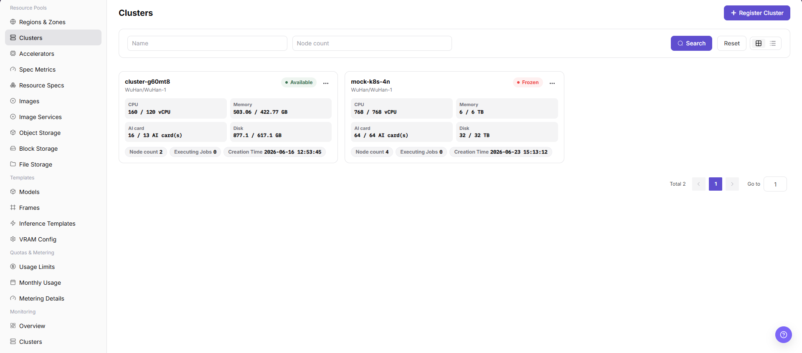

# Onboard the Cluster and Verify Devices

## Target Outcome

The cluster is available, all four NPU cards are discovered on the expected nodes, and compatible specifications can be associated.

## Applicable Roles

- Platform Operator

## Before You Start

- Prepare the cluster endpoint, registration information, network route, and required agent or credential.
- Record the expected node count and physical distribution of all four NPU cards.

## Entry

- **Role:** Operator
- **Menu:** AI Infrastructure > On-Prem > Resource Pools > Cluster Management
- **Route:** `/powerone/resourcepool/cluster`

## Steps

1. Confirm that the target region and availability zone exist.
2. Register the cluster with kubeconfig, API server, authentication, and network data.
3. Wait until the cluster becomes available.
4. Open cluster details and verify that all accelerator nodes are Ready.
5. Verify that the reported target NPU count is four, with no missing or duplicate devices.

6. Open **Cluster Details** and review the cluster's region, availability zone, status, associated specifications, and storage configuration.
7. Open **Cluster Nodes** and confirm node state, device visibility, and resource reporting for every node that hosts an accelerator.
8. If a cluster is disabled, do not select it for new resource creation until it is enabled and its nodes return to the expected state.

## How to Verify All Four NPU Cards

| Check | Expected Result |
| --- | --- |
| Cluster state | Available |
| Node state | Every node hosting an NPU is Ready |
| Device total | Four NPU cards |
| Allocatable count | Matches actual usage after subtracting running workloads |
| Resource key | Matches Accelerator Management and specification metrics |

## Completion Checklist

> **Purpose:** These are the exit criteria for the current feature task. Use them to decide whether the result is observable and reviewable and whether you can continue to the next step in the scenario. They do not repeat the procedure; if any item fails, follow the troubleshooting section below.

| Check | Pass Criteria |
| --- | --- |
| 1 | Cluster, node, and device data are visible. |
| 2 | All four NPU cards are recognized. |
| 3 | A one-card test workload enters scheduling successfully. |

## Troubleshooting

| Symptom | Check First |
| --- | --- |
| Cluster registration fails | Endpoint, network, registration data, agent state, and time synchronization |
| Fewer than four cards appear | Node health, driver, device plug-in, accelerator mapping, and hardware visibility |
| Cluster Details has no expected data | Cluster state, selected region/zone, permission scope, synchronization time, and whether the cluster has finished onboarding |
| Cluster Nodes is empty | Cluster availability, node registration, node permission scope, and synchronization or collection status |
| A disabled cluster is still selectable | Refresh the page, recheck cluster state and downstream associations, and do not submit a workload until the selectable scope is corrected |
| Workloads cannot access cluster storage after a change | Cluster storage association, region/zone binding, storage component health, and workload mount configuration |

## User Manual

[Cluster Management](/usermanual/ai-infra-on-prem/operator/resource-pools/clusters/)
