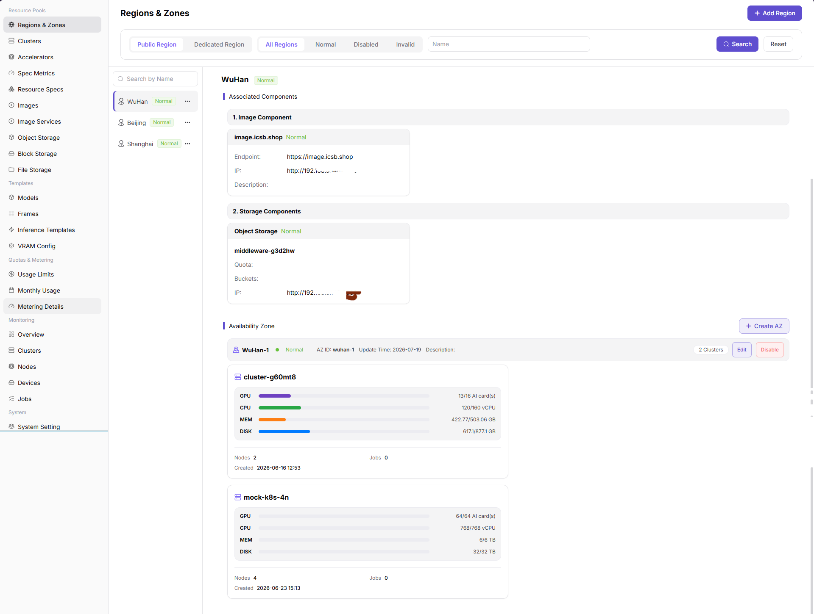
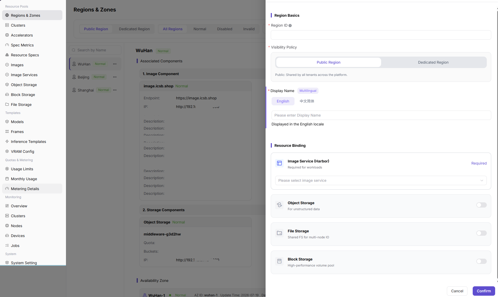
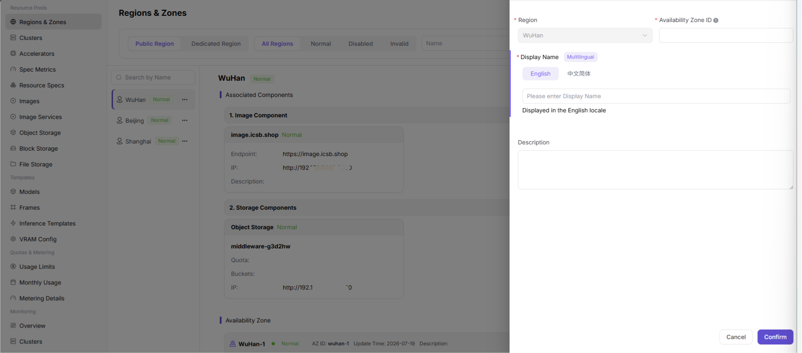

# Create Regions and Availability Zones

## Scenario Goal

Create the region and availability zone for a local cluster so that clusters, specifications, images, storage, and workloads use the same resource boundary.

## Applicable Roles

- Platform operator

## Before You Start

- Map the data center, site, or resource group to the intended region and availability zone.
- Prepare unique identifiers and localized display names that do not duplicate existing records.
- Confirm the availability zone, network boundary, and storage boundary for the target cluster.

## Feature Entry

- **Role:** Operator
- **Menu:** AI Infrastructure > On-Prem > Resource Pools > Regions & Zones
- **Page route:** `/powerone/resourcepool/region`

## Procedure

1. Open Regions & Zones and review existing regions, availability zones, and states before creating records.

2. Add a region, enter its name, unique identifier, and localized display names, and make it available for downstream resource onboarding.

3. Add an availability zone under the target region, enter its name and unique identifier, and verify the region assignment.

4. Return to the list, confirm that both records are visible and available, and record the availability zone to select during cluster registration.

## Completion Checklist

> **Purpose:** Use these checks to confirm that the resource boundary is ready for cluster onboarding. Do not register the cluster while any check fails.

| Check Item | Success Criteria |
| --- | --- |
| Region | The region name, unique identifier, and state are correct. |
| Availability zone | The zone belongs to the correct region and has a unique name and identifier. |
| Downstream selection | The target region and availability zone are selectable during cluster registration. |

## Troubleshooting

| Symptom | Check First |
| --- | --- |
| A region or zone cannot be created | Account permissions, required fields, unique identifiers, and duplicate records |
| The zone is unavailable during cluster registration | Region and zone state, assignment, and current tenant scope |
| Resources appear in the wrong location | Region choices for the cluster, specifications, images, and storage |

## User Manual

[Review the complete fields and maintenance guidance for Regions & Zones](/usermanual/ai-infra-on-prem/operator/resource-pools/regions-zones/)
