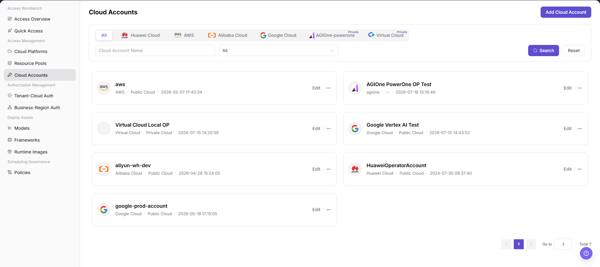
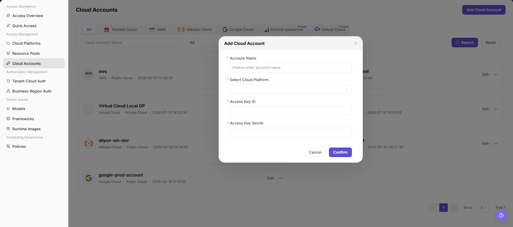

# Cloud Accounts

## Feature Overview

| Item | Content |
| --- | --- |
| Applicable Roles | Operators |
| Navigation Path | AI Infra(On-Cloud) > Access Management > Cloud Accounts |
| Page Route | `/infrahub/op/access/account` |
| Managed Objects | Cloud accounts, associated cloud platforms, and access credentials |

#### Beginner Explanation

Cloud Accounts registers the credentials used to access cloud resources. After credentials are saved, the platform can discover pools and support authorization and deployment. Real values belong only in secure fields.

#### Terminology

| Term | Description |
| --- | --- |
| Cloud Account | An identity used to access resources on a cloud platform. |
| Access Key ID | A cloud credential identifier. Documentation uses `<ACCESS_KEY_ID>`. |
| Access Key Secret | A sensitive secret paired with the identifier. Documentation uses `<ACCESS_KEY_SECRET>`. |

#### Recommended Operation Order

Review the list to avoid duplicates, add the account and validate resource synchronization, edit it for credential rotation, and migrate pool and authorization dependencies before deletion.

#### Beginner Checklist

| Scenario | Do First | Do Not Do Directly |
| --- | --- | --- |
| First visit | Review existing objects, states, and available actions | Change an unknown object |
| Before a change | Verify upstream dependencies, impact scope, and target object | Skip dependency and impact checks |
| After completion | Validate the current and downstream pages with Result Validation | Rely only on a success message |
| Page error | Record the redacted object, time, and page message | Submit repeatedly or record real credentials |

## Prerequisites

1. The current account has the permission required for Cloud Accounts.
2. The cloud platform is connected and least-privilege credentials are available through a secure channel.
3. Before adding, rotating, or deleting credentials, check resource synchronization, authorization, and deployment impact.

## Page Description

The page filters by platform and account name. Account cards show the platform, type, update time, and actions.

Page screenshots:

The image shows the Cloud Accounts page. Quickly filter managed accounts by cloud platform tags or name; cards display platform type, last updated time, and management actions.

## Main Operations

### Add Cloud Account

1. Click **"Add Cloud Account"**.
2. Enter the account name and select the cloud platform.
3. Enter the real values corresponding to `<ACCESS_KEY_ID>` and `<ACCESS_KEY_SECRET>` in secure fields.
4. Click **"Confirm"**, refresh the list, and check resource synchronization.

The image shows the Add Cloud Account dialog. Specify the account name, target cloud platform, and access key credentials.

### Edit Cloud Account

1. Click **"Edit"** on the right side of the target account card to open the maintenance dialog.
2. Verify the account name, target cloud platform, and current credential state.
3. Update only the fields requiring rotation (such as entering a new Access Key Secret), then click **"Confirm"** to revalidate cloud resource synchronization.

### Delete Cloud Account

1. Confirm that the account has no pool, authorization, or deployment dependency.
2. Click **"Delete"** from more actions and verify the confirmation message.
3. Refresh after deletion. If it fails, migrate the dependencies identified by the page.

## Parameter Reference

| Field Name | Required | Field Type | Example | Description |
| --- | --- | --- | --- | --- |
| Cloud Account Name | No | Text / search condition | Displayed on page | Account name used for list filtering. |
| Account Name | Yes | Text | Displayed on page | Account display name entered when adding a cloud account. |
| Cloud Platform | Yes | Filter / dropdown | Displayed on page | Cloud platform that owns the account. Select it through `Select Cloud Platform` when adding. |
| Cloud Platform Type | System-generated | Text | `Public Cloud` | Cloud platform type shown on list cards. |
| Access Key ID | Yes | Secure input | `<ACCESS_KEY_ID>` | Cloud-side access credential identifier. |
| Access Key Secret | Yes | Secure input | `<ACCESS_KEY_SECRET>` | Cloud-side sensitive credential. Do not write it into documentation or screenshots. |
| Search | No | Action button | `Search` | Queries the cloud account list by filters. |
| Reset | No | Action button | `Reset` | Clears filters and restores the default list. |
| Add Cloud Account | No | Action button | `Add Cloud Account` | Opens the add cloud account dialog. |
| Edit | No | Action entry | `Edit` | Opens existing cloud account configuration for maintenance. |
| Delete | No | High-risk action entry | `Delete` | Removes a cloud account after dependency and authorization checks. |
| Cancel | No | Action button | `Cancel` | Closes the add dialog without submitting configuration. |
| Confirm | No | High-risk action | `Confirm` | Submits the new cloud account configuration and may save real credentials and trigger later validation or synchronization. |

## Pitfalls

- Do not skip the upstream dependency check: The cloud platform is connected and least-privilege credentials are available through a secure channel.
- Confirm impact before a configuration change: Before adding, rotating, or deleting credentials, check resource synchronization, authorization, and deployment impact.
- A success message does not prove downstream synchronization. Use Result Validation afterward.
- Use only `<API_KEY>`, `<PERSONAL_KEY>`, `<ACCESS_KEY_ID>`, `<ACCESS_KEY_SECRET>`, `<BASE_URL>`, and `<ENDPOINT_PATH>` for credential and endpoint examples.

## Result Validation

| Check Item | Success Signal | If Abnormal |
| --- | --- | --- |
| Page is accessible | Title, navigation, and main content display correctly | Check role permission and navigation path |
| Managed objects are visible | Cloud accounts, associated cloud platforms, and access credentials display as expected | Clear filters and verify upstream dependencies |
| Operation result is saved | The expected state or new record appears | Review page messages, required fields, and dependencies |
| Downstream result is consistent | Associated pages show the change | Wait for synchronization, refresh, and return to the responsible object |

## FAQ

#### Target Object Is Missing in Cloud Accounts

**Symptom:**

The expected object is missing from the list or selector.

**Possible Causes:**

- Active query criteria filter out the target object.
- An upstream object is disabled, or the current role lacks visibility.

**Resolution:**

1. Clear filters and refresh the page.
2. Verify the prerequisite object: The cloud platform is connected and least-privilege credentials are available through a secure channel.
3. Confirm the current role and data scope, then locate the object again.

#### Cloud Accounts Action Is Unavailable

**Symptom:**

An expected button, menu, or state switch is unavailable.

**Possible Causes:**

- The current account lacks the required action permission.
- Object state, references, or prerequisites block the action.

**Resolution:**

1. Verify the permission for the action and the current object state.
2. Check references and prerequisites identified by the page message.
3. Remove the blocker, refresh the page, and perform the action once.

#### Cloud Accounts Change Does Not Reach Downstream

**Symptom:**

The page reports success, but a downstream page still shows the old state.

**Possible Causes:**

- An associated page has stale cache or synchronization delay.
- The current and downstream pages use different roles, tenants, or data scopes.

**Resolution:**

1. Wait for synchronization and refresh both pages.
2. Confirm that both pages use the same role, tenant, and object scope.
3. If they still differ, return to the responsible object and verify the saved result.

#### Cloud Accounts Data Differs from Another Page

**Symptom:**

Counts or states differ from an associated page.

**Possible Causes:**

- The pages use different filters, aggregation rules, or update times.
- The change is still synchronizing, or role-based data scopes differ.

**Resolution:**

1. Align filters and aggregation rules on both pages.
2. Check update times and wait for synchronization.
3. Compare object details instead of summary counts only.

#### How to Troubleshoot a Cloud Accounts Failure

**Symptom:**

Submission fails or the state does not change for an extended period.

**Possible Causes:**

- Required fields, field combinations, or object state do not meet submission rules.
- An upstream dependency is invalid, the request failed, or the same action is already processing.

**Resolution:**

1. Record the redacted object, time, and complete page message.
2. Verify required fields, object state, and upstream dependencies.
3. Confirm that no identical job is processing before one retry.

## Notes

- Before adding, rotating, or deleting credentials, check resource synchronization, authorization, and deployment impact.
- Do not put real accounts, credentials, internal locations, or customer data in documentation, screenshots, tickets, or chat records.
- Authorization, deployment, deletion, publication, state, or billing changes require an auditable record and recovery plan.

## Next Steps

1. Go to Resource Pools to view resource pools that can be synchronized or used by this account.
2. Go to Tenant-Cloud Auth or Business-Region Auth to configure resource visibility scope.
3. Go to Access Overview to review account, resource pool, and authorization flow status.
