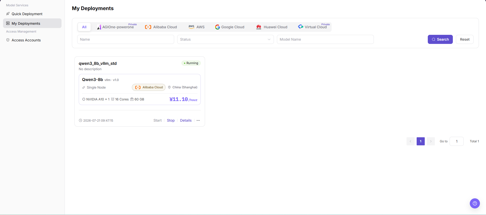
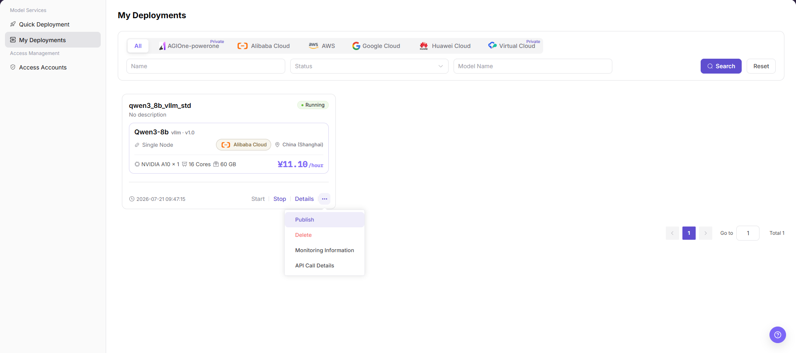
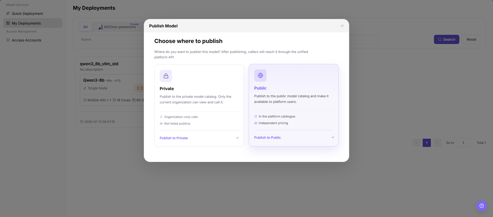
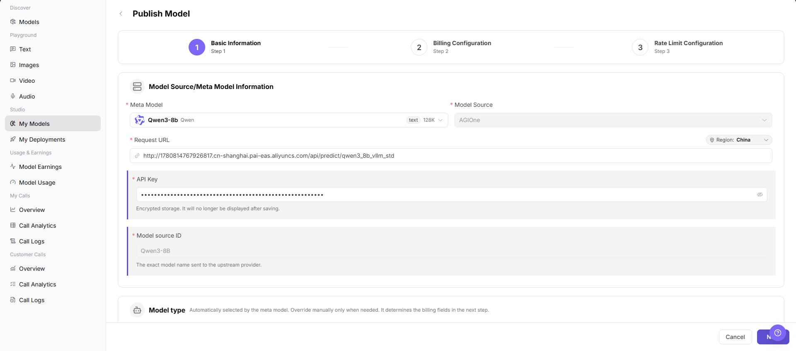

# My Deployments

## Feature Overview

| Item | Content |
| --- | --- |
| Applicable Roles | Model Providers |
| Navigation Path | AI Infra(On-Cloud) > Model Services > My Deployments |
| Page Route | `/infrahub/user/model/deployment` |
| Managed Objects | Model deployments, states, events, service information, and publishing entry |

#### Beginner Explanation

My Deployments is the task center for model services. Check status and events after creation, and publish only after the service is ready.

#### Terminology

| Term | Description |
| --- | --- |
| Deployment State | The current stage from creation to ready or failed. |
| Event | A timeline of scheduling, pull, startup, and error information. |
| Publishing Region | The visibility scope selected when converting a deployment into a model service. |

#### Recommended Operation Order

Review the deployment list, open details and events, and choose a publishing region only after the service is stable.

#### Beginner Checklist

| Scenario | Do First | Do Not Do Directly |
| --- | --- | --- |
| First visit | Review existing objects, states, and available actions | Change an unknown object |
| Before a change | Verify upstream dependencies, impact scope, and target object | Skip dependency and impact checks |
| After completion | Validate the current and downstream pages with Result Validation | Rely only on a success message |
| Page error | Record the redacted object, time, and page message | Submit repeatedly or record real credentials |

## Prerequisites

1. The current account has the permission required for My Deployments.
2. A Quick Deployment job exists and the current account can view it.
3. Before starting, stopping, deleting, or publishing, confirm service impact, customer visibility, and cost.

## Page Description

The page lists deployments, states, and actions, with a publishing entry in more actions. The current Operator account does not expose this user entry, so this page is partially verified from existing screenshots and the cross-role workflow.

Page screenshots:

The image shows the My Deployments service list page, filtering cards by cloud platform and displaying deployment name, model version, node specifications, running state, and hourly cost estimates.

## Main Operations

### View Deployment Details

1. Locate the target record in My Deployments.
2. Open details and verify model, region, flavor, and current state.
3. Review the event timeline for scheduling, image-pull, or startup failures.

### View Service Information

1. Confirm that the deployment is ready.
2. Verify service location, health state, and update time. Documentation uses only `<BASE_URL>` and `<ENDPOINT_PATH>`.
3. Validate the service with a redacted test request and do not store real credentials in documentation.

### Publish a Deployed Model

#### Step 1: Open the Publish Entry

1. In the My Deployments list, locate the target running deployment card.
2. Click the more actions icon (`···`) in the lower-right corner of the card and select **"Publish"** from the menu.

The image shows selecting the Publish action from the more actions menu on a deployment card.

#### Step 2: Choose Publication Target Area

1. In the "Choose Where to Publish" dialog, select the target visibility area based on your intended audience:
   - **Private Area**: Publish to the private model library, accessible and invokable only within the current organization/tenant.
   - **Public Area**: Publish to the public model library, available for all platform users to invoke with independent pricing.
2. Click "Publish to Private Area" or "Publish to Public Area" to proceed to the detailed configuration form.

The image shows the target publication area selection dialog, allowing models to be published to an organization's private area or the platform's public catalog.

#### Step 3: Complete Model Publishing Details and Submit

1. The system automatically populates the meta-model, model source, and upstream prediction request URL.
2. Enter or verify the API key and Model Source ID.
3. Complete the billing configuration and rate-limiting rules step-by-step, then click Submit.
4. After submission, navigate to `Creative Space > My Models` to confirm that the model is published and ready for invocation.

The image shows the Publish Model form, automatically populating the deployment prediction URL while configuring the API key, billing, and rate-limiting rules.

## Parameter Reference

| Field Name | Required | Field Type | Example | Description |
| --- | --- | --- | --- | --- |
| Name | No | Input | `demo-deployment` | Filters records by deployment name. Use sanitized examples only. |
| Status | No | Dropdown | `Running` | Filters records by deployment status. |
| Model Name | No | Input | `demo-model` | Filters deployment records by model name. |
| Deployment Name | No | Card field | `demo_deployment` | Deployment record display name. Avoid real business or customer information. |
| Deployment Status | No | Status tag | `Running` | Shows whether the deployment is available. |
| Model Name | No | Card field | `Sample Model` | Model bound to the deployment record. |
| Deployment Mode | No | Card field | `Single Node` | Deployment mode used by the current deployment. |
| Cloud Platform | No | Card field | `Sample Cloud Platform` | Cloud platform where the deployment is located. |
| Region | No | Card field | `Sample Region` | Region where the deployment is located. |
| Resource Specification | No | Card field | `Sample GPU / CPU / Memory` | Resources used by the deployment. |
| Cost | No | Display field | `Sample cost/hour` | Deployment cost reference. Real amount details are not recorded in documentation. |
| Publish Entry | Yes | Action entry | `Publish` | Opens the publish region selection dialog. |
| Publish Region | Yes | Selection card | `Private` | Selects whether the model is published to Private or Public. |
| Private | No | Publish region | `Publish to Private` | Publishes to the private model catalog for tenant-only visibility and calls. |
| Public | No | Publish region | `Publish to Public` | Publishes to the public model catalog for end users. |
| Redirect Target | Yes | Page redirect | `Studio > My Models > Publish Model` | Target page after selecting the publish region. |
| Meta Model | Yes | Select | `Sample Model` | Meta model information on the publish model page. |
| Model Source | Yes | Dropdown | `source-a` | Source of the model being published. |
| Request URL | Yes | URL | `<BASE_URL><ENDPOINT_PATH>` | Upstream request address. Use placeholder URLs only in documentation. |
| API Key | Yes | Secret text | `<redacted>` | API key is sensitive and must be redacted in documentation. |
| Model source ID | Yes | Text | `demo-model-id` | Model name or identifier sent to the upstream provider. |
| Region | No | Dropdown | `Sample Region` | Region field on the publish model page. |

## Pitfalls

- Do not skip the upstream dependency check: A Quick Deployment job exists and the current account can view it.
- Confirm impact before a configuration change: Before starting, stopping, deleting, or publishing, confirm service impact, customer visibility, and cost.
- A success message does not prove downstream synchronization. Use Result Validation afterward.
- Use only `<API_KEY>`, `<PERSONAL_KEY>`, `<ACCESS_KEY_ID>`, `<ACCESS_KEY_SECRET>`, `<BASE_URL>`, and `<ENDPOINT_PATH>` for credential and endpoint examples.

## Result Validation

| Check Item | Success Signal | If Abnormal |
| --- | --- | --- |
| Page is accessible | Title, navigation, and main content display correctly | Check role permission and navigation path |
| Managed objects are visible | Model deployments, states, events, service information, and publishing entry display as expected | Clear filters and verify upstream dependencies |
| Operation result is saved | The expected state or new record appears | Review page messages, required fields, and dependencies |
| Downstream result is consistent | Associated pages show the change | Wait for synchronization, refresh, and return to the responsible object |

## FAQ

#### Target Object Is Missing in My Deployments

**Symptom:**

The expected object is missing from the list or selector.

**Possible Causes:**

- Active query criteria filter out the target object.
- An upstream object is disabled, or the current role lacks visibility.

**Resolution:**

1. Clear filters and refresh the page.
2. Verify the prerequisite object: A Quick Deployment job exists and the current account can view it.
3. Confirm the current role and data scope, then locate the object again.

#### My Deployments Action Is Unavailable

**Symptom:**

An expected button, menu, or state switch is unavailable.

**Possible Causes:**

- The current account lacks the required action permission.
- Object state, references, or prerequisites block the action.

**Resolution:**

1. Verify the permission for the action and the current object state.
2. Check references and prerequisites identified by the page message.
3. Remove the blocker, refresh the page, and perform the action once.

#### My Deployments Change Does Not Reach Downstream

**Symptom:**

The page reports success, but a downstream page still shows the old state.

**Possible Causes:**

- An associated page has stale cache or synchronization delay.
- The current and downstream pages use different roles, tenants, or data scopes.

**Resolution:**

1. Wait for synchronization and refresh both pages.
2. Confirm that both pages use the same role, tenant, and object scope.
3. If they still differ, return to the responsible object and verify the saved result.

#### My Deployments Data Differs from Another Page

**Symptom:**

Counts or states differ from an associated page.

**Possible Causes:**

- The pages use different filters, aggregation rules, or update times.
- The change is still synchronizing, or role-based data scopes differ.

**Resolution:**

1. Align filters and aggregation rules on both pages.
2. Check update times and wait for synchronization.
3. Compare object details instead of summary counts only.

#### How to Troubleshoot a My Deployments Failure

**Symptom:**

Submission fails or the state does not change for an extended period.

**Possible Causes:**

- Required fields, field combinations, or object state do not meet submission rules.
- An upstream dependency is invalid, the request failed, or the same action is already processing.

**Resolution:**

1. Record the redacted object, time, and complete page message.
2. Verify required fields, object state, and upstream dependencies.
3. Confirm that no identical job is processing before one retry.

## Notes

- Before starting, stopping, deleting, or publishing, confirm service impact, customer visibility, and cost.
- Do not put real accounts, credentials, internal locations, or customer data in documentation, screenshots, tickets, or chat records.
- Authorization, deployment, deletion, publication, state, or billing changes require an auditable record and recovery plan.

## Next Steps

1. Continue completing basic information, billing configuration, and rate limit configuration on the `Publish Model` page.
2. Before publishing, confirm publish region, visibility scope, invocation method, and billing strategy again.
3. After publishing, return to `My Models` or the model catalog to check model status and visibility.
