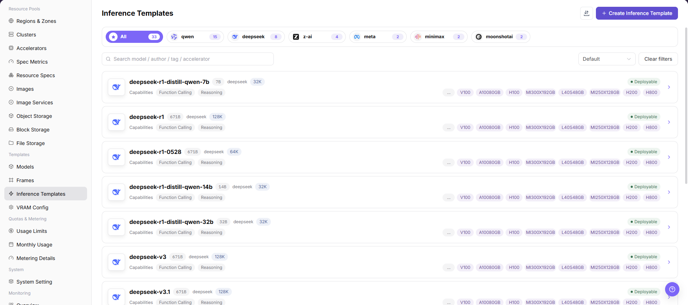
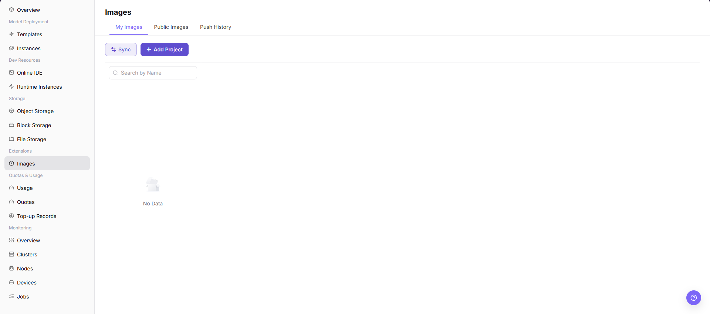
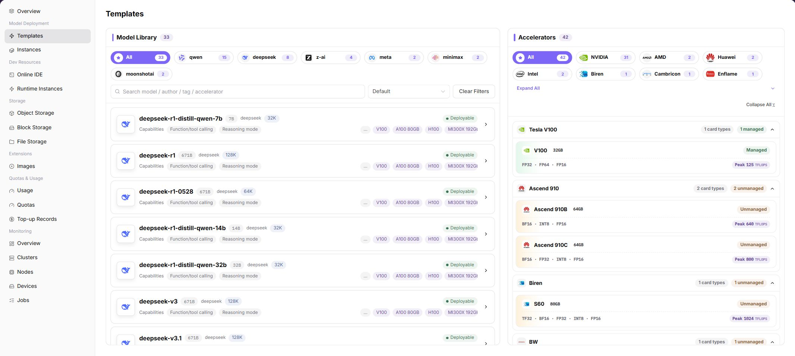
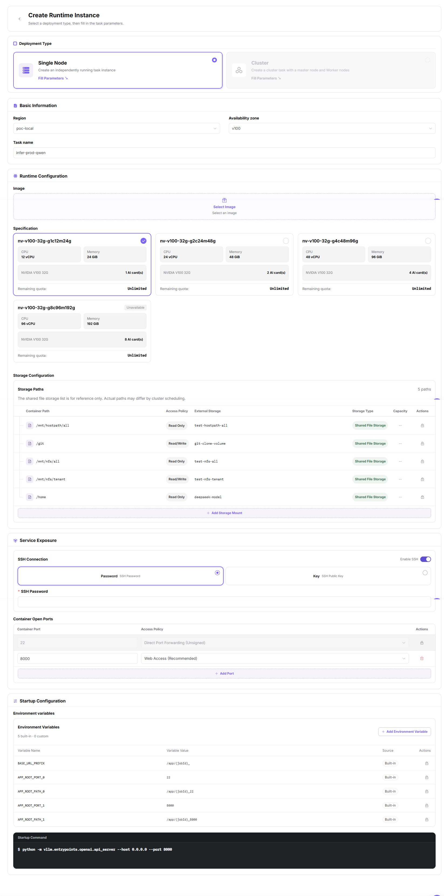
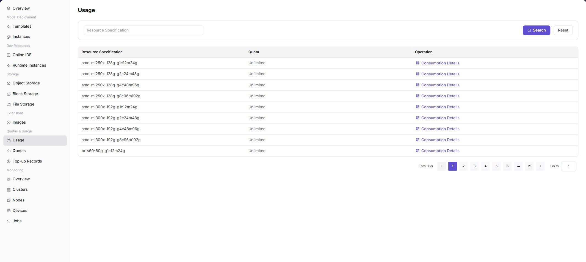

# Deploy a Model Service from Scratch

::: info Document Information
Version: v1.0
Updated: 2026-07-08
:::

## Feature Overview

This document connects operator and End User On-Prem operations into an end-to-end path: operators first prepare regions, availability zones, clusters, specifications, images, storage, templates, and quotas; End Users then select templates or images to create model services and confirm service status through logs, usage, and monitoring.

| Item | Content |
| --- | --- |
| Applicable Role | Operator, End User |
| Recommended Prereading | [Platform Getting Started](../../getting-started/), [Regions / Availability Zones](../../operator/resource-pools/regions-zones/), [Cluster Management](../../operator/resource-pools/clusters/) |
| Output | A model service or runtime instance whose status, logs, usage, and monitoring can be checked |
| Typical Use | First integration in a new environment, training demos, pre-launch acceptance, and issue location |

#### Beginner Explanation

An On-Prem end-to-end deployment is like delivering self-built data center resources to users: operators prepare regions, clusters, specifications, templates, and quotas first, and users then select images, data, and startup parameters to create model services.

## End-to-End Flow

| Phase | Actor | Goal |
| --- | --- | --- |
| Resource boundary | Operator | Create regions and availability zones. |
| Compute access | Operator | Register Kubernetes clusters and confirm that nodes are visible. |
| Capability opening | Operator | Associate specifications, images, storage, templates, and quotas. |
| Asset preparation | End User | Select public images or push custom images, and prepare model files and input data. |
| Service creation | End User | Create online inference, an online IDE, or a runtime instance. |
| Status verification | End User | View status, logs, ports, events, usage, and monitoring. |
| Troubleshooting loop | Both | Check resources, permissions, quotas, images, storage, and clusters based on the failure path. |

#### Terms Quick Reference

| Term | Description |
| --- | --- |
| Cluster Registration | The operator connects a Kubernetes cluster to the platform and completes status verification. |
| Resource Specification | The CPU, memory, and GPU/NPU combination selected when a user creates an instance. |
| Inference Template | A deployable plan that combines model, framework, image, specification, and parameters. |
| Instance Event | A key record for locating creation failures, image pull failures, or scheduling failures. |

## Prerequisites

1. The operator has permissions to manage resource pools, templates, quotas, and monitoring.
2. The End User has permissions to create model instances, runtime instances, object storage, and image projects.
3. Kubernetes API Server, image registry, object storage, or shared storage is accessible from the platform side.
4. Tenant quotas and credits are sufficient for this validation.
5. Images, startup commands, model files, and input/output paths have been planned.

## Parameter Reference

| Field Name | Required | Field Type | Example | Description |
| --- | --- | --- | --- | --- |
| Region / Availability Zone | Yes | Selection | Example East China Zone | Determines the resource pool, specification, and user-visible scope. |
| Cluster | Yes | Text | Example Cluster A | Provides the underlying resources for instances, jobs, or model services. |
| Resource Specification | Yes | Selection | `4C16G-1GPU` | Defines the CPU, memory, and accelerator combination selected when a user creates a service. |
| Image | Yes | Text | `registry.example.com/model:1.0` | Provides the runtime image for the model service. The placeholder is not a real repository. |
| Storage Component | No | Text | Example File Storage A | Mounts models, data, or output files. |
| Deployment Instance | System generated | Text | `INSTANCE-202607130001` | Tracks service status, events, logs, and monitoring data. |

## Pitfalls

- Do not paste real kubeconfig, registry credentials, storage keys, tokens, or internal endpoints into examples or screenshots.
- If a specification is not selectable, check cluster association, tenant quota, template limits, and current filters together.
- If an instance fails after submission, inspect events and logs before changing quota or cluster configuration.

## Step 1: Operator Creates Region / Availability Zone

1. Go to `Resource Pools > Regions / Availability Zones`.
2. Click `Add Region`, fill in the region ID, display name, visibility policy, and bind the image service and required storage components.
3. Under the target region, click `Add Availability Zone`, and fill in the availability zone ID, display name, and description.
4. After submission, confirm that the region and availability zone status is normal.

The following screenshot shows the region and availability zone list. Use it to confirm that the resource-pool geographic hierarchy has been created.


**Result validation:**

| Check Item | Success Signal | If Abnormal |
| --- | --- | --- |
| Target region | The target region is visible in the region list. | Return to this step and check the prerequisites, permissions, and configuration status. |
| Bound components | The image component and required storage components are visible in region details. | Return to this step and check the prerequisites, permissions, and configuration status. |
| Target availability zone | The target availability zone is visible in the availability zone list. | Return to this step and check the prerequisites, permissions, and configuration status. |

## Step 2: Operator Registers a Cluster

1. Go to `Resource Pools > Cluster Management`.
2. Click `Register Cluster`.
3. Paste or fill in kubeconfig-related connection information, and verify the region, availability zone, API Server, authentication method, CIDR, NodePort, and monitoring port.
4. After submission, return to the cluster list and view cluster status, node count, and resource usage.

The following screenshot shows the cluster list. Use it to check cluster status, node count, and resource usage.


**Result validation:**

| Check Item | Success Signal | If Abnormal |
| --- | --- | --- |
| Cluster status | The cluster status changes to Accessing, Available, or another expected state. | Return to this step and check the prerequisites, permissions, and configuration status. |
| Node information | Node information is visible on the cluster node page. | Return to this step and check the prerequisites, permissions, and configuration status. |
| Node resources | Node status, CPU, memory, disk, and accelerator resources are visible. | Return to this step and check the prerequisites, permissions, and configuration status. |

## Step 3: Operator Configures Resource Specifications

1. Go to `Resource Pools > Specification Metrics` and confirm the metric definitions for CPU, memory, accelerators, VRAM, and other resources.
2. Go to `Resource Pools > Resource Specifications` and create user-facing resource packages.
3. Return to `Cluster Management` and associate available specifications in the cluster details.

**Result validation:**

| Check Item | Success Signal | If Abnormal |
| --- | --- | --- |
| Specification status | The target specification is available. | Return to this step and check the prerequisites, permissions, and configuration status. |
| Cluster association | The specifications associated with the cluster include the target specification. | Return to this step and check the prerequisites, permissions, and configuration status. |
| User selection | Users can select the specification when creating an instance. | Return to this step and check the prerequisites, permissions, and configuration status. |

## Step 4: Operator Configures Templates or Opens Resources

1. Go to `Templates > Model Configuration` to maintain deployable models and model versions.
2. Go to `Templates > Framework Configuration` to maintain inference frameworks and runtime image relationships.
3. Go to `Templates > Inference Templates` to bind models, frameworks, specifications, ports, variables, and default parameters.
4. Go to `Templates > VRAM Estimation` to maintain KV Token, dynamic expressions, factor forms, and VRAM recommendation rules.
5. Go to `Quota & Metering` to set resource quotas and credits for tenants.

The following screenshot shows the inference template list. Use it to confirm that a selectable template has been published and can be referenced by users.



**Result validation:**

| Check Item | Success Signal | If Abnormal |
| --- | --- | --- |
| Template availability | The inference template is published or selectable by users. | Return to this step and check the prerequisites, permissions, and configuration status. |
| Template associations | The model, framework, image, specification, and VRAM rules associated with the template are consistent. | Return to this step and check the prerequisites, permissions, and configuration status. |
| Tenant quota and credit | The target tenant has sufficient quota and credit. | Return to this step and check the prerequisites, permissions, and configuration status. |

## Step 5: User Prepares Images and Data



1. If using a platform public image, go to `Extension Services > Image Services > Public Images` to confirm that the image is visible.
2. If using a custom image, first create an image project in `My Images`, then push the image to the repository address provided by the page.
3. Go to `Storage Services > Object Storage` to create a bucket and upload model files, datasets, or runtime artifacts.
4. Record the image address, object path, and startup command. Do not record real credentials.

## Step 6: User Creates Online Inference / Development Environment / Runtime Instance

#### Method A: Use a Deployment Template to Create a Model Service



1. Go to `Model Deployment > Deployment Templates`.
2. Select the target template.
3. Fill in the instance name, model parameters, specification, ports, storage, and environment variables according to the template.
4. After submission, enter the model instance list to view status.

#### Method B: Create a Runtime Instance



1. Go to `Development Resources > Runtime Instances`.
2. Click `Create Instance`.
3. Select `Single Node` or `Cluster`.
4. Fill in the image, specification, startup command, and mount path.
5. After submission, view instance status and logs.

Startup command examples:

```bash
python train.py --model /mnt/models/base --data /mnt/data/train.jsonl --output /mnt/output
bash run.sh --config /mnt/config/config.yaml
python app.py --host 0.0.0.0 --port 8000
```

## Step 7: Verify Service Status

1. In the instance list, confirm that the status enters Running, Succeeded, or the state expected for the current task type.
2. Open instance details and view logs, events, ports, and resource usage.
3. If the service exposes an access address, use the platform-provided entrypoint to verify connectivity.
4. Check whether expected output is generated in object storage or mounted directories.

## Step 8: View Usage, Quotas, and Monitoring



1. Go to `Quota & Usage > Resource Usage` to view instance resource consumption.
2. Go to `Quota & Usage > Resource Quotas` to confirm remaining quota.
3. Go to `Monitoring` to view statistics overview, clusters, nodes, devices, and job data. If user-side monitoring is not opened, prioritize instance logs and events for troubleshooting.

## Failure Branches and Troubleshooting Paths

#### Failure Branch: Cluster Registration Fails

Next hop: [Cluster Management](../../operator/resource-pools/clusters/)

**Symptom:** After the operator registers a cluster, the status is abnormal, and later regions or specifications cannot bind to the cluster.

**Troubleshooting Path:**

1. Check whether kubeconfig, CA, token, and API Server connectivity are correct.
2. Confirm that the cluster version, network, and monitoring collection components meet access requirements.
3. After registration succeeds, go to resource specifications and monitoring pages to verify that the cluster is visible.

#### Failure Branch: Specification Is Not Selectable

Next hop: [Resource Specifications](../../operator/resource-pools/resource-specs/)

**Symptom:** When a user creates an instance, the target CPU, memory, or GPU specification is not visible.

**Troubleshooting Path:**

1. Confirm that the operator has created the resource specification and associated it with the target cluster.
2. Check tenant quota, region visibility scope, and template specification limits.
3. Go to cluster, node, and device monitoring to confirm that the target resources still have capacity.

#### Failure Branch: Instance Creation Fails

Next hop: [Job Monitoring](../../operator/monitoring/jobs/)

**Symptom:** After an instance is submitted, it enters a failed, queued, or startup-abnormal state.

**Troubleshooting Path:**

1. View instance events and logs first to distinguish image, startup command, mount, and resource issues.
2. Verify the image address, storage path, environment variables, and startup parameters.
3. If events indicate insufficient resources, return to quotas, specifications, and cluster capacity for further troubleshooting.

## Result Validation

| Check Item | Success Signal | If Abnormal |
| --- | --- | --- |
| Resources visible | The creation page can select the target region, specification, image, or template | Continue creating an instance or deployment |
| Status normal | The instance, job, or model service enters Running or Available | Enter invocation, logs, or monitoring |
| Troubleshooting entrypoint available | Events, logs, or monitoring can locate errors | Continue troubleshooting by failure branch |

## FAQ

#### Why can users still not create instances after cluster registration succeeds?

**Symptom:**

The cluster appears in the list, but users still cannot create runtime instances, Online IDEs, or model services.

**Possible Causes:**

The cluster is not ready, specifications are not associated, templates are not opened, quota is insufficient, or images and storage are not bound to the target scope.

**How to Handle:**

Confirm cluster and node status first. Then verify resource specifications, templates, quotas, images, and storage. Use a test instance to validate the scheduling chain.

#### What if a specification cannot be selected?

**Symptom:**

The target CPU, memory, GPU, or accelerator specification is not visible when users create an instance or model service.

**Possible Causes:**

The specification is disabled, not associated with the target cluster, or the current user lacks region, availability zone, tenant, or quota permission.

**How to Handle:**

Open Resource Specs and cluster details to confirm association. Check quota and authorization scope, then refresh the user-side creation page and select again.

#### Where should I start after instance creation fails?

**Symptom:**

The instance fails after submission, stays queued for too long, or cannot start.

**Possible Causes:**

Capacity is insufficient, image pulling fails, storage mounting fails, template parameters are wrong, or node status is abnormal.

**How to Handle:**

Check instance status and error messages first. Then troubleshoot node monitoring, image services, storage, quotas, and template parameters in order.


## Next Steps

1. Organize the verified image, startup command, ports, object paths, and parameters into team standards.
2. Accumulate inference templates or runtime instance templates for common scenarios.
3. Clean up unused objects, image tags, and completed instances according to business cycles.
4. Periodically check quota, usage, and monitoring trends to discover capacity bottlenecks in advance.
