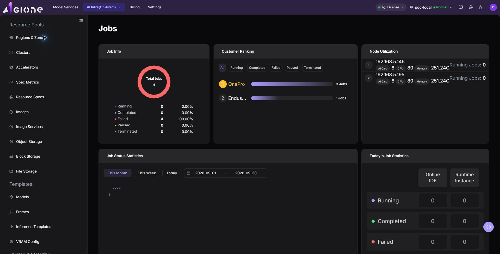

# Jobs

## Feature Overview

| Item | Content |
| --- | --- |
| Applicable Role | Operator |
| Navigation Path | AI Infra(On-Prem) > Monitoring > Jobs |
| Page Route | `/powerone/monitor/work` |
| Managed Object | Configuration, status, and relationships on Jobs |

#### Beginner Explanation

Job monitoring is like a task queue and execution list. It shows training, inference, or development task status, queueing reasons, runtime duration, and resource occupation.

#### Terms

| Term | Description |
| --- | --- |
| Job Status | Queued, running, succeeded, failed, or canceled. |
| Queueing Reason | Reason the job cannot start due to insufficient resources, quota limits, or scheduling constraints. |
| Runtime Duration | Duration from job startup to the current time. |

#### Recommended Operation Order

Confirm prerequisites for Model instances, online IDEs, runtime instances, training tasks, and historical jobs, follow Main Operations, run Result Validation, and continue to the next page.

#### First-Time User Notes

Confirm that the task involves Configuration, status, and relationships on Jobs, and then follow the recommended order. If fields or state differ from expectations, check prerequisites before continuing downstream.

## Prerequisites

1. The current account has job monitoring view permissions.
2. The platform has collected job status, events, queueing, and runtime duration.
3. The target tenant, user, or cluster scope has been clarified.
4. For troubleshooting, job ID or submission time has been prepared.

## Page Description

Use this page to inspect model instances, online IDEs, runtime instances, training tasks, and historical jobs.

Job monitoring is used to view job queueing, running status, failure causes, and resource occupation. Operators can use it to analyze insufficient resources, image pull failures, startup exceptions, or long-running tasks.

The following figure shows the job monitoring page.

## Main Operations

### Filter and View Job Monitoring

1. Go to `AI Infrastructure > On-Prem > Monitoring > Job Monitoring`.
2. Confirm the region and resource pool in the upper-right corner, and filter by job status, tenant/user, cluster, resource type, or time range.
3. View the job list and overall running status, and verify job ID, job name, job type, job status, tenant/user, cluster, and resource occupation.
4. Review queue duration, runtime duration, GPU/accelerator occupation, failure information, and event entrypoints to identify long queueing, startup failures, insufficient resources, or abnormal occupation.

### Investigate Abnormal Job Metrics

1. When jobs show batch queueing, stalled running status, or sudden failure spikes, note the abnormal job IDs and cluster.
2. Keeping the same time range, check `Cluster Statistics` and `Node Statistics` to verify if cluster-wide compute resources are exhausted.
3. Access job details and instance logs to investigate image pull timeouts, startup command errors, storage mount failures, or OOM crashes.
4. If deadlock jobs must be canceled or rescheduled, follow standard platform operational procedures rather than force-killing workloads without authorization.

#### Key Focus

- Whether failed and queued jobs increase abnormally.
- Whether long-running jobs occupy critical resources.
- Whether job tenant, specification, image, and cluster match expectations.

## Parameter Quick Reference

| Field Name | Required | Field Type | Example | Description |
| --- | --- | --- | --- | --- |
| Job ID | Yes | Text | `job-20260706-001` | Locates a single job or task instance. |
| Job Name | Conditionally required | Text | `inference-job` | Helps locate a job by business name. |
| Job Type | Conditionally required | Enum | `Runtime Instance` | Distinguishes model instances, online IDEs, runtime instances, training tasks, or historical jobs. |
| Job Status | System-generated | Status | `Running` | Shows whether the job is queued, running, succeeded, or failed. |
| Tenant / User | Conditionally required | Text | `tenant-a` | Used to locate job ownership by tenant or user. |
| Cluster | Conditionally required | Text | `cluster-prod-a` | Locates the cluster where the job is running or queued. |
| Node | System-generated | Text | `node-gpu-01` | Shows the node to which the job is scheduled. |
| Resource Specification | System-generated | Text | `2 * A800` | Shows the resource specification requested or occupied by the job. |
| GPU / Accelerator Occupation | System-generated | Number / Text | `2 * A800` | Shows accelerator specification and quantity occupied by the job. |
| Queue Duration | System-generated | Duration | `18 minutes` | Determines whether scheduling is waiting or resources are insufficient. |
| Runtime Duration | System-generated | Duration | `2 hours 15 minutes` | Determines whether the job runs longer than expected. |
| Failure Information | System-generated | Text | `ImagePullBackOff` | Helps locate job failure causes. |
| Time Range | Conditionally required | Date range | `Last 1 hour` | Controls the query window for statistic cards, trend charts, and list data. |

## Pitfalls

- Job queueing is not necessarily a failure. It may be caused by insufficient resources or quotas.
- Failure causes should be judged together with events, logs, and image pull status.
- Long-running jobs should be evaluated for resource occupation and cost.
- Job monitoring may have collection latency. Do not judge faults based only on a single instant status.
- Job exceptions should be investigated together with events, logs, image pull, startup command, storage mount, node status, and device status.
- Long-running or high-resource jobs are not necessarily abnormal. Judge together with business expectations, tenant quotas, and model specifications.
- Do not write real job IDs, instance names, image addresses, data paths, log contents, tenant information, node names, cluster IDs, resource pool IDs, internal metric keys, or test data in the document.
- `Terminate`, `Restart`, and `Delete` are high-risk actions. Confirm the scope and impact before executing the final action.

### Configuration Rules and Impact

- **For queueing, check resources and scheduling conditions first**: Queueing is not necessarily a platform fault. It may be caused by specification, labels, quotas, or cluster capacity limits.
- **Use events with failure information**: Error codes and events can distinguish image, storage, startup command, permission, and insufficient resource issues.
- **Runtime duration helps discover stuck tasks**: Long-running tasks should be judged together with logs, resource utilization, and business expectations.
- **Resource occupation affects other users**: When large jobs are submitted intensively, monitor tenant quotas and cluster watermarks at the same time.

## Result Validation

| Check Item | Success Signal | If Abnormal |
| --- | --- | --- |
| Page load | Jobs charts or lists are visible | Check monitoring permission and whether collection is available in the selected region |
| Scope | Time range, region, and object count match the investigation | Clear filters and restore them one at a time to avoid mixed scopes |
| Freshness | Update time is within the expected collection interval | Check collection interval, connection, and alerts in system or monitoring configuration |
| Correlation | An abnormal metric can be linked to a cluster, node, device, or job | Keep the same time range and cross-check adjacent monitoring pages and object details |

## FAQ

#### No Data on Jobs

**Symptom:**

The page opens, but charts or lists are empty.

**Possible Causes:**

- No job ran in the selected time.
- collection is unavailable in the region.
- the role lacks metric permission.

**Solution:**

1. Expand the time range and reset filters
2. verify regional monitoring capability
3. compare an adjacent monitoring page.

#### Jobs Is Not Updating

**Symptom:**

The data does not change for an extended period.

**Possible Causes:**

- The next collection cycle has not arrived.
- the collector is abnormal.
- the page is cached.

**Solution:**

1. Check update time
2. inspect collector status and alerts
3. refresh with the same time range.

#### Jobs Differs from Adjacent Pages

**Symptom:**

The same object has different values on two monitoring pages.

**Possible Causes:**

- Aggregation granularity differs.
- time range or time zone differs.
- filters target different objects.

**Solution:**

1. Align time range and time zone
2. verify aggregation scope
3. clear and restore filters one at a time.

#### Unable to Locate Target Object in Related Monitoring

**Symptom:**

The metric or details entry does not lead to the expected object.

**Possible Causes:**

- The object ended or was removed.
- the role cannot see it.
- relationship identifiers differ.

**Solution:**

1. Record object and time
2. check its list state
3. ask the Operator to verify visibility.

#### A Spike Cannot Be Reproduced

**Symptom:**

A spike was recorded, but current details are normal.

**Possible Causes:**

- The spike was brief.
- sampling is coarse.
- the job has ended.

**Solution:**

1. Lock the spike interval
2. compare job and node events
3. retain a sanitized screenshot and object identifier.

## Notes

- Job names, image addresses, data paths, and log contents may contain sensitive information.
- Before terminating a job, confirm business impact and output file retention policy.
- High-frequency failed jobs should be reviewed through templates or images.
- `Terminate`, `Restart`, and `Delete` affect real jobs. Confirm the scope and impact before executing the final action.
- Documentation examples must not include real job IDs, instance names, image addresses, data paths, log contents, tenant information, node names, cluster IDs, resource pool IDs, internal metric keys, or test data.

## Next Steps

1. For queueing issues, verify quotas, specifications, and cluster capacity.
2. For failure issues, verify images, startup commands, storage, and events.
3. For long-running tasks, enter usage and monitoring pages to evaluate consumption.
