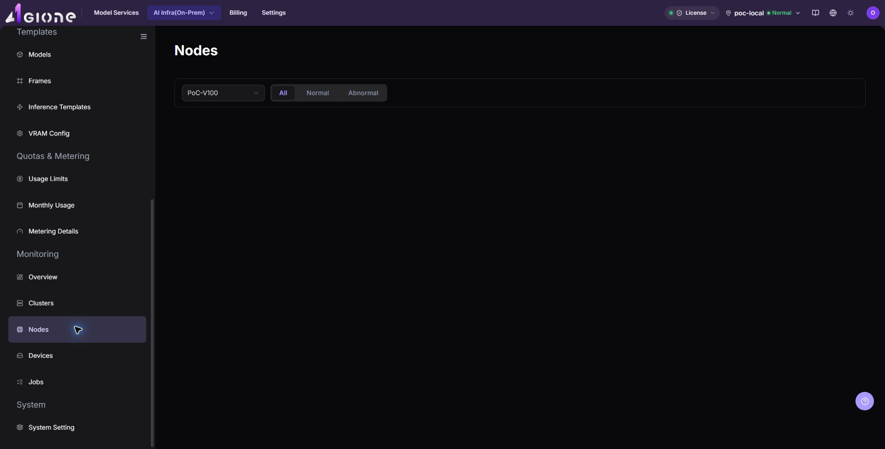
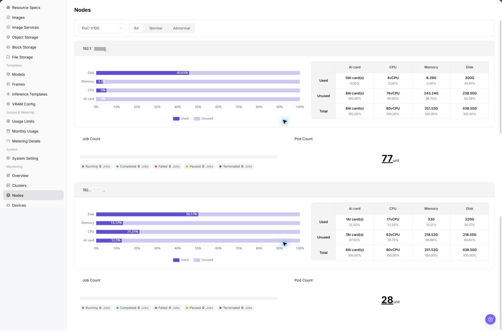

# Nodes

## Feature Overview

| Item | Content |
| --- | --- |
| Applicable Role | Operator |
| Navigation Path | AI Infra(On-Prem) > Monitoring > Nodes |
| Page Route | `/powerone/monitor/node` |
| Managed Object | Configuration, status, and relationships on Nodes |

#### Beginner Explanation

Node statistics are like a server inspection checklist. They show CPU, memory, disk, and status for each node, helping determine which machine an issue lands on.

#### Terms

| Term | Description |
| --- | --- |
| Node Status | Whether a node is Ready, unschedulable, or abnormal. |
| CPU Usage | Current CPU load of the node. |
| Memory Usage | Node memory occupation. |

#### Recommended Operation Order

Confirm prerequisites for Node status, node role, resource utilization, heartbeat, and owning cluster, follow Main Operations, run Result Validation, and continue to the next page.

#### First-Time User Notes

Confirm that the task involves Configuration, status, and relationships on Nodes, and then follow the recommended order. If fields or state differ from expectations, check prerequisites before continuing downstream.

## Prerequisites

1. The current account has node monitoring view permissions.
2. The target node belongs to an accessed cluster.
3. Node CPU, memory, disk, and status metrics are reported normally.
4. The troubleshooting time range or affected task has been clarified.

## Page Description

Use this page to inspect node state, node role, resource utilization, heartbeat, and cluster ownership.

Node statistics are used to view CPU, memory, disk, and runtime status for each node. Operators can use it to locate NotReady nodes, high-watermark nodes, or machines with interrupted collection curves.

The following figure shows the node statistics page.

## Main Operations

### Filter and View Node Statistics

1. Go to `AI Infrastructure > On-Prem > Monitoring > Node Statistics`.
2. Confirm the region and resource pool in the upper-right corner, and filter by cluster, node name, status, or time range.
3. View the node list and overall running status, and verify node name, cluster, region/AZ, node status, and resource usage level.
4. Review CPU, memory, accelerator, storage, network, and job-related statistics to identify high load, insufficient resources, or abnormal node status.

### Investigate Abnormal Node Metrics

1. When a node status is NotReady, resources are near full load, or metric collection curves break, note the node name and cluster.
2. Keeping the same time range, cross-check `Device Monitoring` for accelerator temperature and health on that node.
3. Cross-reference with `Job Monitoring` and cluster node details to inspect running instances, labels, taints, and events.
4. If hardware failure or driver exception occurs, coordinate with platform operations to drain or maintain the node rather than deleting resources directly.

#### Key Focus

- Whether the node is online or Ready.
- Whether single-node resources are close to full load.
- Whether abnormal nodes are concentrated in the same cluster or availability zone.

## Parameter Quick Reference

| Field Name | Required | Field Type | Example | Description |
| --- | --- | --- | --- | --- |
| Node Name | Yes | Text | `node-gpu-01` | Locates a specific compute node. |
| Cluster | Conditionally required | Drop-down | `cluster-prod-a` | Limits the cluster to which the node belongs. |
| Region / AZ | Conditionally required | Drop-down | `Wuhan / AZ A` | Limits the resource location to which the node belongs. |
| Node Status | System-generated | Status | `Ready` | Shows whether the node is schedulable, unavailable, or has alerts. |
| CPU Usage | System-generated | Percentage | `72%` | Determines whether node CPU is close to bottleneck. |
| Memory Usage | System-generated | Percentage | `81%` | Determines node memory pressure. |
| Accelerator Usage | System-generated | Percentage | `65%` | Determines whether GPU, NPU, or other accelerator resources are close to bottleneck. |
| Storage Usage | System-generated | Percentage | `68%` | Determines whether system disk, data disk, or mounted storage is close to limit. |
| Network Traffic | System-generated | Value / Trend | `Inbound / Outbound` | Helps determine whether node network traffic has abnormal fluctuation or bottlenecks. |
| Job Count | System-generated | Number | `12` | Shows the number of running, queued, or abnormal jobs on the node. |
| Time Range | Conditionally required | Date range | `Last 1 hour` | Controls the query window for statistic cards, trend charts, and list data. |
| Update Time | System-generated | Date time | `2026-07-06 10:00` | Determines whether node metrics are latest data. |

## Pitfalls

- Node Ready does not mean the device plugin is definitely normal.
- High disk watermark may cause image pull or log write failures.
- During troubleshooting, judge together with node events and job logs.
- Node statistics may have collection latency. Do not judge faults based only on a single instant metric.
- Node exceptions should be investigated together with clusters, devices, jobs, scheduling events, and node logs.
- Do not write real node names, node IPs, device IDs, cluster IDs, resource pool IDs, tenant information, internal metric keys, or test data in the document.

### Configuration Rules and Impact

- **Node status before resource watermarks**: When a node is NotReady, unschedulable, or collection is abnormal, handle the status problem first.
- **Disk pressure affects job stability**: High disk watermark may cause image pull, log write, or temporary file creation failures.
- **Single-node exception can cause local queueing**: Scheduling failure is not necessarily overall cluster capacity shortage. It may be caused by target node labels or taint restrictions.
- **Metric delay requires event judgment**: When node metrics are delayed, also view cluster events and job failure reasons.

## Result Validation

| Check Item | Success Signal | If Abnormal |
| --- | --- | --- |
| Page load | Nodes charts or lists are visible | Check monitoring permission and whether collection is available in the selected region |
| Scope | Time range, region, and object count match the investigation | Clear filters and restore them one at a time to avoid mixed scopes |
| Freshness | Update time is within the expected collection interval | Check collection interval, connection, and alerts in system or monitoring configuration |
| Correlation | An abnormal metric can be linked to a cluster, node, device, or job | Keep the same time range and cross-check adjacent monitoring pages and object details |

## FAQ

#### No Data on Nodes

**Symptom:**

The page opens, but charts or lists are empty.

**Possible Causes:**

- No job ran in the selected time.
- collection is unavailable in the region.
- the role lacks metric permission.

**Solution:**

1. Expand the time range and reset filters
2. verify regional monitoring capability
3. compare an adjacent monitoring page.

#### Nodes Is Not Updating

**Symptom:**

The data does not change for an extended period.

**Possible Causes:**

- The next collection cycle has not arrived.
- the collector is abnormal.
- the page is cached.

**Solution:**

1. Check update time
2. inspect collector status and alerts
3. refresh with the same time range.

#### Nodes Differs from Adjacent Pages

**Symptom:**

The same object has different values on two monitoring pages.

**Possible Causes:**

- Aggregation granularity differs.
- time range or time zone differs.
- filters target different objects.

**Solution:**

1. Align time range and time zone
2. verify aggregation scope
3. clear and restore filters one at a time.

#### Unable to Locate Target Object in Related Monitoring

**Symptom:**

The metric or details entry does not lead to the expected object.

**Possible Causes:**

- The object ended or was removed.
- the role cannot see it.
- relationship identifiers differ.

**Solution:**

1. Record object and time
2. check its list state
3. ask the Operator to verify visibility.

#### A Spike Cannot Be Reproduced

**Symptom:**

A spike was recorded, but current details are normal.

**Possible Causes:**

- The spike was brief.
- sampling is coarse.
- the job has ended.

**Solution:**

1. Lock the spike interval
2. compare job and node events
3. retain a sanitized screenshot and object identifier.

## Notes

- Node names, IPs, labels, and equipment room information should be sanitized.
- A single-node exception does not necessarily mean the whole cluster is unavailable.
- Before node maintenance, confirm impact on running tasks and mounted storage.
- Before fault judgment, cross-check with cluster statistics, device monitoring, job monitoring, scheduling events, and node logs.
- Documentation examples must not include real node names, node IPs, device IDs, cluster IDs, resource pool IDs, tenant information, internal metric keys, or test data.

## Next Steps

1. When a node is NotReady, check cluster events and node status.
2. When resources have high watermarks, locate the instances or jobs occupying resources.
3. When accelerators are involved, continue viewing device monitoring.
