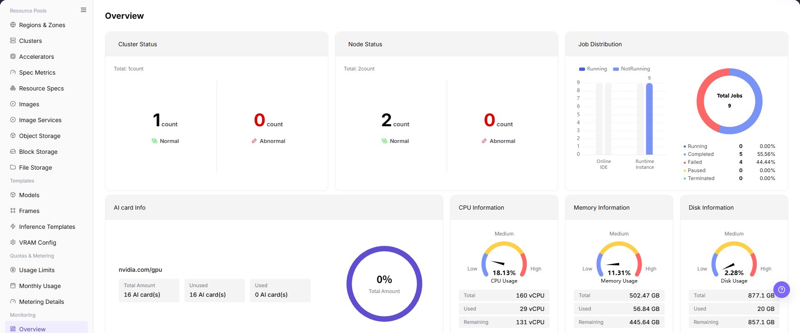

# Overview

## Feature Overview

| Item | Content |
| --- | --- |
| Applicable Role | Operator |
| Navigation Path | AI Infra(On-Prem) > Monitoring > Overview |
| Page Route | `/powerone/monitor/overview` |
| Managed Object | Resource status, capacity watermarks, exception summaries, and dedicated monitoring entries |

#### Beginner Explanation

Statistics overview serves as the resource pool cockpit, centrally presenting overall platform resource utilization and health summaries to help operators quickly evaluate system health and decide whether to open cluster, node, device, or job monitoring pages for targeted investigation.

#### Terms

| Term | Description |
| --- | --- |
| Global Watermark | Overall platform resource utilization across GPU, CPU, memory, and disk. |
| Exception Aggregation | Centralized summary of abnormal clusters, abnormal nodes, and failed jobs. |
| Dedicated Monitoring | Sub-monitoring pages in the left navigation, including Cluster Statistics, Node Statistics, Device Monitoring, and Job Monitoring. |

#### Recommended Operation Order

First review top cluster, node, and job health summaries, then check GPU, CPU, memory, and disk resource utilization; if anomalies are discovered, switch to the corresponding dedicated monitoring page via the left menu for targeted investigation.

#### First-Time User Notes

This is a read-only global status dashboard, not a resource configuration page. Use it to judge health direction and capacity bottlenecks from a macro perspective; verify specific root causes on dedicated object pages via the left navigation.

## Prerequisites

1. The current account has operator monitoring view permissions.
2. Target regions, availability zones, and clusters have completed resource access.
3. Monitoring collection components normally report cluster, node, device, and job data.
4. The resource pool and affected resource types under investigation have been clarified.

## Page Description

Use this page to understand the current on-prem resource state and decide which dedicated monitoring page to investigate next.

Statistics overview presents global resource status, job distribution, and hardware utilization dashboards. Read the page in the following order:

| Page Area | What to Confirm |
| --- | --- |
| Cluster Status | Total cluster count, along with normal and abnormal cluster distribution. |
| Node Status | Total physical/compute node count, along with normal and abnormal node distribution. |
| Job Distribution | Bar charts comparing Online IDE and Runtime Instance counts, and donut charts showing shares of running, completed, failed, paused, and terminated jobs. |
| GPU Information | GPU driver model identifier (e.g. `nvidia.com/gpu`), total AI cards, unused count, used count, and the overall usage percentage gauge. |
| Compute & Storage Information | Gauge charts for CPU, memory, and disk utilization, along with total, used, and remaining capacity figures. |
| Dedicated Navigation | Left menu entries for Cluster Statistics, Node Statistics, Device Monitoring, and Job Monitoring. |

## Main Operations

### Read the Overview and Identify Resource Watermarks

1. Go to `AI Infrastructure > On-Prem > Monitoring > Overview`.
2. Inspect the top **Cluster Status** and **Node Status** cards to check if any abnormal objects are highlighted in red.
3. Review the **Job Distribution** cards to confirm whether failed or unexpectedly terminated jobs have increased.
4. Review the bottom **GPU Information**, **CPU Information**, **Memory Information**, and **Disk Information** dashboards, checking percentage gauges and used/remaining capacity numbers.
5. When utilization falls into yellow (moderate) or red (critical) zones, evaluate platform capacity risks.

### Navigate to Dedicated Monitoring by Metric

1. **Cluster Exceptions**: If abnormal clusters appear in Cluster Status, click **Cluster Statistics** in the left navigation to identify the affected cluster name and events.
2. **Node Exceptions**: If abnormal nodes appear in Node Status, click **Node Statistics** in the left navigation to locate offline or unready physical nodes.
3. **Compute Contention**: If total GPU utilization is high (e.g., above 85%), click **Device Monitoring** in the left navigation to inspect VRAM usage and allocation per GPU card.
4. **Job Failures**: If failed jobs increase in Job Distribution, click **Job Monitoring** in the left navigation to find failed job instances and container error logs.
5. Redact internal resource names and sensitive identifiers before sharing screenshots externally.

## Parameter Quick Reference

| Field / Metric Name | Required | Field Type | Example | Description |
| --- | --- | --- | --- | --- |
| Cluster Status (Total / Normal / Abnormal) | System-generated | Status count | `Total: 1 / 1 Normal / 0 Abnormal` | Total managed clusters and normal/abnormal breakdown. |
| Node Status (Total / Normal / Abnormal) | System-generated | Status count | `Total: 2 / 2 Normal / 0 Abnormal` | Total compute nodes, where green indicates ready and red indicates abnormal. |
| Job Distribution (Category Bar Chart) | System-generated | Distribution chart | `Online IDE: 1 / Runtime Instance: 1` | Task counts categorized by online IDE and runtime instance. |
| Job Status (Donut Chart) | System-generated | Ratio chart | `Running / Completed / Failed / Paused / Terminated` | Share and percentage of all jobs across lifecycle states. |
| GPU Information | System-generated | Resource capacity | `Total: 16 AI card(s) / Unused: 16 / Used: 0` | GPU driver model identifier and AI card total, free, and used counts. |
| Total GPU Usage | System-generated | Percentage gauge | `0%` | Overall platform GPU utilization rate. |
| CPU Information | System-generated | Resource capacity | `Total: 160 vCPU / Used: 29 / Remaining: 131` | Total vCPU cores, allocated cores, and remaining available cores. |
| CPU Utilization | System-generated | Semicircular gauge | `18.13% (Low / Med / High)` | Global CPU load percentage with low/medium/high zone indicators. |
| Memory Information | System-generated | Resource capacity | `Total: 502.47 GB / Used: 56.84 / Remaining: 445.64` | Total physical memory, allocated memory, and remaining memory. |
| Memory Utilization | System-generated | Semicircular gauge | `11.31% (Low / Med / High)` | Global memory resource utilization percentage. |
| Disk Information | System-generated | Resource capacity | `Total: 877.1 GB / Used: 20 / Remaining: 857.1` | Local or attached disk storage total, used, and remaining capacity. |
| Disk Utilization | System-generated | Semicircular gauge | `2.28% (Low / Med / High)` | Platform disk storage capacity utilization percentage. |

## Pitfalls

- The overview can only help locate direction and does not replace specific object details.
- Rising watermarks should be judged together with new jobs, expansion, and queueing.
- Monitoring overview is used to observe global watermarks and should not be the sole basis for expansion, migration, or fault judgment.
- Metrics may have collection latency. Troubleshooting should be combined with cluster, node, device, and job details.
- Mask tenants, node names, and business identifiers before screenshots.
- Do not write real cluster IDs, node names, resource pool IDs, tenant information, internal metric keys, or test data in the document.

### Reading Rules and Impact

- **Use overview to determine direction first**: Identify the anomalous metric type first, then switch to cluster, node, or job dedicated monitoring via the left menu.
- **Interpret exception count across cycles**: Check whether an anomaly is a temporary spike or continuous failure to prevent false alarms caused by momentary jitter.
- **Metric availability determines trustworthiness**: If card numbers are clearly abnormal or empty, check the monitoring collection pipeline first.
- **Evaluate watermarks comprehensively**: Temporary high utilization is not necessarily a failure; judge it together with new workloads, scaling, and historical trends.

## Result Validation

| Check Item | Success Signal | If Abnormal |
| --- | --- | --- |
| Page load | All 6 overview metric dashboards and cards render properly | Check operator monitoring permissions and monitoring agent service status |
| Status verification | Cluster and node counts match the actual scale of managed resources | Refresh the page; if numbers mismatch, verify cluster onboarding status |
| Freshness | Resource utilization and job counts dynamically reflect running workloads | Check collection cycle, connectivity, and alerts in system or monitoring settings |
| Navigation flow | Smoothly navigates to the corresponding sub-monitoring page upon discovering an issue | Check sub-page menu permissions and visible scope |

## FAQ

#### No Data on Overview

**Symptom:**

The page opens, but charts or cards appear empty or show all zeros.

**Possible Causes:**

- The monitoring collection agent is stopped or network disconnected.
- The current role lacks monitoring metric permissions.
- The underlying cluster has not completed monitoring onboarding.

**Solution:**

1. Check underlying Prometheus / monitoring agent service status.
2. Confirm the logged-in role has On-Prem monitoring operator permissions.
3. Go to Cluster Management to confirm the cluster is in a healthy managed state.

#### Overview Data Is Not Updating

**Symptom:**

Workloads have started or finished, but utilization and job status do not change for an extended period.

**Possible Causes:**

- Collection interval introduces a periodic delay.
- Browser page cache has not refreshed.
- Metric reporting pipeline is congested.

**Solution:**

1. Refresh the browser page or navigate to Overview again.
2. Check monitoring container logs and collector status.
3. Switch to Job Monitoring to verify real-time job status.

#### Overview Differs from Dedicated Pages

**Symptom:**

The node or job counts on Overview cards differ from the rows displayed in sub-page lists.

**Possible Causes:**

- Overview cards and detail lists have different aggregation cache refresh frequencies.
- Sub-pages have additional active filter conditions applied.

**Solution:**

1. Check if the sub-page has active project, status, or name filters.
2. Clear temporary filters on the sub-page and compare again.

#### Cannot Find the Target Object in Dedicated Monitoring

**Symptom:**

Overview indicates an abnormal node or failed job, but it is not directly visible in the sub-page list.

**Possible Causes:**

- The target object has self-healed or was cleaned up/released.
- The sub-page list defaults to filtering out certain states.

**Solution:**

1. In Node Statistics or Job Monitoring, switch status filters to "All" or "Abnormal/Failed".
2. Check recent audit logs and cluster events.

#### A Spike Cannot Be Reproduced

**Symptom:**

A high watermark was recorded earlier, but current metrics have returned to normal.

**Possible Causes:**

- The spike was a momentary burst caused by short-lived jobs.
- The workload completed normally and released GPU compute resources.

**Solution:**

1. Filter historical jobs in Job Monitoring during that specific time window.
2. Cross-check job runtime duration with resource quotas.

## Notes

- Overview is used to discover direction and should not be the sole basis for incident responsibility.
- Mask tenants, nodes, IPs, and business identifiers before screenshots.
- Watermark exceptions need to be judged together with historical trends, business windows, and job changes.
- Before expansion, migration, or fault handling, cross-check with cluster statistics, node statistics, device monitoring, and job monitoring.
- Documentation examples must not include real cluster IDs, node names, resource pool IDs, tenant information, internal metric keys, or test data.

## Next Steps

1. If exceptions are concentrated in clusters, click **Cluster Statistics** in the left menu.
2. If exceptions are concentrated in nodes or hardware, click **Node Statistics** or **Device Monitoring** in the left menu.
3. If job failures or queueing increase, click **Job Monitoring** in the left menu and troubleshoot with quotas.
