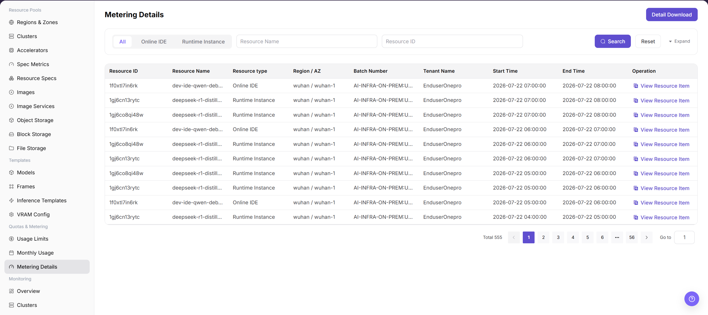
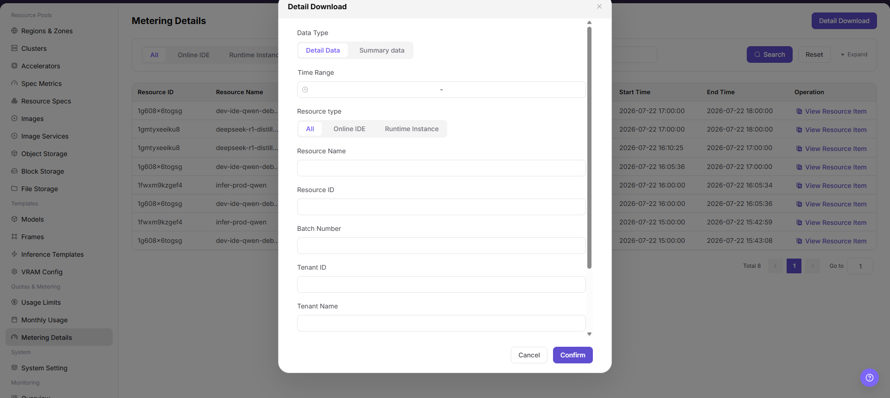

# Metering Details

::: info Document Information
Version: v1.0
Updated: 2026-08-27
:::

## Feature Overview

`Metering Details` is used to view resource-level metering records and supports filtering by resource type, region, availability zone, batch, and enterprise.

| Item | Content |
| --- | --- |
| Applicable Role | Operator |
| Navigation path | AI Infrastructure > On-Prem > Quotas & Metering > Metering Details |
| Page route | `/powerone/quota-metric/resource` |
| Managed objects | Resource ID, resource name, resource type, region, availability zone, batch number, enterprise, and start/end time |
| Typical use | Reconcile monthly metering, explain user consumption, and download details |

#### Beginner Explanation

Metering details are like resource consumption transaction records. They record what resources a tenant used, when they were used, how much was used, and how many Credits were converted.

#### View Flow

1. Go to `Quotas & Metering > Metering Details`.
2. Filter by time, status, resource type, or keyword.
3. View the list or chart results.
4. If an exception is found, drill down into the associated page.

#### Terms Quick Reference

| Term | Description |
| --- | --- |
| Resource Type | Type of metered object, such as online IDE or runtime instance. |
| Batch Number | Metering task or aggregation batch identifier. |
| Detail Download | Exports details within the current filter scope. |

## Prerequisites

1. The current account has operator permissions.
2. The target region has been selected correctly.
3. Related resources, jobs, or metering tasks have reported data.

## Page Description

Metering details are used to reconcile tenants, resources, billing cycles, usage, and Credits consumption record by record. Operators can locate abnormal details by tenant, resource name, or time range, and cross-check them with monthly metering summaries.

The following figure shows the metering details page.

## Main Operations

### View Metering Details

1. Go to `Quotas and Metering > Metering Details` and select a time range.
2. Filter by tenant, project, resource type, cluster, or metering status.
3. Check usage, unit, metering time, and refresh time.
4. If no record is returned, check the time zone and synchronization status. Redact metering and tenant data before sharing.

### Reconcile Metering with Resource Events

1. Open the target detail and record a redacted object, time, and metered value.
2. Compare resource creation, running, stopping, or deletion time with the metering interval.
3. Event time and metering interval should be traceable. If not, check data delay and measurement units.
4. Do not start or stop real resources to test metering anomalies.

### View Metering Details

#### Procedure

1. Go to `AI Infrastructure > On-Prem > Quotas & Metering > Metering Details`.
2. Select resource type, region, availability zone, or enterprise.
3. Click `Search`.
4. Click `View Resource Item` or expand details to view resource start and end time.
5. To reconcile offline, click `Detail Download`.

#### Detail Download

1. Go to `AI Infrastructure > On-Prem > Quotas & Metering > Metering Details`.
2. Select a resource type filter as needed, such as `All`, `Online IDE`, or `Runtime Instance`.
3. Use query conditions such as `Resource Name` and `Resource ID` to narrow the detail range.
4. Click `Search`, and confirm that resource ID, resource name, resource type, region/AZ, batch number, tenant name, start time, and end time match the export scope.
5. Before clicking `Detail Download`, verify filter conditions, billing period scope, and whether sensitive tenant or resource information is included.
6. After the download is complete, store the file in a controlled directory for reconciliation, metering review, or troubleshooting only.
7. For learning or screenshots only, view the button and filter fields without clicking `Detail Download`.

## Parameter Reference

| Field Name | Required | Field Type | Example | Description |
| --- | --- | --- | --- | --- |
| Tenant | Yes | Drop-down | `tenant-a` | Filters the consumption subject to view. |
| Resource Name | Conditionally required | Text | `inference-qwen` | Instance, job, or storage resource that generated metering. |
| Billing Cycle | Yes | Date range | `2026-07-01 to 2026-07-31` | Settlement cycle to which the details belong. |
| Usage | System-generated | Number / duration | `12 card-hours` | Actual resource usage. |
| Credits | System-generated | Number | `360` | Consumed credits converted from usage according to billing rules. |
| Detail Status | System-generated | Status | `Posted` | Shows whether the detail has completed statistics, posting, or correction. |

## Pitfalls

- Sufficient quota does not mean the underlying cluster definitely has idle resources.
- Metering data may be delayed. Use a unified time range and statistical definition during reconciliation.
- Sanitize tenant, amount, and business identifiers before exporting data.
- `Detail Download` exports metering details and may include tenant names, resource IDs, resource names, time ranges, and usage information.
- Downloaded files are only for reconciliation, metering review, or troubleshooting. Do not distribute them through unauthorized channels.
- Confirm filter conditions before downloading to avoid exporting an overly large scope or non-target tenant data.
- Do not write real tenant names, resource IDs, batch numbers, downloaded file names, internal paths, or test data in the manual.

## Result Validation

| Check Item | Success Signal | If Abnormal |
| --- | --- | --- |
| Filter results | The displayed records match the filter conditions. | Check the tenant, billing period, quota, usage records, and metering synchronization status. |
| Detail and summary consistency | The detail start time, end time, and resource type explain the monthly summary. | Check the tenant, billing period, quota, usage records, and metering synchronization status. |
| Filters applied before download | The list scope matches the selected filters. | Recheck the resource type, resource name, resource ID, batch number, tenant, and region. |
| Export scope | The downloaded data matches the search conditions. | Narrow the filter scope and search again. |
| Controlled file storage | The file is saved and shared only in authorized directories. | Delete unauthorized copies and redistribute the file through the approved internal process. |
| No download during learning | `Detail Download` is not selected during learning or screenshot capture. | If a file was downloaded accidentally, remove it through the sensitive-file handling process. |

## Configuration Rules and Impact

- **Filter before download**: Avoid exporting an overly large range.
- **Use details to explain summaries**: Monthly metering differences should first be checked from detail totals.

## FAQ

#### Instance Record Cannot Be Found in Metering Details

**Symptom:**

The user is known to have created an instance, but the corresponding record cannot be found in metering details.

**Possible Causes:**

- The instance runtime does not fall within the filter range.
- The instance has not entered metering status or has been filtered out.
- Tenant, region, or specification filters do not match.

**Solution:**

1. Expand the time range and query again.
2. Cross-filter by instance name, tenant, and specification.
3. Confirm whether instance status and metering tasks have completed.

#### Metering Detail Amount or Usage Is Abnormal

**Symptom:**

The usage, duration, or amount of a single metering record is clearly inconsistent with expectations.

**Possible Causes:**

- Specification unit price or metering unit is configured incorrectly.
- The instance runs across cycles and is split into multiple metering records.
- Resource release is delayed, causing occupied time to be longer than expected.

**Solution:**

1. Verify specifications, units, and metering rules.
2. Check the instance lifecycle and release time.
3. Initiate an operations review for abnormal records.

## Next Steps

1. When details are abnormal, narrow the query scope by tenant, resource, and time range.
2. When details and monthly usage are inconsistent, confirm whether there are delayed postings, correction records, or cross-cycle resources.
3. Before exporting details, sanitize tenant names, resource names, amounts, and internal unit prices.
4. When explaining fees, combine resource specification, runtime duration, and billing rules into a definition tenants can understand.

## Notes

- Metering details may have statistical delays. Confirm final posting status before settlement.
- Detail export files contain sensitive business data and should not be distributed through public channels.
- Do not directly modify detail definitions. Handle them through billing rules or correction processes.
- Before downloading details, confirm the filter scope and whether tenant or resource identifiers require desensitization.
