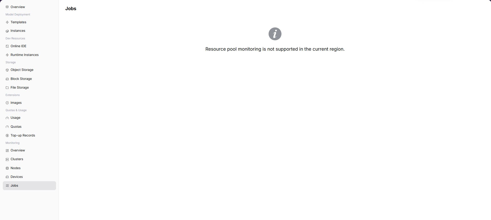

# Job Monitoring

::: info Document Information
Version: v1.0
Updated: 2026-08-27
:::

## Feature Overview

`Job Monitoring` is used to view model instances, online IDEs, runtime instances, and historical jobs within the user-visible scope from a End User perspective. When the operator has opened user-side monitoring and collection data is normal, the page displays corresponding charts, lists, or statistics. If the capability is not opened to the selected region, users should troubleshoot with instance status, logs, and events, and contact the operator to confirm monitoring opening conditions.

| Item | Content |
| --- | --- |
| Applicable Role | End User |
| Navigation path | AI Infrastructure > On-Prem > Monitoring > Job Monitoring |
| Page route | `/powerone/user-monitor/work` |
| Managed objects | Model instances, online IDEs, runtime instances, and historical jobs within the user-visible scope |
| Typical use | Locate queued, failed, long-running, and abnormal resource consumption jobs |

#### Beginner Explanation

Job monitoring is like a personal task queue list. It shows job ID, status, queue duration, runtime duration, GPU occupation, and failure causes.

#### Terms Quick Reference

| Term | Description |
| --- | --- |
| Job ID | Identifier used to locate a single training, inference, or runtime task. |
| Queue Duration | Time a job waits for resources or scheduling conditions. |
| Runtime Duration | Duration after a job starts running. |
| Failure Cause | Scheduling, image, startup, or resource error summary returned by the platform. |

## Prerequisites

1. The current account has job monitoring view permissions.
2. The target job belongs to the current account or current tenant visible scope.
3. The job has been submitted and generated status, events, or monitoring data.
4. The job ID or submission time to troubleshoot has been clarified.

## Page Description

The page displays job monitoring capability for the selected region. When the capability is opened, users can view metric trends, list data, or key status. When the capability is not opened, the page shows a capability prompt.

#### Expected Page Elements When Capability Is Open

| Page Element | Example | Description |
| --- | --- | --- |
| Job List | `train-job-001` | Displays jobs associated with model instances, online IDEs, or runtime instances. |
| Job Status | `Running / Queued / Failed` | Determines task lifecycle and current processing stage. |
| Queue Reason | `Insufficient resources / Image pulling` | Helps locate why creation is slow or cannot start. |
| Runtime Duration | `2h 13m` | Determines whether the task exceeds expected runtime. |
| Failure Information | `ImagePullBackOff` | Determines whether logs, events, or operator support is needed. |

## Main Operations

### View Monitored Objects

1. Open the monitoring page and select the time range, region, and resource pool.
2. Filter the objects supported by the current page, such as clusters, nodes, devices, jobs, or status.
3. Check aggregation scope, data refresh time, and object count to avoid comparing different scopes.
4. If no data is shown, expand the range and clear filters one at a time. Redact internal resource names and metrics before sharing.

### Drill Down into Abnormal Metrics

1. Click an abnormal metric, trend point, or **"Details"** for the target object.
2. Keep the same time range and inspect utilization, status, alerts, and related objects.
3. Determine whether the anomaly affects one object, one cluster, or the whole environment. Compare adjacent monitoring pages if information is insufficient.
4. Do not start, stop, migrate, or delete resources to test a monitoring anomaly.

### View Job Monitoring

#### Procedure

1. Go to `AI Infrastructure > On-Prem > Monitoring > Job Monitoring`.
2. Confirm the region in the upper-right corner.
3. Filter by time, status, or keyword provided by the page.
4. View charts, lists, or prompt information.
5. If monitoring capability is not opened, return to instance details to view logs, events, and status.

#### Key Focus When Capability Is Open

- Whether jobs remain queued for a long time.
- Whether failure causes point to quota, image, startup command, or insufficient resources.
- Whether GPU occupation and runtime duration match expectations.

## Parameter Reference

| Field Name | Required | Field Type | Example | Description |
| --- | --- | --- | --- | --- |
| Job ID | Yes | Text | `job-20260706-001` | Locates a single job. |
| Status | System-generated | Status | `Running` | Shows queued, running, succeeded, or failed. |
| Queue Duration | System-generated | Duration | `18 minutes` | Determines whether scheduling wait exists. |
| Runtime Duration | System-generated | Duration | `2 hours 15 minutes` | Determines whether the task exceeds expectations. |
| GPU Occupation | System-generated | Number / specification | `2 * A800` | Shows accelerator resources occupied by the job. |
| Failure Cause | System-generated | Text | `ImagePullBackOff` | Helps locate failure direction. |
| Submission Time | System-generated | Date time | `2026-07-06 09:30` | Used to align logs, events, and usage. |

## Pitfalls

- Job queueing is usually related to quotas, specifications, capacity, or scheduling conditions. Do not only refresh the page.
- When failure cause is empty, view instance events and logs first.
- When GPU occupation is normal but results are abnormal, return to training scripts or model parameters for troubleshooting.

## Result Validation

| Check Item | Success Signal | If Abnormal |
| --- | --- | --- |
| Job list | The list shows job ID, status, queue duration, runtime duration, and resource usage. | Check the time range, cluster, node, device, and job filters, and verify monitoring collection status. |
| Filtered results | The list and statistics change when the filters change. | Check the time range, cluster, node, device, and job filters, and verify monitoring collection status. |
| Failure details | A failed job can be opened to view an error summary, events, or logs. | Check the time range, cluster, node, device, and job filters, and verify monitoring collection status. |

## Prepare Before Contacting the Operator

If the job page is abnormal, prepare the following information so that the operator can distinguish queueing, failure, resource shortages, and history-retention problems:

| Information | Example | Purpose |
| --- | --- | --- |
| Job ID | `job-20260713001` | Identifies the task record. |
| Job Status | `Queued / Failed / Running` | Determines the troubleshooting direction. |
| Queue Duration | `25 minutes` | Indicates scheduling or resource-waiting problems. |
| Failure Time | `2026-07-13 10:15` | Aligns events, logs, and monitoring curves. |
| Specification / Queue | `2 * A800 / gpu-prod` | Confirms whether the resource pool and quota match. |

## FAQ

#### Job Remains Queued for a Long Time

**Symptom:**

The job remains Pending, Queued, or waiting for resources.

**Possible Causes:**

- Target specification or GPU model resources are insufficient.
- Current tenant quota is insufficient.
- Scheduling conditions, node labels, or storage mount conditions are not satisfied.

**Solution:**

1. Verify whether resource quotas and target specifications are available.
2. View cluster, node, and device monitoring to confirm capacity.
3. Switch specification or region if necessary, or contact the operator to adjust resources.

#### Job Fails but Logs Are Empty

**Symptom:**

The job status is Failed, but the log page has no application output.

**Possible Causes:**

- The container did not start successfully, so logs have not been generated.
- Image pull, startup command, or mount failure occurred before application startup.
- Log collection has delay or permission restrictions.

**Solution:**

1. View events and the failure cause field.
2. Check image address, startup command, environment variables, and mount paths.
3. Provide job ID, submission time, and error summary to the operator for troubleshooting.

## Next Steps

1. For queueing issues, verify quotas, specifications, and device capacity first.
2. For failure issues, view events, image, startup command, and mount path first.
3. For high-duration jobs, evaluate resource consumption together with the usage page.

## Notes

- Job IDs, image addresses, data paths, and log contents may contain sensitive information.
- Before stopping a job, confirm whether output files and logs need to be retained.
- When the same error appears repeatedly, adjust configuration before retrying to avoid continuous credit consumption.
