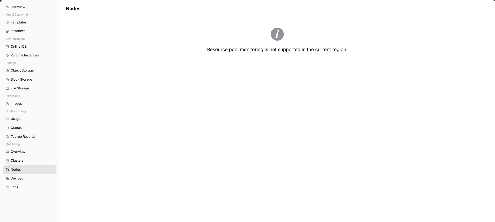

# Nodes

## Feature Overview

| Item | Content |
| --- | --- |
| Applicable Role | Model Provider and Model Consumer |
| Navigation Path | AI Infra(On-Prem) > Monitoring > Nodes |
| Page Route | `/powerone/user-monitor/node` |
| Managed Object | Configuration, status, and relationships on Nodes |

#### Beginner Explanation

Node statistics are like a dashboard for each server. They show node CPU, memory, GPU, and status to determine whether a task is slow or failed because of a specific node.

#### Terms

| Term | Description |
| --- | --- |
| Node Name | Server node identifier in the cluster that hosts instances or jobs. |
| CPU Usage | Node compute resource usage ratio. |
| Memory Usage | Node memory occupation ratio. |

#### Recommended Operation Order

Confirm prerequisites for Node resource trends and status within the user-visible scope, follow Main Operations, run Result Validation, and continue to the next page.

#### First-Time User Notes

Confirm that the task involves Configuration, status, and relationships on Nodes, and then follow the recommended order. If fields or state differ from expectations, check prerequisites before continuing downstream.

## Prerequisites

1. The current account has node monitoring view permissions.
2. The operator has opened node metrics for the target region or cluster.
3. Node collection data is normally reported.
4. The instance or job to troubleshoot can be mapped to a time range.

## Page Description

Use this page to inspect node resource trends and states within the current user's scope.

The page displays node statistics capability for the selected region. When the capability is opened, users can view metric trends, list data, or key status. When the capability is not opened, the page shows a capability prompt.

#### Expected Page Elements When Capability Is Open

| Page Element | Example | Description |
| --- | --- | --- |
| Node List | `node-a-01` | Displays nodes within the user-visible scope. |
| CPU Metric | `CPU usage 65%` | Determines node compute resource pressure. |
| Memory Metric | `128GiB / 256GiB` | Determines whether the instance is affected by memory resources. |
| Disk Metric | `Disk 70%` | Determines whether logs, cache, or data directories are close to limits. |
| Node Status | `Ready / NotReady` | Determines whether the node can host jobs. |

## Main Operations

### View Node Statistics

1. Go to `AI Infrastructure > On-Prem > Monitoring > Node Statistics`.
2. Confirm the region and time range in the upper-right corner, and filter by node status or keyword.
3. Review node metric charts and lists, and inspect changes across CPU, memory, and GPU curves.
4. If monitoring capability is not opened, return to the instance details page to view logs, events, and status.

### Investigate Abnormal Node Metrics

1. When a node hosting your workload becomes NotReady or resource curves remain saturated, record the node ID and timestamp.
2. Switch to `Job Monitoring` to confirm whether your jobs on that node are experiencing failures or abnormal queueing.
3. If persistent node abnormalities cause training interruptions or inference latency, contact the operator to troubleshoot node health.

#### Key Focus When Capability Is Open

- Whether nodes are Ready or schedulable.
- Whether CPU, memory, or GPU curves remain high.
- Whether curves are interrupted or update time is clearly delayed.

## Parameter Quick Reference

| Field Name | Required | Field Type | Example | Description |
| --- | --- | --- | --- | --- |
| Node Name | Yes | Text | `node-gpu-01` | Locates a specific node. |
| Region | Conditionally required | Drop-down | `Central China Zone 1` | Limits the region to which the node belongs. |
| Cluster | Conditionally required | Drop-down | `cluster-a` | Limits the cluster to which the node belongs. |
| CPU Usage | System-generated | Percentage | `72%` | Determines node CPU pressure. |
| Memory Usage | System-generated | Percentage | `81%` | Determines node memory pressure. |
| GPU Usage | System-generated | Percentage | `65%` | Determines node accelerator compute pressure. |
| Node Status | System-generated | Status | `Ready` | Shows whether the node is available or abnormal. |

## Pitfalls

- Temporary CPU or memory spikes are not necessarily failures. Judge them together with the task runtime window.
- Curve interruption may be collection delay or node unavailability.
- Users usually cannot maintain nodes directly. During troubleshooting, prepare time range and instance information for the operator.

### Troubleshooting Information to Prepare

When node data is abnormal, prepare the following information to distinguish a single-node failure, resource exhaustion, and collection delay:

| Information | Example | Purpose |
| --- | --- | --- |
| Node name | `node-gpu-01` | Locates the specific machine. |
| Cluster | `cluster-prod-a` | Confirms node ownership and impact scope. |
| CPU / Memory curve | `CPU 92% / Memory 85%` | Determines whether resources are at a high watermark. |
| Disk curve | `Disk 90%` | Identifies image-pull, log-write, and temporary-file risks. |
| Node-state duration | `NotReady for 10 minutes` | Determines how long the abnormal state has continued. |

## Result Validation

| Check Item | Success Signal | If Abnormal |
| --- | --- | --- |
| Page load | Nodes charts or lists are visible | Check monitoring permission and whether collection is available in the selected region |
| Scope | Time range, region, and object count match the investigation | Clear filters and restore them one at a time to avoid mixed scopes |
| Freshness | Update time is within the expected collection interval | Check collection interval, connection, and alerts in system or monitoring configuration |
| Correlation | An abnormal metric can be linked to a cluster, node, device, or job | Keep the same time range and cross-check adjacent monitoring pages and object details |

## FAQ

#### No Data on Nodes

**Symptom:**

The page opens, but charts or lists are empty.

**Possible Causes:**

- No job ran in the selected time.
- collection is unavailable in the region.
- the role lacks metric permission.

**Solution:**

1. Expand the time range and reset filters
2. verify regional monitoring capability
3. compare an adjacent monitoring page.

#### Nodes Is Not Updating

**Symptom:**

The data does not change for an extended period.

**Possible Causes:**

- The next collection cycle has not arrived.
- the collector is abnormal.
- the page is cached.

**Solution:**

1. Check update time
2. inspect collector status and alerts
3. refresh with the same time range.

#### Nodes Differs from Adjacent Pages

**Symptom:**

The same object has different values on two monitoring pages.

**Possible Causes:**

- Aggregation granularity differs.
- time range or time zone differs.
- filters target different objects.

**Solution:**

1. Align time range and time zone
2. verify aggregation scope
3. clear and restore filters one at a time.

#### Cannot Locate Target Object in Related Monitoring

**Symptom:**

The metric or details entry does not lead to the expected object.

**Possible Causes:**

- The object ended or was removed.
- the role cannot see it.
- relationship identifiers differ.

**Solution:**

1. Record object and time
2. check its list state
3. ask the Operator to verify visibility.

#### A Spike Cannot Be Reproduced

**Symptom:**

A spike was recorded, but current details are normal.

**Possible Causes:**

- The spike was brief.
- sampling is coarse.
- the job has ended.

**Solution:**

1. Lock the spike interval
2. compare job and node events
3. retain a sanitized screenshot and object identifier.

## Notes

- Node names, IPs, and labels are operations-sensitive information and must be sanitized before screenshots.
- Node metrics only describe resource status. Business failures still require logs and events.
- Users cannot directly repair nodes. Provide evidence to the operator.

## Next Steps

1. When node metrics are abnormal, check whether affected jobs or instances are concentrated on this node.
2. For GPU-related issues, continue to device monitoring.
3. If the node remains abnormal, avoid repeatedly retrying on the same specification.
