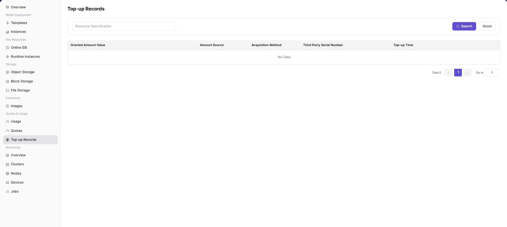

# Top-up Records

## Feature Overview

| Item | Content |
| --- | --- |
| Applicable Role | Model Provider and Model Consumer |
| Navigation Path | AI Infra(On-Prem) > Quotas & Usage > Top-up Records |
| Page Route | `/powerone/quota-usage/top-up-history` |
| Managed Object | Credit top-up records, sources, acquisition methods, external serial numbers, and top-up times |

#### Beginner Explanation

Top-up records are like the transaction history of a credit wallet, used to view the time, quantity, and status of each top-up, deduction, or adjustment.

#### Terms

| Term | Description |
| --- | --- |
| Granted Amount | Amount of credits granted to the account by the platform. |
| Value Amount | Value amount corresponding to the credits. |
| Source | Credit source, such as manual grant, campaign, or external system. |

#### Recommended Operation Order

Define the target tenant and query range, search for the record, review the returned fields, and then reconcile the record with the related credit change or external evidence.

#### First-Time User Notes

This is a read-only record page. An empty list can mean that no record matches the current conditions; reset the filters and confirm the tenant and time range before treating it as an exception.

## Prerequisites

1. The current account has permission to view top-up records.
2. The current tenant has had credit top-ups or grants.
3. For reconciliation, external payment or approval records have been prepared.

## Page Description

Use this page to locate credit top-up records and trace when, how, and from which source credits were granted.

The page contains a query area and a result table. In the screenshot, the list is empty, which means that no record matches the current conditions; it does not by itself indicate that top-up processing failed.

#### Page Areas

| Field/Area | Description |
| --- | --- |
| Search Area | Sets the query conditions. Use **"Search"** to apply them and **"Reset"** to restore the default list. |
| Granted Amount | Granted credit quantity. |
| Value Amount | Credit value amount. |
| Source | Credit source. |
| Acquisition Method | Acquisition method. |
| Third Party Serial Number | External serial number. |
| Top-up Time | Arrival time. |

## Main Operations

### Query and Review Top-up Records

1. Go to `AI Infrastructure > On-Prem > Quota & Usage > Top-Up Records`.
2. Confirm that the current account is viewing the target tenant and define the time range or serial information to query.
3. Enter the available query conditions and click **"Search"**.
4. Review the granted amount, value amount, source, acquisition method, third-party serial number, and top-up time in the returned rows.
5. If no record is returned, check the time zone and tenant scope, then click **"Reset"** and apply conditions one at a time.
6. Redact external serial numbers and credit information before sharing evidence.

### Reconcile a Top-up with the Quota Change

1. Record the target row's redacted third-party serial number, source, top-up time, and granted amount.
2. Compare external payment or approval evidence and locate the corresponding credit change or usage record.
3. The external record, top-up record, and credit change should be traceable by serial number and time. If not, check refresh time and posting status.
4. Do not create another top-up or quota adjustment to test an anomaly.

## Parameter Quick Reference

| Area / Field | Required | Field Type | Example | Description |
| --- | --- | --- | --- | --- |
| Query conditions | No | Search fields | `Time range / serial number` | Narrows the result table. Available conditions depend on the current page. |
| Granted Amount | System-generated | Number | `2000 Credits` | Amount of credits granted by the record. |
| Value Amount | System-generated | Number | `20 USD` | Value amount corresponding to the granted credits. |
| Source | System-generated | Text | `Manual grant` | Identifies where the credit change originated. |
| Acquisition Method | System-generated | Text / Enum | `Top-up` | Describes how the credits were obtained. |
| Third Party Serial Number | System-generated | Text | `external-001` | Links the platform record to external payment or approval evidence. |
| Top-up Time | System-generated | Date time | `2026-07-06 10:00` | Time when the top-up record was generated or posted. |

## Pitfalls

- When there is no data, Click **"Reset"** first to exclude filter impact.
- Top-up records are used for reconciliation and do not mean resource quotas have been adjusted.

### Configuration Rules and Impact

- Top-up records only reflect credit changes and do not reflect resource quotas such as GPU or CPU.
- Credit arrival and resource quota adjustment are different concepts.
- During reconciliation, retain external serial numbers and times.

## Result Validation

| Check Item | Success Signal | If Abnormal |
| --- | --- | --- |
| Page entry | Top-up Records opens with the query area and result table | Check menu permission, current business identity, and tenant scope |
| Query result | Returned rows match the selected tenant, time range, and available conditions | Reset filters and verify time boundaries, time zone, and tenant scope |
| Empty state | Resetting filters either restores records or confirms that no record exists in the current scope | Confirm whether the tenant has had a top-up or grant and whether the source record has been generated |
| Reconciliation | The external serial number, top-up time, source, and granted amount correspond to external evidence and the credit change | Compare records by serial number and time, then check posting status and data refresh |

## FAQ

#### No Records on Top-up Records

**Symptom:**

The page opens, but lists or statistics are empty.

**Possible Causes:**

- Filters are too narrow.
- source records are not generated.
- the role cannot see them.

**Solution:**

1. Reset filters
2. verify the source job or metering cycle
3. check business identity and tenant scope.

#### Top-up Records Shows the Wrong Scope

**Symptom:**

Data does not belong to the expected time, region, or object.

**Possible Causes:**

- Time boundaries differ.
- the region filter did not apply.
- ownership changed.

**Solution:**

1. Select time and region again
2. verify object identifiers
3. confirm ownership in source details.

#### Top-up Records Is Delayed

**Symptom:**

A source operation completed, but its record is not visible.

**Possible Causes:**

- Aggregation is not complete.
- the page is cached.
- source state is still processing.

**Solution:**

1. Verify source state
2. wait one aggregation cycle and refresh
3. inspect the processing task if delay persists.

#### Details or Download Is Unavailable

**Symptom:**

The details, expand, or download entry is disabled.

**Possible Causes:**

- The record does not support it.
- role permission is insufficient.
- the file is not generated.

**Solution:**

1. Select an eligible record
2. check role permission
3. confirm the statistics or export task is complete.

#### Summary and Details Do Not Match

**Symptom:**

The summary differs from the total of individual records.

**Possible Causes:**

- Periods differ.
- values are rounded.
- some records are still processing.

**Solution:**

1. Align period and time zone
2. compare by object
3. wait for pending records and check again.

## Notes

- Top-up records involve credits and settlement information. Do not display complete screenshots in public channels.
- After a record takes effect, the balance may still change due to metering deductions. View usage at the same time.
- During reconciliation, use record ID and time range. Do not leak internal accounts or business contract information.

## Next Steps

1. If credits do not change after top-up, verify record status and effective time.
2. When abnormal deductions are found, troubleshoot together with usage records and operator metering details.
3. For reconciliation, export or record top-up transactions by time range.
4. When contacting the operator, provide record ID, time, change quantity, and a screenshot of current credits.
