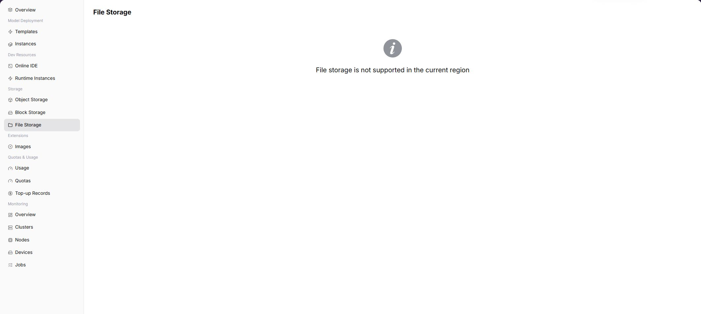

# File Storage

::: info Document Information
Version: v1.0
Updated: 2026-08-27
:::

## Feature Overview

`File Storage` is used to view and use shared file storage capability opened by the operator in the target region. After the capability is opened, the page displays available file systems, shared directories, capacity, status, and mount entrypoints. When the capability is not opened, users need to confirm region, permissions, quotas, and operator component access status.

| Item | Content |
| --- | --- |
| Applicable Role | End User |
| Navigation path | AI Infrastructure > On-Prem > Storage Services > File Storage |
| Page route | `/powerone/storage-service/file` |
| Managed objects | Shared file systems, directories, capacity, mount relationships, and access policies |
| Typical use | Provide shared directories for multiple instances or jobs, suitable for datasets, model repositories, and output directories |

#### Beginner Explanation

File storage is like a team shared folder, suitable for multiple instances or jobs to read the same data, model files, or output directories. It emphasizes directory and file semantics, which are different from the independent disk semantics of block storage.

#### Terms Quick Reference

| Term | Description |
| --- | --- |
| Shared Directory | File system directory accessible by multiple instances or jobs. |
| NFS | Common shared file system protocol. |
| Mount Path | Path used to access the shared directory inside the container. |
| Access Policy | Read-only or read/write permission control. |

## Prerequisites

1. The operator has connected and opened file storage components in the target region.
2. The current account has permission to view and use file storage.
3. Tenant quota, capacity, and instance specifications meet usage requirements.
4. When mounting to an instance, the instance region, cluster, and storage capability are consistent.

## Page Description

The page is used to display file storage capability in the selected region. When the capability is opened, it usually displays list, capacity, status, creation entrypoint, mount entrypoint, and operation entrypoint. When the capability is not opened, the page shows a capability unavailable prompt.

## Main Operations

### View Storage Resources

1. Open the corresponding storage-service page and filter by name, project, status, capacity, or update time.
2. Open details and check capacity, used space, access method, mount or connection status, and creation time.
3. If no record is returned, reset filters and check project and region. Do not share internal addresses or access credentials.
4. For capacity or status anomalies, inspect quota, events, and associated instances before creating another resource.

### Manage Capacity, Mounts, or Access

1. Open the target action menu and identify the impact of expansion, mount, unmount, permission, or deletion entries.
2. Record current capacity, associated instances, and data-protection status before changes.
3. Before expansion, unmount, or deletion, confirm tasks and backups. Do not perform the final action during read-only validation.
4. After an approved change, check capacity, connection status, and events. If abnormal, stop subsequent actions and follow the recovery process.

### Create Shared Directory

#### Areas Displayed When the Feature Is Available

| Area | Description |
| --- | --- |
| List Area | Displays existing shared directories, capacity, status, and update time. |
| Create Entrypoint | Adds a file storage directory or declaration. |
| Mount Entrypoint | Associates a shared directory with an instance or container path. |
| Operation Entrypoint | Edit, expand, unmount, delete, or view details depending on page capabilities. |

#### Procedure

1. Go to `AI Infrastructure > On-Prem > Storage Services > File Storage`.
2. Confirm the region in the upper-right corner.
3. If the page provides a create entrypoint, fill in name, capacity, access policy, and description.
4. After submission, return to the list and view status.
5. Select this shared directory in instance creation or instance details and set the in-container path.

## Parameter Reference

| Field Name | Required | Field Type | Example | Description |
| --- | --- | --- | --- | --- |
| Shared Directory Name | Yes | Text | `shared-dataset` | File storage resource display name. |
| Capacity | Yes | Number | `500GiB` | Available space in the shared directory. |
| Access Policy | Conditionally required | Enum | `Read/write` | Controls read-only or read/write access. |
| Mount Path | Conditionally required | Text | `/mnt/shared` | Access path inside the instance or container. |
| Share Status | System-generated | Enum | `Available` | Used to determine whether it can be mounted, expanded, or deleted. |

#### Mount, Unmount, and Confirm Capacity

#### Mount

1. Open the instance creation page or storage mount entrypoint.
2. Select the target file storage resource.
3. Fill in the in-container path, such as `/mnt/data` or `/mnt/output`.
4. After submission, view instance events and logs to confirm successful mounting.

#### Unmount

1. Confirm that no running process is reading or writing this path.
2. Perform unmount through the instance or storage operation entrypoint.
3. Refresh the page to confirm that the mount relationship has been removed.

#### Confirm Capacity

1. View capacity and status in the file storage list.
2. Run `df -h` inside the instance or perform application-side capacity checks.
3. If capacity is insufficient, expand according to page capabilities or contact the operator to adjust quota.

## Alternative Paths

- To save model files, datasets, or artifact packages, consider [Object Storage](../object-storage/) first.
- When shared directory semantics are required, use file storage or cluster shared storage configured by the operator.
- When independent volume capability is required, use block storage. If the page is not opened, contact the operator to confirm whether the target region has underlying storage components.

## Prepare Before Contacting the Operator

If file storage is abnormal, prepare the following information so that the operator can distinguish shared-path, permission, client-node, and multi-node access problems:

| Information | Example | Purpose |
| --- | --- | --- |
| File System ID | `fs-20260713001` | Identifies the target file storage. |
| Mount Path | `/mnt/share` | Indicates whether the in-container path conflicts with another path. |
| Permission | `Read-write / Read-only` | Indicates whether a write failure is caused by permissions. |
| Client Node | `node-gpu-01` | Identifies the node where mounting failed. |
| Shared Directory | `/exports/models` | Confirms the NFS export path and tenant directory. |

## Pitfalls

- Files in shared directories are visible to multiple tasks. Confirm naming and overwrite risks before writing.
- NFS or shared storage paths must be sanitized before screenshots.
- High-concurrency small-file read/write may affect performance. Split directories or use object storage if necessary.

## Result Validation

| Check Item | Success Signal | If Abnormal |
| --- | --- | --- |
| Page is accessible | The file storage page opens and shows shared directory records or an empty-state message. | Check account permission, region scope, and file storage component availability. |
| Create-directory entry is visible | Users with permission can see the create shared directory entry and open the form. | Confirm whether file storage is opened to the current tenant. |
| Mount information is clear | File system ID, mount path, permission, client node, and status are visible. | Verify NFS address, exported directory, read/write permission, and client network. |
| Multi-node access can be verified | The shared directory can be read or written as expected from target instances or nodes. | Check export policy, permission scope, mount parameters, and node connectivity. |

## FAQ

#### Page Has No File Storage Data

**Symptom:**

No available file storage resources are visible after entering the page, or the page indicates that the capability is not opened to the selected region.

**Possible Causes:**

- The operator has not connected file storage components in the target region.
- The current account has no view or use permission.
- Tenant quota or capacity is insufficient.
- The filtered region is inconsistent with the instance region.

**Solution:**

1. Confirm the region in the upper-right corner.
2. Contact the operator to confirm file storage component, region binding, and tenant permissions.
3. Check resource quotas and capacity.
4. In the short term, object storage or temporary directories inside instances can be used, but temporary directories are not suitable for saving important results.

#### Path Is Unavailable After Mounting

**Symptom:**

After the instance starts, the file storage mount path cannot be accessed inside the container.

**Possible Causes:**

- Mount path is incorrect or conflicts with the application directory.
- The cluster where the instance runs cannot access underlying storage.
- Permissions, access policy, or capacity configuration is incorrect.

**Solution:**

1. View instance events and logs.
2. Confirm in-container path, access policy, and instance region.
3. Contact the operator to check underlying storage components and cluster mount capability.

#### Delete or Unmount Fails

**Symptom:**

Attempts to delete or unmount a file storage resource fail.

**Possible Causes:**

- Running instances are still using this resource.
- The resource is abnormal, expanding, or recycling.
- Current account permissions are insufficient.

**Solution:**

1. Stop or migrate dependent instances first.
2. Refresh the page and confirm resource status.
3. Contact the operator to check permissions and underlying storage reclaim status.

## Next Steps

1. Verify the mount path in runtime instances or Online IDE.
2. Write input data and output results to persistent paths.
3. Periodically clean up unused data to avoid exhausting quotas.

## Notes

- Before deleting or unmounting, confirm that no running instances depend on it.
- Mount paths must not overwrite system directories, application directories, or key directories inside the image.
