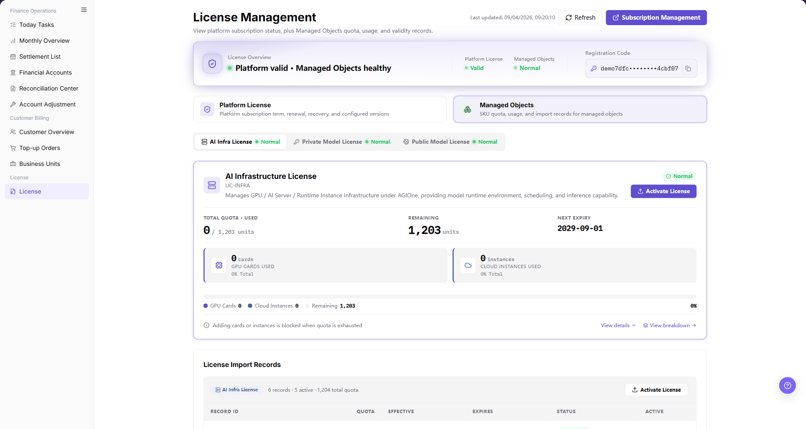
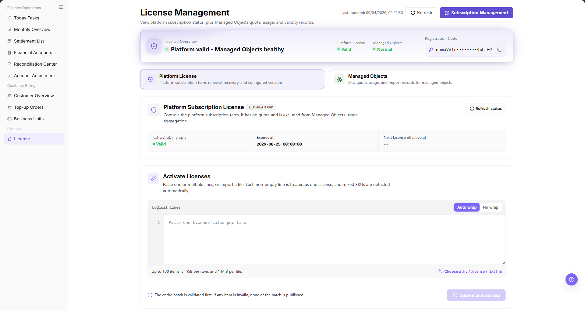
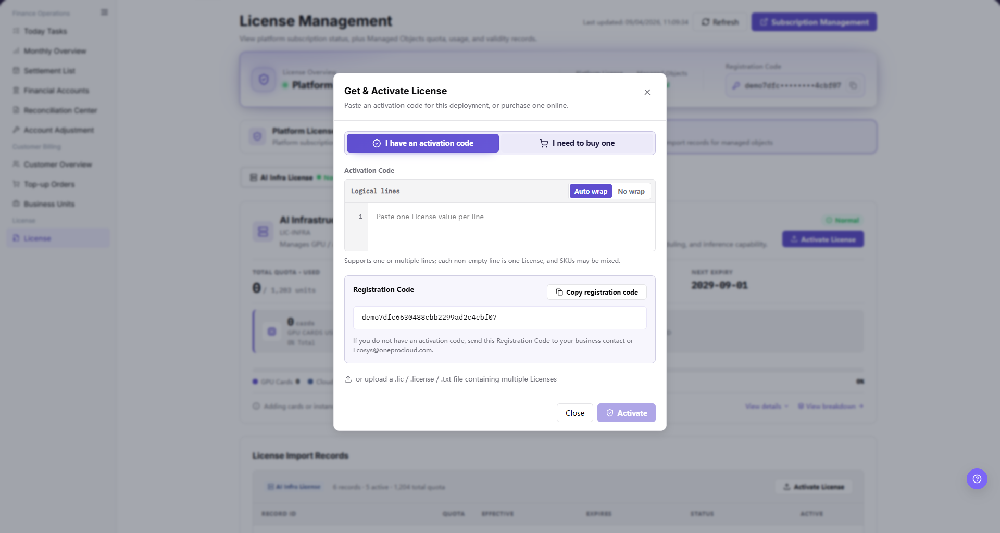

# License

::: info Document Information
Version: v1.1
Updated: 2026-09-03
:::

## Feature Overview

| Item | Content |
| --- | --- |
| Applicable Role | Operations administrator |
| Navigation Path | Billing > License > License |
| Managed Objects Route | `/user/usercenter/license/managed-objects` |
| Platform License Route | `/user/usercenter/license/platform-license` |
| Managed Areas | Platform subscription status and versions; Managed Objects quota, usage, validity, activation, and import records |

`License Management` has two independent areas: `Platform License` and `Managed Objects`. Platform License controls the platform subscription term and authorized versions. Managed Objects controls License authorization for AI infrastructure, private models, and public models, including quota, validity, registration code, activation, and import records.

#### Beginner Explanation

Treat Platform License as the platform-level subscription and Managed Objects as authorization for the objects managed by AGIOne. Check the overview status first, and then enter the corresponding area. Do not paste or submit a License until the target environment, registration code, source, and authorization scope are confirmed.

#### Terms Quick Reference

| Term | Meaning |
| --- | --- |
| Platform License | Platform subscription term, renewal, recovery, and configured authorized versions. |
| Managed Objects | SKU-based quota, usage, validity, and import records for objects managed by AGIOne. |
| Registration Code | Identifier generated for the current deployment. It is used to obtain a matching License. |
| Activation Code / License Value | Authorization content pasted one item per non-empty logical line or imported from a supported file. |
| Logical Lines | Editor mode in which each non-empty line is treated as one License value. |
| Batch Validation | The entire batch is prevalidated. If any item is invalid, none of the batch is published. |

## Prerequisites

1. The current account can open `Billing > License > License`.
2. The current page belongs to the target environment and deployment.
3. Required internal approval and a trusted License source are available before activation.
4. The browser session is valid.

::: warning Security and Operation Boundary
Complete registration codes, activation codes, and License contents are sensitive credentials. In screenshots, apply pixelated masking only to the credential value itself; keep labels, controls, status, quota, dates, record IDs, and other Demo business data readable. A registration code already shortened by the system with dots does not require additional masking. Opening a page, tab, or activation dialog is read-only; **"Submit and activate"** and **"Activate"** change the current deployment and require separate confirmation.
:::

## Page Description

The page header shows the overall Platform License and Managed Objects states together with the current deployment registration code. The two large cards below the overview switch between the Platform License and Managed Objects areas.

The screenshot shows the Managed Objects area. Verify the selected card, License category, quota state, validity information, and import-record area.

## Main Operations

### Check Overall Status and Select an Area

1. Go to `Billing > License > License`.
2. Verify the Platform License and Managed Objects states in the overview banner.
3. Confirm that the registration code belongs to the target deployment. Do not copy it into public materials.
4. Click `Platform License` to check the platform subscription, or click `Managed Objects` to check SKU authorization.
5. If the status is stale, click **"Refresh"** before troubleshooting. Do not repeatedly submit a License to force a refresh.

### Review Platform License

1. Click the `Platform License` card.
2. Review the subscription status, expiry information, and configured authorized versions.
3. In `Activate Licenses`, paste one License value on each non-empty logical line, or choose a `.lic`, `.license`, or `.txt` file.
4. Use `Auto wrap` for normal reading or `No wrap` when checking the original line structure.
5. Respect the editor limits: up to 100 items, 64 KiB per item, and 1 MiB per imported file.
6. Mixed SKUs can be included in one batch. The page validates the entire batch before publishing; if any item is invalid, none of the batch is published.
7. Stop before **"Submit and activate"** during read-only verification.

The screenshot shows the Platform License status area, multi-line editor, wrap controls, file import entry, limits, and batch-validation reminder.

### Review Managed Objects

1. Click the `Managed Objects` card.
2. Select `AI Infra License`, `Private Model License`, or `Public Model License`.
3. Verify status, total and used quota, remaining quota, nearest expiry, and the capacity bar.
4. Use `View details` to confirm the authorization scope and `View breakdown` to check quota composition when those entries are available.
5. Review `License Import Records` for record ID, quota, effective time, expiry time, status, and active state.
6. Keep record IDs, quota values, dates, and status readable when they are needed to explain the page. Protect only complete License, registration-code, activation-code, Key, Secret, or Token values.

### Open Managed Object Activation

1. In the target Managed Objects category, click **"Activate License"**.
2. In `Get & Activate License`, select `I have an activation code`. The `I need to buy one` tab is a purchase entry and is outside read-only verification.
3. Paste one or more License values in the logical-line editor. Each non-empty line is treated as one License, and mixed SKUs are allowed.
4. Alternatively, import a `.lic`, `.license`, or `.txt` file containing multiple Licenses.
5. Verify the displayed registration code belongs to the target deployment.
6. Use `Auto wrap` or `No wrap` to inspect the input, and stop before the final **"Activate"** action.

The screenshot shows the Managed Objects activation dialog. The complete registration-code value is protected with a value-level pixelated mosaic. The field label, input boundary, controls, explanatory text, and ordinary Demo data remain visible. No License value was entered during read-only verification.

## Parameter Quick Reference

| Field or Control | Required | Type | Description |
| --- | --- | --- | --- |
| Platform License | No | Area selector | Opens platform subscription status, authorized versions, and batch activation. |
| Managed Objects | No | Area selector | Opens SKU quota, usage, validity, activation, and import records. |
| Registration Code | System-generated | Sensitive text | Identifies the current deployment and must match the License source. |
| Logical Lines | Yes for paste | Multi-line editor | Treats every non-empty line as one License value. |
| Auto wrap / No wrap | No | Display control | Changes editor wrapping only; it does not change License content. |
| License file | No | File import | Supports `.lic`, `.license`, and `.txt`; maximum file size is 1 MiB. |
| Batch size | System-enforced | Limit | Up to 100 License items, with a maximum of 64 KiB per item. |
| Submit and activate | Final action | Button | Publishes a validated Platform License batch and changes the deployment state. |
| Activate | Final action | Button | Activates the Managed Objects License and changes the deployment state. |

## Pitfalls

- Platform License and Managed Objects are separate authorization dimensions. A healthy state in one area does not prove the other area is valid.
- Registration codes and License values are deployment-specific sensitive credentials. Do not reuse them across environments unless License support explicitly confirms compatibility.
- `Auto wrap` and `No wrap` only change display. They do not merge or split License items.
- Empty lines are ignored, but every non-empty logical line is treated as one License. Preserve the original License value without added spaces or line breaks.
- Batch activation is atomic at validation time: one invalid item prevents the whole batch from being published.
- Authorized quota is not billing balance. Check billing pages separately for balance or settlement issues.
- `Subscription Management`, `I need to buy one`, `Submit and activate`, and `Activate` can lead to purchasing or state-changing operations. Do not use them during read-only verification.

## Result Validation

| Check Item | Success Signal | If Abnormal |
| --- | --- | --- |
| Page is accessible | `License Management` opens and `License > License` is highlighted in the sidebar. | Check role permissions and page loading status. |
| Two areas are visible | `Platform License` and `Managed Objects` cards are available. | Refresh the page and verify that the current deployment has loaded. |
| Platform License state is visible | Subscription status, expiry information, and authorized versions are displayed. | Click **"Refresh status"** and record the visible status and error message; remove only embedded credential values. |
| Managed Objects state is visible | License category, quota, validity, and import records are displayed. | Switch categories and check License status and expiry. |
| Batch rules are visible | Editor, wrap controls, supported file types, size limits, and atomic-validation message are displayed. | Confirm that the Platform License area is selected and reload the page. |
| Activation dialog opens | Registration code, logical-line editor, file import, and final action are visible. | Check Managed Objects permissions and target category state. |

## FAQ

#### Platform License Is Valid but Managed Objects Is Unavailable

Platform subscription and Managed Objects authorization are separate. Open `Managed Objects`, check the target License category, quota, validity, and import records, and provide the administrator with the visible status information without including complete credential values.

#### A License Batch Cannot Be Submitted

Check that the batch contains no more than 100 non-empty items, each item is at most 64 KiB, the imported file is at most 1 MiB, and every item is valid. Because validation is atomic, one invalid item blocks the entire batch.

#### Activation State Does Not Refresh

Use **"Refresh"** or **"Refresh status"**, then check the relevant import records. Do not resubmit the same License until the current deployment, registration code, and previous result are confirmed.

## Notes

- The Demo verification opened the Platform License area and Managed Objects activation dialog but stopped before `Submit and activate` and `Activate`.
- The current page does not provide a documented deletion flow. Do not invent one.
- When escalating a License issue, share the page route, status, and error message, but remove any complete registration code, activation code, License, Key, Secret, or Token value.

## Next Steps

1. If Platform License is abnormal, confirm subscription term and authorized versions with the platform administrator.
2. If Managed Objects is abnormal, confirm the target SKU, quota, validity, and import record.
3. Perform activation only after environment, deployment, registration code, License source, and approval are confirmed.
