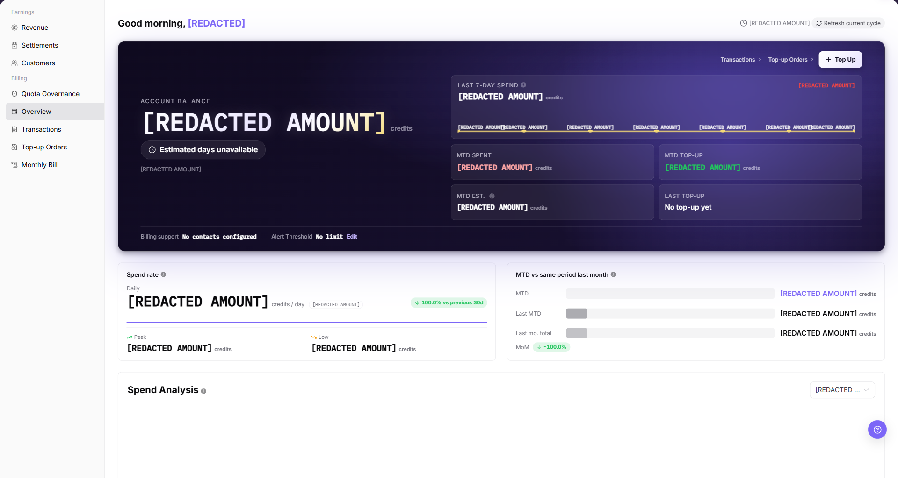

# Account Overview

::: info Document Information
Version: v1.0
Updated: 2026-07-29
:::

## Feature Overview

`Account Overview` summarizes the current account, including account balance, estimated available days, seven-day consumption, month-to-date spending, month-to-date top-ups, monthly estimate, last top-up, billing support, alert threshold, consumption analysis, top three cost sources, and recent transactions. Use it to assess account status before opening Transactions, Top-up Orders, Monthly Bill, or Quota Governance for details.

| Item | Content |
| --- | --- |
| Applicable Role | Model Provider, End User |
| Navigation path | Billing > User Billing > Account Overview |
| Page route | `/billing/my/account` |
| Managed objects | Account balance, consumption trends, top-up entry, alert threshold, and recent transactions |
| Typical use | Assess balance sufficiency, review consumption trends, and open transaction or top-up details |

#### Beginner Explanation

Account Overview is the billing home page. It first shows the current balance and estimated available days, then recent consumption, monthly changes, major cost sources, and recent transactions. If the balance, trend, or recent records look wrong, continue in `Transactions`, `Top-up Orders`, or `Monthly Bill`.

#### Terms Quick Reference

| Term | Meaning | Handling Tip |
| --- | --- | --- |
| Account Balance | Credits currently available to the account. | Compare it with the post-change balance in Transactions. |
| Estimated Available Days | Remaining usage time estimated from recent consumption. | Use it as a trend only, not a guarantee. |
| Monthly Estimate | Estimated monthly consumption based on the current rate. | It can change before the billing cycle ends. |
| Top 3 Cost Sources | Sources with the highest current consumption. | Open Transactions when a source is unusually high. |
| Alert Threshold | Balance level used to trigger a reminder. | Confirm the team's consumption pattern before changing it. |
| Recent Transactions | A subset of recent account changes. | Use Transactions for complete reconciliation. |

## Prerequisites

1. The current account has permission to view user-side billing.
2. Open `My Billing > Account Overview`.
3. Before checking balance, trends, or recent transactions, wait for the page to finish loading.

::: warning High-risk Operation Boundary
Top-ups, alert-threshold changes, and billing-data exports may affect a real account or expose sensitive information. For learning or screenshots, view only the page, entrypoints, and fields; do not submit changes.
:::

## Page Description

`Account Overview` opens the current overview directly. There is no legacy or modern view switch. Use `Transactions`, `Top-up Orders`, `Monthly Bill`, and `Quota Governance` for detailed follow-up. Sanitize amounts, account information, and contact details before sharing the screenshot.

| Area | Description |
| --- | --- |
| Account Balance | Displays the current available balance. |
| Estimated Available Days | Estimates how many days the balance can support from the seven-day consumption rate. |
| Last 7 Days Consumption | Displays recent consumption. |
| Month-to-date Spending | Displays Credits consumed in the current calendar month. |
| Month-to-date Top-ups | Displays Credits topped up in the current calendar month. |
| Monthly Estimate | Estimates this month's consumption at the current rate. |
| Last Top-up | Displays the most recent top-up information. |
| Billing Support | Provides the billing-support entry. |
| Alert Threshold | Displays the balance reminder threshold and its edit entry. |
| Consumption Analysis | Compares month-to-date consumption with the same period last month. |
| Top 3 Cost Sources | Displays major consumption sources. |
| Recent Transactions | Displays recent account changes and `View All`. |
| Transactions | Opens the Transactions page. |
| Top-up Orders | Opens the Top-up Orders page. |

## Main Operations

### Review Account Overview

1. Go to `Billing > User Billing > Account Overview`.
2. Review `Account Balance` and `Estimated Available Days` to assess whether the balance is sufficient.
3. Review `Last 7 Days Consumption`, `Month-to-date Spending`, `Month-to-date Top-ups`, and `Monthly Estimate`.
4. Review `Consumption Analysis` and `Top 3 Cost Sources` for abnormal sources.
5. For learning or screenshots, view only balance, trends, and entrypoints; do not submit a top-up or alert-threshold change.

### Review Recent Transactions

1. Go to `Billing > User Billing > Account Overview`.
2. Review recent account changes in `Recent Transactions`.
3. Check transaction time, type, amount direction, and description.
4. If the subset cannot explain the balance change, click `View All` or open `Transactions`.
5. Hide real amounts, accounts, order numbers, transaction numbers, and business context in external communication.

### Open Top-up Orders

1. Go to `Billing > User Billing > Account Overview`.
2. Click `Top-up Orders`.
3. Locate an order by order number, status, or credit source.
4. Check top-up status, credited amount, creation time, and completion time.
5. For learning or screenshots, view only the entry and list fields; do not initiate a real top-up or export order data.

## Parameter Reference

| Field Name | Required | Field Type | Example | Description |
| --- | --- | --- | --- | --- |
| Account Balance | System-generated | Credits | Sanitized amount | Current available balance. |
| Estimated Available Days | System-generated | Number | Sanitized days | Estimated from the seven-day consumption rate. |
| Last 7 Days Consumption | System-generated | Credits | Sanitized amount | Accumulated consumption in the last seven days. |
| Month-to-date Spending | System-generated | Credits | Sanitized amount | Credits consumed in the current calendar month. |
| Month-to-date Top-ups | System-generated | Credits | Sanitized amount | Credits topped up in the current calendar month. |
| Monthly Estimate | System-generated | Credits | Sanitized amount | Monthly estimate based on the current consumption rate. |
| Last Top-up | System-generated | Information area | Sanitized amount | Displays the latest top-up information. |
| Billing Support | System-generated | Entry | Sanitized contact | Opens billing support. |
| Alert Threshold | Editable | Number | Sanitized threshold | Balance level that triggers a reminder. |
| Consumption Analysis | System-generated | Chart / metric | Sanitized ratio | Displays consumption trend and comparison. |
| Top 3 Cost Sources | System-generated | Ranking | Sanitized source | Displays major consumption sources. |
| Recent Transactions | System-generated | List | Sanitized transaction | Displays recent account changes. |
| Transactions | No | Entry | `Transactions` | Opens the Transactions page. |
| Top-up Orders | No | Entry | `Top-up Orders` | Opens the Top-up Orders page. |
| Top Up | No | High-risk entry | `Top Up` | May initiate a real top-up flow; this manual only defines the boundary. |
| Edit | No | High-risk entry | `Edit` | May change the alert threshold; confirm impact before saving. |

## Pitfalls

- Estimated available days are based on recent consumption and can drop quickly after a large workload starts.
- Account Overview shows summaries and only some recent transactions; it does not replace Transactions.
- Monthly Estimate is not a final bill. Top-ups, refunds, and consumption can change it before the cycle ends.
- Confirm the team's consumption pattern before changing the alert threshold; an unsuitable threshold can delay action.
- Do not record real accounts, emails, order numbers, transaction numbers, amounts, customer names, tenant names, Tokens, or Keys.
- Sanitize screenshots, exports, tickets, and comments.

## Result Validation

| Check Item | Success Signal | If Abnormal |
| --- | --- | --- |
| Page loading | Balance, consumption metrics, recent transactions, and shortcuts are displayed. | Refresh the page or check user-side billing permission. |
| Metric visibility | Seven-day consumption, month-to-date spending, top-ups, and monthly estimate are visible. | Wait for loading to finish and refresh. |
| Entry availability | `Transactions`, `Top-up Orders`, and `View All` open their target pages. | Check menu permission or re-enter the page. |
| Recent transaction review | Recent transactions show time, type, amount direction, and description. | Open Transactions and use the target time range. |
| No unintended high-risk action | No top-up is submitted, alert threshold saved, or real data exported during learning or screenshot capture. | If triggered, record the time and scope and notify the owner for review. |

## FAQ

#### Account Balance Is Empty or Abnormal

**Symptom:**

The balance is missing or differs from the expected value.

**Possible Causes:**

The account lacks billing permission, page data has not finished loading, or the balance is being compared under a different billing scope.

**Solution:**

Refresh current-cycle data, confirm account and menu permissions, then open `Transactions` to review recent income and expense records.

#### Estimated Available Days Do Not Match Expectations

**Symptom:**

Estimated available days are too low, too high, or zero.

**Possible Causes:**

The seven-day consumption rate changed significantly or there is not enough stable recent usage data.

**Solution:**

Review seven-day consumption, month-to-date spending, and the monthly estimate together. Do not rely on estimated days alone.

#### Recent Transactions Cannot Explain the Balance Change

**Symptom:**

The Recent Transactions area does not explain the balance change.

**Possible Causes:**

The overview shows only a subset of records; the full history is in Transactions.

**Solution:**

Click `View All` or open `Transactions`, then filter again by time range and transaction type.

## Next Steps

1. For an individual balance change, open [Transactions](../transactions/).
2. To verify top-up status, open [Top-up Orders](../top-up-orders/).
3. For monthly reconciliation, open [Monthly Bill](../monthly-bill/).
4. To assess quota risk, open [Quota Governance](../quota-governance/).

## Notes

- Do not paste complete account, email, order number, transaction number, or balance screenshots into external channels.
- Account Overview is a summary entry; use Transactions and Monthly Bill for final reconciliation.
- Confirm permission and approval before a top-up, refund, deduction, threshold change, or data export.
- For learning or screenshots, view only pages, entrypoints, and fields; do not submit changes.
