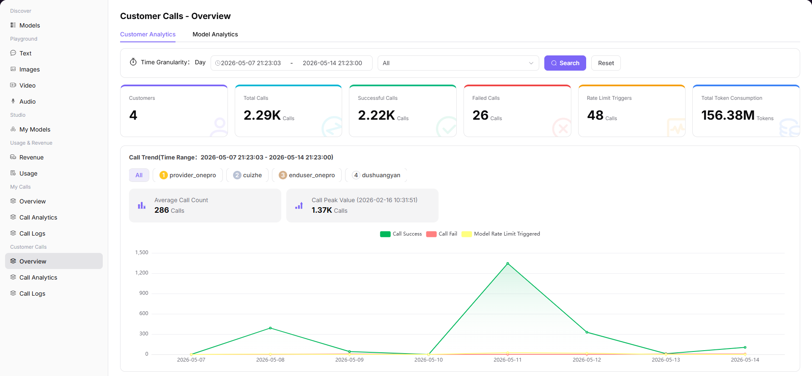

# Overview

## Preface

| Item | Content |
|------|---------|
| Target Audience | User |
| Navigation Path | Customer Calls > Overview |
| Overview | Statistics on call status by customer or model dimension to understand call volume, success rate, and Token consumption trends |

## Page Structure

### Search Area

The page top supports selecting data granularity, time range, and customer / model filtering.

### Action Buttons

No specific operation buttons.

### Data List

The page displays core metric cards and trend and ranking charts.

### Page Screenshot

## Operations

### Viewing Customer Call Overview

1. Enter the platform homepage, click the **"Customer Calls > Overview"** menu in the left navigation bar to enter the customer call overview page.
2. Switch analysis dimension:
   - Customer Dimension: statistical analysis by calling customer (user) as the unit;
   - Model Dimension: statistical analysis by calling model as the unit.
   - Click the corresponding tab to switch the view.
3. Set filter parameters at the top of the page:
   - Data Granularity: select the time unit for the statistics period (e.g., "Day");
   - Time Range: select the start and end dates to query;
   - Customer / Model Filter: depending on the dimension, you can select a specific customer or model to view.
   - After setting, click the **"Search"** button to load data; click **"Reset"** to clear all filter conditions.
4. View core metric cards:
   - Customer Count (customer dimension only): total number of independent customers who initiated calls during the statistics period;
   - Total Calls: total number of calls during the statistics period;
   - Successful Calls: number of successful calls during the statistics period;
   - Failed Calls: number of failed calls during the statistics period;
   - Rate Limit Triggers: number of requests blocked due to triggering model rate limits during the statistics period;
   - Total Token Consumption: total input and output Tokens consumed during the statistics period.
5. View trend and ranking charts:
   - **Call Trends Chart**: the line chart shows the distribution of total calls, successful calls, failed calls, and rate limit triggers by date. You can click on points on the chart to view detailed data for that day. You can switch via tags to view call data for a single customer or model;
   - **Token Consumption Trends Chart** (model dimension only): the line chart shows the distribution of input Token and output Token consumption by date;
   - **TOP Ranking List**: Customer Call TOP5 (customer dimension only) / Model Call TOP5 (model dimension only): list sorted by total call volume, including successful and failed counts. Rate Limit Trigger TOP5: list sorted by rate limit trigger count for customers or models. Click "View Details" to enter the detailed call statistics page for the corresponding customer or model.

#### Parameters

| Term | Type | Example | Description |
|------|------|---------|-------------|
| Dimension | Tab | `Customer / Model` | The statistical dimension for analysis |
| Data Granularity | Dropdown | `Day / Week / Month` | The time unit for the statistics period |
| Time Range | Date Range | `2026-05-07 to 2026-05-14` | The time period for statistics |
| Customer Count | Number | `125` | Total number of independent customers who initiated calls within the selected time range |
| Total Calls | Number | `15,234` | Total number of all customer / model call requests within the selected time range |
| Successful Calls | Number | `14,892` | Number of successfully completed call requests within the selected time range |
| Failed Calls | Number | `342` | Number of failed call requests within the selected time range |
| Rate Limit Triggers | Number | `45` | Number of requests rejected due to triggering rate limit policies within the selected time range |
| Total Token Consumption | Number | `256.7M` | Total input and output Tokens consumed by all calls within the selected time range |

## Notes

* Click the "Customer Dimension" or "Model Dimension" tab at the top of the page to switch between different analysis perspectives.
* In the top filter, you can select a specific customer or model to view their independent call trends and consumption data.
* Click on a peak point on the trend chart to view specific call data for that date.