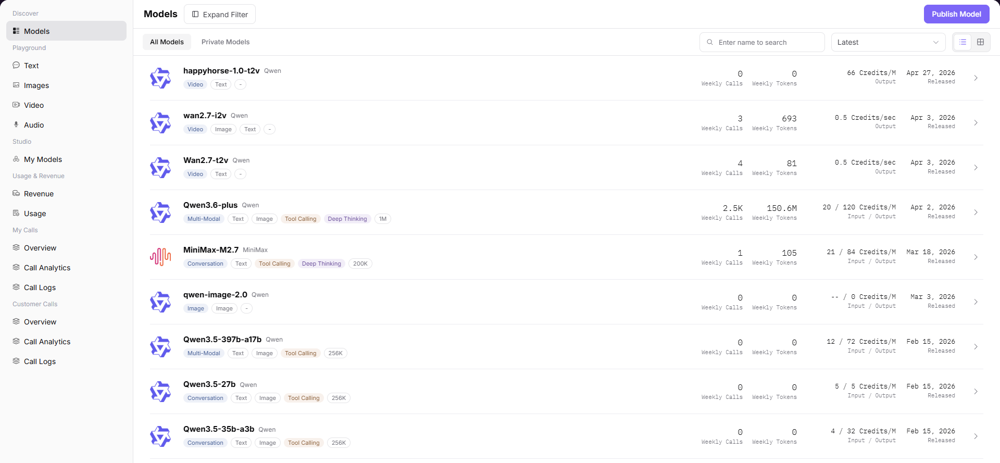

# Models

## Preface

| Item | Content |
|------|---------|
| Target Audience | User |
| Navigation Path | Discover > Models |
| Overview | Browse and search all models on the platform, understand model capabilities and view detailed usage information |

## Page Structure

### Search Area

The page left provides a model type filter (Multimodal, Chat, Image, Audio, Video, etc.), supporting filtering by input / output capabilities. The page top supports direct search by model name.

### Action Buttons

* The page top-right provides a "Publish Model" button for submitting new model publishing applications
* Each model card provides a click entry to enter the details page

### Data List

The page displays all / private model lists. Each model card contains name, type tag, capability tag, weekly call volume, billing standard, release date, and other information.

### Page Screenshot

## Operations

### Viewing Model List

1. Enter the platform homepage, click the **"Discover > Models"** menu in the left navigation bar to enter the model marketplace page.
2. The page displays all / private model lists. You can use the left filter to filter by model type (Multimodal, Chat, Image, Audio, Video, etc.) and input / output capabilities, or directly search by model name.
3. Click the target model (e.g., Qwen3.6-plus) to enter the details page to view complete model information and usage guidelines.

#### Parameters

| Term | Type | Example | Description |
|------|------|---------|-------------|
| Model Name | Text | `Qwen3.6-plus / MiniMax-M2.7` | The name and author of the model |
| Model Type Tag | Tag | `Multimodal / Video Model / Chat Model` | The functional type of the model |
| Capability Tag | Tag | `Tool Calling / Deep Thinking` | The extended capabilities supported by the model |
| Weekly Call Volume | Number | `2.4K / 1` | The number of times the model was called this week |
| Weekly Token Volume | Number | `146.6M / 105` | The total Token consumption of the model this week |
| Billing Standard | Text | `20 / 120 Credit/M / 0.5 Credit/sec` | The calling fee standard of the model |
| Release Date | Date | `2026-04-02` | The release date of the model |

| Term | Type | Example | Description |
|------|------|---------|-------------|
| Context Length | Number | `1M` | The maximum context window length supported by the model |
| Input / Output Limit | Number | `Max Input 991K / Max Output 64K` | The Token limit for a single call |
| Reference Credit Price | Number | `Input 20 Credit / Output 120 Credit` | The reference fee per million Tokens |
| Input / Output Modalities | Multi-select | `Input: Text / Image / Video; Output: Text` | The input/output data types supported by the model |
| Capability Support | Toggle Tag | `Deep Thinking / Tool Calling` | The extended capabilities of the model |
| Supported Protocols | Tag | `openai/chat_completions / anthropic/messages` | The API protocols compatible with the model |
| Supplier Information | Card | `Alibaba-China: Free Quota` | The model's supplier, billing mode, and performance data |

## Other Operations

| Operation | Steps |
|-----------|-------|
| Filter and Search | Filter by model type / input-output capabilities on the left, search by name at the top, and switch sorting methods (Newest / Popular, etc.) |
| View Model Details | Click the model name card → Enter the details page, switch to view supplier, quick start, performance, overview, etc. |
| View API Call Examples | In the "Quick Start" tab, switch between SDK/HTTP/Curl methods, copy API endpoint, Base URL, and calling code |
| View Performance Data | In the "Performance" tab, select time range, view average request latency, first token delay, and other metric charts |
| View Model Overview | In the "Overview" tab, view the model's core features, applicable scenarios, version information, and other detailed introductions |
| Publish Model | Click the "Publish Model" button at the top right to submit a new model publishing application |
| Experience / Claim Free Quota | On the supplier information card, click "Experience" or "Claim Free Quota" to obtain trial qualifications |

## Notes

* Some models offer free quotas. You can click "Claim Free Quota" on the supplier information card to get trial qualifications.
* When viewing API call examples, you can switch between SDK/HTTP/Curl methods in the "Quick Start" tab.