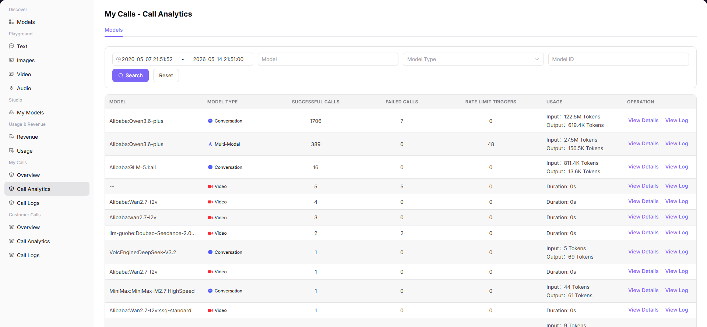

# Call Analytics

## Preface

| Item | Content |
|------|---------|
| Target Audience | User |
| Navigation Path | My Calls > Call Analytics |
| Overview | Statistics on call status by model dimension to understand call volume and consumption of each model |

## Page Structure

### Search Area

The page top supports selecting time range, model name, model type, and model ID for filtering.

### Action Buttons

Each model provides "View Details" and "View Logs" operation buttons.

### Data List

The page displays call statistics in table format, summarized by model.

### Page Screenshot

## Operations

### Viewing Call Statistics

1. Enter the platform homepage, click the **"My Calls > Call Analytics"** menu in the left navigation bar to enter the call statistics page.
2. Set filter parameters at the top of the page:
   - Time range: select the start and end dates to query, e.g., 2026-05-07 to 2026-05-14;
   - Model: enter the model name for fuzzy search;
   - Model Type: filter by type, such as chat / multimodal / video model, etc.;
   - Model ID: enter the model unique identifier for exact search.
   - After setting, click the **"Search"** button to load data; click **"Reset"** to clear all filter conditions.
3. View the statistics list. The table displays call statistics summarized by model:
   - Model: model name and identifier;
   - Model Type: such as chat model, multimodal, video model, etc.;
   - Successful calls: number of successful calls for this model during the statistics period;
   - Failed calls: number of failed calls for this model during the statistics period;
   - Rate limit triggers: number of requests blocked due to triggering frequency limits for this model;
   - Usage: consumed Tokens (for text/multimodal models) or duration (for video models), such as Input: 122.5M Tokens / Output: 619.4K Tokens;
   - Operations: View Details / View Logs.

#### Parameters

| Term | Type | Example | Description |
|------|------|---------|-------------|
| Time Range | Date Range | `2026-05-07 to 2026-05-14` | The time period for statistics |
| Model | Text | `Qwen3.6-plus` | The model name for fuzzy search |
| Model Type | Tag | `Chat / Multimodal / Video` | The functional type for filtering |
| Model ID | Text | `qwen/qwen3.6-plus` | The unique identifier for exact search |
| Successful Calls | Number | `2.13K` | Total number of successfully completed call requests for this model within the selected time range |
| Failed Calls | Number | `120` | Total number of failed call requests for this model within the selected time range |
| Rate Limit Triggers | Number | `15` | Number of requests rejected due to triggering rate limit policies for this model within the selected time range |
| Usage | Text | `Input: 122.5M Tokens / Output: 619.4K Tokens` | Resources consumed by this model within the selected time range: text models are input/output Token count, video models are generation duration |

## Notes

* When filtering models, you can use a combination of model name, model type, or model ID at the top.
* Click "View Details" in the operations column to enter the detailed call statistics page for that model.
* Click "View Logs" in the operations column to jump to the call log page to view individual records.