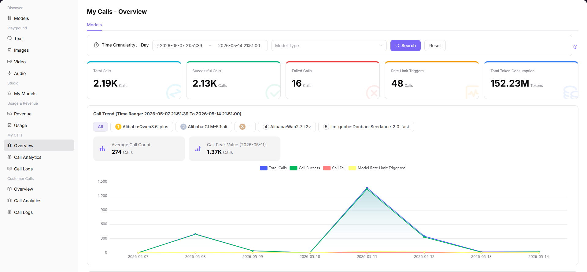

# Overview

## Preface

| Item | Content |
|------|---------|
| Target Audience | User |
| Navigation Path | My Calls > Overview |
| Overview | View the overall status of model calls to understand call volume, success rate, and Token consumption trends |

## Page Structure

### Search Area

The page top supports selecting data granularity (e.g., "Day"), time range, and model type filtering.

### Action Buttons

No specific operation buttons.

### Data List

The page displays core metric cards and multi-dimensional trend charts.

### Page Screenshot

## Operations

### Viewing Call Overview

1. Enter the platform homepage, click the **"My Calls > Overview"** menu in the left navigation bar to enter the call overview page.
2. Set query parameters at the top of the page:
   - Select data granularity (e.g., "Day");
   - Select time range (e.g., 2026-05-07 to 2026-05-14);
   - Optional: filter by model type;
   - Click the **"Search"** button to load data for the specified period.
3. View core metric cards:
   - Total calls: total number of model call requests during the statistics period (example: 2.19K times);
   - Successful calls: number of successfully completed calls during the statistics period (example: 2.13K times);
   - Other key metrics: failed calls, rate limit triggers, total consumed Tokens, etc.
4. View multi-dimensional trend charts:
   - **Overall call trends**: the line chart shows the distribution of total calls, successful calls, failed calls, and rate limit triggers by date. You can click on points on the chart to view detailed data for that day (e.g., total calls, successful/failed calls, rate limit counts);
   - **Per-model call trends**: you can switch via tags to view call data for a single model, such as Alibaba-China:Qwen3.6-plus. View average call count and call peak (example: peak 1.37K times, appeared on 2026-05-11);
   - **Token consumption trends**: the line chart shows the distribution of input Token and output Token consumption by date. You can click on points on the chart to view Token consumption details for that day (e.g., input 94.5M, output 490.5K).

#### Parameters

| Term | Type | Example | Description |
|------|------|---------|-------------|
| Total Calls | Number | `2.19K` | Total number of all model call requests initiated within the selected time range |
| Successful Calls | Number | `2.13K` | Number of successfully completed call requests within the selected time range |
| Failed Calls | Number | `120` | Number of call requests that failed for various reasons within the selected time range |
| Rate Limit Triggers | Number | `15` | Number of requests blocked due to triggering model call frequency limits within the selected time range |
| Total Consumed Tokens | Number | `94.5M` | Total number of input and output Tokens consumed by all calls within the selected time range |
| Average Call Count | Number | `312` | Average number of calls per day within the selected time range |
| Call Peak | Number | `1.37K` | The date with the highest call volume within the selected time range and its call count |

## Notes

* To filter for a single model, click the model tag in the "Call Trends" area to view that model's independent data.
* Click on a peak point on the trend chart to view specific call data for that date.
* Click "View More" to jump to the call log page to view detailed records.