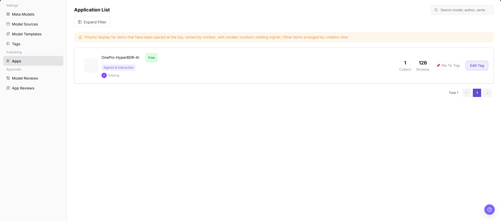

# Apps

::: info Document Information
Version: v1.0
Updated: 2026-08-27
:::

## Feature Overview

Apps helps operators view apps, model permissions, call scopes, status, and publishing records for application-level model access governance.

| Item | Content |
| --- | --- |
| Applicable Role | Operator |
| Navigation path | Model Services > Publishing > Apps |
| Page route | `/modelone/publish/application` |
| Managed objects | Apps, model permissions, call scopes, status, and publishing records |
| Typical use | Maintain apps that can call model services |

#### Beginner Explanation

Apps packages model capabilities into a customer-facing entry point. Operators focus on whether app information, visibility scope, called models, and publishing status are consistent.

#### Terms Quick Reference

| Term | Description |
| --- | --- |
| App | A customer-facing usage entry that wraps model capabilities. |
| Bound model | The model actually called by the app backend. |
| Publishing status | Lifecycle status such as draft, under review, published, or delisted. |
| Call entry | Customer access entry for the app or API. Use placeholders in documentation. |

## Prerequisites

1. The current account has app publishing management permission.
2. The app bound model, call entry, customer visibility scope, and publishing notes are prepared.
3. Customer authorization and model status have been confirmed before publishing.

## Page Description

This page manages app publishing records, including app name, bound model, visibility scope, publishing status, call entry, and review information. Operators should confirm that app display information, model permissions, and customer visibility scope match.

Page screenshot:

Used to view app status, bound models, and visibility scope.

## Main Operations

### View Applications

1. Go to `Model Services > Publishing > Applications`.
2. Filter by application name, type, status, publisher, or update time.
3. Check the name, version, status, and update time in the filtered result. If no result is returned, reset the filters and check the active tab.
4. The target application should be uniquely identifiable. If the list remains empty, check permissions and whether the application has been delisted.

### View Application Details

1. Click **"Details"** or the application name in the target row.
2. View the description, version, associated models, visibility, publishing status, and update time.
3. Compare the version and status with the list. If they differ, refresh the page and use the latest status shown in the details.
4. Return to the list after read-only validation. Do not publish, delist, or delete the application.

### View App List

1. Go to `Model Services > Publishing > Apps`.
2. On the `Application List` page, view the app name, tag, author, pricing status, collect count, and browse count.
3. Enter a model, author, series, or source keyword in the search box in the upper-right corner.
4. To use more filters, click `Expand Filter` and query by the filter fields shown on the page.
5. In an app card, view operation entries such as `Pin To Top` and `Edit Tag` as needed. Before performing change actions, confirm the impact scope.

## Parameter Reference

| Field Name | Required | Field Type | Example | Description |
| --- | --- | --- | --- | --- |
| App Name | System-displayed | Text | `sample-app` | App name displayed in the app list. |
| Tag | System-displayed | Tag | `Agents & Interaction` | App category or display tag. |
| Author | System-displayed | Text | `lixipeng` | App creator or maintainer. |
| Pricing Status | System-displayed | Tag | `Free` | Current pricing or billing status of the app. |
| Collect Count | System-displayed | Number | `1` | Number of times the app has been collected. |
| Browse Count | System-displayed | Number | `126` | Number of times the app has been viewed. |
| Actions | Displayed by permission | Button | `Pin To Top` / `Edit Tag` | App list operation entries available to the current account. |

## Pitfalls

- Before publishing, confirm that the bound model is listed and its authorization scope covers target customers.
- Before delisting an app, evaluate customer-side call impact.
- Redact customer names, internal app IDs, and call entries in screenshots.

## Result Validation

| Check Item | Success Signal | If Abnormal |
| --- | --- | --- |
| The page can be opened | The app list page opens normally. | Return to the page and check permissions, menu entry, and page loading status. |
| The list loads normally | App cards, collect count, browse count, and operation entries are displayed normally. | Return to the page and check permissions, filters, and data status. |
| Search works | After a keyword is entered, matching apps can be located. | Return to the page and check the keyword, filters, and data status. |
| Filters work | After `Expand Filter` is clicked, filter fields can be viewed and used. | Return to the page and check page state and filter conditions. |
| View entries are available | App cards can be used to view basic app information and available operation entries. | Return to the page and check permissions and page state. |

## FAQ

#### Customer Cannot See the App After Publishing

**Symptom:**

The app status is published, but the customer-side list does not display it.

**Possible Causes:**

- The visibility scope does not include this customer.
- The bound model is not authorized or has been delisted.
- Publishing cache has not refreshed.

**Handling:**

1. Verify app visibility scope.
2. Check bound model status and authorization.
3. Refresh the customer-side page or wait for synchronization.

#### App Call Fails

**Symptom:**

The customer can see the app, but calls return errors.

**Possible Causes:**

- The bound model is unavailable.
- Call entry or parameter mapping is incorrect.
- Customer quota or rate limits are triggered.

**Handling:**

1. Check model status and call logs.
2. Verify app parameter mapping.
3. View customer call error codes and quota.

#### App Publishing Record Status Does Not Change for a Long Time

**Symptom:**

The publishing status in the app list stays in processing or pending publishing for a long time.

**Possible Causes:**

The review workflow is not complete, model permission configuration is missing, or the publishing task synchronization is delayed.

**Handling:**

Check app review records and model permissions. Confirm whether the publishing task has error prompts. If needed, record the app ID and time and ask the platform admin to troubleshoot.

## Notes

- Confirm customer call impact before delisting an app.
- Redact customer names, app IDs, and call entries in screenshots.
- Real call addresses and credentials should only be displayed in secure platform areas.

## Next Steps

1. View app call logs.
2. Analyze customer call trends.
3. Adjust model or visibility scope based on customer feedback.
