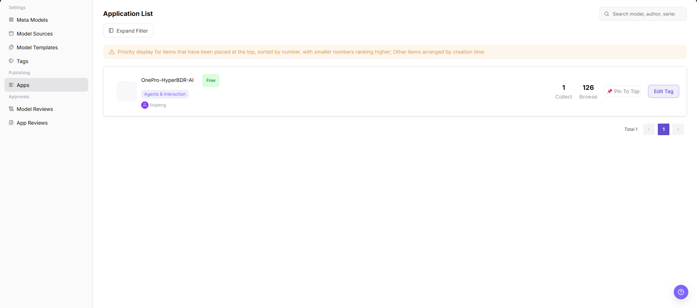

# Apps

::: info Document Information
Version: v1.0
Updated: 2026-08-27
:::

## Feature Overview

Apps helps Operator Admins view apps, model permissions, call scopes, status, and publishing records for application-level model access governance.

| Item | Content |
| --- | --- |
| Applicable Role | Operator Admin |
| Navigation path | Model Services > Publishing > Apps |
| Page route | `/modelone/publish/application` |
| Managed objects | Apps, model permissions, call scopes, status, and publishing records |
| Typical use | Maintain apps that can call model services |

#### Beginner Explanation

Apps packages model capabilities into a customer-facing entry point. Operator Admins check whether app information, visibility scope, called models, and publishing status are consistent.

#### Terms Quick Reference

| Term | Description |
| --- | --- |
| App | A customer-facing usage entry that wraps model capabilities. |
| Bound model | The model actually called by the app backend. |
| Publishing status | Lifecycle status such as draft, under review, published, or delisted. |
| Call entry | Customer access entry for the app or API. Use placeholders in documentation. |

## Prerequisites

1. The current account has app publishing management permission.
2. The app bound model, call entry, customer visibility scope, and publishing notes are prepared.
3. Customer authorization and model status have been confirmed before publishing.

## Page Description

This page manages app publishing records, including app name, bound model, visibility scope, publishing status, call entry, and review information. Operator Admins should confirm that app display information, model permissions, and customer visibility scope match.

Page screenshot:

The image shows the Apps publication management page, displaying published app cards, category tags, maintainers, billing status, and usage metrics, along with search, filters, pin, and tag editing actions.

## Main Operations

### View and Search Applications

1. Go to `Model Services > Publishing > Apps`.
2. Enter an app, author, series, or source keyword in the upper-right search box to find target applications.
3. Click **"Expand Filter"** to filter by categories or status if more criteria are needed.
4. Verify the application name, category tag, author, billing status, and usage statistics in the resulting cards.

### View Application Details

1. Click the application name on the target card to view details.
2. Review the application description, version, associated models, visibility scope, publishing status, and update time.
3. Verify that the configuration complies with operational standards against the list record.
4. Return to the list after read-only inspection.

### Pin Applications and Edit Tags

1. On the right side of the target app card, click **"Pin To Top"** if prioritized display is required; pinned items appear at the top ordered by sequence number.
2. Click **"Edit Tag"** to adjust the application's category or business tags in the dialog.
3. Save changes and refresh the page to verify updated positions and tags in the list and client portal.

## Parameter Reference

| Field Name | Required | Field Type | Example | Description |
| --- | --- | --- | --- | --- |
| App Name | System-displayed | Text | `Example App` | App name displayed in the app list. |
| Tag | System-displayed | Tag | `Agents & Interaction` | App category or display tag. |
| Author | System-displayed | Text | `Example Maintainer` | App creator or maintainer. |
| Pricing Status | System-displayed | Tag | `Free` | Current pricing or billing status of the app. |
| Collect Count | System-displayed | Number | `1` | Number of times the app has been collected. |
| Browse Count | System-displayed | Number | `126` | Number of times the app has been viewed. |
| Actions | Displayed by permission | Button | `Pin To Top` / `Edit Tag` | App list operation entries shown for the current account. |

## Pitfalls

- Before publishing, confirm that the bound model is listed and its authorization scope covers target customers.
- Before delisting an app, evaluate customer-side call impact.
- Redact customer names, internal app IDs, and call entries in screenshots.

## Result Validation

| Check Item | Success Signal | If Abnormal |
| --- | --- | --- |
| Page entry | The page title shows `Application List`, with a search box and **"Expand Filter"**. | Check the `Model Services > Publishing > Apps` path and the current account permission. |
| List result | The page shows app cards or an empty-state message. | Clear the search and filters, then reload the page. |
| Search result | Every remaining card matches the entered keyword. | Check the keyword, clear other filters, and search again. |
| Filter result | After **"Expand Filter"**, the page shows filter controls and updates the card list after selection. | Clear the active filter and check the page message. |
| Card actions | The target card shows the actions allowed for the current account. | Confirm the target card and ask the Operator Admin to check permission when an expected action is absent. |

## FAQ

#### Customer Cannot See the App After Publishing

**Symptom:**

The app status is published, but the customer-side list does not display it.

**Possible Causes:**

- The visibility scope does not include this customer.
- The bound model is not authorized or has been delisted.
- The current customer account is outside the configured visibility scope.

**Handling:**

1. Verify app visibility scope.
2. Check bound model status and authorization.
3. Open the customer-side list with the intended account and clear its filters.
4. If the app is still absent, ask the Operator Admin to compare the visible publishing status and customer scope.

#### App Call Fails

**Symptom:**

The customer can see the app, but calls return errors.

**Possible Causes:**

- The bound model is unavailable.
- Call entry or parameter mapping is incorrect.
- Customer quota or rate limits are triggered.

**Handling:**

1. Check model status and call logs.
2. Verify app parameter mapping.
3. Open `Customer Calls > Call Logs` and record the visible error code or request ID.
4. Contact the Model Provider when the bound model or upstream response is the remaining cause.

#### App Publishing Record Status Does Not Change for a Long Time

**Symptom:**

The publishing status in the app list stays in processing or pending publishing for a long time.

**Possible Causes:**

The review workflow is not complete, model permission configuration is missing, or the publishing task synchronization is delayed.

**Handling:**

Open App Reviews and check the visible review status and comment. Then compare the app's model permission and publishing status. If no page explains the state, provide a redacted app identifier and time range to the platform admin.

#### Search or Filters Return No Apps

**Symptom:**

The page opens, but no app card remains after a search or filter change.

**Possible Causes:**

- The keyword does not match the app name, author, model, or source.
- Multiple filters exclude the target card.
- The current account cannot view the target app.

**Handling:**

1. Clear the keyword and all expanded filters.
2. Search with one known value only.
3. Confirm that the page shows either a matching card or its empty-state message.
4. Ask the Operator Admin to check visibility when another authorized account can see the app.

#### A Card Action Is Missing or the Change Is Not Visible

**Symptom:**

The target card does not show **"Pin To Top"** or **"Edit Tag"**, or the card still shows the previous order or tag after a submitted change.

**Possible Causes:**

- The current account does not have the action permission.
- A search or filter hides the changed card.
- The page shows a visible error after submission.

**Handling:**

1. Confirm that you are on the intended card.
2. Record any message shown after the action.
3. Clear filters and reopen the card list.
4. If the action is still missing or the visible value is unchanged, ask the Operator Admin to check permission and the submitted change.

## Notes

- Confirm customer call impact before delisting an app.
- Redact customer names, app IDs, and call entries in screenshots.
- Real call addresses and credentials should only be displayed in secure platform areas.

## Next Steps

1. View app call logs.
2. Analyze customer call trends.
3. Adjust model or visibility scope based on customer feedback.
