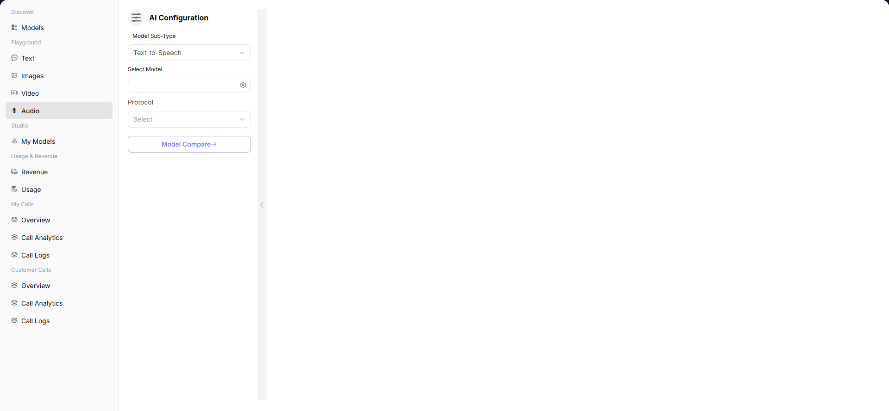

# Audio

## Preface

| Item            | Content                                                                             |
| --------------- | ----------------------------------------------------------------------------------- |
| Target Audience | User                                                                                |
| Navigation Path | Playground > Audio                                                                  |
| Overview        | Synthesize speech from text to experience the model's audio generation capabilities |

## Page Structure

### Search Area

No search area.

### Action Buttons

* The left provides model selection, parameter configuration, and other operations
* The right provides audio playback controls

### Data List

The page displays the generated audio results and playback control area.

### Page Screenshot

## Operations

### Generating Audio with Model

1. Enter the platform homepage, click **"Model Services > Playground > Audio"** menu to enter the audio generation page.
2. Select **Model Subtype** (e.g., Speech Synthesis).
3. Select the target voice model from the model list.
4. Configure pre-configuration parameters (select voice role, set language type, adjust speech rate and pitch).
5. Select **Communication Protocol**.
6. Enter the text to be synthesized in the input area.
7. Click the **"Send"** button.
8. Play the generated result in the audio playback area.

#### Parameters

| Term | Type | Example | Description |
|------|------|---------|-------------|
| Model Subtype | Dropdown | `Speech Synthesis` | The audio generation mode |
| Voice Model | List Selection | `Voice-1 / Voice-2` | The voice model used for audio synthesis |
| Voice Role | Dropdown | `Female / Male` | The voice character type |
| Language | Dropdown | `English / Chinese` | The language type for synthesis |
| Speech Rate | Number Slider | `1.0` | The speed of speech playback |
| Pitch | Number Slider | `1.0` | The pitch adjustment for the voice |
| Communication Protocol | Dropdown | `openai/audio` | The API protocol for model calling |

### Model Comparison

1. Click the **"Multiple Model Comparison"** button.
2. Select two voice models to compare.
3. Configure parameters for each model separately (can select different voice colors).
4. Enter the same text to be synthesized.
5. Click the **"Send"** button.
6. Play the generated audio from both models in sequence in the output area for comparison.
7. To exit the comparison mode, click the **"Cancel Comparison"** button.

## Other Operations

| Operation | Steps |
|-----------|-------|
| Download Audio | Click the **"Download"** button in the generated result to save the audio locally |
| Playback Control | Supports pause, resume, volume adjustment, and other operations |
| Copy Text | Copy the current text to be synthesized |
| Switch Voice | Before generation, you can reselect different voice persons |

## Notes

* The download audio function allows saving the generated audio locally.
* Playback controls support pause, resume, volume adjustment, and other operations.
* You can copy the current text to be synthesized for repeated use.
* Before generation, you can reselect different voice persons to get different voice effects.