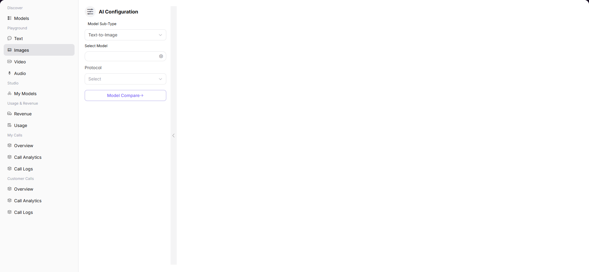

# Images

## Preface

| Item | Content |
|------|---------|
| Target Audience | User |
| Navigation Path | Playground > Images |
| Overview | Generate AI images through text descriptions or reference images to experience the model's image generation capabilities |

## Page Structure

### Search Area

No search area.

### Action Buttons

* The left "AI Configuration" panel provides model selection, parameter configuration, and other operations
* The bottom input box provides a send button

### Data List

The page center displays the generated image results.

### Page Screenshot

## Operations

### Generating Images with Model

1. Enter the platform homepage, click the **"Playground > Images"** menu in the left navigation bar to enter the image generation experience page.
2. Set generation parameters in the left "AI Configuration" panel:
   - Select **Model Subtype** (e.g., Image-to-Image / Text-to-Image);
   - Click "Select Model" and select the model and supplier in the popup (e.g., qwen-image-2.0);
   - Select **Protocol** (e.g., openai/images);
   - Fill in the required **Prompt** (image generation prompt);
   - Fill in **Image** (reference image, used for image-to-image scenarios);
   - Set the number of generated images **N**;
   - Set output image size **Size**;
   - Configure **Response Format** (response format, e.g., url);
   - Fill in **User** (user identifier, optional).
3. Click the send button on the right side of the bottom input box to generate the image.

#### Parameters

| Term | Type | Example | Description |
|------|------|---------|-------------|
| Model Subtype | Dropdown | `Image-to-Image / Text-to-Image` | The image generation mode |
| Select Model | Popup Selection | `Alibaba-China qwen-image-2.0` | The model used for image generation. You can switch between different supplier instances |
| Protocol | Dropdown | `openai/images` | The API protocol for model calling |
| Prompt | Text Input | `please input` | Required. The prompt for image generation, describing the content you want to generate |
| Image | Text Input | `please input` | Required for image-to-image mode. The reference image information |
| N | Number Slider | `1` | The number of images generated per call |
| Size | Text Input | `1024×1024` | The resolution of the output image |
| Response Format | Text Input | `url` | The return format of the generation result |
| User | Text Input | `please input` | Optional. User identifier for request tracking |

| Term | Type | Example | Description |
|------|------|---------|-------------|
| Model Name / Identifier | Text | `qwen-image-2.0 / qwen/qwen-image-2.0` | The name and unique identifier of the model |
| Release Date | Date | `2026-03-03` | The release date of the model |
| Context Length | Text | `-` | Image models usually do not have context length |
| Input / Output Credit | Number | `0 Credit` | The fee standard for calling this model |
| Supplier | Text | `DuShuangYan` | The model's supplier / service provider |
| Price / Image | Number | `0 Credit` | The fee for generating a single image |
| Weekly Call / Token Volume | Number | `0 / 0 Images` | Usage of this supplier instance |

## Other Operations

| Operation | Steps |
|-----------|-------|
| Switch Model | Click the icon on the right side of "Select Model" → Select different model or supplier in the popup → Click "Confirm" |
| Multiple Model Comparison | Click the "Multiple Model Comparison" button to enter the multi-model parallel image generation experience page |
| Generate Image | After configuring all parameters, click the send button on the right side of the bottom input box to generate the image |

## Notes

* Text-to-Image mode requires detailed Prompt descriptions to get more accurate generation results.
* Image-to-Image mode requires a reference image. The generated image will reference its style and content.
* You can click the "Multiple Model Comparison" button to enter the multi-model parallel image generation experience page.