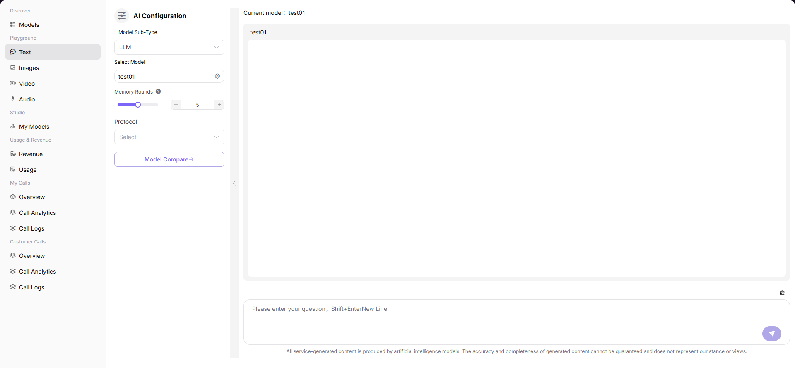

# Text

## Preface

| Item | Content |
|------|---------|
| Target Audience | User |
| Navigation Path | Playground > Text |
| Overview | Interact with AI models through dialogue to experience the model's text generation and conversation capabilities |

## Page Structure

### Search Area

No search area.

### Action Buttons

* The left "AI Configuration" panel provides model selection, parameter configuration, and other operations
* The right conversation input box provides a send button

### Data List

The right conversation window displays historical conversation records and current conversation content.

### Page Screenshot

## Operations

### Generating Text with Model

1. Enter the platform homepage, click the **"Playground > Text"** menu in the left navigation bar to enter the dialogue experience page.
2. Set dialogue parameters in the left "AI Configuration" panel:
   - Select **Model Subtype** (e.g., LLM);
   - Click "Select Model" and select the model and supplier in the popup;
   - Adjust **Memory Turns** (set the number of message history the dialogue context remembers);
   - Select **Protocol** (if needed).
3. Enter a question in the right conversation input box and click send to dialogue with the model. Shift+Enter can be used for line breaks.

#### Parameters

| Term | Type | Example | Description |
|------|------|---------|-------------|
| Model Subtype | Dropdown | `LLM` | The type of the dialogue model, currently a large language model |
| Select Model | Popup Selection | `Creator-test Qwen3-max-2026-01-23 test01` | The model used for dialogue. You can switch between different supplier instances |
| Memory Turns | Number Slider | `3` | The number of historical messages the model remembers in the dialogue, affecting context coherence |
| Protocol | Dropdown | `(Not Selected)` | The API protocol for model calling |

| Term | Type | Example | Description |
|------|------|---------|-------------|
| Model Name / Identifier | Text | `Qwen3-max-2026-01-23 / qwen/qwen3-max-2026-01-23` | The name and unique identifier of the model |
| Release Date | Date | `2026-01-23` | The release date of the model |
| Context Length | Number | `256K` | The maximum context window supported by the model |
| Input / Output Credit | Number | `0 Credit` | The fee standard for calling this model |
| Supplier | Text | `Creator-test / DuShuangYan` | The model's supplier / service provider |
| Weekly Call / Token Volume | Number | `0 / 0 M Tokens` | Usage of this supplier instance |
| Capability Tag | Tag | `Deep Thinking / Tool Calling` | The extended capabilities supported by the model |

## Other Operations

| Operation | Steps |
|-----------|-------|
| Switch Model | Click the icon on the right side of "Select Model" → Select different model or supplier in the popup → Click "Confirm" |
| Adjust Memory Turns | Drag the slider or enter a number directly to set the number of dialogue context memory messages |
| Multiple Model Comparison | Click the "Multiple Model Comparison" button to enter the multi-model parallel dialogue experience page |
| Conversation Input | Enter a question in the bottom input box, press the send button or Enter to send; use Shift+Enter for line breaks |
| View Conversation History | View historical conversation records in the conversation window |

## Notes

* Higher memory turns mean longer dialogue context, but also more Token consumption.
* Use Shift+Enter for line breaks to avoid sending incomplete sentences.
* You can click the "Multiple Model Comparison" button to enter the multi-model parallel dialogue experience page.