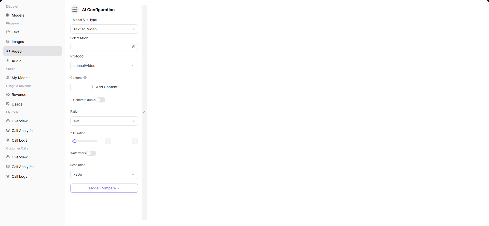

# Video

## Preface

| Item | Content |
|------|---------|
| Target Audience | User |
| Navigation Path | Playground > Video |
| Overview | Generate AI videos through text descriptions to experience the model's video generation capabilities |

## Page Structure

### Search Area

No search area.

### Action Buttons

* The left "AI Configuration" panel provides model selection, parameter configuration, and other operations
* The bottom input box provides a send button

### Data List

The page center displays the generated video results.

### Page Screenshot

## Operations

### Generating Videos with Model

1. Enter the platform homepage, click the **"Playground > Video"** menu in the left navigation bar to enter the video generation experience page.
2. Set generation parameters in the left "AI Configuration" panel:
   - Select **Model Subtype** (e.g., Text-to-Video);
   - Click "Select Model" and select the model and supplier in the popup (e.g., Doubao-Seedance-2.0-fast);
   - Select **Protocol** (e.g., openai/video);
   - Click "Add Content" to configure the content description for video generation;
   - Enable / Disable **Generate audio** (whether to generate video audio);
   - Set video aspect ratio **Ratio** (e.g., 16:9);
   - Set video duration **Duration**;
   - Enable / Disable **Watermark** (whether to add watermark);
   - Set video resolution **Resolution** (e.g., 720p).
3. Enter the prompt for video generation in the bottom input box and click the send button to generate the video.

#### Parameters

| Term | Type | Example | Description |
|------|------|---------|-------------|
| Model Subtype | Dropdown | `Text-to-Video` | The video generation mode |
| Select Model | Popup Selection | `llm-guohe Doubao-Seedance-2.0-fast` | The model used for video generation. You can switch between different supplier instances |
| Protocol | Dropdown | `openai/video` | The API protocol for model calling |
| Content | Configuration Item | `Multiple can be added` | The core content description for video generation. Multiple can be added |
| Generate audio | Toggle | `Enable / Disable` | Whether to automatically add audio to the generated video |
| Ratio | Dropdown | `16:9` | The aspect ratio of the output video |
| Duration | Number Slider | `5` | The duration of the generated video (seconds) |
| Watermark | Toggle | `Enable / Disable` | Whether to add a watermark to the video |
| Resolution | Dropdown | `720p` | The resolution of the output video |

| Term | Type | Example | Description |
|------|------|---------|-------------|
| Model Name / Identifier | Text | `Doubao-Seedance-2.0-fast / bytedance/Doubao-Seedance-2.0-fast` | The name and unique identifier of the model |
| Release Date | Date | `2026-01-28` | The release date of the model |
| Context Length | Number | `256K` | The maximum context window supported by the model |
| Input / Output Credit | Number | `Input Credit / Output 66 Credit` | The fee standard for calling this model |
| Supplier | Text | `AGIOneSystem` | The model's supplier / service provider |
| Output Price | Number | `20 Credit/M` | The billing standard for video generation |
| Weekly Call / Token Volume | Number | `0 / 0 Tokens` | Usage of this supplier instance |

## Other Operations

| Operation | Steps |
|-----------|-------|
| Switch Model | Click the icon on the right side of "Select Model" → Select different model or supplier in the popup → Click "Confirm" |
| Multiple Model Comparison | Click the "Multiple Model Comparison" button to enter the multi-model parallel video generation experience page |
| Generate Video | After configuring all parameters, enter the prompt in the bottom input box and click the send button to generate the video |
| Configure Content | Click the "Add Content" button to add multiple video content descriptions |

## Notes

* Video generation takes a long time. Please be patient.
* Adding multiple Content items can generate richer video content.
* You can click the "Multiple Model Comparison" button to enter the multi-model parallel video generation experience page.