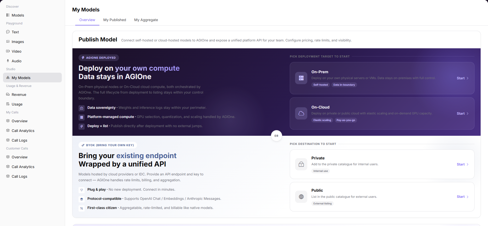

# My Models

## Preface

| Item | Content |
|------|---------|
| Target Audience | User |
| Navigation Path | Studio > My Models |
| Overview | Manage and publish your own models, supporting AGIOne hosted deployment, third-party BYOK access, and multi-model aggregation |

## Page Structure

### Search Area

The page top supports multi-dimensional filtering by public / private models, model name, and model type.

### Action Buttons

* The page top-right provides a **"Publish Model"** button
* The "My Aggregation" tab provides a **"Create Aggregation Model"** button
* Each model provides Details, Edit, Enable / Disable, Delete operations

### Data List

The page is divided into "My Releases" and "My Aggregation" two tabs, displaying single-instance published models and aggregation models respectively.

### Page Screenshot

## Operations

### Publishing a Model (Chat Model)

1. Enter the platform homepage, click the **"My Models"** menu in the left navigation bar to enter the model management page.
2. Click the **"Publish Model"** button at the top right of the page to enter the publishing process.
3. Select publishing mode and region:
   - Select deployment method (On-Prem / On-Cloud private deployment, or BYOK access to existing Endpoint);
   - Select output region (Private or Public);
   - Click "Start" to enter the configuration process.
4. Configure basic model information:
   - Select **Model Type** (Chat / Multimodal / Image / Video / Audio / Embedding / Rerank);
   - Configure model source information (model source, region, request URL, API key, meta-model, model source ID);
   - Configure request header information;
   - Set input / output modalities, advanced capabilities (tool calling / thinking mode), token limits;
   - Select supported protocols and perform connectivity tests;
   - Fill in personalized identifier, model description;
   - Set publishing method (immediate / scheduled);
   - Click "Next".
5. Configure billing rules:
   - Select billing method (free / paid);
   - Select billing mode (input / output billing / unified billing);
   - Set input / output Token quantity, original price / selling price;
   - Configure free quota (enable / disable, set claimable quota, user count, total amount);
   - Fill in activity description;
   - Click "Next".
6. Configure rate limiting rules:
   - Select whether to enable rate limiting;
   - Set default rate limits (RPM requests per minute, TPM tokens per minute);
   - Click "Save Only" or "Submit for Review" to complete publishing.

#### Parameters

| Term | Type | Example | Description |
|------|------|---------|-------------|
| Model | Text | `Alibaba-China:Qwen3.6-plus` | The name and identifier of the model |
| Model Source ID | Text | `qwen/qwen3.6-plus/9b059` | The unique identifier of the model on the corresponding source platform |
| Model Type | Tag | `Multimodal / Chat Model / Video Model` | The functional type of the model |
| Billing Mode | Text | `Input/Output Billing / Unified Billing` | The model's charging method |
| Free Quota | Text | `Quota Mode / None` | The model's free call quota configuration |
| Description | Text | `Qwen3.6 Native Vision...` | The model's description |
| Active Version | Text | `1.0.1` | The currently active model version |
| Pending Version | Text | `--` | The version pending release |
| Status | Tag | `Published / Unpublished` | The model's publishing status |

| Term | Type | Example | Description |
|------|------|---------|-------------|
| Model Type | Single Select | `Chat Model / Multimodal` | Required. The functional type of the model |
| Model Source | Dropdown | `Alibaba-China` | Required. The model's source channel |
| Request URL | URL | `https://dashscope.aliyuncs.com` | Required. The API address of the model service |
| API Key | Text | `sk-e1f985...` | Required. The key for calling the model |
| Meta-model | Text | `Qwen3-235b-a22b-instruct-2507` | Required. The corresponding meta-model name |
| Model Source ID | Text | `qwen3-235b-a22b-instruct-2507` | Required. The unique identifier of the model on the source platform |
| Input / Output Modalities | Multi-select | `Input / Output are both Text` | Required. The input/output data types supported by the model |
| Advanced Capabilities | Toggle | `Function/Tool Support / Thinking Mode` | Optional. The model's extended capabilities |
| Token Limits | Number | `Max Context 128K` | Required. Set Token length limit |
| Supported Protocols | Multi-select | `OpenAI-ChatCompletions` | Required. The API protocols compatible with the model |
| Billing Method | Single Select | `Free / Paid` | Required. The model's charging method |
| Billing Mode | Single Select | `Input/Output Billing / Unified Billing` | Required. The pricing method when charging |
| Input / Output Original / Selling Price | Number | `Input Original 4.00 / Selling 2.00` | Required. The reference price and actual selling price of Tokens |
| Free Quota | Toggle | `Enabled / Not Enabled` | Optional. Configure the model's free call quota |
| Rate Limiting | Toggle | `Enabled / Not Enabled` | Optional. Configure the model's call frequency limit |
| RPM/TPM | Number | `RPM2/TPM100` | Requests per minute / Token limit per minute |

### Adding an Aggregation Model

1. Enter the platform homepage, click the **"My Models"** menu in the left navigation bar and switch to the **"My Aggregation"** tab.
2. Click the **"Create Aggregation Model"** button at the top right of the page to enter the publishing process.
3. Select publishing region:
   - Select Private or Public in the popup;
   - Click "Publish to Private / Publish to Public" to enter the configuration process.
4. Configure basic aggregation model information:
   - Select **Model Type** (Chat / Multimodal / Image / Video / Audio / Embedding / Rerank);
   - Configure multiple member models under the aggregation model: click "Add Model" and select published models from the list (e.g., multiple supplier instances of GLM 4.7);
   - Set parameters for each member model: enable status, minimum success rate, maximum concurrency, maximum context length, cost (input / output Token limit);
   - Set matching strategy (success rate priority / cost priority / cost & experience balance / random / round-robin);
   - Fill in personalized identifier, tags, model description;
   - Set publishing method (immediate / scheduled);
   - Click "Next".
5. Configure billing rules:
   - Select billing method (free / paid);
   - Select billing mode (unified billing / input / output billing);
   - Set Tokens quantity, original price (strikethrough price), selling price;
   - Click "Next".
6. After confirming all configuration information is correct, click "Save Only" or "Submit for Review" to complete publishing.

#### Parameters

| Term | Type | Example | Description |
|------|------|---------|-------------|
| Model | Text | `AGIOneSystem:Kolors:agg` | The name and identifier of the aggregation model |
| Model Source ID | Text | `kolors/kolors/645cb` | The unique identifier of the aggregation model |
| Model Type | Tag | `Image Model / Chat Model` | The functional type of the aggregation model |
| Billing Mode | Text | `Unified Billing / Free / Input/Output Billing` | The aggregation model's charging method |
| Free Quota | Text | `None` | The aggregation model's free call quota configuration |
| Description | Text | `Aggregation model status 21` | The aggregation model's description |
| Active Version | Text | `1.0.0 / 4.0.0` | The currently active model version |
| Pending Version | Text | `-- / 5.0.0` | The version pending release |
| Status | Tag | `Published / Pending Review` | The aggregation model's publishing status |

| Term | Type | Example | Description |
|------|------|---------|-------------|
| Model Type | Single Select | `Chat Model / Image Model` | Required. The functional type of the aggregation model |
| Member Models | List Selection | `Multiple supplier instances of GLM 4.7` | Required. Select 2 or more published models |
| Member Model Parameters | Number / Toggle | `Min Success Rate 80%, Max Context Length 200K` | Required. Availability and cost control parameters for each member model |
| Matching Strategy | Single Select | `Success Rate Priority / Cost Priority` | Required. The routing strategy for model calls |
| Billing Method | Single Select | `Free / Paid` | Required. The aggregation model's charging method |
| Billing Mode | Single Select | `Unified Billing / Input/Output Billing` | Required. The pricing method when charging |
| Original / Selling Price | Number | `Original 10.00 / Selling 5.00` | Required. The reference price and actual selling price of Tokens |

## Other Operations

| Operation | Steps |
|-----------|-------|
| View Details | Click the target model's **"Details"** button → View complete configuration information → Click the back arrow at the top left to exit |
| Edit Model | Click the target model's **"Edit"** button → Modify configuration information → Submit for review |
| Enable / Disable Model | Click the target model's **"Enable"** / **"Disable"** button → Confirm status change |
| Delete Model | Click the target model's **"Delete"** button → This action is irreversible. Please operate with caution. |

## Notes

* **Deletion operations are irreversible.** Please operate with caution.
* Aggregation models need to select at least 2 published models as member models.
* Before publishing a model, ensure that the configuration information is accurate to avoid affecting service quality.