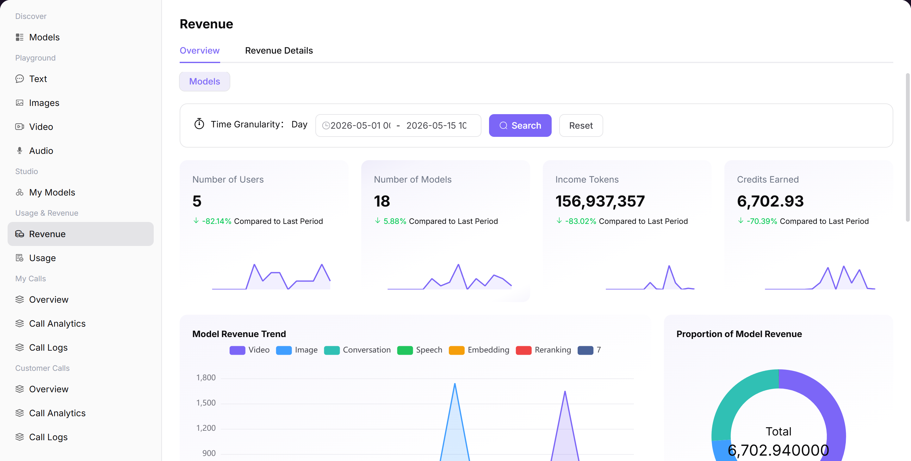

# Revenue

## Preface

| Item | Content |
|------|---------|
| Target Audience | User |
| Navigation Path | Usage & Revenue > Revenue |
| Overview | View revenue overview and settlement details to understand the income generated from model calls |

## Page Structure

### Search Area

The page top supports filtering by billing period (YYYY-MM format), time range, and dimension (model / user).

### Action Buttons

No specific operation buttons.

### Data List

The page is divided into "My Revenue Overview" and "My Revenue Details" two tabs.

### Page Screenshot

## Operations

### Viewing Revenue Overview

1. Enter the platform homepage, click **"Model Services > Usage & Revenue > Revenue"** menu. The "My Revenue Overview" tab is displayed by default.
2. Switch **Dimension** (e.g., "Model").
3. Select **Time Range**.
4. View core metrics (user count / model count / revenue Tokens / revenue points).
5. View charts (model revenue trends / revenue proportion / user activity / call frequency).

#### Parameters

| Term | Type | Example | Description |
|------|------|---------|-------------|
| Dimension | Dropdown | `Model / User` | The statistical dimension for revenue analysis |
| Time Range | Date Range | `2026-05-01 to 2026-05-14` | The time period for revenue statistics |
| User Count | Number | `125` | Number of users who generated revenue during the period |
| Model Count | Number | `18` | Number of models that generated revenue during the period |
| Revenue Tokens | Number | `1,234,567` | Total tokens that generated revenue during the period |
| Revenue Points | Number | `5,537.14` | Total revenue points earned during the period |

### Viewing Revenue Details

1. Click the **"My Revenue Details"** tab.
2. Select **Billing Period** (YYYY-MM format).
3. Switch **Dimension** (Model).
4. Filter: **Usage Time**, **User Name**, **Model Type**.
5. View settlement data metrics (settled / already settled / pending settlement points).
6. View the list details.

#### Parameters

| Term | Type | Example | Description |
|------|------|---------|-------------|
| Billing Period | Date | `2026-05` | The billing period for settlement |
| Usage Time | Timestamp | `2026-05-14 19:XX:XX` | The time when the call occurred |
| User Name | Text | `User-123` | The name of the user who made the call |
| Model Type | Tag | `Chat Model / Video Model` | The functional type of the model |
| Settled Points | Number | `5,526.66` | Points that have been settled |
| Already Settled Points | Number | `5,526.66` | Points already confirmed for settlement |
| Pending Settlement Points | Number | `10.48` | Points waiting for settlement |

## Notes

* Revenue data may be delayed. Please refer to the actual settlement data as the standard.
* If you have questions about revenue data, please contact platform customer service.