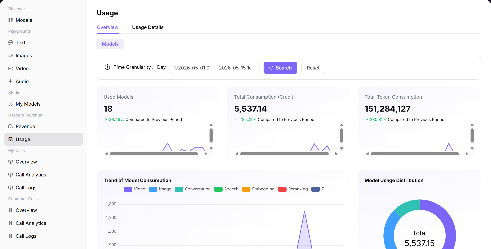

# Usage

## Preface

| Item | Content |
|------|---------|
| Target Audience | User |
| Navigation Path | Usage & Revenue > Usage |
| Overview | View usage overview and details to understand Token consumption and costs from model calls |

## Page Structure

### Search Area

The page top supports selecting data granularity (day) and time range.

### Action Buttons

No specific operation buttons.

### Data List

The page is divided into "Usage Details Overview" and "Usage Details Details" two tabs.

### Page Screenshot

## Operations

### Viewing Usage Details Overview

1. Enter the platform homepage, click the **"Usage & Revenue > Usage"** menu in the left navigation bar to enter the usage management page.
2. The page is divided into **"Usage Details Overview"** and **"Usage Details Details"** two tabs, which can view usage trends and settlement details separately.
3. Set query conditions at the top of the page: select data granularity (day) and time range, click **"Search"** to view data for the specified period.
4. View core metric cards: number of models used, total consumption (Credit), total Token consumption, and view period-over-period changes for each metric.
5. View multi-dimensional trend charts:
   - Model consumption trends: line chart showing consumption changes by model type (video / chat / image, etc.);
   - Model usage distribution: donut chart showing consumption proportion of different model types;
   - Model call frequency trends: line chart showing call volume changes for different models;
   - Model call frequency distribution: pie chart showing model call proportion.

#### Parameters

| Term | Type | Example | Description |
|------|------|---------|-------------|
| Number of Models Used | Number | `18` | Total number of models called during the statistics period |
| Total Consumption (Credit) | Number | `5,537.14` | Total consumed Credit during the statistics period |
| Total Token Consumption | Number | `151,284,127` | Total consumed Tokens during the statistics period |

### Viewing Usage Details

1. Click the **"Usage Details Details"** tab to switch to the settlement details view.
2. Select the billing period (e.g., 2026-05) at the top of the page to view the settlement data for the corresponding month.
3. View settlement data cards: Credit to be settled, Credit already settled, Credit pending settlement.
4. In the detailed list below, you can search and filter by model name and model type to view details of single call records:
   - Usage time, time consumed (MS);
   - Associated model, model type;
   - Usage (input / output Tokens);
   - Deduction status, actual usage;
   - Billing rules, Credit consumed this time.

#### Parameters

| Term | Type | Example | Description |
|------|------|---------|-------------|
| Credit to be Settled | Number | `5,537.14` | Total consumption to be settled for this billing period |
| Credit Already Settled | Number | `5,526.66` | Consumption already settled for this billing period |
| Credit Pending Settlement | Number | `10.48` | Consumption not yet settled for this billing period |
| Usage Time | Timestamp | `2026-05-14 19:XX:XX` | The time when the call occurred |
| Time Consumed (MS) | Number | `1417` | Time consumed for this call |
| Associated Model | Text | `Creator-test:Qwe...` | The model called this time |
| Usage | Text | `Input:22 Tokens` | Token consumed for this call |
| Credit Consumed This Time | Number | `0 / 0.34` | Credit consumed for this call |

## Notes

* Usage data may be delayed. Please refer to the actual settlement data as the standard.
* You can read the settlement description at the top of the page to understand the settlement logic for small amounts.