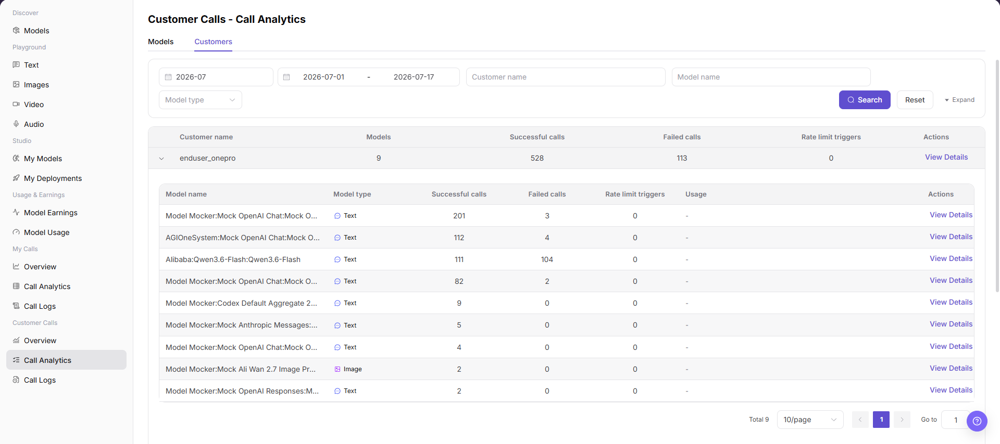
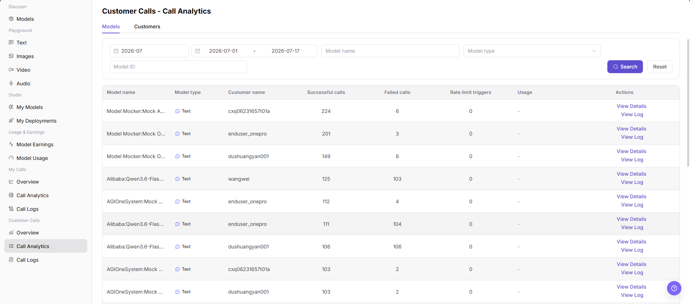
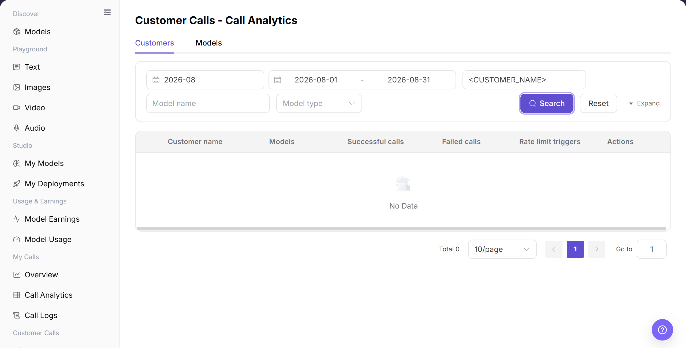
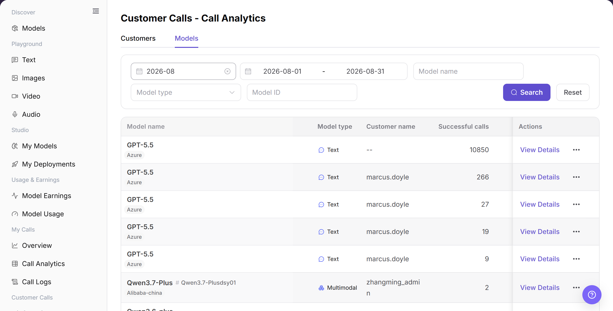

# Call Analytics

## Feature Overview

| Item | Content |
| --- | --- |
| Applicable Roles | Model Providers |
| Navigation Path | Model Services > Customer Calls > Call Analytics |
| Page Route | `/modelone/monitoring/monitor/list/user` |
| Managed Objects | Customer list, model list, successful calls, failed calls, and rate-limit triggers |

#### Beginner Explanation

Customer Call Analytics works like operational details split by customer and model. Customers shows how many models each customer uses, while Models shows call performance by model.

#### Terminology

| Term | Description |
| --- | --- |
| Customers | Aggregates model count and call indicators by customer. |
| Models | Shows customer call analytics by model. |
| Models Used | The number of models called by a customer in the selected scope. |
| View Details | Opens additional analytics for a target customer or model. |

#### Recommended Operation Order

Locate the customer and review models used in Customers, switch to Models to compare model performance, and then open details for an abnormal object.

#### Beginner Checklist

| Scenario | Do First | Do Not Do Directly |
| --- | --- | --- |
| A customer reports an issue | Locate the customer in Customers first | Review every model immediately |
| Model performance is abnormal | Compare indicators in Models | Review customer totals only |
| A query returns no result | Reset filters and expand the period | Add more filters |
| Preparing to share analytics | Redact customer names and business identifiers | Share raw lists externally |

## Prerequisites

1. The current account has access to the `Call Analytics` page.
2. The month, date range, model, customer, or model type to view has been clarified.
3. Sensitive fields such as customer names, model names, call volume, and usage are displayed according to permissions.

## Page Description

The page uses Customers and Models to show success, failure, rate limits, and usage. Query criteria and details entries depend on the active tab.

Page screenshots:

Use Customers to review models used and call indicators by customer.

Use Models to compare customer call performance by model.

## Main Operations

### View Customer Call List

1. Go to `Model Services > Customer Calls > Call Analytics`.
2. Click **"Customers"** and enter a customer name or model name.
3. Click **"Search"** and verify models used, successful calls, failed calls, and rate-limit triggers.
4. Click **"View Details"** for the target customer. Click **"Reset"** if the criteria are incorrect.

The image shows customer-list results. Verify customer criteria and call indicators.

### View Model Call List

1. Click **"Models"**.
2. Enter a model name and select a model type if needed.
3. Click **"Search"** and verify customer call analytics for the target model.
4. Before opening details, confirm the active tab, time range, and model criteria.

The image shows model-list results. Verify model criteria and customer call performance.

## Parameter Reference

| Field Name | Required | Field Type | Example | Description |
| --- | --- | --- | --- | --- |
| Month | Yes | Month selector | `2026-07` | Controls the statistical month for call analytics. |
| Date Range | Yes | Date range | `2026-07-01 to 2026-07-17` | Controls the query time range for list data. |
| Analytics Tab | Yes | Tab | `Models` / `Customers` | Switches between the model list and customer list. |
| Model Name | No | Input | Enter on page | Filters the model list or customer list by model name. |
| Model Type | No | Selector | `Text` / `Image` | Filters statistics by model capability type. |
| Model ID | No | Input | Enter on page | Filters by model ID on the Models tab. |
| Customer Name | No | Input / text | Enter on page | Filters statistics by customer name on the Customers tab. |
| Models | System-generated | Number | Displayed on page | Shows the number of models used by a customer on the Customers tab. |
| Successful Calls | System-generated | Number | Displayed on page | Number of successful calls within the selected range. |
| Failed Calls | System-generated | Number | Displayed on page | Number of failed calls within the selected range. |
| Rate Limit Triggers | System-generated | Number | Displayed on page | Number of rate-limit triggers within the selected range. |
| Usage | System-generated | Text / tag | Displayed on page | Shows token, quota, or other call usage information. |
| Actions | No | Action entry | `View Details` / `View Log` | Opens analytics details or jumps to call logs. |

## Pitfalls

- Call analytics is for trends and distributions. It does not replace per-request error details in call logs.
- When switching customer, model, or time granularity, chart scope changes. Keep filters visible in screenshots.
- Peaks, failure rate, and average latency should be checked together with model version and Endpoint status.

## Result Validation

| Check Item | Success Signal | If Abnormal |
| --- | --- | --- |
| Page is accessible | The `Customer Calls - Call Analytics` page opens normally, and `Customer Calls > Call Analytics` is highlighted in the sidebar. | Check account permissions, navigation path, and page loading status. |
| Model list displays normally | The `Models` tab shows model name, model type, customer name, successful calls, failed calls, rate limit triggers, and action entries. | Adjust the month, date range, or model filters and retry. |
| Customer list displays normally | The `Customers` tab shows customer name, models, successful calls, failed calls, rate limit triggers, and action entries. | Adjust the date range, customer name, or model name and retry. |
| Filters are available | After switching month, date range, model, customer, or model type, list data changes accordingly. | Check whether filters are too narrow, and click `Reset` if needed. |
| Search / Reset works | `Search` displays matching data, and `Reset` clears filters. | Check network status, page API responses, and account permissions. |
| List data is consistent | Successful calls, failed calls, rate limit triggers, and usage in the list are consistent with details or logs. | Open `View Details` or `View Log` for cross-checking. |

## FAQ

#### Customer List Is Empty

**Symptom:**

Call Analytics shows the condition described by “Customer List Is Empty.”

**Possible Causes:**

- Time range or filters do not match.
- Page data is still synchronizing.

**Resolution:**

1. Reset filters and align the time range.
2. Cross-check details or logs.

#### Model List Is Empty

**Symptom:**

Call Analytics shows the condition described by “Model List Is Empty.”

**Possible Causes:**

- customer call data or status changed.
- Page data is still synchronizing.

**Resolution:**

1. Reset filters and align the time range.
2. Cross-check details or logs.

#### The Lists Differ

**Symptom:**

Call Analytics shows the condition described by “The Lists Differ.”

**Possible Causes:**

- customer call data or status changed.
- Page data is still synchronizing.

**Resolution:**

1. Reset filters and align the time range.
2. Cross-check details or logs.

#### Query Results Do Not Match

**Symptom:**

Call Analytics shows the condition described by “Query Results Do Not Match.”

**Possible Causes:**

- customer call data or status changed.
- Page data is still synchronizing.

**Resolution:**

1. Reset filters and align the time range.
2. Cross-check details or logs.

#### Details Do Not Open

**Symptom:**

Call Analytics shows the condition described by “Details Do Not Open.”

**Possible Causes:**

- customer call data or status changed.
- Permission is missing or the record expired.

**Resolution:**

1. Reset filters and align the time range.
2. Verify permission and record status, and then retry.

## Notes

- Customer names, model names, call volume, costs, Keys, request content, and business identifiers are sensitive operational information.
- Before external communication or screenshots, redact customer names, Keys, request content, cost details, and internal test parameters.
- Call analytics is aggregated data. Use call logs when troubleshooting a single request.

## Next Steps

1. Click `View Details` to view statistics for the target model or customer.
2. Click `View Log` or go to `Customer Calls > Call Logs` to locate a single request.
3. Return to `Customer Calls > Overview` to view trends, consumption statistics, and TOP rankings.
