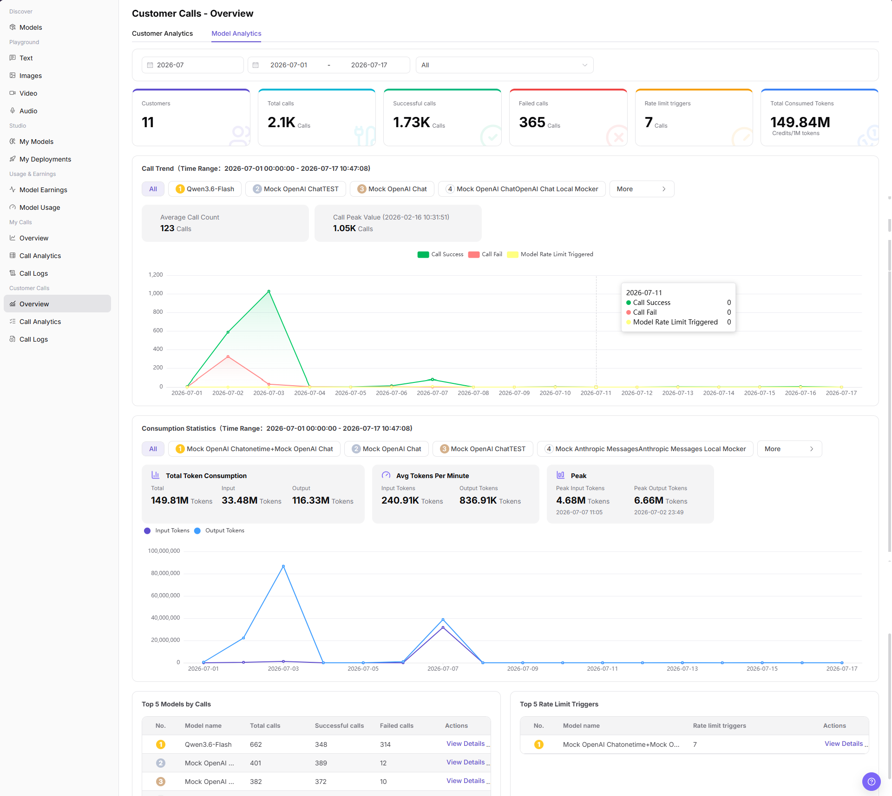
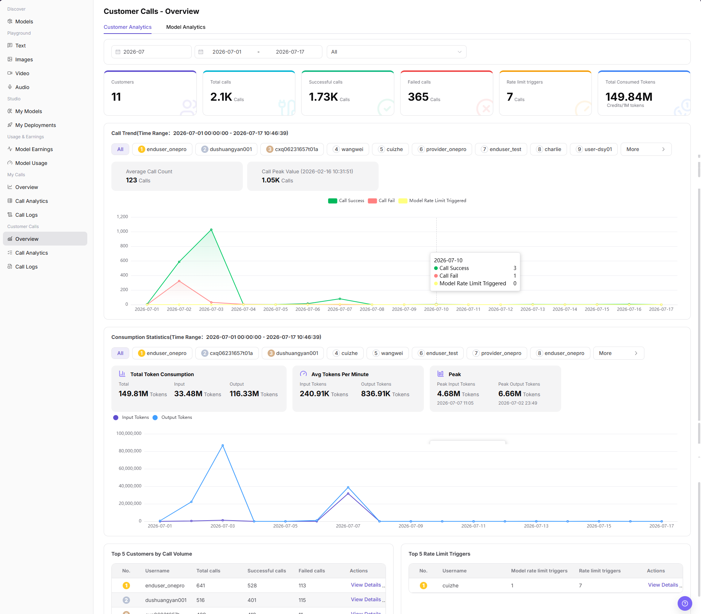
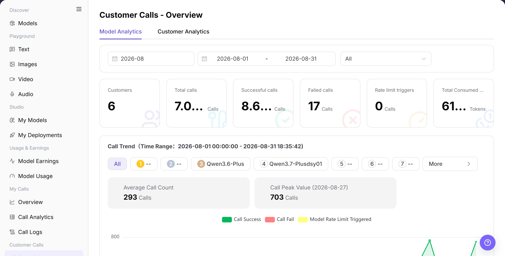
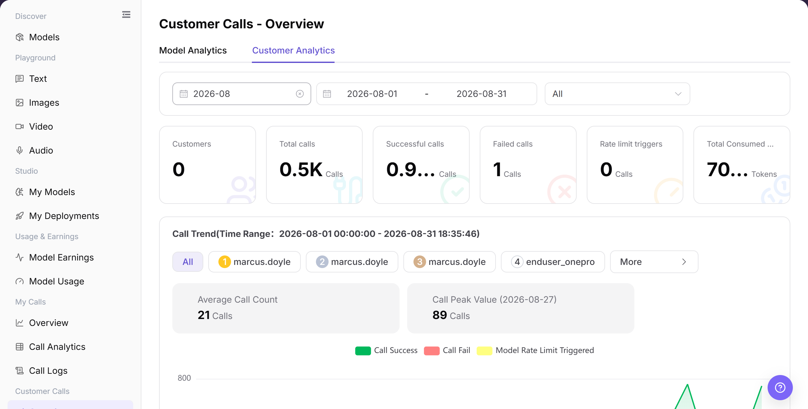

# Overview

## Feature Overview

| Item | Content |
| --- | --- |
| Applicable Roles | Model Providers |
| Navigation Path | Model Services > Customer Calls > Overview |
| Page Route | `/modelone/monitoring/monitor/overview/model` |
| Managed Objects | Model- and customer-dimension call indicators, trends, rankings, and details entry |

#### Beginner Explanation

Customer Calls Overview works like an operations dashboard for Model Providers. Model Analytics answers which models are called, while Customer Analytics answers which customers are calling them. Use both views to assess impact.

#### Terminology

| Term | Description |
| --- | --- |
| Model Analytics | Aggregates customer calls, success, failure, and rate limits by model. |
| Customer Analytics | Aggregates called models and call indicators by customer. |
| Total Calls | Total customer calls in the selected scope. |
| Top Ranking | Models or customers ranked by call volume or another indicator. |

#### Recommended Operation Order

Review overall trends and abnormal models in Model Analytics, switch to Customer Analytics to identify affected customers, and then continue through details or logs.

#### Beginner Checklist

| Scenario | Do First | Do Not Do Directly |
| --- | --- | --- |
| Unsure which view to open | Start with Model Analytics | Conclude from one view only |
| Model failures increase | Use Customer Analytics to confirm impact | Change every model immediately |
| Customer data is empty | Expand the period and verify customer criteria | Conclude that the customer made no calls |
| Preparing to share the dashboard | Redact customer and business identifiers | Share raw data externally |

## Prerequisites

1. The current account has access to the `Overview` page.
2. The statistical month, date range, and dimension to view have been clarified.
3. Customer names, model names, call volume, and cost-related fields are displayed according to permissions.

## Page Description

The page contains Model Analytics and Customer Analytics, with aggregate indicators, trends, consumption statistics, rankings, and details entries.

Page screenshots:

Use Model Analytics to review totals, success, failure, rate limits, and rankings.

Use Customer Analytics to review customer call trends and rankings.

## Main Operations

### View Model Call Overview

1. Go to `Model Services > Customer Calls > Overview`.
2. Click **"Model Analytics"** and select a time range and model criteria.
3. Verify total, successful, failed, and rate-limited calls, trends, and model rankings.
4. Open details for an abnormal model to continue investigation.

The image shows Model Analytics. Verify the time range, aggregate indicators, trends, and model list.

### View Customer Call Overview

1. Click **"Customer Analytics"**.
2. Select a time range and customer criteria.
3. Verify customer count, call trends, consumption statistics, and customer rankings.
4. Open details for an abnormal customer to continue investigation.

The image shows Customer Analytics. Verify customer scope, trends, and rankings.

## Parameter Reference

| Field Name | Required | Field Type | Example | Description |
| --- | --- | --- | --- | --- |
| Statistical Month | Yes | Month selector | `2026-07` | Controls the month of overview data. |
| Date Range | Yes | Date range | `2026-07-01 to 2026-07-17` | Controls the time range for trends, consumption statistics, and TOP rankings. |
| Analytics Tab | Yes | Tab | `Customer Analytics` / `Model Analytics` | Switches between customer aggregation and model aggregation. |
| Customer | No | Selector | `All` or target customer | Filters statistics by customer on Customer Analytics. |
| Model | No | Selector | `All` or target model | Filters statistics by model on Model Analytics. |
| Customers | System-generated | Number | Displayed on page | Number of customers that generated calls in the selected range. |
| Total Calls | System-generated | Number | Displayed on page | Total number of calls in the selected range. |
| Successful Calls | System-generated | Number | Displayed on page | Number of successful calls in the selected range. |
| Failed Calls | System-generated | Number | Displayed on page | Number of failed calls in the selected range. |
| Rate Limit Triggers | System-generated | Number | Displayed on page | Number of calls that hit model rate limits in the selected range. |
| Token Usage | System-generated | Number | Displayed on page | Shows total consumed tokens, input tokens, output tokens, average tokens per minute, and peaks. |
| Actions | No | Action entry | `View Details` | Opens customer-level or model-level details. |

## Pitfalls

- Customer Calls Overview is for customer-level trends, not for locating a single failed request. Use call logs for single-request troubleshooting.
- Align time range, customer scope, model version, and aggregation granularity before comparing customer calls.
- Revenue, call count, and failure-rate data may have synchronization delay. Do not use overview numbers alone as final settlement evidence.

## Result Validation

| Check Item | Success Signal | If Abnormal |
| --- | --- | --- |
| Page is accessible | The `Customer Calls - Overview` page opens normally, and `Customer Calls > Overview` is highlighted in the sidebar. | Check account permissions, navigation path, and page loading status. |
| Customer analytics data displays normally | The `Customer Analytics` tab shows customers, call trend, consumption statistics, and Top 5 Customers by Call Volume. | Adjust the date range or customer filter and retry. |
| Model analytics data displays normally | The `Model Analytics` tab shows model-level trends, consumption statistics, and Top 5 Models by Calls. | Adjust the date range or model filter and retry. |
| Filters are available | After switching month, date range, customer, or model, charts and TOP tables change accordingly. | Check whether filters are too narrow, and switch back to `All` if needed. |
| Detail entry is available | Clicking `View Details` opens the corresponding customer or model details. | Confirm data permissions and whether the statistical object still exists. |
| Statistics are consistent | Call trends, consumption statistics, and TOP tables match the selected filters. | Refresh the page or expand the time range for cross-checking. |

## FAQ

#### Customer Call Data Is Empty

**Symptom:**

Overview shows the condition described by “Customer Call Data Is Empty.”

**Possible Causes:**

- Time range or filters do not match.
- Page data is still synchronizing.

**Resolution:**

1. Reset filters and align the time range.
2. Cross-check details or logs.

#### Model and Customer Views Differ

**Symptom:**

Overview shows the condition described by “Model and Customer Views Differ.”

**Possible Causes:**

- customer call data or status changed.
- Page data is still synchronizing.

**Resolution:**

1. Reset filters and align the time range.
2. Cross-check details or logs.

#### Failures Increase

**Symptom:**

Overview shows the condition described by “Failures Increase.”

**Possible Causes:**

- customer call data or status changed.
- Page data is still synchronizing.

**Resolution:**

1. Reset filters and align the time range.
2. Cross-check details or logs.

#### Rate Limits Increase

**Symptom:**

Overview shows the condition described by “Rate Limits Increase.”

**Possible Causes:**

- customer call data or status changed.
- Page data is still synchronizing.

**Resolution:**

1. Reset filters and align the time range.
2. Cross-check details or logs.

#### Details Do Not Open

**Symptom:**

Overview shows the condition described by “Details Do Not Open.”

**Possible Causes:**

- customer call data or status changed.
- Permission is missing or the record expired.

**Resolution:**

1. Reset filters and align the time range.
2. Verify permission and record status, and then retry.

## Notes

- Customer names, call volume, costs, model usage, and business identifiers are sensitive operational information.
- Before external communication or screenshots, redact customer names, Keys, request content, cost details, and internal test parameters.
- The overview page shows aggregated data. Use call logs when troubleshooting a single request.

## Next Steps

1. Go to `Customer Calls > Call Analytics` to view more detailed statistical distribution.
2. Go to `Customer Calls > Call Logs` to locate single failed requests.
3. Adjust operations follow-up strategy based on customer or model call trends.
