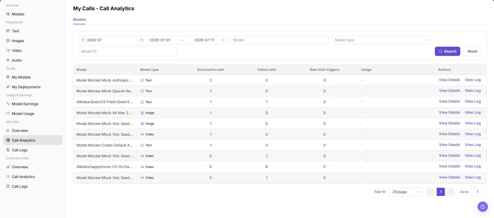
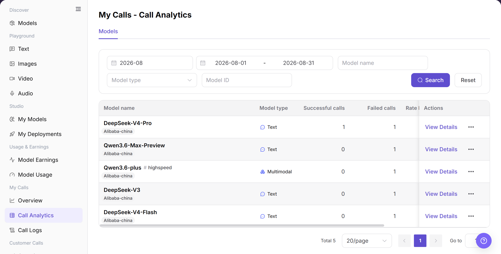
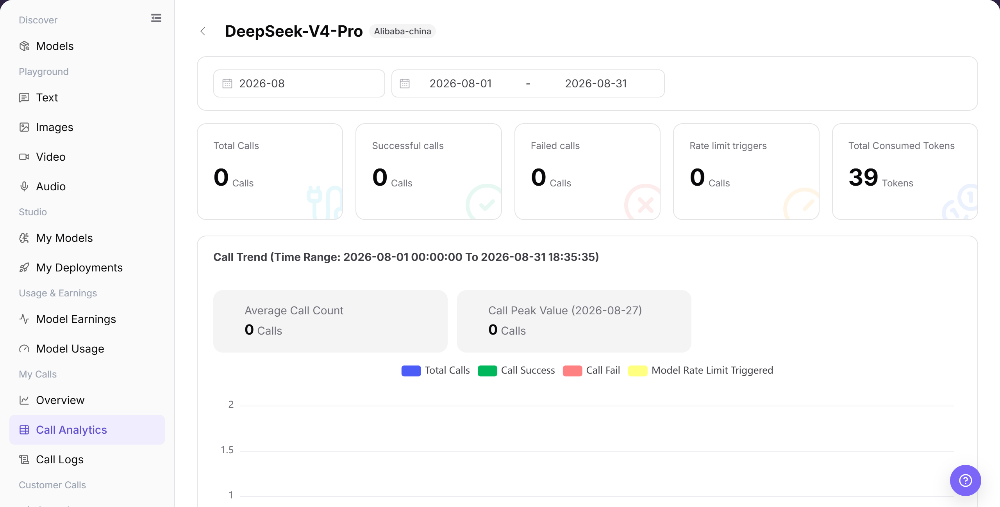

# Call Analytics

## Feature Overview

| Item | Content |
| --- | --- |
| Applicable Roles | Model Providers and Model Consumers |
| Navigation Path | Model Services > My Calls > Call Analytics |
| Page Route | `/modelone/monitoring/calls/list/model` |
| Managed Objects | Model call successes, failures, rate-limit triggers, usage, and analytics details |

#### Beginner Explanation

Call Analytics works like a model-by-model scorecard. The list shows successes, failures, rate-limit triggers, and usage, while details help identify when an anomaly occurred.

#### Terminology

| Term | Description |
| --- | --- |
| Successful Calls | Calls completed successfully in the selected scope. |
| Failed Calls | Calls that did not complete successfully in the selected scope. |
| Rate Limit Triggers | Calls that reached a rate-limit policy. |
| Usage | Aggregated token, call-count, or other consumption information. |

#### Recommended Operation Order

Query by model name, model ID, or type, compare success, failure, rate limits, and usage, and then open analytics details for an abnormal model.

#### Beginner Checklist

| Scenario | Do First | Do Not Do Directly |
| --- | --- | --- |
| Unsure which model to query | Query by name or ID first | Enter conflicting filters |
| Failures increase | Open analytics details | Review list totals only |
| Rate limits increase | Check period and rate-limit policy | Increase call volume immediately |
| No list data | Reset filters and expand the period | Repeat the same search |

## Prerequisites

1. The current account has access to the `Call Analytics` page.
2. The current account has call records in the statistical period, or the billing cycle and date range to view have been confirmed.
3. Before viewing or screenshots, confirm whether model names, Key names, fees, business applications, and call volume need to be redacted.

::: warning Sensitive Information Boundary
Call analytics may contain fees, call volume, Key names, business applications, model names, and abnormal calls. When viewing or sharing data, redact accounts, Keys, request content, fees, and business identifiers according to permission.
:::

## Page Description

The page lists successful calls, failed calls, rate-limit triggers, and usage by model. Open details to review analytics for a target model.

Page screenshots:

Focus on query criteria, model statistics, and the details entry.

## Main Operations

### View Model Call Analytics

1. Go to `Model Services > My Calls > Call Analytics`.
2. Enter a model name or model ID and select a model type if needed.
3. Click **"Search"** and verify successes, failures, rate limits, and usage. Click **"Reset"** if the filters are incorrect.

The image shows model call analytics. Compare success, failure, rate limits, and usage.

### View Model Analytics Details

1. Open the details entry for the target model.
2. Verify the model name, time range, and aggregate indicators.
3. Compare trends with list results. Open call logs when individual request information is required.

The image shows analytics details. Verify the model, time range, and metric scope.

## Parameter Reference

| Field Name | Required | Field Type | Example | Description |
| --- | --- | --- | --- | --- |
| Time Range | Yes | Month / date range | `2026-07` | Controls the statistical period for call analytics. |
| Model | No | Input / selector | Enter on page | Filters statistics by model name. |
| Application | No | Selector | Displayed on page | If the page provides an application dimension, filters call analytics by business application. |
| Key | No | Selector | Displayed on page | If the page provides a Key dimension, identifies the call source by Key. |
| Calls | System-generated | Number | `2` | Number of model calls within the filter range, which may be composed of success and failure statistics. |
| Token Usage | System-generated | Number | Displayed on page | If the page shows token dimensions, it is used to view model consumption. |
| Cost | System-generated | Number | Displayed by page unit | If the page shows cost dimensions, redact it before sharing. |
| Success Rate | System-generated | Percentage / statistic | Calculated by page | Can be calculated from successful calls and total calls. |
| Failure Rate | System-generated | Percentage / statistic | Calculated by page | Can be calculated from failed calls and total calls. |
| Average Latency | System-generated | Number | Displayed on page | If the page shows latency dimensions, it is used to measure response speed. |
| Status | System-generated | Tag / statistic | `Success` / `Failed` / `Rate limited` | Distinguishes successful calls, failed calls, or rate-limit triggers. |

## Pitfalls

- Call analytics is time-aggregated, so it may differ from real-time logs in a short window.
- When comparing models, align time range, call method, and model version.
- Higher latency does not always mean model failure. Network, queueing, input length, or rate-limit policy may also be involved.

## Result Validation

| Check Item | Success Signal | If Abnormal |
| --- | --- | --- |
| Page is accessible | The `My Calls - Call Analytics` page opens normally, and `My Calls > Call Analytics` is highlighted in the sidebar. | Check account permissions, navigation path, and page loading status. |
| Statistics display normally | Model, Model type, Successful calls, Failed calls, Rate limit triggers, and action entries are displayed normally. | Expand the time range or confirm whether the current account has call records. |
| Chart or statistics table loads normally | The call analytics table loads and shows model-level data. | Refresh the page, or switch billing cycle and date range and retry. |
| Filters are available | Billing cycle, date range, Model, Model type, and Model ID can be entered or selected. | Click `Reset` and enter filter conditions again. |
| Search / Reset is available | Clicking `Search` refreshes the table, and clicking `Reset` clears filter conditions. | Check filter format and network status. |
| Statistics match filters | Model, model type, and call counts in the table update with filter conditions. | Compare Call Logs to confirm statistical delay and filter range. |

## FAQ

#### Analytics List Is Empty

**Symptom:**

Call Analytics shows the condition described by “Analytics List Is Empty.”

**Possible Causes:**

- Time range or filters do not match.
- Page data is still synchronizing.

**Resolution:**

1. Reset filters and align the time range.
2. Cross-check details or logs.

#### Failures Are Abnormal

**Symptom:**

Call Analytics shows the condition described by “Failures Are Abnormal.”

**Possible Causes:**

- call data or status changed.
- Page data is still synchronizing.

**Resolution:**

1. Reset filters and align the time range.
2. Cross-check details or logs.

#### Rate Limits Are Abnormal

**Symptom:**

Call Analytics shows the condition described by “Rate Limits Are Abnormal.”

**Possible Causes:**

- call data or status changed.
- Page data is still synchronizing.

**Resolution:**

1. Reset filters and align the time range.
2. Cross-check details or logs.

#### Usage Is Inconsistent

**Symptom:**

Call Analytics shows the condition described by “Usage Is Inconsistent.”

**Possible Causes:**

- call data or status changed.
- Page data is still synchronizing.

**Resolution:**

1. Reset filters and align the time range.
2. Cross-check details or logs.

#### Analytics Details Do Not Open

**Symptom:**

Call Analytics shows the condition described by “Analytics Details Do Not Open.”

**Possible Causes:**

- call data or status changed.
- Permission is missing or the record expired.

**Resolution:**

1. Reset filters and align the time range.
2. Verify permission and record status, and then retry.

## Notes

- Do not write real accounts, Keys, request content, fee details, or internal test parameters in the document.
- Call analytics is aggregate data. Use Call Logs for single-request troubleshooting.
- Use only redacted statistics for external communication.

## Next Steps

1. Click `View Details` to view model-level statistics.
2. Click `View Log` or go to `Call Logs` to troubleshoot single requests.
3. Adjust call strategy based on failed calls, rate-limit triggers, and model type.
