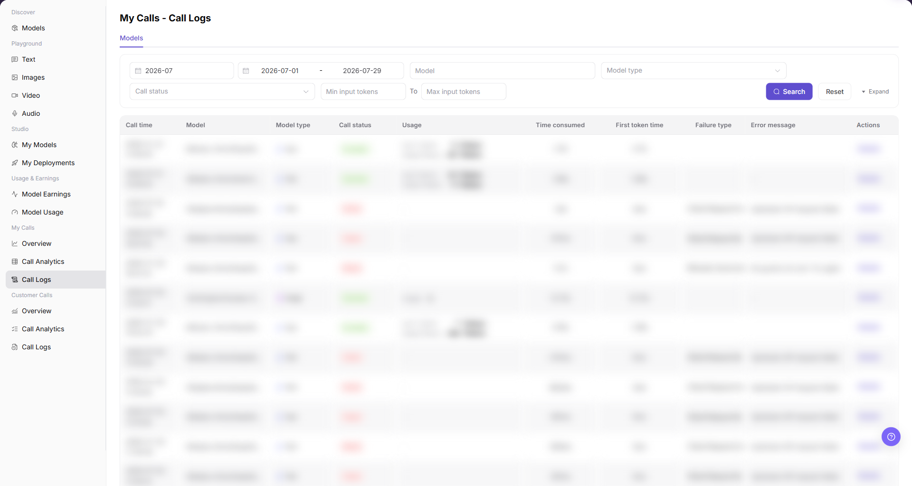
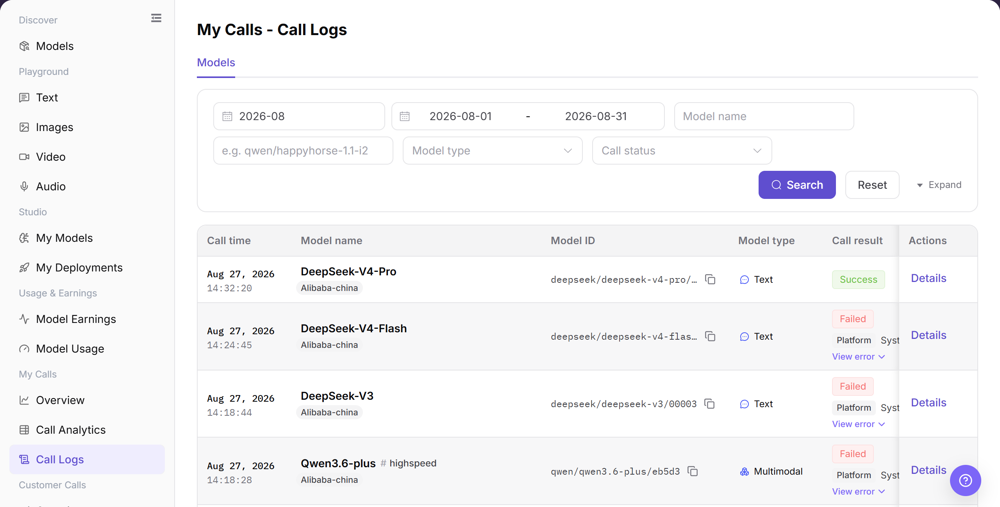
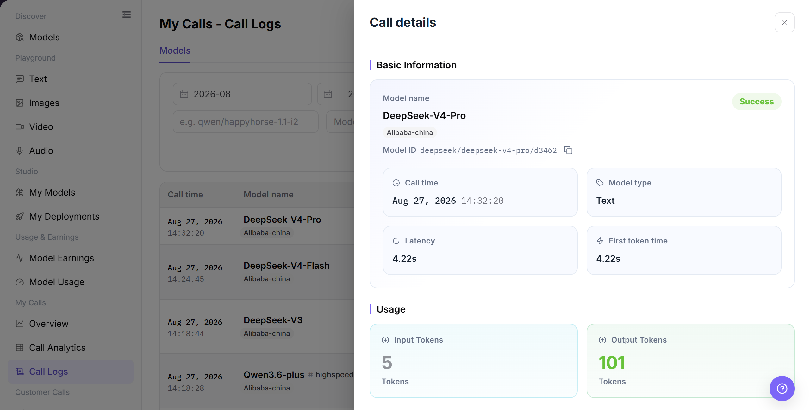

# Call Logs

## Feature Overview

| Item | Content |
| --- | --- |
| Applicable Roles | Model Providers and Model Consumers |
| Navigation Path | Model Services > My Calls > Call Logs |
| Page Route | `/modelone/monitoring/calls/log/model` |
| Managed Objects | Personal model-call records, results, usage, latency, and details |

#### Beginner Explanation

Call Logs works like an itemized record of model requests. Locate a record by model, status, and time, and open details to review result, usage, and latency for a single failure.

#### Terminology

| Term | Description |
| --- | --- |
| Call Time | The time when the request was made and recorded. |
| Call Result | The success or failure state of one call. |
| First Token Time | The time for a text model to return its first token. |
| Call Details | Model, status, usage, latency, and error summary for one call. |

#### Recommended Operation Order

Set time and model criteria, query logs, verify result, usage, and latency, and then open details for the target record.

#### Beginner Checklist

| Scenario | Do First | Do Not Do Directly |
| --- | --- | --- |
| Cannot find a record | Check time range and time zone first | Repeat a model-name query only |
| A call failed | Open details for the error summary | Repeat the call immediately |
| Latency is abnormal | Compare adjacent records for the model | Review one latency value only |
| Preparing to share details | Remove requests, responses, and credentials | Copy complete details |

## Prerequisites

1. The current account has access to the `Call Logs` page.
2. The time range, model, model type, or call status to view has been clarified.
3. Use only redacted log information for troubleshooting.

## Page Description

The page shows model-call records for the current account. Query by model name, model ID, type, status, and time range, and open details for individual call information.

Page screenshots:

Focus on query criteria, call result, usage, latency, and the details entry.

## Main Operations

### Query Call Logs

1. Go to `Model Services > My Calls > Call Logs`.
2. Set a time range, enter a model name or model ID, and select model type and call status if needed.
3. Click **"Search"** and verify call time, result, usage, and latency. Click **"Reset"** if the criteria are incorrect.

The image shows call logs. Verify the time range, call result, and target record.

### View Call Details

1. Click **"Details"** for the target record.
2. Verify model, call time, result, usage, latency, and error summary.
3. For troubleshooting, retain only a redacted request identifier and error summary. Do not copy complete requests, responses, or credentials.

The image shows one call's details. Remove request, response, and credential information before sharing.

## Parameter Reference

| Field Name | Required | Field Type | Example | Description |
| --- | --- | --- | --- | --- |
| Month | Yes | Month selector | `2026-07` | Controls the statistical month for call logs. |
| Date Range | Yes | Date range | `2026-07-01 to 2026-07-17` | Controls the query time range for call logs. |
| Model | No | Input | Enter on page | Filters call logs by model name. |
| Model Type | No | Selector | `Text` / `Video` | Filters call logs by model capability type. |
| Call Status | No | Selector | `Success` / `Failed` | Filters logs by call processing result. |
| Minimum Input Tokens | No | Number input | `0` | Sets the lower input-token boundary for the query. |
| Maximum Input Tokens | No | Number input | `1000` | Sets the upper input-token boundary for the query. |
| Call Time | System-generated | Time | Displayed on page | Shows when a single call occurred. |
| Usage | System-generated | Text / tag | Displayed on page | Shows token, free quota, or multimodal input/output usage. |
| Time Consumed | System-generated | Time | Displayed on page | Shows the total time consumed by a single call. |
| First Token Time | System-generated | Time | Displayed on page | Shows the time before the first token is returned. |
| Failure Type | System-generated | Text | Displayed on page | Shows the issue category for a failed request. |
| Error Message | System-generated | Text | Displayed on page | Shows the error summary for a failed request. Redact it before screenshots or external communication. |
| Actions | No | Action entry | `Details` | Opens single-call log details. |

## Pitfalls

- API Key, Token, Prompt, response content, and complete Endpoint may contain sensitive data. Record only sanitized snippets.
- For 429, check rate limits and quota first; for 401, check credentials and permissions; for 5xx, check model service and upstream status.
- Before retrying, verify request parameters, model version, and input size to avoid repeated invalid calls.

## Result Validation

| Check Item | Success Signal | If Abnormal |
| --- | --- | --- |
| Page is accessible | The `My Calls - Call Logs` page opens normally, and `My Calls > Call Logs` is highlighted in the sidebar. | Check account permissions, navigation path, and page loading status. |
| Call log list loads normally | The list shows columns such as call time, model, call status, usage, latency, and error message. | Refresh the page or retry after adjusting the month and date range. |
| Filters are available | After filtering by month, date range, model, model type, or call status, the list refreshes. | Check whether filters are too narrow, and click `Reset` if needed. |
| Search / Reset works | `Search` displays matching logs, and `Reset` clears the filters. | Check network status, page API responses, and account permissions. |
| Log details can be opened | Clicking `Details` opens more information about a single call. | Confirm that the record is still within the log retention period. |
| Field information is consistent | Call status, time consumed, usage, failure type, and error message are consistent with the details page. | Reopen details or expand the time range for cross-checking. |

## FAQ

#### Target Log Is Missing

**Symptom:**

Call Logs shows the condition described by “Target Log Is Missing.”

**Possible Causes:**

- Time range or filters do not match.
- Page data is still synchronizing.

**Resolution:**

1. Reset filters and align the time range.
2. Cross-check details or logs.

#### Call Status Is Failed

**Symptom:**

Call Logs shows the condition described by “Call Status Is Failed.”

**Possible Causes:**

- call data or status changed.
- Page data is still synchronizing.

**Resolution:**

1. Reset filters and align the time range.
2. Cross-check details or logs.

#### Call Latency Is Abnormal

**Symptom:**

Call Logs shows the condition described by “Call Latency Is Abnormal.”

**Possible Causes:**

- call data or status changed.
- Page data is still synchronizing.

**Resolution:**

1. Reset filters and align the time range.
2. Cross-check details or logs.

#### Token Usage Is Abnormal

**Symptom:**

Call Logs shows the condition described by “Token Usage Is Abnormal.”

**Possible Causes:**

- call data or status changed.
- Page data is still synchronizing.

**Resolution:**

1. Reset filters and align the time range.
2. Cross-check details or logs.

#### Details Contain Sensitive Data

**Symptom:**

Call Logs shows the condition described by “Details Contain Sensitive Data.”

**Possible Causes:**

- call data or status changed.
- Permission is missing or the record expired.

**Resolution:**

1. Reset filters and align the time range.
2. Verify permission and record status, and then retry.

## Notes

- Do not expose complete requests, response bodies, Keys, accounts, or cost details in documentation, screenshots, or tickets.
- Call log data may be cleaned according to the retention period. Confirm the time range first during troubleshooting.
- Error messages are only used for troubleshooting and must be redacted before public communication.

## Next Steps

1. Adjust request parameters or calling methods based on the failure type and error message.
2. To troubleshoot a single request, open `Details` and view redacted log information.
3. To determine whether the issue is a batch anomaly, go back to `My Calls > Call Analytics` and view aggregated data.
