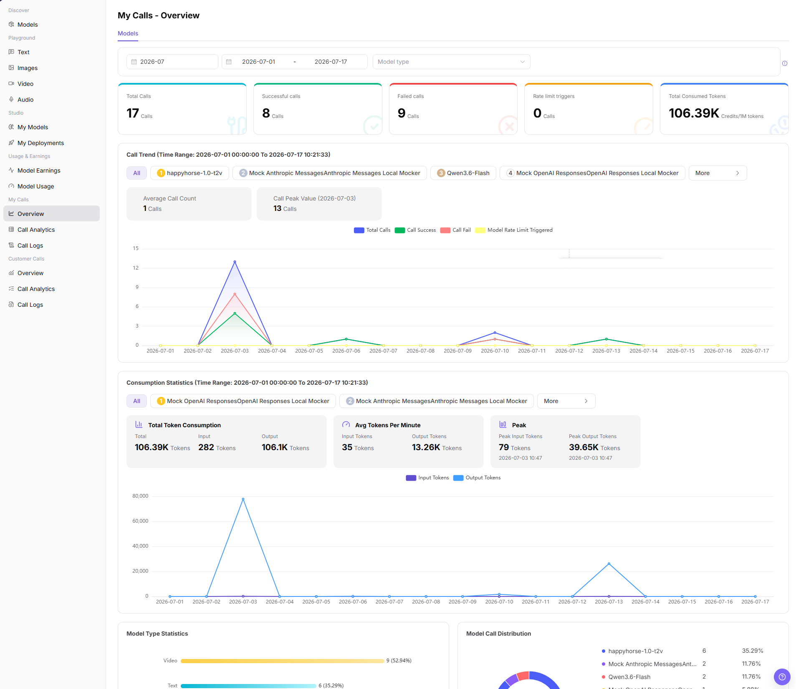
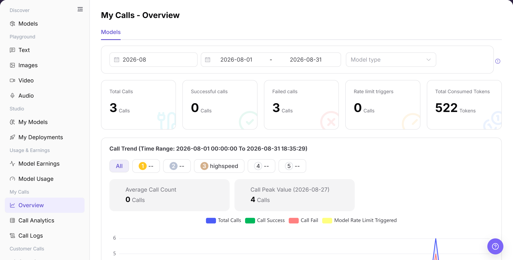

# Overview

## Feature Overview

| Item | Content |
| --- | --- |
| Applicable Roles | Model Providers and Model Consumers |
| Navigation Path | Model Services > My Calls > Overview |
| Page Route | `/modelone/monitoring/calls/overview/model` |
| Managed Objects | Personal call indicators, call trends, model rankings, and log entry |

#### Beginner Explanation

Overview works like a personal call dashboard. Review total, successful, and failed calls and usage trends, and then open logs from an abnormal model to locate individual requests.

#### Terminology

| Term | Description |
| --- | --- |
| Total Calls | The number of calls made in the selected period. |
| Failed Calls | Calls that did not complete successfully. |
| Rate Limit Trigger | The number of calls restricted by rate-limit policies. |
| Call Trend | Changes in calls, success, failure, or usage over time. |

#### Recommended Operation Order

Select a time range and review aggregate indicators, compare trends and model rankings, and use the log entry to investigate anomalies.

#### Beginner Checklist

| Scenario | Do First | Do Not Do Directly |
| --- | --- | --- |
| No overview data | Expand the time range | Conclude immediately that calls were not recorded |
| Success rate drops | Compare failure and rate-limit trends | Review total calls only |
| A model is abnormal | Open logs for individual requests | Infer the cause from charts alone |
| Preparing to share an image | Redact business identifiers and sensitive information | Share the original image |

## Prerequisites

1. The current account has access to the `Overview` page.
2. The current account has call records in the statistical period, or the time range to view has been confirmed.
3. Before viewing or screenshots, confirm whether model names, Key names, fees, and business identifiers need to be redacted.

::: warning Sensitive Information Boundary
The call overview may show fees, call volume, model names, Key names, token consumption, and abnormal trends. When viewing or sharing data, redact accounts, Keys, request content, fees, and business identifiers according to permission.
:::

## Page Description

The page shows call totals, trends, and model rankings for the current account and provides an entry to call logs. Changing the time range updates indicators and charts.

Page screenshots:

Focus on the time range, aggregate indicators, trend chart, and model list.

## Main Operations

### View Call Trends and Open Logs

1. Go to `Model Services > My Calls > Overview`.
2. Select a time range and model type, and verify total, successful, failed, and rate-limited calls and usage.
3. Compare trends and the model list to locate an abnormal model.
4. Click **"View Logs"** for the target model to continue in call logs.

The image shows call totals, trends, and the model list. Open logs from the target model when an anomaly is found.

## Parameter Reference

| Field Name | Required | Field Type | Example | Description |
| --- | --- | --- | --- | --- |
| Time Range | Yes | Month / date range | `2026-07` | Controls the overview statistical period. |
| Model | No | Tag / selector | `All` | Views data by model in trend or statistics areas. |
| Application | No | Selector | Displayed on page | If the page provides an application dimension, filters the call overview by application. |
| Key | No | Selector | Displayed on page | If the page provides a Key dimension, identifies the call source by Key. |
| Calls | System-generated | Number | `17` | Total calls within the filter range. |
| Token Usage | System-generated | Number | `106.39K` | Total consumed input and output tokens. |
| Cost | System-generated | Number | Displayed by page unit | Call cost or fee statistics, which should be redacted when shared. |
| Success Rate | System-generated | Percentage / statistic | Calculated by page | Can be calculated from successful calls and total calls. |
| Failure Rate | System-generated | Percentage / statistic | Calculated by page | Can be calculated from failed calls and total calls. |
| Status | System-generated | Tag / statistic | `Success` / `Failed` / `Rate limited` | Distinguishes successful calls, failed calls, or rate-limit triggers. |

## Pitfalls

- My Calls Overview shows only the current account's visible scope, not tenant-wide or customer-wide totals.
- When balance, Credits, or call count looks abnormal, check call logs, model usage, and billing pages together.
- Align model and time range before comparing data, otherwise different model versions may be mixed.

## Result Validation

| Check Item | Success Signal | If Abnormal |
| --- | --- | --- |
| Page is accessible | The `My Calls - Overview` page opens normally, and `My Calls > Overview` is highlighted in the sidebar. | Check account permissions, navigation path, and page loading status. |
| Overview metrics display normally | Total Calls, Successful calls, Failed calls, Rate limit triggers, and Total Consumed Tokens are displayed normally. | Expand the time range or confirm whether the current account has call records. |
| Trend charts load normally | Call Trend, Consumption Statistics, Model Type Statistics, and Model Call Distribution are displayed normally. | Refresh the page, or switch billing cycle and date range and retry. |
| Filters are available | Billing cycle, date range, and model type filters can be selected. | Clear filter conditions and view again. |
| Search / Reset is available | If the page provides `Search`, `Query`, or `Reset`, filter results can be refreshed or cleared. | Check filter format and network status. |
| Data matches filters | Metrics, trend charts, and TOP5 records update with filter conditions. | Compare Call Analytics or Call Logs to confirm statistical delay and filter range. |

## FAQ

#### Overview Is Empty

**Symptom:**

Overview shows the condition described by “Overview Is Empty.”

**Possible Causes:**

- Time range or filters do not match.
- Page data is still synchronizing.

**Resolution:**

1. Reset filters and align the time range.
2. Cross-check details or logs.

#### Success Rate Drops

**Symptom:**

Overview shows the condition described by “Success Rate Drops.”

**Possible Causes:**

- call data or status changed.
- Page data is still synchronizing.

**Resolution:**

1. Reset filters and align the time range.
2. Cross-check details or logs.

#### Rate Limits Increase

**Symptom:**

Overview shows the condition described by “Rate Limits Increase.”

**Possible Causes:**

- call data or status changed.
- Page data is still synchronizing.

**Resolution:**

1. Reset filters and align the time range.
2. Cross-check details or logs.

#### Trend and List Differ

**Symptom:**

Overview shows the condition described by “Trend and List Differ.”

**Possible Causes:**

- call data or status changed.
- Page data is still synchronizing.

**Resolution:**

1. Reset filters and align the time range.
2. Cross-check details or logs.

#### Call Logs Do Not Open

**Symptom:**

Overview shows the condition described by “Call Logs Do Not Open.”

**Possible Causes:**

- call data or status changed.
- Permission is missing or the record expired.

**Resolution:**

1. Reset filters and align the time range.
2. Verify permission and record status, and then retry.

## Notes

- Do not write real accounts, Keys, request content, fee details, or internal test parameters in the document.
- Overview statistics may have delays. Use Call Logs for single-request troubleshooting.
- Use only redacted aggregate information for external communication.

## Next Steps

1. Go to `Call Analytics` for more detailed trend and dimension analysis.
2. Go to `Call Logs` to view single requests, error codes, and request status.
3. Adjust call strategy based on failed records, rate-limit triggers, and token peaks.
