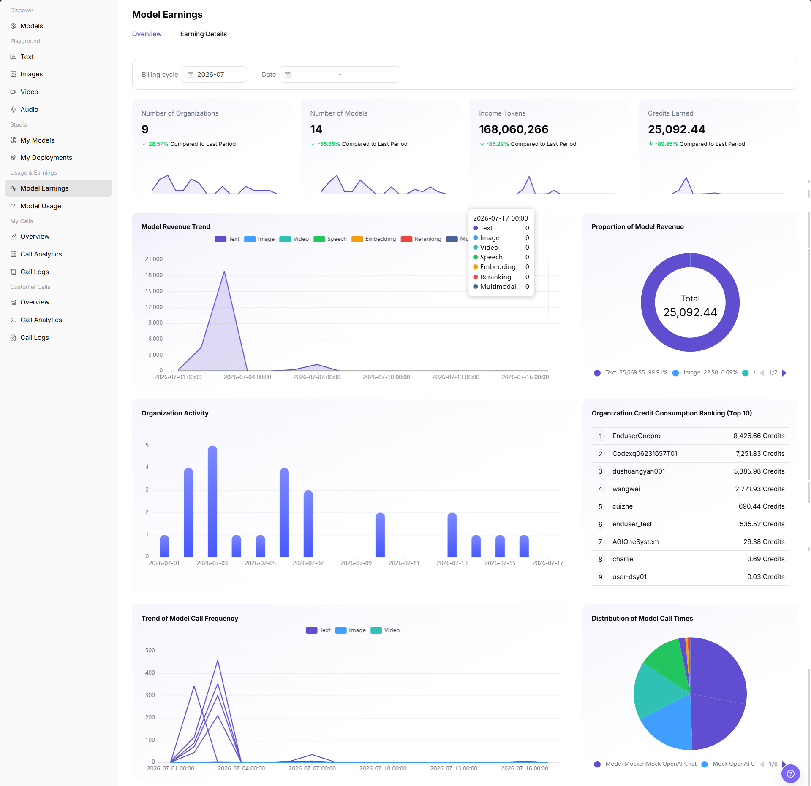
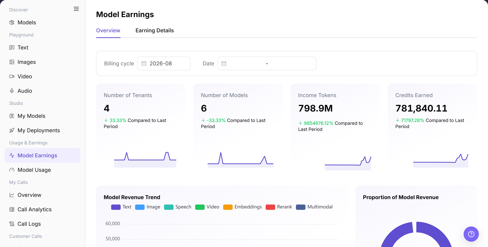
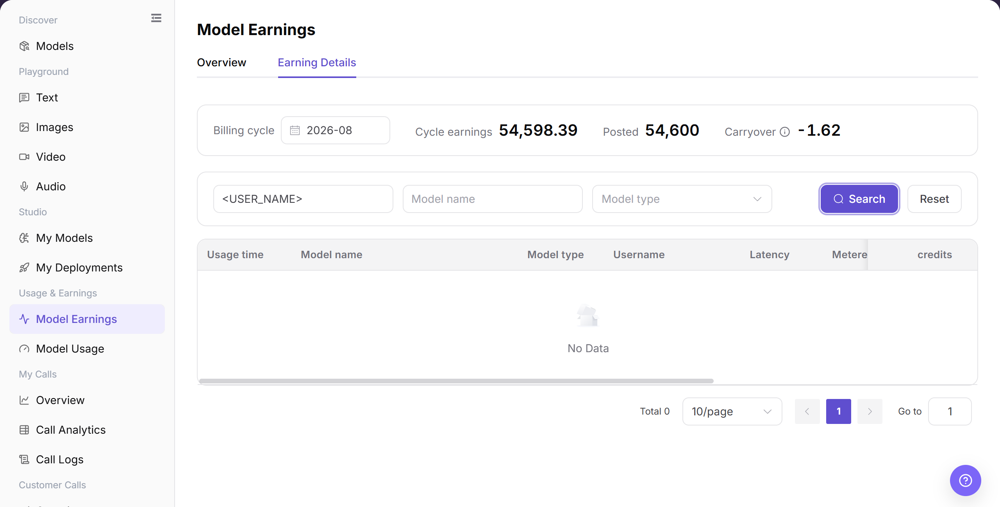
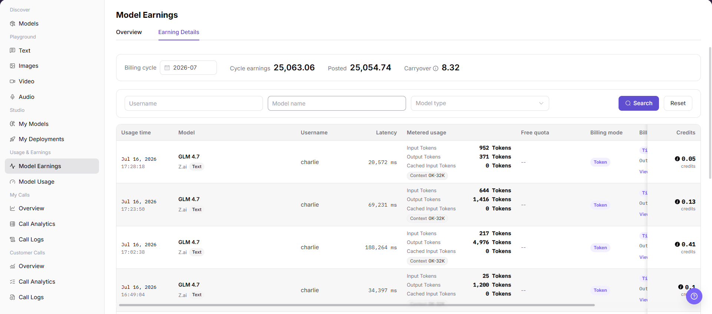

# Model Earnings

## Feature Overview

| Item | Content |
| --- | --- |
| Applicable Roles | Model Providers |
| Navigation Path | Model Services > Usage and Earnings > Model Earnings |
| Page Route | `/modelone/accounting/useage/overview/model` |
| Managed Objects | Earnings overview, earnings trends, model distribution, and earning details |

#### Beginner Explanation

Model Earnings works like a earnings ledger for model activity. Use the overview for totals and trends, and use details to reconcile records by time, user, or model.

#### Terminology

| Term | Description |
| --- | --- |
| Overview | Summarizes earnings indicators and trends for the selected time range. |
| Earning Details | Shows individual earnings records by time and business object. |
| Statistics Period | Determines the time range and aggregation scope for overview and details. |
| Model Distribution | Shows each model's share of total earnings. |

#### Recommended Operation Order

Review totals, trends, and model distribution in Overview, and then query records in Earning Details. Use the same statistics period in both tabs during reconciliation.

#### Beginner Checklist

| Scenario | Do First | Do Not Do Directly |
| --- | --- | --- |
| No data | Expand the statistics period first | Conclude that there is no earnings |
| Overview and details differ | Align time range and filters | Mix different scopes |
| Preparing reconciliation | Record the period and filters | Keep screenshot values only |
| Sharing data | Redact users and business identifiers first | Share raw details externally |

## Prerequisites

1. The current account has access to the `Model Earnings` page.
2. The target model has generated statistical calls or earning records.
3. The billing cycle, date range, user, model, or model type to view has been confirmed.
4. Earning amount, username, tenant ranking, and settlement status are sensitive information and must be redacted before screenshots or export.

::: warning High-Risk Operation Boundary
Use this page to view and reconcile the earnings overview and details. Settlement, account adjustment, and sensitive-data export are not performed here. Redact user, tenant, amount, and business identifiers before sharing data.
:::

## Page Description

The page contains Overview and Earning Details. The overview shows aggregate indicators and trends, while details provide a queryable record list.

Page screenshots:

Use this image to identify aggregate indicators and charts.

## Main Operations

### View Model Earnings Overview

1. Go to `Model Services > Usage and Earnings > Model Earnings`.
2. Click **"Overview"**.
3. Select a statistics period and verify totals, trends, model distribution, and update time.
4. If no data is shown, expand the period and confirm that the current account has relevant records.

The image shows the overview. Verify the period, aggregate indicators, trends, and model distribution.

### Query Model Earnings Details

1. Click **"Earning Details"**.
2. Set the time range and query the target records with available filters.
3. Verify record time, model, business object, and earnings value.
4. Before sharing or reconciliation, remove user names, business identifiers, and other sensitive information.

The image shows detail filters and results. Verify the time range, filters, and result scope.

This image provides an additional view of detail fields and list structure.

## Parameter Reference

| Field Name | Required | Field Type | Example | Description |
| --- | --- | --- | --- | --- |
| Billing cycle | Yes | Month selector | `2026-07` | Month that the earnings statistics and settlement belong to. |
| Date | No | Date range | Select on page | Limits the statistical time range for overview charts. |
| Username | No | Input | Enter on page | Filters earning details by calling user. |
| Model name | No | Input | Enter on page | Filters earning details by model. |
| Model type | No | Dropdown | `Text` | Filters earning details by model capability type. |
| Revenue Amount | System-generated | Number | `Credits` | Earnings amount or Credit value displayed on the page. |
| Call Volume | System-generated | Number | `Tokens` | Metered usage, such as input tokens, output tokens, or cached input tokens. |
| Billing Type | System-generated | Tag | `Token` | Billing method used by the earning record. |
| Billing rules | System-generated | Text / details entry | `Redacted billing rule` | Shows the pricing rule matched by the current earning record and opens the rule details entry. |
| Billing rule details | System-generated | Popover / details | `Redacted rule details` | Shows total charged, pricing breakdown, matched conditions, usage consumed, cost summary, free quota, and total cost. |
| Settlement Status | System-generated | Status | `Posted` / `Carryover` | Whether the amount has been posted or remains as carryover. |
| Time Range | No | Date / month | Select on page | Controls the overview or detail statistical period. |
| Caller | System-generated | Text | User or tenant name | User or tenant that generated the earning. |
| Actions | No | Row entry | `View details · 3 details` | View billing rule details matched by the earning record. |

## Pitfalls

- Model earnings are not credited in real time. They may be affected by the billing cycle, settlement status, and earnings rules.
- Customer, model, and time views use different scopes. Do not add them together without checking the metric definition.
- If revenue looks abnormal, verify model usage and call logs first, then ask operations to confirm settlement rules.

## Result Validation

| Check Item | Success Signal | If Abnormal |
| --- | --- | --- |
| Page is accessible | The `Model Earnings` page opens normally, and `Overview` and `Earning Details` tabs are visible. | Check account permissions, navigation path, and page loading status. |
| Earnings overview displays normally | Number of Tenants, Number of Models, Income Tokens, Credits Earned, and charts are displayed normally. | Switch Billing cycle or Date and retry. Confirm whether the current period has earning data. |
| Filters are available | Billing cycle, Date, Username, Model name, and Model type can be entered or selected. | Check filter format, or click `Reset` and query again. |
| Earning list loads normally | The details list shows Usage time, Model, Username, Metered usage, Free quota, Billing mode, Billing rules, and credits. | Confirm whether the billing cycle contains earning records, or broaden filters. |
| Billing rule details can be viewed | After clicking `View details · 3 details`, total charged, pricing breakdown, matched conditions, usage consumed, and cost summary are visible. | Compare model usage and call logs to confirm statistical delay or billing-rule differences. |

## FAQ

#### Model Earnings Data Is Empty

**Symptom:**

No earnings data appears for the selected period.

**Possible Causes:**

- No relevant record exists in the period.
- The filters are too narrow.

**Resolution:**

1. Expand the statistics period.
2. Clear filters and confirm that business records exist.

#### Overview and Details Differ

**Symptom:**

The overview total differs from the sum of details.

**Possible Causes:**

- The tabs use different time ranges.
- Detail filters are still active.

**Resolution:**

1. Align the statistics period.
2. Reset detail filters and calculate again.

#### Target Model Has No Record

**Symptom:**

No earnings record appears for the target model.

**Possible Causes:**

- Model name or time criteria do not match.
- Records are still synchronizing.

**Resolution:**

1. Query the model and expand the period.
2. Refresh later and check update time.

#### Data Update Time Is Abnormal

**Symptom:**

Recent business records do not appear.

**Possible Causes:**

- Statistics processing is delayed.
- The page cache is not refreshed.

**Resolution:**

1. Check the page update time.
2. Refresh and compare with call logs.

#### Reconciliation Has a Difference

**Symptom:**

Page earnings differs from an external record.

**Possible Causes:**

- Billing units or time boundaries differ.
- Model or customer scopes differ.

**Resolution:**

1. Fix time, model, and billing unit.
2. Reconcile record by record from details.

## Notes

- Do not write real accounts, pricing policies, internal test parameters, or sensitive data in the document.
- Before screenshots or export, confirm that usernames, tenant names, earning amounts, and Credit details are redacted.
- Settlement, account adjustment, and sensitive data export are outside the scope of this document.

## Next Steps

1. Cross-check with model usage, call analytics, and call logs.
2. Use redacted earning details for reconciliation.
3. Optimize model operations based on revenue trends, model-type proportion, and tenant consumption ranking.
